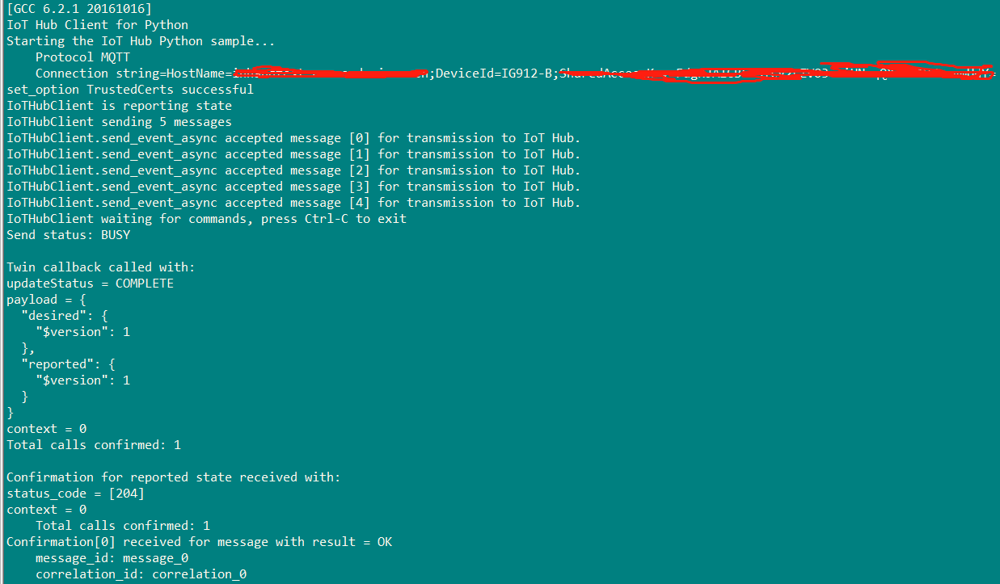
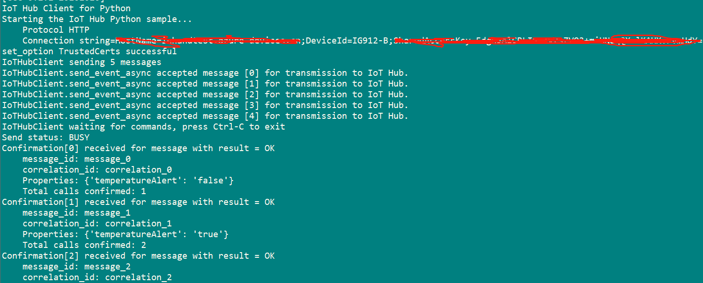
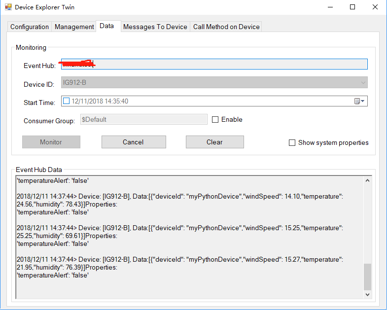
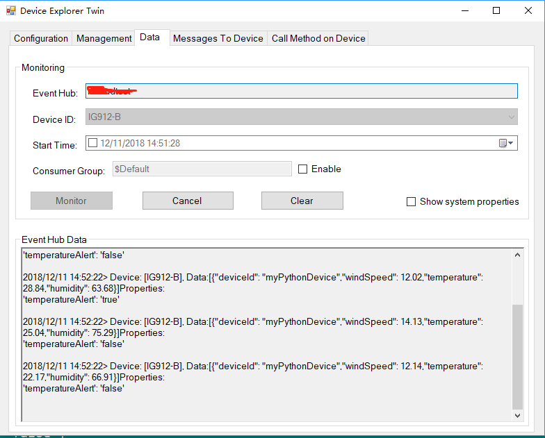
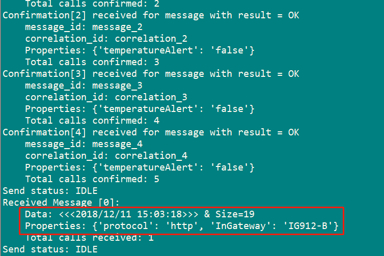

Run a simple PYTHON sample on IG912-B device running Custom Linux
===
---

# Table of Contents

-   [Introduction](#Introduction)
-   [Step 1: Prerequisites](#Prerequisites)
-   [Step 2: Prepare your Device](#PrepareDevice)
-   [Step 3: Build and Run the Sample](#Build)
-   [Next Steps](#NextSteps)

# Introduction

**About this document**

This document describes how to connect IG912-B device running Custom Linux with Azure IoT SDK. This multi-step process includes:
-   Configuring Azure IoT Hub
-   Registering your IoT device
-   Build and deploy Azure IoT SDK on device

# Step 1: Prerequisites

You should have the following items ready before beginning the process:

-   [Prepare your development environment][setup-devbox-python]
-   [Setup your IoT hub][lnk-setup-iot-hub]
-   [Provision your device and get its credentials][lnk-manage-iot-hub]
-   InGateway IG912-B device.

# Step 2: Prepare your Device

-   The URL for the device is <https://www.inhand.com.cn/products/edge-computing-gateway.html>
-   Connect the InGateway IG912-B using the ssh or telnet with putty.

# Step 3: Build SDK and Run the sample

## 3.1 Build SDK on ubuntu machine
### 3.1.1 Setup the development environment

For Ubuntu, you can use apt-get to install the right packages:

        sudo apt-get update
        sudo apt-get install -y curl libcurl4-openssl-dev build-essential cmake-3.6 git python2.7-dev libboost-python-dev

### 3.1.2 Install the Cross Compilation Toolchain

        tar -xjvf am335x-arm-linux-gnueabihf-glibc-V1.0.tar.bz2 -C /opt
        export PATH=$PATH:/opt/buildroot-2017.02.5/output/host/usr/bin

### 3.1.3 Clone github repository
	
        git clone --recursive https://github.com/Azure/azure-iot-sdk-python.git

### 3.1.4 cross compile azure iot sdk for python

        cd azure-iot-sdk-python
        touch  Azure-IOT-IG9-Cross-Compile.cmake

The content is as follows:

        makefile
        #IG9 cross compile evironment configure for cmake
        SET(IG9_CROSS_COMPILE_PATH "/opt/buildroot-2017.02.5/output/host/usr")
        SET(IG9_SYSTEM_PATH "/root/INOS/IG9/system")
        
        # this one is important
        SET(CMAKE_SYSTEM_NAME Linux)
        #this one not so much
        SET(CMAKE_SYSTEM_VERSION 1)
        SET(CMAKE_SYSTEM_PROCESSOR arm)

        # specify the cross compiler
        SET(CMAKE_C_COMPILER  ${IG9_CROSS_COMPILE_PATH}/bin/arm-linux-gnueabihf-gcc)
        SET(CMAKE_CXX_COMPILER  ${IG9_CROSS_COMPILE_PATH}/bin/arm-linux-      gnueabihf-g++)
        SET(CMAKE_C_FLAGS "${CMAKE_C_FLAGS} -L${IG9_SYSTEM_PATH}/util-linux/.libs/ -L${IG9_SYSTEM_PATH}/curl/lib/.libs/")
        SET(CMAKE_CXX_FLAGS "${CMAKE_CXX_FLAGS} -L${IG9_SYSTEM_PATH}/util-linux/.libs/ -L${IG9_SYSTEM_PATH}/curl/lib/.libs/"        )
        #SET_PROPERTY(TARGET PROPERTY CXX_STANDARD gnu++98)
        #ADD_DEFINITIONS(-std=gnu++0x -std=gnu++11)

        # where is the target environment 
        SET(CMAKE_FIND_ROOT_PATH  "${IG9_CROSS_COMPILE_PATH}/" "${IG9_SYSTEM_PATH}/python/" "${IG9_SYSTEM_PATH}/install/IG9-ti-am335x/usr/lib/")
        INCLUDE_DIRECTORIES("${IG9_SYSTEM_PATH}/python" "${IG9_SYSTEM_PATH}/python/Include" "${IG9_SYSTEM_PATH}/util-linux/libuuid/src/" "${IG9_SYSTEM_PATH}/openssl2/include" "${IG9_SYSTEM_PATH}/curl/include")
        LINK_DIRECTORIES(${IG9_SYSTEM_PATH}/util-linux/.libs/)
        #TARGET_LINK_LIBRARIES(uuid "$${IG9_SYSTEM_PATH}/util-linux/.libs/libuuid.so")
        SET(CMAKE_LIBRARY_PATH "${IG9_SYSTEM_PATH}/util-linux/.libs/")
        ADD_DEFINITIONS(-D_GLIBCXX_USE_DEPRECATED=1 -DBOOST_NO_AUTO_PTR)

        #Python configure
        SET(PYTHONLIBS_FOUND ON)
        SET(PYTHON_INCLUDE_DIR ${IG9_SYSTEM_PATH}/python/Include/)

        #Boost configure
        SET(Boost_INCLUDE_DIR ${IG9_SYSTEM_PATH}/boost)
        SET(Boost_LIBRARY_DIR ${IG9_SYSTEM_PATH}/boost/stage/lib/)

        #OpenSSL configure
        SET(OPENSSL_ROOT_DIR ${IG9_SYSTEM_PATH}/openssl2/)
        SET(OPENSSL_INCLUDE_DIR ${IG9_SYSTEM_PATH}/openssl2/include/)
        SET(OPENSSL_CRYPTO_LIBRARY ${IG9_SYSTEM_PATH}/openssl2/libcrypto.so)
        SET(OPENSSL_SSL_LIBRARY ${IG9_SYSTEM_PATH}/openssl2/libssl.so)

        #CURL configure
        SET(CURL_INCLUDE_DIR ${IG9_SYSTEM_PATH}/curl/include)
        SET(CURL_LIBRARY ${IG9_SYSTEM_PATH}/curl/lib/.libs/libcurl.so)
        #SET(LIBCURL_DIR  ${IG9_SYSTEM_PATH}/curl/)

        # search for programs in the build host directories
        SET(CMAKE_FIND_ROOT_PATH_MODE_PROGRAM NEVER)
        # for libraries and headers in the target directories
        SET(CMAKE_FIND_ROOT_PATH_MODE_LIBRARY ONLY)
        SET(CMAKE_FIND_ROOT_PATH_MODE_INCLUDE ONLY)

### build project:

        ./build_all/linux/build.sh	--toolchain-file Azure-IOT-IG9-Cross-Compile.cmake 
        arm-linux-gnueabihf-strip  ./c/cmake/iotsdk_linux/python_service_client/src/iothub_service_client.so
        arm-linux-gnueabihf-strip ./c/cmake/iotsdk_linux/python/src/iothub_client.so
        arm-linux-gnueabihf-strip ./c/cmake/iotsdk_linux/provisioning_device_client_python/src/provisioning_device_client.so

## 3.2 Running the Sample
### 3.2.1 Use tftp command copy files from ubuntu tftpboot directory to target device
        cd  /tmp
        tftp -gr iothub_client.so 10.5.16.187(tftp server ip address)
        tftp -gr iothub_service_client.so 10.5.16.187
        tftp -gr provisioning_device_client.so 10.5.16.187
        tftp -gr  iothub_client_sample.py 10.5.16.187
        tftp -gr  iothub_client_args.py 10.5.16.187
        tftp -gr  iothub_client_cert.py 10.5.16.187

	        export PYTHONPATH=$PATH:/tmp

### 3.2.2 Send Device Events to IoT Hub:
Run the sample application using the following command:

**For MQTT protocol:**

        python iothub_client_sample.py -p mqtt -c  "[device connection string]"

**For HTTP protocol:**

        python iothub_client_sample.py -p http -c "[device connection string]"

**For AMQP protocol:**

        python iothub_client_sample.py -p mqtt -c "[device connection string]"

-   Verify that the confirmation messages show an OK. If not, then you may have incorrectly copied the device hub connection information. 
**If MQTT protocol:**

 

**If AMQP protocol:**

 

**If HTTP protocol:**

 

-   You should be able to see the events received in the DeviceExplorer's data tab.

**If MQTT protocol:**

 

**If AMQP protocol:**

 

**If HTTP protocol:**

 

### 3.2.3 Receive messages from IoT Hub

-   You should be able to see the message received in the device console window.

**If MQTT protocol:**

 

**If AMQP protocol:**

**If HTTP protocol:**

# Next Steps

You have now learned how to run a sample application that collects sensor data and sends it to your IoT hub. To explore how to store, analyze and visualize the data from this application in Azure using a variety of different services, please click on the following lessons:

-   [Manage cloud device messaging with iothub-explorer]
-   [Save IoT Hub messages to Azure data storage]
-   [Use Power BI to visualize real-time sensor data from Azure IoT Hub]
-   [Use Azure Web Apps to visualize real-time sensor data from Azure IoT Hub]
-   [Weather forecast using the sensor data from your IoT hub in Azure Machine Learning]
-   [Remote monitoring and notifications with Logic Apps]   

[Manage cloud device messaging with iothub-explorer]: https://docs.microsoft.com/en-us/azure/iot-hub/iot-hub-explorer-cloud-device-messaging
[Save IoT Hub messages to Azure data storage]: https://docs.microsoft.com/en-us/azure/iot-hub/iot-hub-store-data-in-azure-table-storage
[Use Power BI to visualize real-time sensor data from Azure IoT Hub]: https://docs.microsoft.com/en-us/azure/iot-hub/iot-hub-live-data-visualization-in-power-bi
[Use Azure Web Apps to visualize real-time sensor data from Azure IoT Hub]: https://docs.microsoft.com/en-us/azure/iot-hub/iot-hub-live-data-visualization-in-web-apps
[Weather forecast using the sensor data from your IoT hub in Azure Machine Learning]: https://docs.microsoft.com/en-us/azure/iot-hub/iot-hub-weather-forecast-machine-learning
[Remote monitoring and notifications with Logic Apps]: https://docs.microsoft.com/en-us/azure/iot-hub/iot-hub-monitoring-notifications-with-azure-logic-apps
[setup-devbox-python]: https://github.com/Azure/azure-iot-device-ecosystem/blob/master/get_started/python-devbox-setup.md
[lnk-setup-iot-hub]: ../setup_iothub.md
[lnk-manage-iot-hub]: ../manage_iot_hub.md
