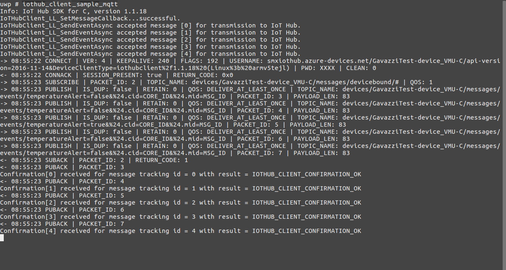
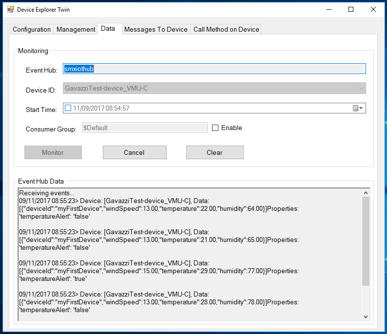
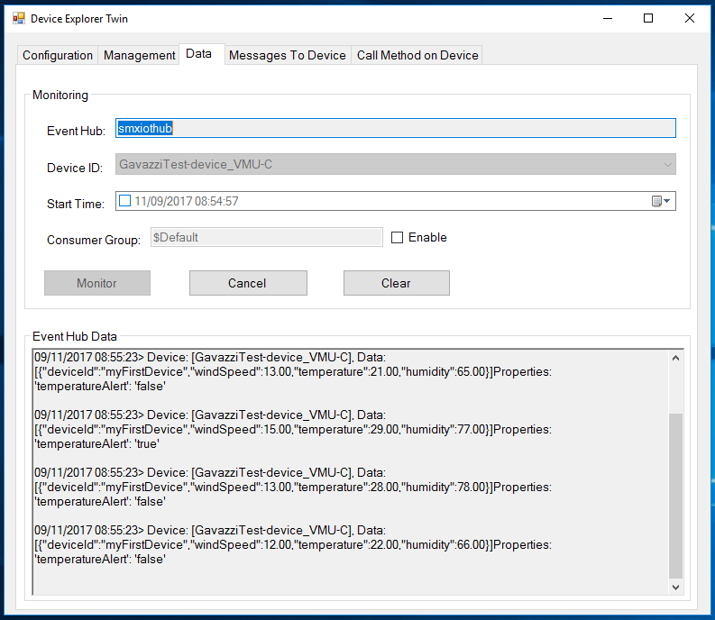
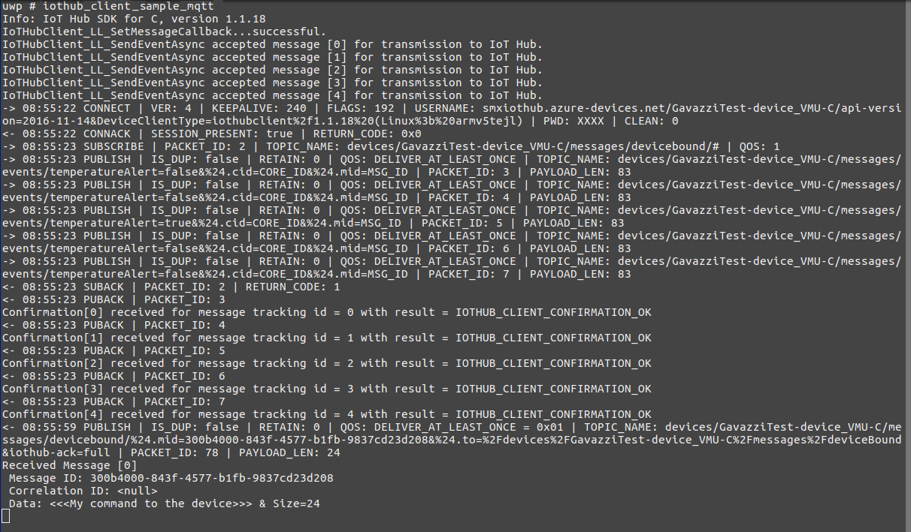
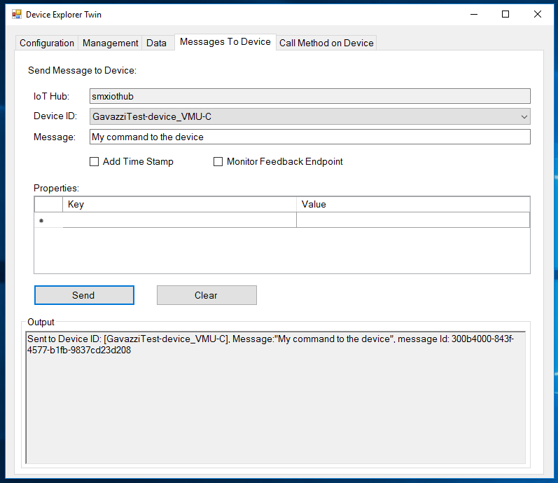

Run a simple C sample on VMU-C device running Carlo Gavazzi's customised LINUX distribution built with GCC
===
---

# Table of Contents

-   [Introduction](#Introduction)
-   [Step 1: Prerequisites](#Prerequisites)
-   [Step 2: Prepare your Device](#PrepareDevice)
-   [Step 3: Build and Run the Sample](#Build)
-   [Next Steps](#NextSteps)

# Introduction

**About this document**

This document describes how to connect VMU-C device running Carlo Gavazzi's customised LINUX distribution built with GCC with Azure IoT SDK. This multi-step process includes:
-   Configuring Azure IoT Hub
-   Registering your IoT device
-   Build and deploy Azure IoT SDK on device

# Step 1: Prerequisites

You should have the following items ready before beginning the process:

-   [Prepare your development environment][setup-devbox-linux]
-   [Setup your IoT hub][lnk-setup-iot-hub]
-   [Provision your device and get its credentials][lnk-manage-iot-hub]
-   VMU-C device.
-   Linux machine or VM instance.
-   Cross compiler settings from GCC.

# Step 2: Prepare your Device
-   Connect the VMU-C to your machine using the USB cable and open a terminal emulator program such as GNOME Terminal on your desktop machine, and switch ON the device.
-	Then, you have to connect to the device via SSH: when prompted, log in with the given username and password.

# Step 3: Build and Run the sample

## 3.1 Build SDK and sample

-   Download the Microsoft Azure IoT Device SDK for C to your LINUX development machine by issuing the following command:

        git clone --recursive https://github.com/Azure/azure-iot-sdk-c.git

-   Set up the cross compiler setting.

-   Edit the following file using any text editor of your choice:

        azure-iot-sdk-c/iothub_client/samples/iothub_client_sample_mqtt/iothub_client_sample_mqtt.c

-   Find the following place holder for IoT connection string:

        static const char* connectionString = "[device connection string]";

-   Replace the above placeholder with device connection string you obtained in [Step 1](#Prerequisites) and save the changes.

-   Build the SDK using following command.

        ./azure-iot-sdk-c/build_all/linux/build.sh --skip-unittests --no-amqp --no-http

-   Copy the generated binary file to the device, in the /cgcApp/bin folder. Please make sure that the binary file has the correct permissions.

## 3.2 Send Device Events to IoT Hub:

-   Run the sample by issuing following command:

        iothub_client_sample_mqtt

-   You can observe the messages IoT Hub receives from the application both from the device terminal:

-   and from the Device Explorer (See [Manage IoT Hub][lnk-manage-iot-hub] to learn how to achieve this step):

## 3.3 Receive messages from IoT Hub

-   See [Manage IoT Hub][lnk-manage-iot-hub] to learn how to send cloud-to-device messages to the application.

-   You can observe the messages the device receives from IoT Hub both from the device terminal:

-   and from the Device Explorer:

# Next Steps

You have now learned how to run a sample application that collects data from Sensors and Energy Meters, and sends them to your IoT hub. To explore how to store, analyze and visualize the data from this application in Azure using a variety of different services, please click on the following lessons:

-   [Manage cloud device messaging with iothub-explorer]
-   [Save IoT Hub messages to Azure data storage]
-   [Use Power BI to visualize real-time sensor data from Azure IoT Hub]
-   [Use Azure Web Apps to visualize real-time sensor data from Azure IoT Hub]
-   [Weather forecast using the sensor data from your IoT hub in Azure Machine Learning]
-   [Remote monitoring and notifications with Logic Apps]   

[Manage cloud device messaging with iothub-explorer]: https://docs.microsoft.com/en-us/azure/iot-hub/iot-hub-explorer-cloud-device-messaging
[Save IoT Hub messages to Azure data storage]: https://docs.microsoft.com/en-us/azure/iot-hub/iot-hub-store-data-in-azure-table-storage
[Use Power BI to visualize real-time sensor data from Azure IoT Hub]: https://docs.microsoft.com/en-us/azure/iot-hub/iot-hub-live-data-visualization-in-power-bi
[Use Azure Web Apps to visualize real-time sensor data from Azure IoT Hub]: https://docs.microsoft.com/en-us/azure/iot-hub/iot-hub-live-data-visualization-in-web-apps
[Weather forecast using the sensor data from your IoT hub in Azure Machine Learning]: https://docs.microsoft.com/en-us/azure/iot-hub/iot-hub-weather-forecast-machine-learning
[Remote monitoring and notifications with Logic Apps]: https://docs.microsoft.com/en-us/azure/iot-hub/iot-hub-monitoring-notifications-with-azure-logic-apps
[setup-devbox-linux]: https://github.com/Azure/azure-iot-sdk-c/blob/master/doc/devbox_setup.md
[lnk-setup-iot-hub]: ../setup_iothub.md
[lnk-manage-iot-hub]: ../manage_iot_hub.md
