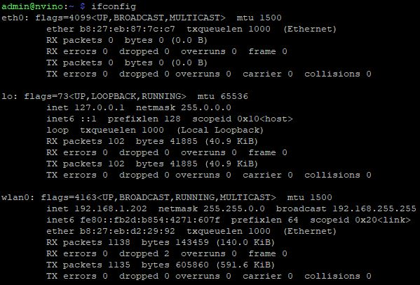
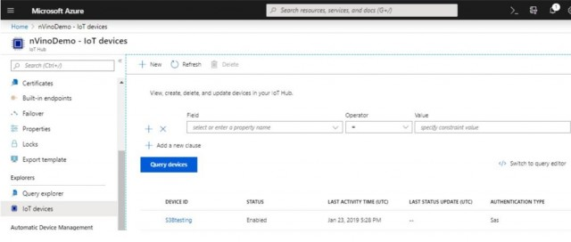
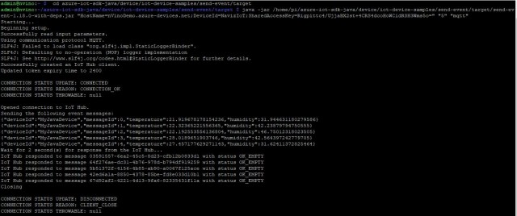
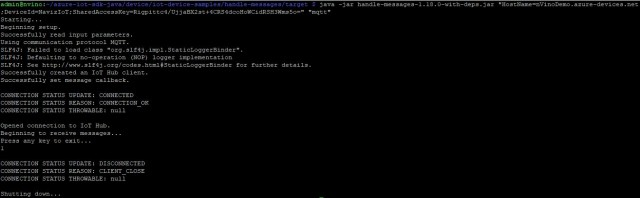

Run a simple JAVA sample on nVino IoT Gateway running Debian GNU/Linux
===
---

# Table of Contents

-   [Introduction](#Introduction)
-   [Step 1: Prerequisites](#Prerequisites)
-   [Step 2: Prepare your Device](#PrepareDevice)
-   [Step 3: Build and Run the Sample](#Build)
-   [Next Steps](#NextSteps)

# Introduction

**About this document**

This document describes how to connect nVino IoT Gateway running Debian with Azure IoT SDK. This multi-step process includes:
-   Configuring Azure IoT Hub
-   Registering your IoT device
-   Build and deploy Azure IoT SDK on device

# Step 1: Prerequisites

You should have the following items ready before beginning the process:

-   nVino IoT Gateway Device.
-   [Setup your IoT hub][lnk-setup-iot-hub]
-   [Provision your device and get its credentials][lnk-manage-iot-hub]

# Step 2: Prepare your Device

-   Plug Ethernet cable to the device or connect device to WIFI.
-   Find out the IP address of your nVino IoT Gateway device by scanning using Advanced IP Scanner. In case you have access to the console you can also type the following command which will show the network adapters and the assigned ip-address.

        sudo ifconfig

-   Open a PuTTY session and connect to the IP address your nVino has assigned.
-   The credentials are:
    -   user : admin
    -   password:nvino

# Step 3: Build SDK and Run the sample

## 3.1 Install Azure IoT Device SDK and prerequisites on device

-   Install the prerequisite packages by issuing the following commands from the command line on the device.

### 3.1.1  Install Java JDK and set up environment variables
        
1.  On nVino IoT Gateway, Install the Java OpenJDK 8 as follows:

        sudo apt-get update        
        sudo apt-get install openjdk-8-jdk      
   
2.  Update the PATH environment variable to include the full path to the bin folder containing Java. To ensure the correct path of Java run below command:     
       
        which java
        
3.  Ensure that the directory shown by the `which java` command matches one of the directories shown in your $PATH variable. You can confirm this by running following command.

        echo $PATH

4.  If Java path is missing in PATH environment variable, run following command to set the same.    

        export PATH=[PathToJava]/bin:$PATH       

    ***NOTE:*** *Here **[PathToJava]** is output of `which java` command. For example, if `which java` output is /usr/bin/java, then export command will be* **export PATH=/usr/bin/java/bin:$PATH**

5.  Make sure that the JAVA_HOME environment variable includes the full path to the JDK. Use below command to get the JDK path.

        update-alternatives --config java

6.  Take note of the JDK location. `update-alternatives` output will show something similar to **/usr/lib/jvm/java-8-openjdk-armhf/jre/bin/java**. The JDK directory would then be **/usr/lib/jvm/java-8-openjdk-armhf/**.

7.  Run the following command to set **JAVA_HOME** environment variable.

        export JAVA_HOME=[PathToJDK]

    ***Note***: *Here [PathToJDK] is JDK directory. For example if jdk directory is /usr/lib/jvm/java-8-openjdk-amd64/, export command will be* **export JAVA_HOME=/usr/lib/jvm/java-8-openjdk-armhf/**

### 3.1.2  Install Maven and set up environment variables

1.  Install maven on linux by running following command.

        sudo apt-get install maven

2.  Update the PATH environment variable to include the full path to the bin folder containing maven. To ensure the correct path of maven, run below command:     
       
        which mvn
         
3.  Ensure that the directory shown by the `which mvn` command matches one of the directories shown in your $PATH variable. You can confirm this by running following command.
 
        echo $PATH

4.  If maven path is missing in PATH environment variable, run following command to set the same.     

        export PATH=[PathToMvn]/bin:$PATH

    ***Note***: *Here [PathToMvn] is output of `which mvn`. For example if `which mvn` output is /usr/bin/mvn, export command will be* **export PATH=/usr/bin/mvn/bin:$PATH**
   
5.  You can verify that the environment variables necessary to run Maven 3 have been set correctly by running `mvn --version`.

### 3.1.3  Install GIT

1.  Install GIT on linux using following command.

        sudo apt-get install git

### 3.1.4 Build the Azure IoT Device SDK for Java

1.  Download the SDK to the board by issuing the following command in PuTTY:

        git clone https://github.com/Azure/azure-iot-sdk-java.git

2.  Verify that you now have a copy of the source code under the directory **azure-iot-sdk-java**.

3.  Run the following commands on device in sequence to build Azure IoT SDK.

        cd azure-iot-sdk-java/device
        mvn install | tee JavaSDK_Build_Logs.txt

4.  Above command will generate the compiled JAR files with all dependencies. This bundle can be found at:

        azure-iot-sdk-java/device/iot-device-client/target/iot-device-client-1.18.0.jar

## 3.2 Run and Validate the Samples

### 3.2.1 Send Device Events to IoT Hub:

-   Register IoT Device with your IoT hub before it can connect by following instructions in quck start guide [Register a device with IoT Hub](https://docs.microsoft.com/en-us/azure/iot-hub/quickstart-send-telemetry-java#register-a-device).
-   You can also use Azure portal to register the IoT Device. IoT hub —> Explorer —> IoT devices.

-   Get the device connection string for the device you just registered which looks like

         HostName=nVinoDemo.azure-devices.net;DeviceId=NavizIoT;SharedAccessKey=Rigpittc4/UjjaBX2st+4CRS4dcoHoWCidRSH3Wms5o=

-   Navigate to the folder containing the executable JAR file for send event sample.

        cd azure-iot-sdk-java/device/iot-device-samples/send-event/target

-   Run the sample by issuing following command .

        java -jar /home/pi/azure-iot-sdk-java/device/iot-device-samples/send-event/target/send-event-1.18.0-with-deps.jar "HostName=nVinoDemo.azure-devices.net;DeviceId=NavizIoT;SharedAccessKey=Rigpittc4/UjjaBX2st+4CRS4dcoHoWCidRSH3Wms5o=" "5" "mqtt"

<a name="Step_3_2_2"</a>
### 3.2.2 Receive messages from IoT Hub

-   Navigate to the folder containing the executable JAR file for the receive message sample.

        cd azure-iot-sdk-java/device/samples/handle-messages/target
     
-   Run the sample by issuing following command using connection string obtained after registering the device.
 
        java -jar handle-messages-1.18.0-with-deps.jar "HostName=nVinoDemo.azure-devices.net;DeviceId=NavizIoT;SharedAccessKey=Rigpittc4/UjjaBX2st+4CRS4dcoHoWCidRSH3Wms5o=" "mqtt"

# Next Steps

You have now learned how to run a sample application that collects sensor data and sends it to your IoT hub. To explore how to store, analyze and visualize the data from this application in Azure using a variety of different services, please click on the following lessons:

-   [Manage cloud device messaging with iothub-explorer]
-   [Save IoT Hub messages to Azure data storage]
-   [Use Power BI to visualize real-time sensor data from Azure IoT Hub]
-   [Use Azure Web Apps to visualize real-time sensor data from Azure IoT Hub]
-   [Weather forecast using the sensor data from your IoT hub in Azure Machine Learning]
-   [Remote monitoring and notifications with Logic Apps]   

[Manage cloud device messaging with iothub-explorer]: https://docs.microsoft.com/en-us/azure/iot-hub/iot-hub-explorer-cloud-device-messaging
[Save IoT Hub messages to Azure data storage]: https://docs.microsoft.com/en-us/azure/iot-hub/iot-hub-store-data-in-azure-table-storage
[Use Power BI to visualize real-time sensor data from Azure IoT Hub]: https://docs.microsoft.com/en-us/azure/iot-hub/iot-hub-live-data-visualization-in-power-bi
[Use Azure Web Apps to visualize real-time sensor data from Azure IoT Hub]: https://docs.microsoft.com/en-us/azure/iot-hub/iot-hub-live-data-visualization-in-web-apps
[Weather forecast using the sensor data from your IoT hub in Azure Machine Learning]: https://docs.microsoft.com/en-us/azure/iot-hub/iot-hub-weather-forecast-machine-learning
[Remote monitoring and notifications with Logic Apps]: https://docs.microsoft.com/en-us/azure/iot-hub/iot-hub-monitoring-notifications-with-azure-logic-apps

[lnk-setup-iot-hub]: ../setup_iothub.md
[lnk-manage-iot-hub]: ../manage_iot_hub.md
