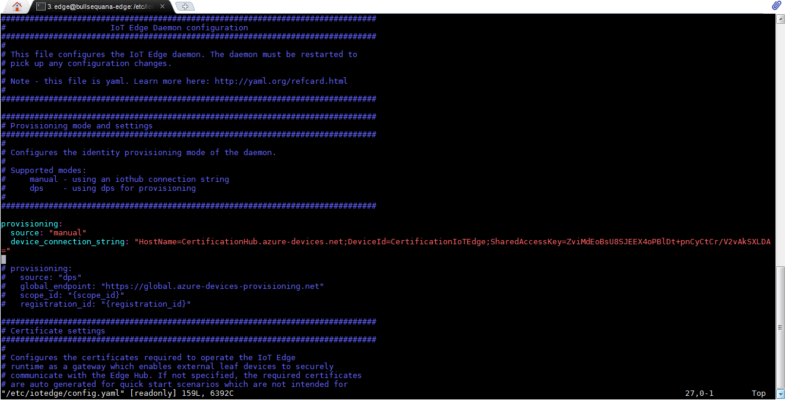
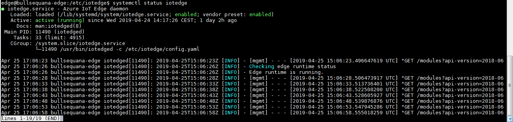
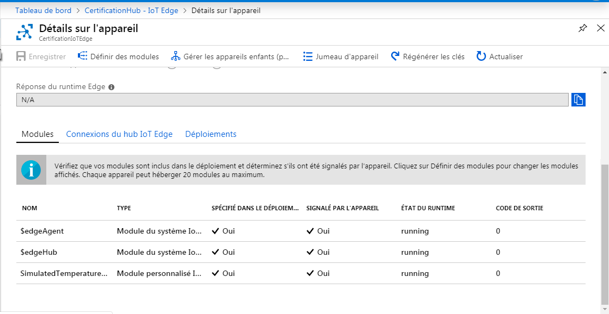

Run a simple C sample on ATOS-BullSequana Edge Server device running Ubuntu Server 18.04
===
---

# Table of Contents

-   [Introduction](#Introduction)
-   [Step 1: Prerequisites](#Prerequisites)
-   [Step 2: Prepare your Device](#PrepareDevice)
-   [Step 3: Manual Test for Azure IoT Edge on device](#Manual)

# Introduction

**About this document**

This document describes how to connect ATOS-BullSequana Edge Server device running Ubuntu Server 18.04 with Azure IoT Edge Runtime pre-installed. This multi-step process includes:

-   Configuring Azure IoT Hub
-   Registering your IoT device
-   Build and Deploy client component 

# Step 1: Prerequisites

You should have the following items ready before beginning the process:

-   [Prepare your development environment][setup-devbox-linux]
-   [Setup your IoT hub](https://account.windowsazure.com/signup?offer=ms-azr-0044p)
-   [Provision your device and get its credentials][lnk-manage-iot-hub]
-   [Sign up to IOT Hub](https://account.windowsazure.com/signup?offer=ms-azr-0044p)
-   [Add the Edge Device](https://docs.microsoft.com/en-us/azure/iot-edge/quickstart-linux)
-   [Add the Edge Modules](https://docs.microsoft.com/en-us/azure/iot-edge/quickstart-linux#deploy-a-module)
-   An ATOS-BullSequana Edge Server device.
-   If you use a Windows laptop: MobaXterm v11.0 or later Home Edition software to have a ssh client (<https://mobaxterm.mobatek.net/download.html>) or any other Windows ssh client

# Step 2: Prepare your Device

-   Connect ATOS-BullSequana Edge Server Ethernet port 1G-P0 or 1G-P1 to an Ethernet 1Gbps switch (Ethernet 100Mbps is not supported) and enabling Edge Server to have a connection with Internet without proxy
-   Connect your laptop to the same Ethernet sub-network that your ATOS-BullSequana Edge Server is connected to
-   Launch MobaXterm on your laptop and connect in ssh with ATOS-BullSequana Edge Server: ssh edge@<ATOS-BullSequana Edge Server IP address> with password: **1234Bull.**
-   Update Connection String for IoT Hub in your ATOS-BullSequana Edge Server

        sudo vi /etc/iotedge/config.yaml

 

# Step 3: Manual Test for Azure IoT Edge on device

This section walks you through the test to be performed on the Edge devices running the Linux operating system such that it can qualify for Azure IoT Edge certification.

## 3.1 Edge RuntimeEnabled (Mandatory)

**Details of the requirement:**n

The following components come pre-installed or at the point of distribution on the device to customer(s):

-   Azure IoT Edge Security Daemon
-   Daemon configuration file
-   Moby container management system
-   A version of `hsmlib` 

*Edge Runtime Enabled:*

**Check the iotedge daemon command:** 

Open the command prompt on your IoT Edge device, confirm that the Azure IoT edge Daemon is under running state

    systemctl status iotedge

 

Open the command prompt on your IoT Edge device, confirm that the module deployed from the cloud is running on your IoT Edge device

    sudo iotedge list

  

On the device details page of the Azure, you should see the runtime modules - edgeAgent, edgeHub and SimulatedTemperatureSensormodules are under running status

 

  
[setup-devbox-linux]: https://github.com/Azure/azure-iot-sdk-c/blob/master/doc/devbox_setup.md
[lnk-setup-iot-hub]: ../setup_iothub.md
[lnk-manage-iot-hub]: ../manage_iot_hub.md
