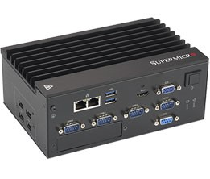
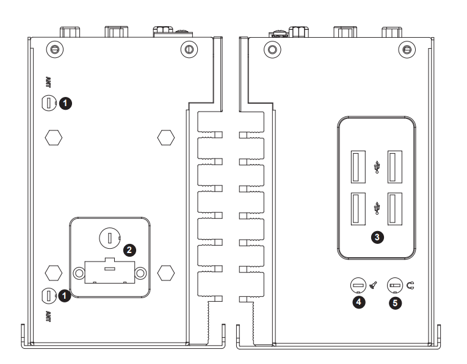
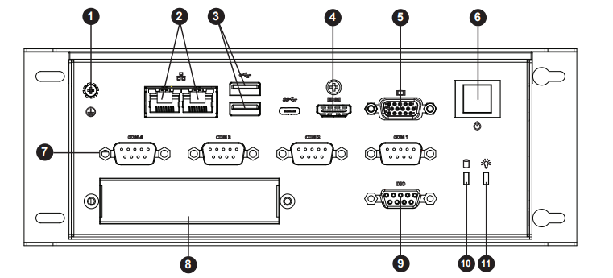

Supermicro SYS-E100-9AP-IA embedded system Azure IoT Edge Service with running Ubuntu 18.04
===
---

# Table of Contents

-   [Introduction](#Introduction)
-   [Step 1: Prerequisites](#Prerequisites)
-   [Step 2: Prepare your Device](#PrepareDevice)
-   [Step 3: Manual Test for Azure IoT Edge on device](#Manual)
-   [Step 4: Troubleshooting](#Troubleshooting)

# Introduction

**About this document**

This document describes how to connect Supermicro SYS-E100-9AP-IA  device running Ubuntu 18.04 with Azure IoT Edge Runtime pre-installed and Device Management. This multi-step process includes:

-   Configuring Azure IoT Hub
-   Registering your IoT device
-   Build and Deploy client component

# Step 1: Prerequisites

You should have the following items ready before beginning the process:

-   [Prepare your development environment][setup-devbox-linux]
-   [Setup your IoT hub](https://account.windowsazure.com/signup?offer=ms-azr-0044p)
-   [Provision your device and get its credentials][lnk-manage-iot-hub]
-   [Sign up to IOT Hub](https://account.windowsazure.com/signup?offer=ms-azr-0044p)
-   [Add the Edge Device](https://docs.microsoft.com/en-us/azure/iot-edge/quickstart-linux)
-   [Add the Edge Modules](https://docs.microsoft.com/en-us/azure/iot-edge/quickstart-linux#deploy-a-module)
-   SYS-E100-9AP-IA device
-   Any necessary connectivity cables (ex, RJ45 Ethernet cable, VGA display cable, etc)

# Step 2: Prepare your Device

**Connect the power adapter** - Super Srever E100-9AP-IA embedded system is comprised of the CSE-E101-IA Chassis and MBD-A2SAN-E single processor motherboard. The server is shipped with 1x non-ECC DDR3L SODIMM and 1x 2280 B-Key M.2 SSD.

 

*Image 1: SYS-E100-9AP-IA device*

**Image 1: SYS-E100-9AP-IA device** - In the shipping box there is a 60W power adapter. Connect the power cable to the power connector (2 on the side of the chassis) and lock the power adapter to the chassis.

 

*Image 2: SYS-E100-9AP-IA side connections*

**Image 2: SYS-E100-9AP-IA side connections** - 1 = Antenna port - 2 = Power input port - 3 = Side USB ports - 4 = 2.5mm microphone port - 5 = 2.5mm headphone port

**Connect to a network and monitor**

-   There are two GbE LAN ports (2) on the front of SYS-E100-9AP-IA. Connect one or both of the ports with an RJ45 cable to enable a network connection. Both ports are DHCP configured.
-   Connect to a monitor with a VGA cable to the VGA port (5) or an HDMI cable to the HDMI port (4) if needed.

 

*Image 3: SYS-E100-9AP-IA front connections*

**Image 3: SYS-E100-9AP-IA front connections** - 1 = Grounding Screw - 2 = LAN ports - 3 = Front USB ports - 4 = HDMI port - 5 = CGA port - 6 = Power button - 7 = COM ports - 8 = PCIe Expansion Port - 9 = DIO port - 10 = HDD activity LED - 11 = Power LED

**Power on the system and log in**

-   Press the power button (6) on the front of the system to turn it on.
-   The system has Ubuntu 18.04 installed. The login information is:

    -   Username: user2
    -   Password: SMC1234!
    -   Root password: SMC1234!

-   After system boot, please check the IP addresses of the Ethernet ports in order to SSH into the device. The SSH port is the default value, port 22.

For additional information about SYS-E100-9AP-IA, see the [Supermicro Website.](https://www.supermicro.com/products/system/Box_PC/SYS-E100-9AP-IA.cfm)

# Step 3: Manual Test for Azure IoT Edge on device

This section walks you through the test to be performed on the Edge devices running the Linux operating system such that it can qualify for Azure IoT Edge certification.

## 3.1 Edge RuntimeEnabled (Mandatory)

**Details of the requirement:**

The following components come pre-installed or at the point of distribution on the device to customer(s):

-   Azure IoT Edge Security Daemon
-   Daemon configuration file
-   Moby container management system
-   A version of `hsmlib` 

*Edge Runtime Enabled:*

**Check the iotedge daemon command:** 

Open the command prompt on your IoT Edge device , confirm that the Azure IoT edge Daemon is under running state

    systemctl status iotedge

 

Open the command prompt on your IoT Edge server, confirm that the module deployed from the cloud is running on your IoT Edge server. You will only see edgeAgent module running out of box.

    sudo iotedge list

  

On the device details page of the Azure, you should see the runtime modules - edgeAgent, edgeHub and tempSensor modueles are under running status

 

# Step 4: Troubleshooting

Please contact [Super Micro Computer](https://www.supermicro.com/) for help on device management component related issues.

[setup-devbox-linux]: https://github.com/Azure/azure-iot-sdk-c/blob/master/doc/devbox_setup.md
[lnk-setup-iot-hub]: ../setup_iothub.md
[lnk-manage-iot-hub]: ../manage_iot_hub.md
