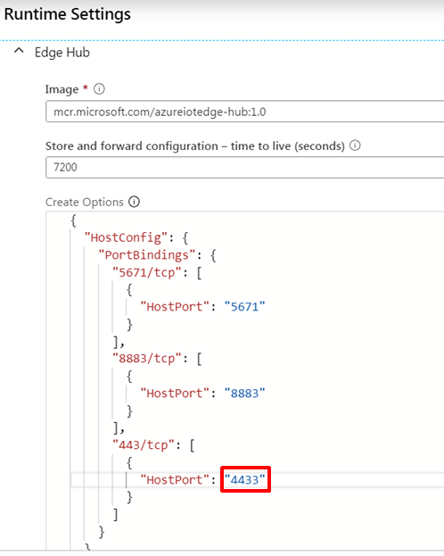
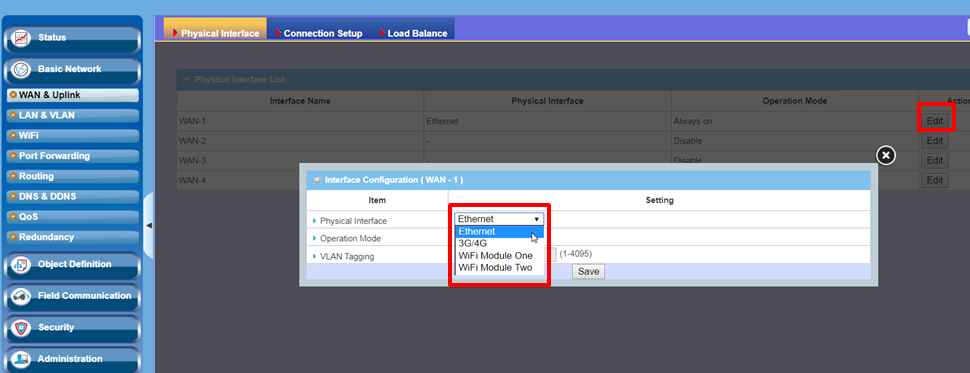
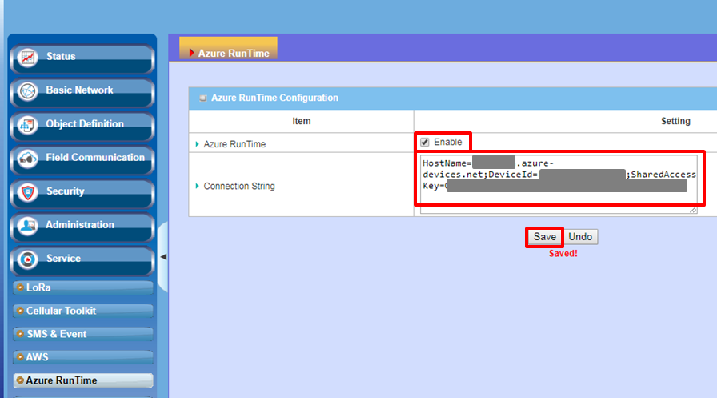

Run a simple Python sample on AiR PACE device running Yocto 2.5.1 (ARM64v8)
===
---

# Table of Contents

-   [Introduction](#Introduction)
-   [Step 1: Prerequisites](#Prerequisites)
-   [Step 2: Prepare your Device](#PrepareDevice)
-   [Step 3: Manual Test for Azure IoT Edge on device](#Manual)

# Introduction

**About this document**

This document describes how to connect AiR PACE device running Yocto 2.5.1 with Azure IoT Edge Runtime pre-installed and Device Management. This multi-step process includes:

-   Configuring Azure IoT Hub
-   Registering your IoT device
-   Build and Deploy client component to test device management capability 

# Step 1: Prerequisites

You should have the following items ready before beginning the process:

-   [Prepare your development environment]( https://github.com/Azure/azure-iot-sdk-c/blob/master/doc/devbox_setup.md)
-   [Setup your IoT hub](https://account.windowsazure.com/signup?offer=ms-azr-0044p)
-   [Provision your device and get its credentials]( https://catalog.azureiotsolutions.com/docs?title=Azure/azure-iot-device-ecosystem/manage_iot_hub)
-   [Sign up to IOT Hub](https://account.windowsazure.com/signup?offer=ms-azr-0044p)
-   [Add the Edge Device](https://docs.microsoft.com/en-us/azure/iot-edge/quickstart-linux)
-   [Add the Edge Modules](https://docs.microsoft.com/en-us/azure/iot-edge/quickstart-linux#deploy-a-module)
	-   Due to the 443 port has been used, change the “HostPort” from 443 to 4443.

	

-   AiR PACE device.

# Step 2: Prepare your Device

## 2.1 Connect cables

This section describes how to connect the cables:

-   Connect power cable
-   Connect WAN cable
-   Connect LAN cable

 

## 2.2 Login to WEB-UI

This section explains how to log in WEB-UI:

-   Open the browser and connect to WEB-UI (gateway of LAN port)

 

-   Fill in username and password for WEB-UI login

## 2.3 Set up WAN by WEB-UI

This section describes how to set up WAN after logging in WEB-UI:

-   **Basic Network**/**WAN & Uplink**/**Physical Interface**
-   Click “Edit” of *WAN-1*
-   Change to “Ethernet” of *Physical Interface* and then click “Save”

 

# Step 3: Manual Test for Azure IoT Edge on device

This section walks you through the test to be performed on the Edge devices running the Linux operating system such that it can qualify for Azure IoT Edge certification.

## 3.1 Edge RuntimeEnabled (Mandatory)

**Details of the requirement:**

The following components come pre-installed or at the point of distribution on the device to customer(s):

-   Azure IoT Edge Security Daemon
-   Daemon configuration file
-   Moby container management system
-   A version of `hsmlib` 

This section describes how to start the Azure service by WEB-UI:

-   **Service**/**Azure Runtile**
-   Check “Enable”
-   Fill in the connection string
-   Check “Save”

 

*Edge Runtime Enabled:*

**Check the iotedge daemon starting:** 

 

Open the command prompt on your IoT Edge device, confirm that the module deployed from the cloud is running on your IoT Edge device

    iotedge list

  

On the device details page of the Azure, you should see the runtime modules - edgeAgent, edgeHub and tempSensor modueles are under running status

 

