Run a simple Japanese sample on AI Edge Computer - AE2100 Series device running Yocto Project 2.5.1
===
---

# Table of Contents

-   [Introduction](#Introduction)
-   [Step 1: Prerequisites](#Prerequisites)
-   [Step 2: Prepare your Device](#PrepareDevice)
-   [Step 3: Manual Test for Azure IoT Edge on device](#Manual)

# Introduction
**About this document**

This document describes how to connect AI Edge Computer - AE2100 Series device running Yocto Project 2.5.1 with Azure IoT Edge Runtime pre-installed and Device Management. This multi-step process includes:

-   Configuring Azure IoT Hub
-   Registering your IoT device
-   Build and Deploy client component to test device management capability

# Step 1: Prerequisites

You should have the following items ready before beginning the process:

-   [Setup your IoT hub](https://account.windowsazure.com/signup?offer=ms-azr-0044p)
-   [Provision your device and get its credentials][lnk-manage-iot-hub]
-   [Sign up to IOT Hub](https://account.windowsazure.com/signup?offer=ms-azr-0044p)
-   [Add the Edge Device](https://docs.microsoft.com/en-us/azure/iot-edge/quickstart-linux)
-   [Get connectionString](https://docs.microsoft.com/en-us/azure/iot-edge/quickstart-linux)
-   [Add the Edge Modules](https://docs.microsoft.com/en-us/azure/iot-edge/quickstart-linux#deploy-a-module)

# Step 2: Prepare your Device

-   A network configuration example is shown below
-   Proxy not supported

 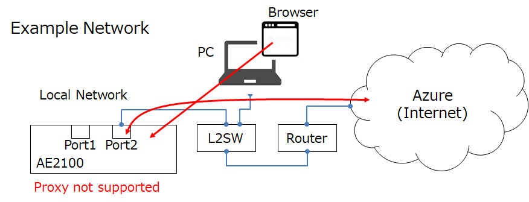

## 2.1 Conect Power cable, LAN cable

This section describes how to connect the cables

-    Connect Power cable
-    Connect LAN cable

 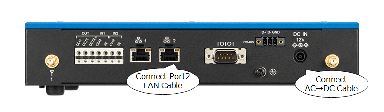

## 2.2 Power ON

This section explains how to turn on the power

-    Push power button

 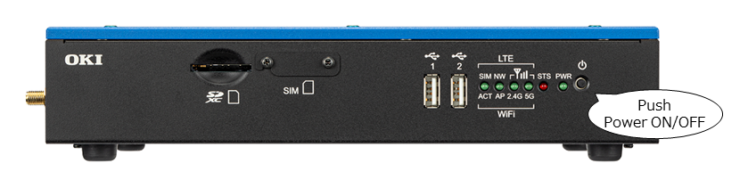

## 2.3 Login to WEB-UI

This section explains how to log in to WEB-UI

-    Factory IP address is 192.168.100.1/255.255.255.0
-    Connect to WEB-UI( http://192.168.100.1 )
-    Agree "使用許諾契約書(License agreement)"

 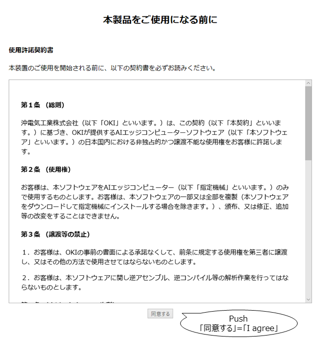

---

-    User name is "adm" for WEB-UI
-    Set password for WEB-UI

 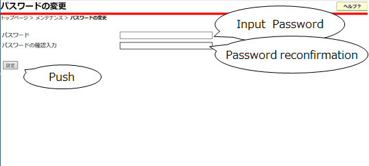

## 2.4 Setup network

This section describes how to set up the network

-    Select "ベーシック(Basic)"
-    Set IP Address
-    Set Default gateway
-    Set Primary DNS Server IP Address

 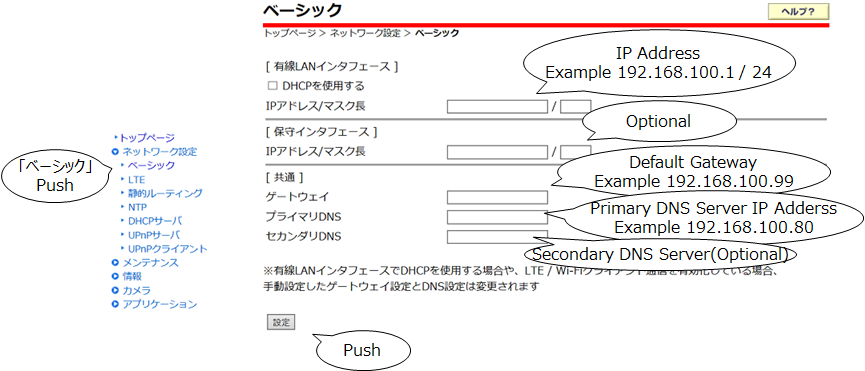

# Step 3: Manual Test for Azure IoT Edge on device

This section walks you through the test to be performed on the Edge devices running the Linux operating system such that it can qualify for Azure IoT Edge certification.

## 3.1 Edge RuntimeEnabled (Mandatory)

This section describes how to start the Azure service

---
-   Select "Azure IoT Edge"
-   Confirm that the service state is "停止中(suspended)"

 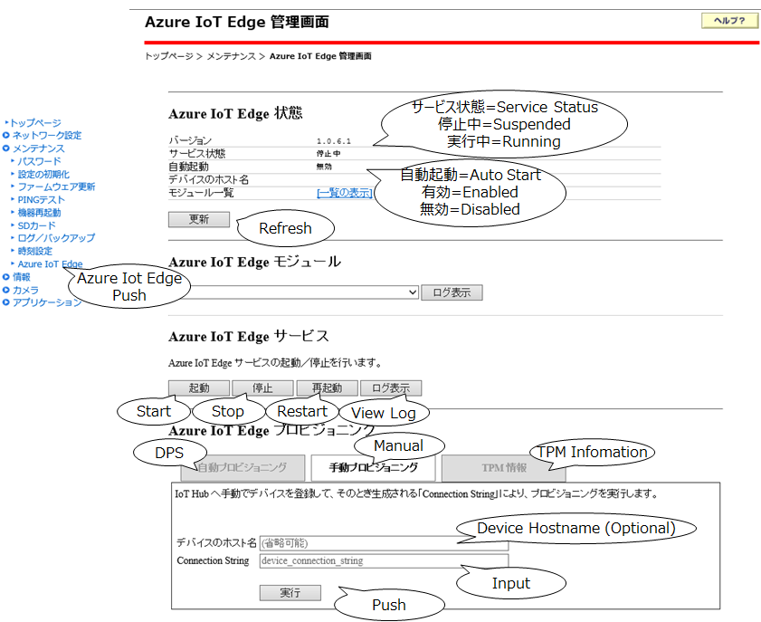
---
-   Select "手動プロビジョニング(Manual provisioning)"
-   Set "デバイスのホスト名(Device hostname)"
-   Set "Connection String"
-   Push "実行(Set)"
-   Push "起動(Start)" for Azure IoT Edge Service

 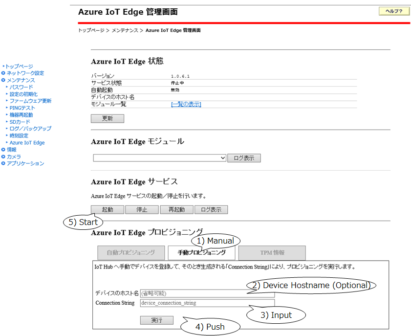
---
-   The service status becomes "実行中(Running)"
-   Auto-start becomes "有効(Enabled)"
-   Wait a few minutes

 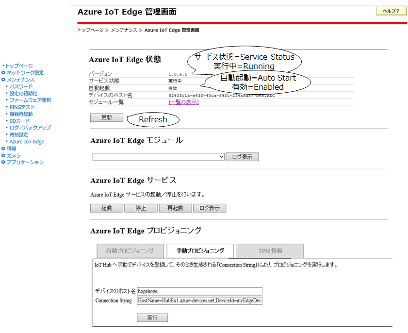
---
-   Check the service log

 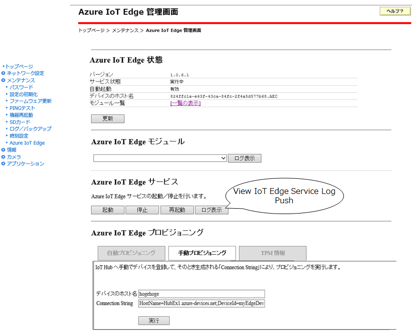
---
-   Confirm that "Active : active( running )" is displayed

 
---
-   Check which module is running

 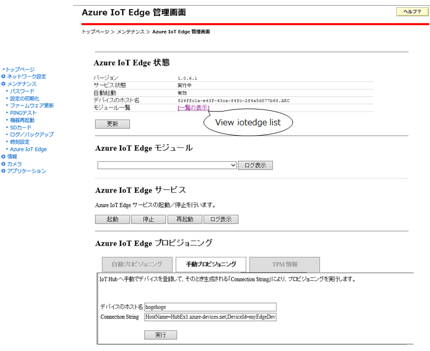
---
-   Confirm that 3 modules are running

 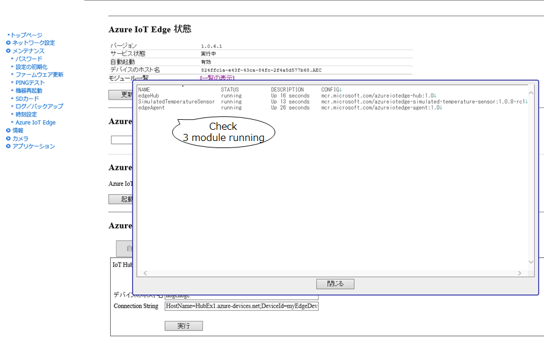
---
-   On the device details page of the Azure, you should see the runtime modules - edgeAgent, edgeHub and tempSensor modueles are under running status

 

## 3.2 Device Management (Optional)
***3.2.x The following are omitted because they are optional.***

**Pre-requisites:** Device Connectivity.

**Description:** A device that can perform basic device management operations (Reboot and Firmware update) triggered by messages from IoT Hub.

## 3.2.1 Firmware Update (Using Microsoft SDK Samples):

Specify the path {{enter the path}} where the firmwareupdate client components are installed.

To run the simulated device application, open a shell or command prompt window and navigate to the **iot-hub/Tutorials/FirmwareUpdate** folder in the Node.js project you downloaded. Then run the following commands:

    npm install
    node SimulatedDevice.js "{your device connection string}"

To run the back-end application, open another shell or command prompt window. Then navigate to the **iot-hub/Tutorials/FirmwareUpdate** folder in the Node.js project you downloaded. Then run the following commands:

    npm install
    node ServiceClient.js "{your service connection string}"

IoT device client will get the message and report the status to the device twin.

 

**Update firmware**

Confirm the IoT hub, Device ID, method name and method payload as below:

-   Press “call Method” button
-   Check the returning status as below:

 

## 3.2.2 Reboot (Using Microsoft SDK Samples):

Specify the path {{enter the path}} where the components are installed 

Confirm the IoT hub, Device ID, method name as below:

-   Press “call Method” button
-   Check the returning status as below:

 

IoT device client will get the message and report the status to the device twin.

 
  
## 3.2.3 Firmware Update (Modified SDK samples/Custom made application):

If the Client components are custom made please add the steps to execute the Firmware Update through Device Twin.

**Note**: Client Components must be shipped with the device 

## 3.2.4 Reboot (Modified SDK samples/Custom made application):

If the Client components are custom made please add the steps to execute the Device Reboot through Direct Methods

**Note**: Client Components must be shipped with the device 

  
[setup-devbox-linux]: https://github.com/Azure/azure-iot-sdk-c/blob/master/doc/devbox_setup.md
[lnk-setup-iot-hub]: ../setup_iothub.md
[lnk-manage-iot-hub]: ../manage_iot_hub.md
