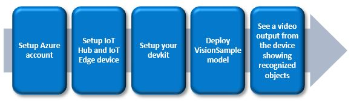

Run a simple C sample on Vision AI Camera device running Yocto
===
---

# Table of Contents

-   [Introduction](#Introduction)
-   [Step 1: Prerequisites](#Prerequisites)
-   [Step 2: Prepare your Device](#PrepareDevice)
-   [Step 3: Setup your Vision AI DevKit](#Setup)

# Introduction

**About this document**

This document describes how to connect Vision AI Camera device running Yocto with Azure IoT Edge Runtime pre-installed and Device Management. This multi-step process includes:

-   Configuring Azure IoT Hub
-   Registering your IoT device
-   Build and Deploy client component to test device management capability 

# Step 1: Prerequisites

To get you started on your journey with vision AI, using the Vision AI DevKit, this guide will take you through setting up your Azure account to seeing video output from the camera of recognized objects. We will use the VisionSample model for this process.

**What you will do:**

-   Setup Azure IoT resources to manage the Vision AI DevKit.
-   Setup the Vision AI DevKit to connect to Wi-Fi and register as an IoT Edge Device connected to an IoT Hub.
-   Deploy the VisionSample model to the device.

**What you will need**

-   Active Azure subscription (Create a [free account](https://azure.microsoft.com/en-in/free/?WT.mc_id=A261C142F.)
-   Vision AI DevKit hardware
-   Monitor supporting HDMI input and an HDMI cable (Do not use any cable adapters), or an [RTSP supporting video player application](https://azure.github.io/Vision-AI-DevKit-Pages/docs/RTSP_stream/)
-   Azure Command-Line Interface (CLI) installation

# Step 2: Prepare your Device

**Setup Azure IoT resources**

To setup your Vision AI DevKit as an Azure IoT Edge device, you will create an IoT Hub to register and remotely manage your DevKit as an Edge device. All required resources are free.

**Install Azure Command Line Interface (CLI) tools**

-   [Install Azure CLI](https://docs.microsoft.com/en-us/cli/azure/install-azure-cli?view=azure-cli-latest).
-   Login to your Azure subscription with Azure CLI:

        az login

-   Verify the correct subscription is being used:

        az account list --output table

-   If the incorrect subscription is being used, use the following command to change to the correct one:

        az account set --subscription <SubscriptionId>

-   [Install Azure CLI IoT extension](https://github.com/Azure/azure-iot-cli-extension):

        az extension add --name azure-cli-iot-ext

**Create Azure IoT resources**

-   Create a resource group to manage all your Azure resources for this project:

        az group create --name AiDevKitResources --location westus2

-   Create a free F1 IoT Hub (Note: replace {myIoTHub} with a unique name):

        az iot hub create --resource-group AiDevKitResources --name {myIoTHub} --sku F1
 
    This process can take 3 - 5 minutes.

**Note:** *If your receive an error because there is already a free hub in use on your subscription, change the SKU to S1. You may also see an error that the IoT Hub name is not available. IoT Hub names must be globally unique. Please try another name.*

-   Register your Vision AI DevKit in IoT Hub.

        az iot hub device-identity create --hub-name {myIoTHub} --device-id myAiDevKitDevice --edge-enabled

-   Retrieve the connection string for your device, which links your physical device with its identity in IoT Hub. Copy the the `connectionString` value. You will use this value when connecting your Vision AI DevKit.

        az iot hub device-identity show-connection-string --device-id myAiDevKitDevice --hub-name {myIoTHub}

# Step 3: Setup your Vision AI DevKit

Follow these [instructions](https://azure.github.io/Vision-AI-DevKit-Pages/docs/Run_OOBE/#connect-the-vision-ai-dev-kit-hardware-to-your-azure-iot-hub) to set up your device for Wifi and register it as an IoT Edge device connected to your IoT Hub.

## Deploy the sample vision AI model

To deploy an sample AI model, we will use the **AI Vision Dev Kit Get Started Module** from the IoT Edge marketplace.

**Note:** *This module is currently hidden in the marketplace thus is only visible with the link below.*

-   Go to [this link](https://ms.portal.azure.com/?microsoft_azure_marketplace_ItemHideKey=AIDevKitPreview#blade/Microsoft_Azure_Marketplace/GalleryFeaturedMenuItemBlade/selectedMenuItemId/home/searchQuery/AI%20vision%20dev%20kit/resetMenuId/), which will require you to sign-in to the Azure portal. You should see **AI Vision Dev Kit Get Started Module**. Click on the name, then click the Create button.
-   Choose your subscription and the IoT Hub you created (these fields may already be filled with the correct information)
-   Click **Find device**, the click on the name of the device you created, `myAiDevKitDevice` in the **Select IoT Edge Device** panel that appears.
-   Click `Select`, then click `Create`.

**Note:** *Module URI will need to be updated to use a test version.*

   To edit the module URI, click on Configure next to the name of the module (AIVisionDevKitGetStartedModule). Update the Image URI field to 

    mcr.microsoft.com/aivision/visionsamplemodule:1.0.16_SSD-arm32v7

   Version 1.0.16 or higher of the get started module requires updated Container Create Options settings. Please replace the current Container Create Options values with the following and hit `Save`:

**Note:** *This step won’t be required by customers once released.*

**Note:** *On the latest firmware, a regression has been introduced. To work around it, click on Configure advanced Edge runtime settings and replace the Create Options of the Edge Hub with the following:*

**Note:** *Some reliability issues have been found with the current version of the edgeHub. To fix them, click on `Configure advanced Edge runtime settings `replace the Edge Hub Image from `mcr.microsoft.com/azureiotedge-hub:1.0` with `mcr.microsoft.com/azureiotedge-hub:1.0.7-rc2` and the Edge Agent Image from `mcr.microsoft.com/azureiotedge-agent:1.0` with `mcr.microsoft.com/azureiotedge-agent:1.0.7-rc2`. This will be fixed automatically with 1.0.7 release. Click the `Save` button.*

-   Confirm the deployment by clicking on `Next` twice then `Submit`.

After a few minutes (once the module has downloaded to your DevKit), you should see objects being detected by the camera when viewing the output from your DevKit on an HDMI connected monitor! (Note: the 417 Runtime Response should be replaced with ‘OK’ once the module has downloaded.) You can optionally use a video player app supporting the RTSP protocol, such as VLC Player, to view the video output from your camera. See the topic [View RTSP video stream](https://azure.github.io/Vision-AI-DevKit-Pages/docs/RTSP_stream/) for details.
