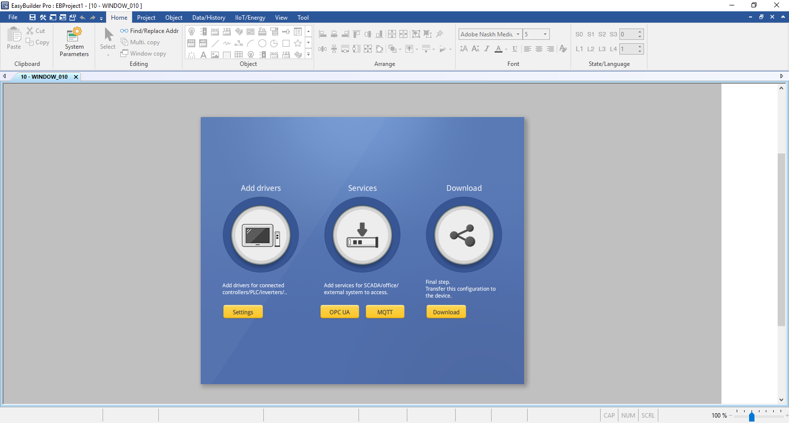
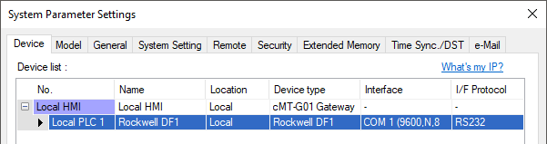
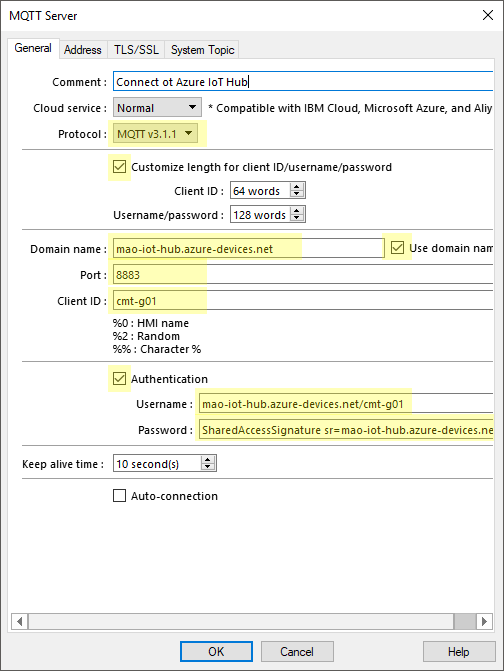
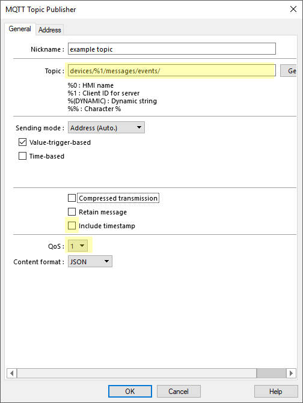
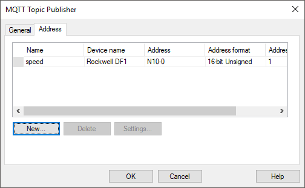
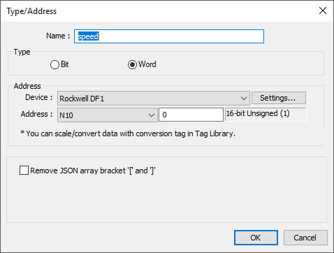

Configure cMT-G01 as an Azure IoT Hub device
===
---

#Table of Contents

-   [Introduction](#Introduction)
-   [Step 1: Prerequisites](#Prerequisites)
-   [Step 2: Prepare your Device](#PrepareDevice)
-   [Next Steps](#NextSteps)

#Introduction

This document describes how to connect cMT-G01 to Azure IoT Hub. It can also be applied to other cMT Gateway products. The multi-step process includes:

-   Configuring Azure IoT Hub
-   Registering your IoT device
-   Configure the device to publish device data to Azure IoT Hub

#Step 1: Prerequisites

You should have the following items ready before beginning the process:

-   [Setup your IoT hub][lnk-setup-iot-hub]
-   [Provision your device and get its credentials][lnk-manage-iot-hub]
-   Create a SAS token for your device as described in [iot-hub-mqtt-support](https://docs.microsoft.com/en-Us/azure/iot-hub/iot-hub-mqtt-support)
-   Configuration software EasyBuilder Pro. Download the software from <http://www.weintek.com/globalw/Download/Download.aspx>
-   cMT-G01 or cMT Gateway device

Step 2: Prepare your Device

1. Open EasyBuilder Pro and create a new cMT-G01 project. 

     

2. Add corresponding drvier for your controller/device. For example, a Rockwell DF1 driver on COM1.

     

3. Open MQTT setting and enable it.
4. In [General] tab, Fill in information from Step 1.

     

   -   Protocol: Select **MQTT v3.1.1**
   -   Enable **Customize length for client ID/username/password**
   -   Domain name: **{IoT hub name}.azure-devices.net**
   -   Port: **8883**
   -   Client ID: **{device_id}**
   -   Username: **{IoT hub name}.azure-devices.net/{device_id}**
   -   Password: Copy text after `SharedAccessSignature=` from SAS token of the device. The password will be this format: `SharedAccessSignature sr={IoT hub name}.azure-devices.net%2Fdevices%2F{device_id}%2Fapi-version%3D2016-11-14&sig={sig}%3d&se={expired_time}`

5. In [TLS/SSL] tab, **enable TLS/SSL**.
6. In [System Topic] tab, disable default topic "Topic List" and "Connect State"
7. Click [OK] to save connection settings.
8. In [Topic Publisher] tab, click [New...] to create a new publishing topic.
9. In topic's [General] tab, configure the topic properties.

     Topic: **device/%1/messages/events** 
     Select **1** for QoS 

     

10. In topic's [Address] tab, configure the device data to report.

    

    Click [New] to add a new device address.

    

11. Simulate the result. You may use [Online Simulation] if your PC can connect to the device/controller or use [Offline Simulation] to simulate one. The simulator will behave like a simulated cMT-G01 and connect to Azure IoT Hub. 
12. When simulation succeeds, you may donwload this project to cMT-G01.

Next Steps
==========

To explore how to store, analyze and visualize the data from this application in Azure using a variety of different services, please click on the following lessons:

- [Manage cloud device messaging with iothub-explorer]
- [Save IoT Hub messages to Azure data storage]
- [Use Power BI to visualize real-time sensor data from Azure IoT Hub]
- [Use Azure Web Apps to visualize real-time sensor data from Azure IoT Hub]
- [Weather forecast using the sensor data from your IoT hub in Azure Machine Learning]
- [Remote monitoring and notifications with Logic Apps]   

[Manage cloud device messaging with iothub-explorer]: https://docs.microsoft.com/en-us/azure/iot-hub/iot-hub-explorer-cloud-device-messaging
[Save IoT Hub messages to Azure data storage]: https://docs.microsoft.com/en-us/azure/iot-hub/iot-hub-store-data-in-azure-table-storage
[Use Power BI to visualize real-time sensor data from Azure IoT Hub]: https://docs.microsoft.com/en-us/azure/iot-hub/iot-hub-live-data-visualization-in-power-bi
[Use Azure Web Apps to visualize real-time sensor data from Azure IoT Hub]: https://docs.microsoft.com/en-us/azure/iot-hub/iot-hub-live-data-visualization-in-web-apps
[Weather forecast using the sensor data from your IoT hub in Azure Machine Learning]: https://docs.microsoft.com/en-us/azure/iot-hub/iot-hub-weather-forecast-machine-learning
[Remote monitoring and notifications with Logic Apps]: https://docs.microsoft.com/en-us/azure/iot-hub/iot-hub-monitoring-notifications-with-azure-logic-apps
[setup-devbox-linux]: https://github.com/Azure/azure-iot-sdk-c/blob/master/doc/devbox_setup.md
[lnk-setup-iot-hub]: ../setup_iothub.md
[lnk-manage-iot-hub]: ../manage_iot_hub.md
