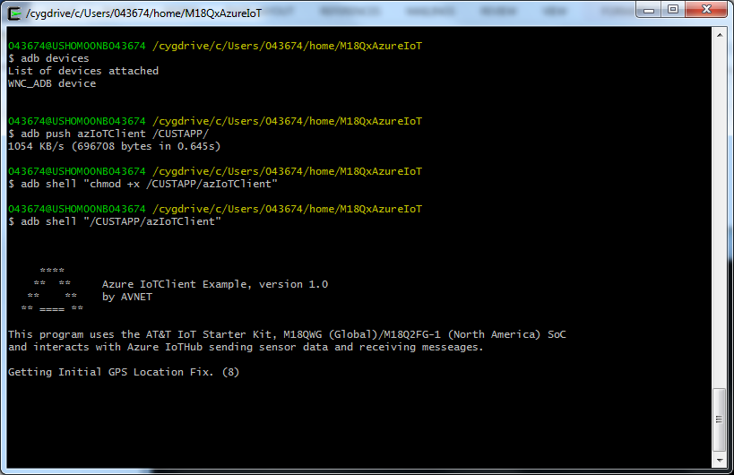

Run a simple C sample on the AT&T 2nd Generation IoT Starter Kit device running Embedded Linux
===
---

# Table of Contents

-   [Introduction](#Introduction)
-   [Step 1: Prerequisites](#Prerequisites)
-   [Step 2: Prepare your Device](#PrepareDevice)
-   [Step 3: Build and Run the Sample](#Build)
-   [Next Steps](#NextSteps)

# Introduction

**About this document**

This document describes how to connect the AT&T IoT Starter Kit device running eLinux with Azure IoT SDK. This multi-step process includes:
-   Configuring Azure IoT Hub
-   Registering your IoT device
-   Build and deploy Azure IoT SDK on device

An unabridged tutorial and purchasing links for this kit is available at https://www.element14.com/community/groups/internet-of-things/blog/2018/12/03/using-an-avnet-lte-iot-starter-kit-with-microsoft-azure

# Step 1: Prerequisites

You should have the following items ready before beginning the process:

-   [Prepare your development environment][setup-devbox-linux]
-   [Setup your IoT hub][lnk-setup-iot-hub]
-   [Provision your device and get its credentials][lnk-manage-iot-hub]

The development tools and scripts for the IoT Starter Kit are targeted to a Linux environment.  They can be run on a virtual machine running Linux if necessary.

## GIT Distributed Version Control System

This is available at:  [https://gist.github.com/derhuerst/1b15ff4652a867391f03](https://www.element14.com/community/external-link.jspa?url=https%3A%2F%2Fgist.github.com%2Fderhuerst%2F1b15ff4652a867391f03)

## The WNC SDK 

Obtained by issuing the command:

    git clone http://github.com/Avnet/AvnetWNCSDK

Once cloned, proceed to the AvnetWNCSDK directory and install the tools by executing the command:

    sudo ./oecorex-86_64-cortexa7-neon-vfpv4-toolchain-nodistro.0.sh'

After the toolchain has been installed, you will need to add the environment variables  (you need to do this each time you open a new terminal window for development) by executing:

`. /usr/local/oecore-x86_64/environment-setup-cortexa7-neon-vfpv4-oe-linux-gnueabi`
 (there is a spaces after the '.')

## Install ADB

1.  Open up a terminal window.
2.  Install ADB by issuing the command '`sudo apt-get install adb`'
3.  Copy the file file  adbpub.key  from the AvnetWNCSDK directory to the ADB directory (`cp ./AvnetWNCSDK/adbpub.key ~/.android/`). This installs the security key so ADB can access the SK2.
4.  Connect your M18Qx to the development PC
5.  Verify the ADB connection by listing the attached devices,  `sudo adb devices`  When you do this the SK2 should be reported as:

        $sudo adb devices
        List of devices attached
        WNC_ADB device

# Get Program Source Code

-   The source code is available from  [https://github.com/Avnet/M18QxAzureIoT](https://www.element14.com/community/external-link.jspa?url=https%3A%2F%2Fgithub.com%2FAvnet%2FM18QxAzureIoT "https://github.com/Avnet/M18QxAzureIoT")**.** You get this code by issuing the command:

        git clone --recurse-submodules https://github.com/Avnet/M18QxAzureIoT 

# Step 2: Prepare your Device
Insert the AT&T SIM card that came with your Kit into the SIM socket and connect it to Power and the development PC using the included Power Cube and USB cables.

# Step 3: Build and Run the sample

## 3.1 Build the samples

Build the program using the following steps.

1.  Go to the M18QxAzureIoT directory
2.  Set your environment by executing the command '**`. /usr/local/oecore-x86_64/environment-setup-cortexa7-neon-vfpv4-oe-linux-gnueabi`'** (If the SDK is in the default location of /usr/local/oecore... if you used a different location, you will have to update the path).
3.  Run the  **autogen.sh**  script. This scrip will install the tools, sub-directories, and other artifacts needed to configure the build system. During this step, the automake tools will read the  **configure.ac**  file and create a 'configure' script.
4.  Execute the '**./configure ${CONFIGURE_FLAGS}**' command. This script was created in step #3 and the environment variable CONFIGURE_FLAGS is created when you run the environment script in step #1. This command will read the Makefile.am file and using CONFIGURE_FLAGS will create a Makefile that is used when running the make command.
5.  You must update the file  **azClientFunctions.cpp**  (line 26) so that it contains the correct  _connectionString_  for your device. 
6.  You are now ready to build the program by issuing the '**make**' command. When you do this, you will observe all the source files be compiled and linked. The end result is a file named '**azIotClient**' which is what we will push to the  LTE IoT Starter Kit.

The   **'azIoTClient'**  file  is the executable code that will be installed on the M18Qx.

### Installing code on the IoT Starter Kit
Use ADB to install the code. First ensure the M18Qx is connected to the development machine and that ADB is connected. You can an verify this by issuing the 'adb devices' command:

    $sudo adb devices
    List of devices attached
    WNC_ADB device

With ADB running and connected to the M18Qx, issue the command to push the executable to the '/CUSTAPP' directory on the IoT Startr Kit.  After you have pushed the executable to the M18Qx, you may need to set the execute attribute so that it can be executed.

    $adb push azIoTClient /CUSTAPP/
    $adb shell "chmod +x /CUSTAPP/azIoTClient"

## 3.3 Run and Validate the Samples

In this section you will run the Azure IoT client SDK samples to validate
communication between your device and Azure IoT Hub. You will send messages to the Azure IoT Hub service and validate that IoT Hub has successfully receive the data. You will also monitor any messages send from the Azure IoT Hub to client.

### 3.3.1 Send Device Events to IOT Hub:

**Sending Telemetry to IoT Hub Sample:**
Run the application by issuing the following ADB command:

     $adb shell "/CUSTAPP/azIoTClient"

When it runs, the output will resemble.

 

The Application will automatically begin sending Telemetry Messages to your Azure IoT Hub and will report when each message is sent.

### 3.3.2 Receive messages from IoT Hub

**3.2.1 Send message from IoT Hub to Device Sample:**
You can send the following messages to the device from Azure:

Message/Command | Description
--- | ---
 REPORT-SENSORS | Reply with a list of available sensor
 SET-PERIOD x | sets the reporting period for standard telemetry messages to x|
GET-DEV-INFO | lists the information about this M18Qx device
GET-LOCATION | sends the current latitude/longitude location
GET-TEMP | sends the current temperature at the boards location
GET-POS | sends the positional information about the board
GET-ENV | sends environmental information about the boards location
LED-ON-MAGENTA | turns the boards LED to Magenta, always on
LED-BLINK-MAGENTA | turns the boards LED to Magenta, blinking
LED-OFF | turns off the boards LED

To send a command, issue the command:

    az iot device c2d-message send --login "HostName=XXX;SharedAccessKeyName=XXX;SharedAccessKey=XXX" --device-id XXX --data "<command>"

You must specify the  **--device-id** along with the login and command because you want this message delivered to a particular device. When you do this with the  **GET-LOCATION** command will resemble:

    az iot device c2d-message send --login "HostName=XXX;SharedAccessKeyName=XXX;SharedAccessKey=XXX" --device-id XXX --data "GET-LOCATION"   

    az iot hub monitor-events --login "HostName=XXX;SharedAccessKeyName=XXX;SharedAccessKey=XXX"   Starting event monitor, use ctrl-c to stop...   event:   origin: XXX   payload: '{"ObjectName":"location-report","last GPS fix":"Fri 2018-11-30 18:34:17","lat":36.04,"long":-78.63}'

# Next Steps

You have now learned how to run a sample application that collects sensor data and sends it to your IoT hub. To explore how to store, analyze and visualize the data from this application in Azure using a variety of different services, please click on the following lessons:

-   [Manage cloud device messaging with iothub-explorer]
-   [Save IoT Hub messages to Azure data storage]
-   [Use Power BI to visualize real-time sensor data from Azure IoT Hub]
-   [Use Azure Web Apps to visualize real-time sensor data from Azure IoT Hub]
-   [Weather forecast using the sensor data from your IoT hub in Azure Machine Learning]
-   [Remote monitoring and notifications with Logic Apps]   

[Manage cloud device messaging with iothub-explorer]: https://docs.microsoft.com/en-us/azure/iot-hub/iot-hub-explorer-cloud-device-messaging
[Save IoT Hub messages to Azure data storage]: https://docs.microsoft.com/en-us/azure/iot-hub/iot-hub-store-data-in-azure-table-storage
[Use Power BI to visualize real-time sensor data from Azure IoT Hub]: https://docs.microsoft.com/en-us/azure/iot-hub/iot-hub-live-data-visualization-in-power-bi
[Use Azure Web Apps to visualize real-time sensor data from Azure IoT Hub]: https://docs.microsoft.com/en-us/azure/iot-hub/iot-hub-live-data-visualization-in-web-apps
[Weather forecast using the sensor data from your IoT hub in Azure Machine Learning]: https://docs.microsoft.com/en-us/azure/iot-hub/iot-hub-weather-forecast-machine-learning
[Remote monitoring and notifications with Logic Apps]: https://docs.microsoft.com/en-us/azure/iot-hub/iot-hub-monitoring-notifications-with-azure-logic-apps
[setup-devbox-linux]: https://github.com/Azure/azure-iot-sdk-c/blob/master/doc/devbox_setup.md
[lnk-setup-iot-hub]: ../setup_iothub.md
[lnk-manage-iot-hub]: ../manage_iot_hub.md

