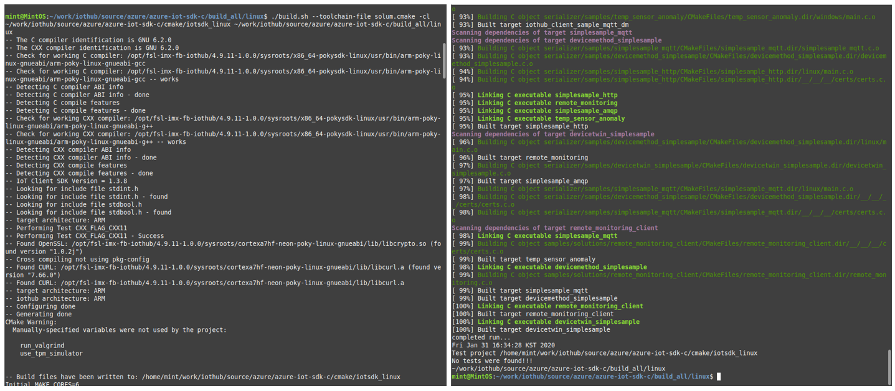
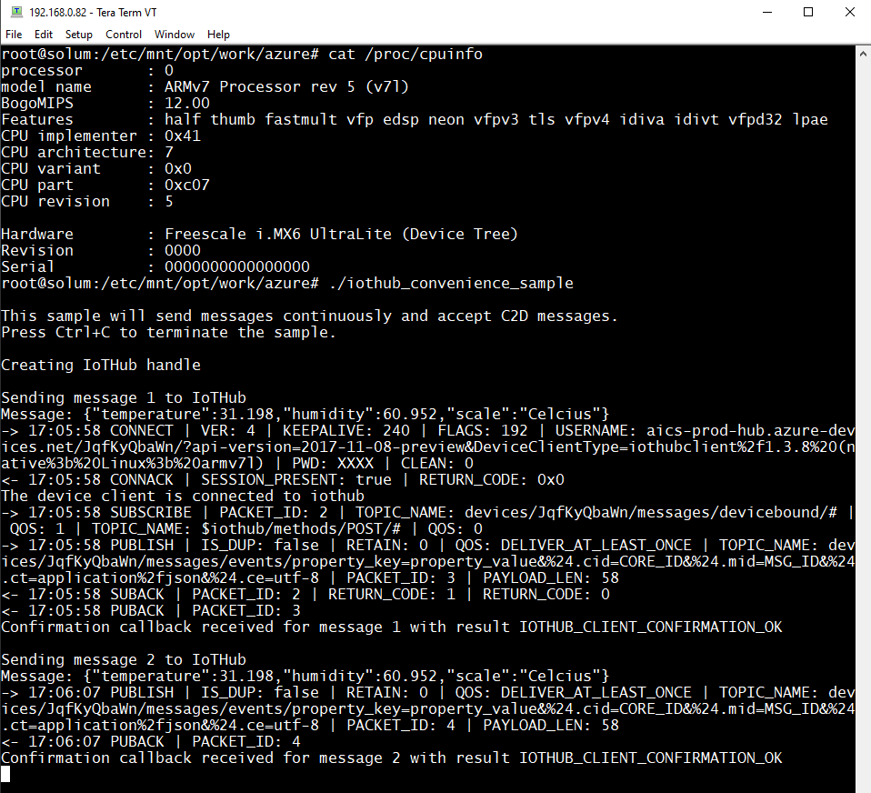

Run a simple C sample on SLG-DM101 device running Embedded Linux from Yocto Project
===
---

# Table of Contents

-   [Introduction](#Introduction)
-   [Step 1: Prerequisites](#Prerequisites)
-   [Step 2: Prepare your Device](#PrepareDevice)
-   [Step 3: Build and Run the Sample](#Build)
-   [Next Steps](#NextSteps)

# Introduction

**About this document**

This document describes how to connect SoluM SLG-DM101 (USB Gateway) device running Embedded Linux from Yocto Project with Azure IoT SDK. This multi-step process includes:
- 	Downloading Azure IoT Hub SDK on Linux PC 
-   Modifying application sample source codes in Azure IoT Hub SDK
-   Registering your IoT device
-   Executing a sample application program (iothub_convenience_sample) of Azure IoT SDK on device

# Step 1: Prerequisites

This document describes how to build and test Azure IoT SDK on SoluM device. 
We assume that you have already configured a development environment (Yocto) referring to the documents from NXP.

You should have the following items ready before beginning the process:

-   Linux PC with Git client installed and access to the [azure-iot-sdk-c](https://github.com/Azure/azure-iot-sdk-c) GitHub
-   SLG-DM101 (SoluM USB Gateway) device.
-   SSH Client on PC in order to connect to the device for executing an application sample.
-   WIFI AP (Aruba or Samsung) supporting SLG-DM101 in order for the device to connect to IoT Hub or USB Typed-WIFI Dongle (RTL 8821cu with USB Gender) 

    <https://www.arubanetworks.com/techdocs/ArubaOS_85_Web_Help/Content/arubaos-solutions/iot/solum.htm>

	<https://www.arubanetworks.com/assets/pso/PSO_Solum.pdf>

# Step 2: Prepare your Device

You can enable SoluM Device to connect to Azure IoT Hub by using one of the below methods. 

When using WIFI AP (such as Aruba AP or Samsung AP)

-   Connect the device to USB port of Aruba WIFI AP (As the below picture using Aruba AP-303H Model)
-   Turn on the WIFI AP by using PoE Cable 
-   After a while, the device (SLG-DM101) will be turned on from USB Power source of the WIFI AP.
-   The device will automatically retrieve an IP address from DHCP Server through Ethernet over USB.

When using WIFI USB Dongle (RTL8821CU, Dual-Band Chipset) 

-	Assuming that SSID and Password to connect to WIFI AP are already configured through WebUI of the device.
-	Connect WIFI Dongle to the micro USB Port of SoluM device with USB Gender.
-   Connect the device to the USB port of Power adapter or USB extension cable.

-   Connection Setting

		Port : 22
		Connection Type : SSH with ppk Key file
	
	

# Step 3: Build and Run the sample

## 3.1 Load the Azure IoT bits and prerequisites on device

-	We assume that user has already configured a development environment in order to build Yocto Project based on the documents from NXP.  
-	For your information, cURL, openSSL, libz and libuuid have already been built manually.
-	Please download the source files from git [https://github.com/Azure/azure-iot-sdk-c.git]

		git clone https://github.com/Azure/azure-iot-sdk-c.git
		cd azure-iot-sdk-c
		git submodule update --init

## 3.2 Build the samples

-	We have made a new cmake file (./build_all/linux/solum.cmake) for building the SDK and have used the modified sysroot folder including some libraries and some headers. 

		set(CMAKE_TRY_COMPILE_TARGET_TYPE STATIC_LIBRARY)
		set(CMAKE_SYSTEM_NAME Linux)
		set(CMAKE_SYSTEM_PROCESSOR armv7ve)
		set(TOOLCHAIN_PREFIX $ENV{SYSROOTS}/x86_64-pokysdk-linux/usr/bin/arm-poky-linux-gnueabi/arm-poky-linux-gnueabi-)
		set(CMAKE_C_COMPILER ${TOOLCHAIN_PREFIX}gcc)
		set(CMAKE_CXX_COMPILER ${TOOLCHAIN_PREFIX}g++)
		set(CMAKE_SYSROOT $ENV{SYSROOTS}/cortexa7hf-neon-poky-linux-gnueabi)
		link_libraries(z)
		set(CMAKE_FIND_ROOT_PATH ${CMAKE_SYSROOT})
		set(CMAKE_FIND_ROOT_PATH_MODE_PROGRAM NEVER)
		set(CMAKE_FIND_ROOT_PATH_MODE_LIBRARY ONLY)
		set(CMAKE_FIND_ROOT_PATH_MODE_INCLUDE ONLY)
		set(OPENSSL_INCLUDE_DIR "/usr/local/poky/openssl/include")
		set(CURL_INCLUDE_DIR "/usr/local/poky/curl_7.66/include")
		set(ZLIB_INCLUDE_DIR "/usr/local/poky/zlib/include")
		set(CMAKE_FIND_ROOT_PATH_MODE_PACKAGE ONLY)
		set(COMPILER_FLAGS " -march=armv7ve -mfpu=neon  -mfloat-abi=hard -mcpu=cortex-a7")
		set(CMAKE_C_FLAGS "${CMAKE_C_FLAGS} ${COMPILER_FLAGS}" CACHE STRING "" FORCE)
		set(CMAKE_CXX_FLAGS "${CMAKE_CXX_FLAGS} ${COMPILER_FLAGS}" CACHE STRING "" FORCE)

-	Modify CMakeList.txt (./azure-iot-sdk-c/) in order to resolve a certificate issue on ARM platform

		# openssl samples on Windows need to have a trusted cert set
		if ((WIN32 AND ${use_openssl}) OR ${use_wolfssl} OR ${use_mbedtls} OR ${use_bearssl})
			option(use_sample_trusted_cert "Set flag in samples to use SDK's built-in CA as TrustedCerts" ON)
		else()
			#option(use_sample_trusted_cert "Set flag in samples to use SDK's built-in CA as TrustedCerts" OFF)
			option(use_sample_trusted_cert "Set flag in samples to use SDK's built-in CA as TrustedCerts" ON)
		endif()

		
-	Edit the following place holder for IoT connection string with your own one (iothub_convenience_sample.c)
	
		/* Paste in your device connection string  */
		static const char* connectionString = "[device connection string]";
		
-	Build the source code by using the below commands

		cd build_all/linux
		export SYSROOTS=/opt/fsl-imx-fb-iothub/4.9.11-1.0.0/sysrootsiot
		export SOLUM_ROOT=$(pwd)
		./build.sh --toolchain-file solum.cmake -cl

	

-	Check whether the sample application has been successfully built (iothub_convenience_sample)

		mint@MintOS:~/work/iothub/source/azure/azure-iot-sdk-c/cmake/iotsdk_linux/iothub_client/samples/iothub_convenience_sample$ pwd
		/home/mint/work/iothub/source/azure/azure-iot-sdk-c/cmake/iotsdk_linux/iothub_client/samples/iothub_convenience_sample
		mint@MintOS:~/work/iothub/source/azure/azure-iot-sdk-c/cmake/iotsdk_linux/iothub_client/samples/iothub_convenience_sample$ ls -al
		total 1004
		drwxr-xr-x  3 mint mint   4096 Jan 31 16:34 .
		drwxr-xr-x 14 mint mint   4096 Jan 31 16:34 ..
		drwxr-xr-x  3 mint mint   4096 Jan 31 16:34 CMakeFiles
		-rw-r--r--  1 mint mint   1188 Jan 31 16:34 cmake_install.cmake
		-rw-r--r--  1 mint mint    430 Jan 31 16:34 CTestTestfile.cmake
		-rwxr-xr-x  1 mint mint 993300 Jan 31 16:34 iothub_convenience_sample
		-rw-r--r--  1 mint mint  11241 Jan 31 16:34 Makefile
		mint@MintOS:~/work/iothub/source/azure/azure-iot-sdk-c/cmake/iotsdk_linux/iothub_client/samples/iothub_convenience_sample$ file iothub_convenience_sample 
		iothub_convenience_sample: ELF 32-bit LSB executable, ARM, EABI5 version 1 (SYSV), dynamically linked, interpreter /lib/ld-linux-armhf.so.3, for GNU/Linux 3.2.0, BuildID[sha1]=1b5fc717dfc9aba94ecad99dcafe9c4db3737701, with debug_info, not stripped
		mint@MintOS:~/work/iothub/source/azure/azure-iot-sdk-c/cmake/iotsdk_linux/iothub_client/samples/iothub_convenience_sample$ 

-	Copy the sample application binary file to the device by using NFS or USB Memory Stick.

		root@solum:/etc/mnt/opt/work/azure# date
		Fri Jan 31 17:03:57 KST 2020
		root@solum:/etc/mnt/opt/work/azure# cat /proc/cpuinfo
		processor       : 0
		model name      : ARMv7 Processor rev 5 (v7l)
		BogoMIPS        : 12.00
		Features        : half thumb fastmult vfp edsp neon vfpv3 tls vfpv4 idiva idivt vfpd32 lpae
		CPU implementer : 0x41
		CPU architecture: 7
		CPU variant     : 0x0
		CPU part        : 0xc07
		CPU revision    : 5

		Hardware        : Freescale i.MX6 UltraLite (Device Tree)
		Revision        : 0000
		Serial          : 0000000000000000
		root@solum:/etc/mnt/opt/work/azure# ls -al
		drwxr-xr-x    2 root     root          4096 Jan 31 17:03 .
		drwxr-xr-x   18 root     root          4096 Jan 30 09:46 ..
		-rwxr-xr-x    1 root     root        993300 Jan 31 17:03 iothub_convenience_sample
		root@solum:/etc/mnt/opt/work/azure#

## 3.3 Run and Validate the Samples

In this section you will run the Azure IoT client SDK samples to validate
communication between your device and Azure IoT Hub. You will send messages to the Azure IoT Hub service and validate that IoT Hub has successfully receive the data. You will also monitor any messages send from the Azure IoT Hub to client.

### 3.3.1 Send Device Events to IOT Hub:

-   Run the sample by issuing following command.    

		
		

# Next Steps

You have now learned how to run a sample application that collects sensor data and sends it to your IoT hub. To explore how to store, analyze and visualize the data from this application in Azure using a variety of different services, please click on the following lessons:

-   [Manage cloud device messaging with iothub-explorer]
-   [Save IoT Hub messages to Azure data storage]
-   [Use Power BI to visualize real-time sensor data from Azure IoT Hub]
-   [Use Azure Web Apps to visualize real-time sensor data from Azure IoT Hub]
-   [Weather forecast using the sensor data from your IoT hub in Azure Machine Learning]
-   [Remote monitoring and notifications with Logic Apps]   

[Manage cloud device messaging with iothub-explorer]: https://docs.microsoft.com/en-us/azure/iot-hub/iot-hub-explorer-cloud-device-messaging
[Save IoT Hub messages to Azure data storage]: https://docs.microsoft.com/en-us/azure/iot-hub/iot-hub-store-data-in-azure-table-storage
[Use Power BI to visualize real-time sensor data from Azure IoT Hub]: https://docs.microsoft.com/en-us/azure/iot-hub/iot-hub-live-data-visualization-in-power-bi
[Use Azure Web Apps to visualize real-time sensor data from Azure IoT Hub]: https://docs.microsoft.com/en-us/azure/iot-hub/iot-hub-live-data-visualization-in-web-apps
[Weather forecast using the sensor data from your IoT hub in Azure Machine Learning]: https://docs.microsoft.com/en-us/azure/iot-hub/iot-hub-weather-forecast-machine-learning
[Remote monitoring and notifications with Logic Apps]: https://docs.microsoft.com/en-us/azure/iot-hub/iot-hub-monitoring-notifications-with-azure-logic-apps
[setup-devbox-linux]: https://github.com/Azure/azure-iot-sdk-c/blob/master/doc/devbox_setup.md
[lnk-setup-iot-hub]: ../setup_iothub.md
[lnk-manage-iot-hub]: ../manage_iot_hub.md
