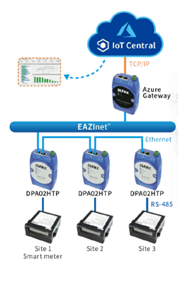
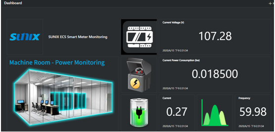

Embedded Linux Sunix Kit – KPE1301 is running Linux
===
---

# Table of Contents

-   [Introduction](#Introduction)
-   [Step 1 : SUNIX IoT Central Starter Kit –KPE1301](#SUNIXIoTCentralStarterKit)
   -   [Connect the sensors](#Connectthesensors)
-   [Step 2 : Build and Run the sample](#BuildandRunthesample)
   -   [SUNIX Gateway Configuration](#SUNIXGatewayConfiguration)
   -   [Send and Receive Data on IoT Central](#SendandReceiveDataonIoTCentral)
-   [Next steps](#Nextsteps)

# Introduction

SUNIX provide the intelligent virtual fence solution kit which integrated with Microsoft Azure public cloud for users to customize their own settings and to extend the other Microsoft software services. The solution kit includes infrared sensor and SUNIX signal collection modules which can transfer the signal of the infrared sensor into the data. Users can create their own dashboard and show the status of the infrared sensor via Microsoft IoT Central without writing additional program. You can also set the rule to send the alert email whenever there's any intrusion and the infrared sensor detect the signal change.

# Step 1 : SUNIX IoT Central Starter Kit – KPE1301

The SUNIX IoT Central Starter Kit includes:

1.  IoT Central Gateway
2.  DevicePort (RS-232/422/485,DPAD02HTP)
3.  Shihlim – SPM-1

# Connect the sensors

# Step 2 : Build and Run the sample

## SUNIX Gateway Configuration

###1. SUNIX Gateway Basic Configuration
###1.1 Login SUNIX Gateway

1.  Use Internet Cable to connect computer and Gateway, after confirming connection, open the browser and enter Gateway preset IP address： `192.168.111.254`.
2.  Enter preset Username: `admin`, Password：`admin`.
3.  After entering username and password, press **Sign in** to enter Gateway Management Interface.

###1.2 Setting Gateway IP address

1.  After logging in Gateway, click **System** on the left panel.
2.  Pull down the right panel and find the Network segment. Change the IP address to match your network environment.
3.  After you complete the setting, press **Apply** to finish setting and login Gateway again.

###1.3 Setting Gateway Profiles

1.  After changing IP, login Gateway again and click **System** on the left panel.
2.  Pull down the right panel and find Azure IoT Central’s segment.
3.  Please set the column Profiles as **Kit-KPE1301**.
4.  Press **Apply** to finish basic setting.

###1.4 Check Pair DP List Connection Status

1.  After logging in Gateway, click **Home** on the left panel.      
2.  Confirm the following three DevicePort connection status. Should display **Connect**.

###2. Create Azure IoT Central
###2.1 Create Real Device

1.  Login <https://portal.azure.com/>, if you haven't account, first signup.
2.  Create **New --> Internet of Things --> IoT Central**, detail refer to <https://docs.microsoft.com/en-us/azure/iot-central/core/quick-deploy-iot-central>.
3.  Create a device and get **ID Scope**, **Device ID**, **Primary Key**.

###3. SUNIX Gateway Connection Authentication

1.  Enter SUNIX Gateway management interface, on the left panel, after clicking **System**, roll down the right panel and find the segment of Azure IoT Central.
2.  Connection Method choose **IoT Central**
3.  Copy and paste the Device Connection information of **ID Scope**, **Device ID**, **Primary Key** to the corresponding SUNIX Gateway columns. After completing setting, press the button **Apply** to finish the operation.

###4. Data Collection Confirmation

1.  Using IoT Central application.

# Send and Receive Data on IoT Central

 
# Next steps

You have now learned how to run a sample application that collects sensor data and sends it to your IoT hub. To explore how to store, analyze and visualize the data from this application in Azure using a variety of different services, please click on the following lessons:

-   [Manage cloud device messaging with iothub-explorer]
-   [Save IoT Hub messages to Azure data storage]
-   [Use Power BI to visualize real-time sensor data from Azure IoT Hub]
-   [Use Azure Web Apps to visualize real-time sensor data from Azure IoT Hub]
-   [Weather forecast using the sensor data from your IoT hub in Azure Machine Learning]
-   [Remote monitoring and notifications with Logic Apps]   

[Manage cloud device messaging with iothub-explorer]: https://docs.microsoft.com/en-us/azure/iot-hub/iot-hub-explorer-cloud-device-messaging
[Save IoT Hub messages to Azure data storage]: https://docs.microsoft.com/en-us/azure/iot-hub/iot-hub-store-data-in-azure-table-storage
[Use Power BI to visualize real-time sensor data from Azure IoT Hub]: https://docs.microsoft.com/en-us/azure/iot-hub/iot-hub-live-data-visualization-in-power-bi
[Use Azure Web Apps to visualize real-time sensor data from Azure IoT Hub]: https://docs.microsoft.com/en-us/azure/iot-hub/iot-hub-live-data-visualization-in-web-apps
[Weather forecast using the sensor data from your IoT hub in Azure Machine Learning]: https://docs.microsoft.com/en-us/azure/iot-hub/iot-hub-weather-forecast-machine-learning
[Remote monitoring and notifications with Logic Apps]: https://docs.microsoft.com/en-us/azure/iot-hub/iot-hub-monitoring-notifications-with-azure-logic-apps