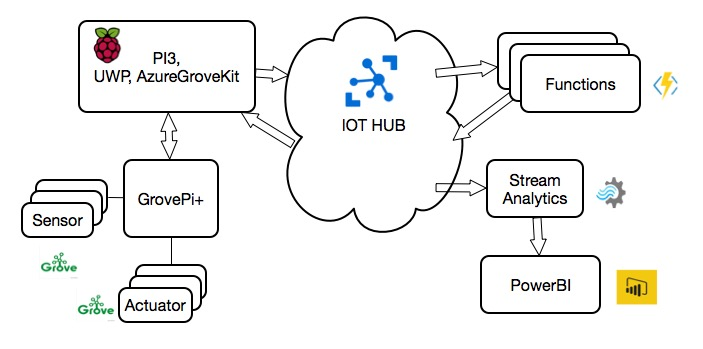
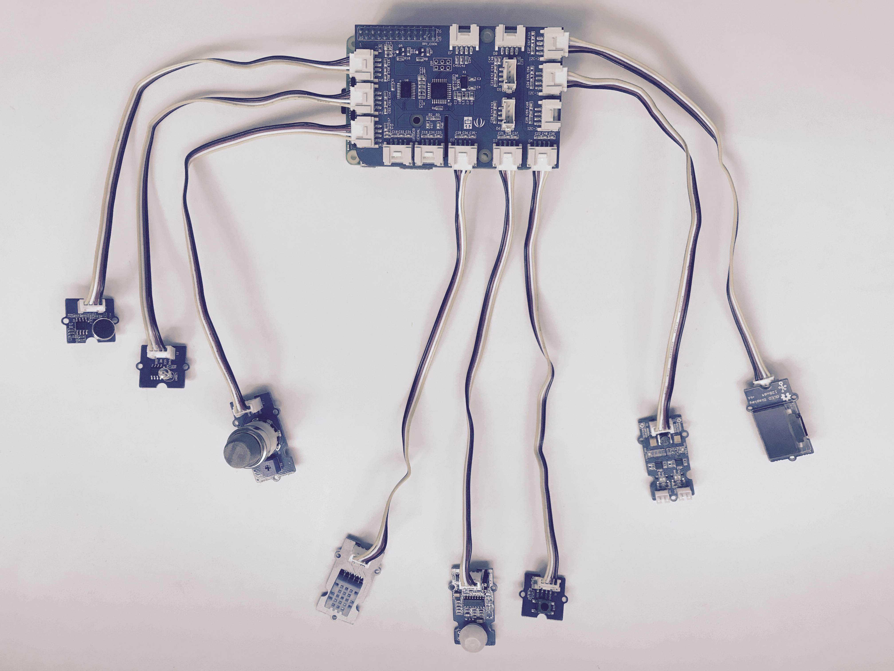

Grove kit running Windows 10 IoT Core and Azure Platform
===
---

# Table of Contents

-   Instructions for using this template
-   Grove kit
-   Connect the sensors
-   Build and Run the sample
-   Send Device Events to IoT Hub
-   Receive messages from IoT Hub
-   Next steps

# Grove kit

The Grove kit includes:

-   Raspberry Pi 3 Model B+
-   ReSpeaker 4-Mic Array for Raspberry Pi
-   Raspberry Pi Camera Module V2
-   Grove - Temp & Humidity & Barometer Sensor (BME280)
-   Grove - 3-Axis Digital Accelerometer
-   Grove - Buzzer
-   Grove - OLED Display 0.96''
-   16GB SD Card

## Connect the sensors

The full name is "Grove Kit for Win10 IoT Core & Azure Platform". This Kit and Guide book will help quickly familiar win10 Iot and Azure. The hardware party is very to use. We make several classic scenes project.

## Install Win10 IoT Core

1. Download IoT Core Dashboard from <https://developer.microsoft.com/en-us/windows/iot/Downloads>
2. Open the Windows 10 IoT Core Dashboard you downloaded and installed from the Get the tools page.
3. Click "Set up a new device".
4. Select Raspberry Pi 3 from the dropdown.
5. Enter device name, password and Wi-Fi network to connect to.
6. Download and install Windows 10 IoT Core on your SD card.
7. A window will pop up to show you the progress. This step can take several minutes depending on the speed of your SD card.
8. Put SD Card into Raspberry
9. Connect display with your Raspberry, HDMI or lvds output.
10. Power on
11. Connect Wi-Fi to internet
12. Remember the ip address from AP

# Build and Run the sample

## Setup Azure IOTHUB Devices Connect String on TPM

1. Open browser, login win10 iot core web console "http://ip-address:8080", Account: Administrator, Password: (You enter on IOT Core Dashboard)
1. Move on "TPM configuration"
2. Intall "Software TPM Emulator(NoSecurity)", wait system restart.
3. Copy "Connection string—primary key"(Refer to [Create Azure IOTHUB](https://github.com/Seeed-Studio/AzureGroveKit#create-azure-iothub)) on "TPM configuration --> Logical devices settings --> Logical device ID: 0 --> Azure Connection String", Then save.

## Deploy AzureGroveKit UWP App

The app help to connect Azure iothub, collect Grove sensor value and control Grove output.
1. Wating Win10 IoT setup, Setting Wi-Fi, Remember the IP Address
2. Open browser, login win10 iot core web console "http://ip-address:8080"
3. Move on "Apps --> Install app"
4. "App package" choice "UWP/Release/AzureGroveKit_[version]_Debug_Test/AzureGroveKit_[version]_arm_Debug.appxbundle"
5. "Certificate" choice "UWP/Release/AzureGroveKit_[version]_Debug_Test/AzureGroveKit_[version]_arm_Debug.cer"
6. "Dependency" choice one "UWP/Release/AzureGroveKit_[version]_Debug_Test/Dependencies/ARM", the click "Add dependency" to choice nexe.
5. "Deploy" click "GO", waiting a few minutes
6. Refresh, you can find AzureGroveKit on Apps row

## Test AzureGroveKit App

1. Power off raspberry, Insert GrovePi module.
2. Insert necessary Grove on GrovePi, Connect map below:

  Grove| GrovePi Port
  -----| ------------
  D2   | Grove - Temp&Humi Sensor
  D3   | Grove - PIR Motion Sensor
  D4   | Grove – Button
  D5   | Grove - Relay
  A0   | Grove - Sound Sensor
  A1   | Grove - Light Sensor
  A2   | Grove - Gas Sensor
  I2C1 | Grove - OLED Display 0.96"
  I2C2 | Grove - Mini I2C Motor Driver
3. Power on and login web console "http://ip-address:8080"
4. Move on "App Manager --> Apps", Run "AzureGroveKit"
5. The app will display on output, Click "Run", Now The App send message to IOTHUB, and can response command.
6. Check "YOUR IOTHUB --> Overview --> Usage", i will show the message count.
7. If you use windows, use [DeviceExplorer](https://github.com/Azure/azure-iot-sdk-csharp/tree/master/tools/DeviceExplorer) see more info.
8. More UWP overview, refer to <https://github.com/Seeed-Studio/AzureGroveKit/tree/master/UWP>

## Create Azure IOTHUB
1. Login "<https://portal.azure.com/>", if you havn't account, first signup.
2. Create "New --> Internet of Things --> IoT hub", detail refer to <https://docs.microsoft.com/en-us/azure/iot-hub/iot-hub-create-through-portal>
3. create a device, move on "All resources --> YOUR_IOTHUB --> Device Explorer --> Add Device", save
4. click the device, copy "Connection string—primary key"

# Next steps

You have now learned how to run a sample application that collects sensor data and sends it to your IoT hub. To explore how to store, analyze and visualize the data from this application in Azure using a variety of different services, please click on the following lessons:

-   [Manage cloud device messaging with iothub-explorer](https://docs.microsoft.com/en-us/azure/iot-hub/iot-hub-explorer-cloud-device-messaging)
-   [Save IoT Hub messages to Azure data storage](https://docs.microsoft.com/en-us/azure/iot-hub/iot-hub-store-data-in-azure-table-storage)
-   [Use Power BI to visualize real-time sensor data from Azure IoT Hub](https://docs.microsoft.com/en-us/azure/iot-hub/iot-hub-live-data-visualization-in-power-bi)
-   [Use Azure Web Apps to visualize real-time sensor data from Azure IoT Hub](https://docs.microsoft.com/en-us/azure/iot-hub/iot-hub-live-data-visualization-in-web-apps)
-   [Weather forecast using the sensor data from your IoT hub in Azure Machine Learning](https://docs.microsoft.com/en-us/azure/iot-hub/iot-hub-weather-forecast-machine-learning)
-   [Remote monitoring and notifications with ​​Logic ​​Apps](https://docs.microsoft.com/en-us/azure/iot-hub/iot-hub-monitoring-notifications-with-azure-logic-apps)
-   [Device management with iothub-explorer](https://docs.microsoft.com/en-us/azure/iot-hub/iot-hub-device-management-iothub-explorer)
[lnk-setup-iot-hub]: ../setup_iothub.md
[lnk-manage-iot-hub]: ../manage_iot_hub.md
