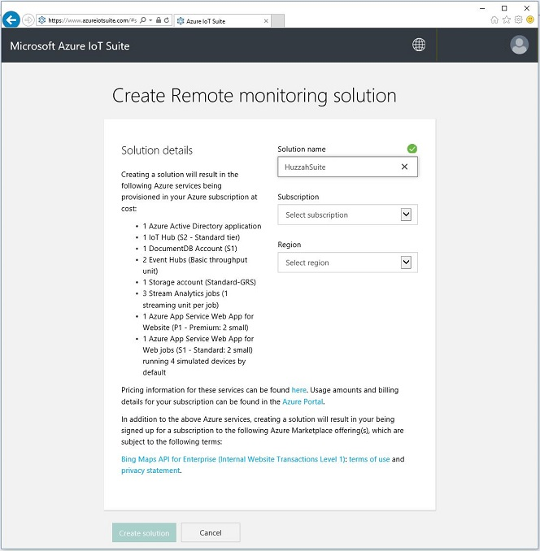
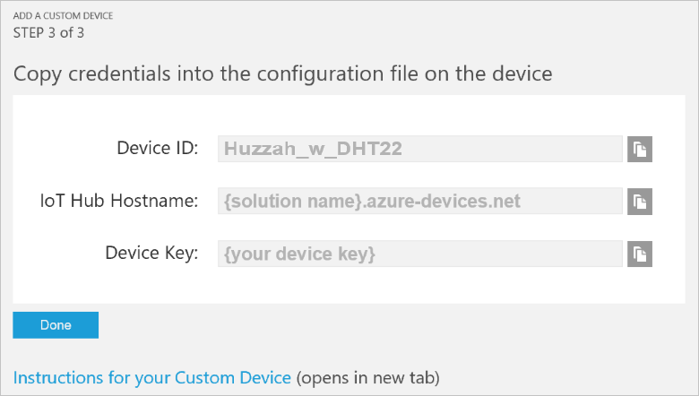
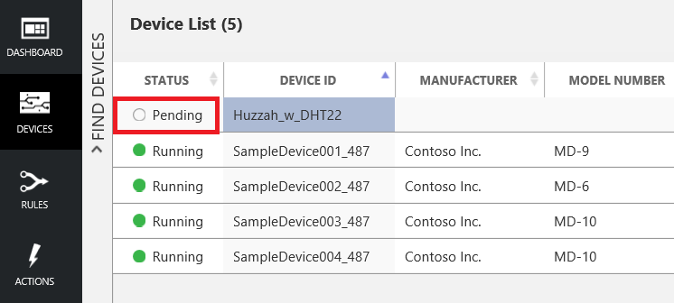
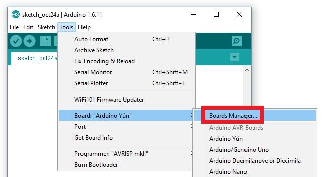
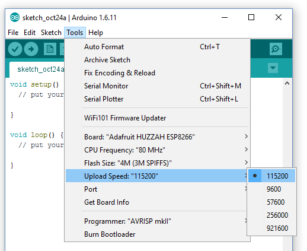
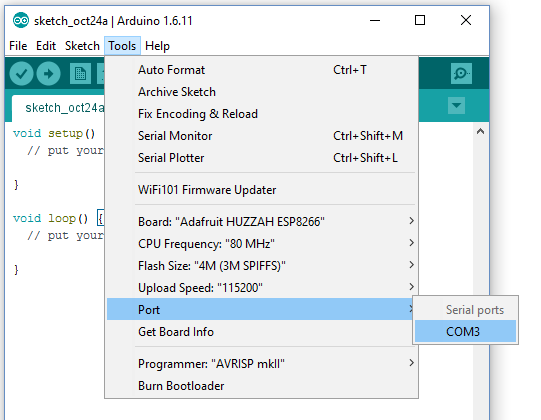
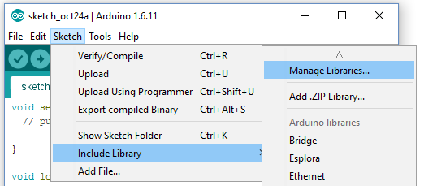

# Get Started with Microsoft Azure IoT Starter Kit - Adafruit Feather Huzzah ESP8266 (Arduino-compatible)

This page contains technical information to help you get familiar with Azure IoT using the Azure IoT Starter Kit - Adafruit Feather Huzzah ESP8266 (Arduino-compatible). You will find two tutorials that will walk you through different scenarios: the first tutorial will show you how to connect your Azure IoT Starter kit to our Remote Monitoring preconfigured solution from Azure IoT Suite. In the second tutorial, you will leverage Azure IoT services to create your own IoT architecture.

You can choose to start with whichever tutorial you want to. If you've never worked with Azure IoT services before, we encourage you to start with the Remote Monitoring solution tutorial, because all of the Azure services will be provisioned for you in a built-in preconfigured solution. Then you can explore how each of the services work by going through the second tutorial.

 We hope you enjoy the process. Please provide feedback if there's anything that we can improve.

***
**Don't have a kit yet?:** Click [here](http://azure.com/iotstarterkits)
***

- [Running a Simple Remote Monitoring Solution on Adafruit Feather Huzzah ESP8266](#run-on-device)
- [Using Microsoft Azure IoT to Process and Use Sensor Data to Indicate Abnormal Temperatures](#using-microsoft-azure-iot)

<a name="run-on-device" />
# Running a Simple Remote Monitoring Solution on Adafruit Feather Huzzah ESP8266 (Arduino-compatible)

This tutorial describes the process of taking your Adafruit Feather Huzzah ESP8266 kit, and using it to develop a temperature, humidity and pressure reader that can communicate with the cloud using the  Microsoft Azure IoT SDK. 

## Table of Contents

- [1.1 Tutorial Overview](#section1.1)
- [1.2 Before Starting](#section1.2)
  - [1.2.1 Required Software](#section1.2.1)
  - [1.2.2 Required Hardware](#section1.2.2)
- [1.3 Connect your device to the Temperature sensor](#section1.3)
- [1.4 Create a New Azure IoT Suite Remote Monitoring solution and Add Device](#section1.4)
- [1.5 Configure the Arduino IDE](#section1.5)
  - [1.5.1 Add the Adafruit Feather Huzzah ESP8266 to the Arduino IDE](#section1.5.1)
  - [1.5.2 Configuration settings](#section1.5.2)
  - [1.5.3 Install Library Dependencies](#section1.5.3)
- [1.6 Modify the Remote Monitoring Sample](#section1.6)
- [1.7 Build and Run Your Remote Monitoring Sample](#section1.7)
- [1.8 View the Sensor Data from the Remote Monitoring Portal](#section1.8)
- [1.9 Stop using the Azure IoT Suite](#section1.9)
  - [1.9.1 Delete the Azure IoT Suite](#section1.9.1)
  - [1.9.2 Stop the Azure IoT Suite](#section1.9.2)
  - [1.9.3 Downsize the Azure IoT Suite](#section1.9.3)
- [1.10 Next steps](#section1.10)

<a name="section1.1" />
## 1.1 Tutorial Overview

In this tutorial, you'll be doing the following:
- Setting up your environment on Azure using the Microsoft Azure IoT Suite Remote Monitoring preconfigured solution, getting a large portion of the set-up that would be required done in one step.
- Setting your device and sensors up so that it can communicate with both your computer, and Azure IoT.
- Updating the device code sample to include our connection data and send it to Azure IoT to be viewed remotely.

<a name="section1.2" />
## 1.2 Before Starting

<a name="section1.2.1" />
### 1.2.1 Required Software

- Arduino IDE, version 1.6.8 (or newer) from www.arduino.cc (Earlier versions will not work with the AzureIoT library)

<a name="section1.2.2" />
### 1.2.2 Required Hardware

- Adafruit Feather Huzzah ESP8266 kit
  - Huzzah ESP8266 board
  - DHT22 Sensor
  - Breadboard
  - M/M jumper wires
  - 10k Ohm Resistor (brown, black, orange)
- A microB USB cable
- A desktop or laptop computer which can run **Arduino IDE 1.6.8** or newer

<a name="section1.3" />
## 1.3 Connect your device to the Temperature sensor

- Using this image as a reference, connect your Adafruit Feather Huzzah ESP8266 kit to the DHT22 Temperature sensor using the breadboard:


***
**Note:** Column on the left corresponds to sensor and on the Right to board. On the image, the board is place between 10 and 30, with the RST pin connected to row 30, and sensor between 1 and 9, with the VDD pin connected to the row 1.
***
- Connect the board, sensor and parts on the breadboard:

| Start                   | End                    | Connector     |
| ----------------------- | ---------------------- | ------------: |
| Huzzah RST (Pin 30i)    | Huzzah CHPD (Pin 15i)  | Huzzah ESP8266 |
| DHT22 (Pin 1J)          | DHT22 (Pin 4J)         | DHT22         |
| Pin 2I                  | Pin 1F                 | 10k Ohm Resistor  |

- For sensor pins, we will use the following wiring:

| Start                   | End                    | Cable Color   |
| ----------------------- | ---------------------- | ------------: |
| VDD (Pin 1G)            | Pin 29J                | Red cable     |
| DATA (Pin 2G)           | Pin 17B                | White cable   |
| GND (Pin 4G)            | Pin 27J                | Black cable   |


- For more information, see: [Adafruit DHT22 sensor setup](https://learn.adafruit.com/dht/connecting-to-a-dhtxx-sensor).

**At the end of your work, your Adafruit Feather Huzzah ESP8266 should be connected with a working sensor.**

<a name="section1.4" />
## 1.4 Create a New Azure IoT Suite Remote Monitoring solution and Add Device

- Log in to [Azure IoT Suite](https://www.azureiotsuite.com/) with your Microsoft account and click **Create a new Solution**


 
***
**Note:** For first time users, click here to get your [Azure free trial](https://azure.microsoft.com/en-us/pricing/free-trial/) which gives you $200 of credit to get started.
***

- Click the `select` button in the **Remote Monitoring** option


- Type in a solution name. For this tutorial we’ll be using _“HuzzahSuite”_ (You will have to name it something else. Make it unique. I.E. "ContosoSample")



- Choose your subscription and desired region to deploy, then click **Create Solution**
- Wait for Azure to finish provisioning your IoT suite (this process may take up to 10 minutes), and then click **Launch**

***
**Note:** You may be asked to log back in. This is to ensure your solution has proper permissions associated with your account.
***

- Open the link to your IoT Suite’s “Solution Dashboard.” You may have been redirected there already.


- This opens your personal remote monitoring site at the URL _&lt;Your Azure IoT Hub suite name&gt;.azurewebsites.net_ (e.g. _HuzzahSuite.azurewebsites.net_)
- Click **Add a Device** at the lower left hand corner of your screen


- Add a new **custom device**


- Enter your desired `device ID`. In this case we’ll use _“Huzzah_w_DHT22”_, and then click Check ID


- If Device ID is available, go ahead and click **Create**



***
- **IMPORTANT NOTE**: Write down your `device ID`, `Device Key`, and `IoT Hub Hostname` to enter into the code you’ll run on your device later 
***

- Make sure your device displays in the devices section. The device status is Pending until the device establishes a connection to the remote monitoring solution.



<a name="section1.5" />
## 1.5 Configure the Arduino IDE

In this step, we will be using the Arduino IDE. If you have not downloaded the IDE, please download it from the [Arduino website](https://www.arduino.cc/en/Main/Software).

<a name="section1.5.1" />
### 1.5.1 Add the Adafruit Feather Huzzah ESP8266 to the Arduino IDE

You will need to install the Adafruit Feather Huzzah ESP8266 board extension for the Arduino IDE. In our steps below, we will be following the same instructions as in [this link](https://learn.adafruit.com/adafruit-huzzah-esp8266-breakout/using-arduino-ide), which you can also use for troubleshooting. After going through the following steps, you should have a working sample with a blinking light on your board.

Open the Arduino IDE and go to `File -> Preferences`


Go to the field titled `"Additional Boards Manager URLs:"` and type  `http://arduino.esp8266.com/stable/package_esp8266com_index.json`


Click on `Tools -> Board -> Boards Manager`



Search for `esp8266`, left click on the result titled `esp8266 by ESP8266 Community` and click on install


After the board is installed select `Tools -> Board -> Adafruit HUZZAH ESP8266`


<a name="section1.5.2" />
### 1.5.2 Configuration settings

Set the CPU frequency to 80MHz by clicking on `Tools -> CPU Frequency -> 80MHz`


Set the upload speed to 115200 by clicking on `Tools -> Upload Speed -> 115200`



Set the COM port by clicking on `Tools -> Port -> COMx`. If you see multiple COM ports, then you will have to experiment, in order to find the one that corresponds to your device. One way to do that is to disconnect your device, check the list of COM ports, reconnect the device and then find which port was not there before.



In order to verify that you've set the correct COM port, you can click on `Tools -> Get Board Info`. If you see the message "Native serial port, can't obtain port info", then you have not selected the correct port. You can change the COM port using the step above and retry this step, until you see a message similar to:


If you run into any connection issues, unplug the board, hold the reset button, and while still holding it, plug the board back in. This will flash to board to try again.

<a name="section1.5.3" />
### 1.5.3 Install Library Dependencies

For this project, we'll also need the following libraries:

 - Adafruit DHT Unified 
 - DHT Sensor Library
 - AzureIoTHub
 - AzureIoTUtility
 - AzureIoTProtocol_MQTT
 - Adafruit Unified Sensor
 
To install these libraries, click on the `Sketch -> Include Library -> Manage Libraries`.



Search for each of these libraries using the box in the upper-right to filter your search, click on the found library, and click the "Install" button.


If you have any problems while installing the libraries, you can find more instructions [here](https://www.arduino.cc/en/Guide/Libraries).

***
**Note**: Starting on version 1.0.17, `AzureIoTHub` required the `AzureIoTUtility` and one of the available protocols. These samples use the `AzureIoTProtocol_MQTT`, but it is prepared to work with `AzureIoTProtocol_HTTP` too.
***

<a name="section1.6" />
## 1.6 Modify the Remote Monitoring sample

- Unzip the [example code](https://github.com/Azure-Samples/iot-hub-c-huzzah-getstartedkit/archive/master.zip), go to the `remote_monitoring` directory and double-click the file `remote_monitoring.ino` to open the project in the Arduino IDE.
- In the project, edit the `iot_configs.h`, look for the following lines of code:

```
#define IOT_CONFIG_WIFI_SSID            "<Your WiFi network SSID or name>"
#define IOT_CONFIG_WIFI_PASSWORD        "<Your WiFi network WPA password or WEP key>"
```

- Replace the placeholders with your WiFi name (SSID) and the WiFi password. 
- Find the Device id, Iot Hub Hostname and Device Key that you wrote down, when you saw the following screen after adding your custom device into the Azure IoT suite:


If you cannot find this data, then you can go to your Remote Monitoring Solution in Azure IoT Suite, click on Devices and then select your device. Check the device properties section at the right part of the page for the DEVICEID, HOSTNAME and Authentication Keys (bottom right of the page). Click on "View Authentication keys" and copy "KEY 1" as your deviceKey.

- Look for the following line of code and replace the placeholders connection information (also remove the "<" and ">" when replacing the information):

```
#define IOT_CONFIG_CONNECTION_STRING    "HostName=<host_name>.azure-devices.net;DeviceId=<device_id>;SharedAccessKey=<device_key>"
```

- Save with `Control-s`

<a name="section1.7" />
## 1.7 Build and Run Your Remote Monitoring Sample

- Build, upload and run the code using **Sketch -> Upload** or by clicking on the arrow button (second from the left)


- If your code is correct and all libraries was properly installed, you will receive something like the following message in the IDE.

  ```
  Sketch uses 376,409 bytes (36%) of program storage space. Maximum is 1,044,464 bytes.
  Global variables use 50,220 bytes (61%) of dynamic memory, leaving 31,700 bytes for
    local variables. Maximum is 81,920 bytes.
  ```

- While the code is being downloaded, there should be a blue blinking LED on your Adafruit Feather Huzzah ESP8266.
- After the deployment is done and you see 100% in the output console, then go to **Tools -&gt; Serial Monitor** in the Arduino IDE to watch the live data being sent. After 15 seconds you should see a measurements update.

***
**Note**: When first starting you will likely see a “Fetching NTP epoch time failed” error – This is normal, and it trying to sync with Azure. This can take even up to 30 seconds to find a NTP server to sync with. One it is synced, it should start transmitting from there.
***

<a name="section1.8" />
## 1.8 View the Sensor Data from the Remote Monitoring Portal

- Once you have the sample running, visit your dashboard by visiting azureiotsuite.com and clicking “Launch” on your solution
- Make sure the “Device to View” in the upper right is set to your device
- If the demo is running, you should see the graph change as your data updates in real time!

<a name="section1.9" />
## 1.9 Stop using the Azure IoT Suite

***
**Warning:** The Remote Monitoring solution provisions a set of Azure IoT Services in your Azure account. It is meant to reflect a real enterprise architecture and thus its Azure consumption is quite heavy. 

To avoid unnecessary Azure consumption, you can delete, stop or downsize your Azure IoT Suite. We recommend you delete the preconfigured solution in azureiotsuite.com once you are done with your work (since it is easy to recreate). 

If you want to read additional information about the Azure IoT Suite, you can go the following websites:
 - https://azure.microsoft.com/en-us/documentation/articles/iot-suite-remote-monitoring-sample-walkthrough/
 - https://azure.microsoft.com/en-us/documentation/articles/iot-suite-connecting-devices/

<a name="section1.9.1" />
### 1.9.1 Delete the Azure IoT Suite

Go to https://www.azureiotsuite.com, click on your existing solution (not on the "Launch" button) and then click the red button `Delete Solution` in the right pane


<a name="section1.9.2" />
### 1.9.2 Stop the Azure IoT Suite

In the [Microsoft Azure Portal](https://portal.azure.com/)
- Click on "All Resources"
- For each Stream Analytics and Web App resource:
    - Click on the resource and click the "Stop" button in the new blade that appears
- For each IoT Hub resource:
    - Click on the resource and click the "Devices" button in the new blade that appears
    - Click on each device in the list and click the "Disable" button that appears in the new blade at the bottom

<a name="section1.9.3" />
### 1.9.3 Downsize the Azure IoT Suite

Alternatively, if you want to keep it up and running you can do two things to reduce consumption:

1) Visit this [guide](https://github.com/Azure/azure-iot-remote-monitoring/blob/master/Docs/configure-preconfigured-demo.md) to run the solution in demo mode and reduce the Azure consumption.  

2) Disable the simulated devices created with the solution (Go to Devices>>Select the device>> on the device details menu on the right, clich on Disable Device. Repeat with all the simulated devices).

<a name="section1.10" />
## 1.10 Next steps

Please visit our [Azure IoT Dev Center](https://azure.microsoft.com/en-us/develop/iot/) for more samples and documentation on Azure IoT.

<a name="using-microsoft-azure-iot" />
# Using Microsoft Azure IoT Services to Identify Temperature Anomalies

This tutorial describes the process of taking your Microsoft Azure IoT Starter Kit for the Adafruit Feather Huzzah ESP8266, and using it to develop a temperature and humidity reader that can communicate with the cloud using the  Microsoft Azure IoT SDK.

## Table of Contents

- [2.1 Tutorial Overview](#section2.1)
- [2.2 Before Starting](#section2.2)
  - [2.2.1 Required Software](#section2.2.1)
  - [2.2.2 Required Hardware](#section2.2.2)
- [2.3 Connect the Sensor Module to your Device](#section2.3)
- [2.4 Create a New Microsoft Azure IoT Hub and Add Device](#section2.4)
- [2.5 Create an Event Hub](#section2.5)
- [2.6 Create a Storage Account for Table Storage](#section2.6)
- [2.7 Create a Stream Analytics job to Save IoT Data in Table Storage and Raise Alerts](#section2.7)
- [2.8 Node Application Setup](#section2.8)
- [2.9 Add the Adafruit Feather Huzzah ESP8266 to the Arduino IDE](#section2.9)
- [2.10 Install Library Dependencies](#section2.10)
- [2.11 Modify the Command Center Sample](#section2.11)
- [2.12 Build Your Command Center Sample](#section2.12)
- [2.13 Next steps](#section2.13)

<a name="section2.1" />
## 2.1 Tutorial Overview

This tutorial has the following steps:
- Provision an IoT Hub instance on Microsoft Azure and adding your device.
- Prepare the device, get connected to the device, and set it up so that it can read sensor data.
- Configure your Microsoft Azure IoT services by adding Event Hub, Storage Account, and Stream Analytics resources.
- Prepare your local web solution for monitoring and sending commands to your device.
- Update the sample code to respond to commands and include the data from our sensors, sending it to Microsoft Azure to be viewed remotely.

Here is a breakdown of the data flow:
- The application running on the Adafruit Feather Huzzah ESP8266 will get temperature data from the temperature sensor and it will send them to the IoT Hub
- A Stream Analytics job will read the data from IoT Hub and write them to an Azure Storage Table. Also, if an anomaly is detected, then this job will write data to an Event Hub
- The Node.js application that is running on your computers will read the data from the Azure Storage Table and the Event Hub and will present them to the user

The end result will be a functional command center where you can view the history of your device's sensor data, a history of alerts, and send commands back to the device.

<a name="section2.2" />
## 2.2 Before Starting

<a name="section2.2.1" />
### 2.2.1 Required Software

- [Git](https://git-scm.com/downloads) - For cloning the required repositories
- Node.js - For the Node application, we will go over this later.
- Arduino IDE, version 1.6.8. (Earlier versions will not work with the Azure IoT library)
- Sensor interface [library](https://github.com/adafruit/Adafruit_DHT22_Library/archive/master.zip) from Adafruit.

<a name="section2.2.2" />
### 2.2.2 Required Hardware
- Adafruit Feather Huzzah ESP8266 IoT kit
  - Huzzah ESP8266 board
  - DHT22 Sensor
  - breadboard
  - M/M jumper wires
  - 10k Ohm Resistor (brown, black, orange)
  - 2x 330 Ohm Resistor (orange, orange, brown) or 2x 560 Ohm Resistor (green, blue, brown)
  - Green LED
  - Red LED
- A microB USB cable
- A desktop or laptop computer which can run **Arduino IDE 1.6.8**

<a name="section2.3" />
## 2.3 Connect the Sensor Module to your Device

- Using [this image](media/huzzah_command_center.png?raw=true) as a reference, connect your DHT22 and Adafruit Feather Huzzah ESP8266 to the breadboard

***
**Note:** Column on the left corresponds to sensor and on the Right to board. On the image, the board is place between 10 and 30 and sensor between 1 and 9. Additionally, when counting the - pins, start from the right and count in, as these do not align with the numbers indicated on the board.

**Note:** The resistor can change a little from one kit to another, e.g. it can be 330 Ohm (orange, orange, brown) or 560 Ohm (green, blue, brown). Both will work with success.
***

- Connect the board, sensor, and parts on the breadboard:

| Start                   | End                    | Connector     |
| ----------------------- | ---------------------- | ------------ |
| Huzzah RST (Pin 30i)    | Huzzah CHPD (Pin 15i)  | Huzzah ESP8266 |
| DHT22 (Pin 1J)          | DHT22 (Pin 4J)         | DHT22         |
| NULL (Pin 2I)           | Pin 1F                 | 10k Ohm Resistor  |
| Pin 2-                  | Pin 2A                 | 330 Ohm Resistor  |
| Pin 4-                  | Pin 5A                 | 330 Ohm Resistor  |
| GRN LED (Pin 2C)        | Pin 3C                 | Green LED  |
| RED LED (Pin 5C)        | Pin 6C                 | Red LED  |

- For the pins, we will use the following wiring:

| Start                   | End                    | Cable Color   | Connected to |
| ----------------------- | ---------------------- | ------------ | ------------- |
| VDD (Pin 1G)            | Pin 29J             | Red cable    | DHT22 |
| DATA (Pin 2G)           | Pin 17B             | White cable  | DHT22 |
| GND (Pin 4G)            | Pin 9-              | Black cable  | DHT22 |
| GND (Pin 27J)           | Pin 25-             | Black cable  | Huzzah ESP8266 |
| Pin 22B                 | Pin 6A              | Red cable    | Red LED  |
| Pin 21B                 | Pin 3A              | Green cable    | Green LED  |


- For more information, see: [Adafruit DHT22 sensor setup](https://learn.adafruit.com/dht/connecting-to-a-dhtxx-sensor).

**At the end of your work, your Adafruit Feather Huzzah ESP8266 should be connected with a working sensor.**

<a name="section2.4" />
### 2.4 Create a New Microsoft Azure IoT Hub and Add Device

- To create your Microsoft Azure IoT Hub and add a device, follow the instructions outlined in the [Setup IoT Hub Microsoft Azure Iot SDK page](../setup_iothub.md).
- After creating your device, make note of your connection string to enter into the code you’ll run on your device later

<a name="section2.5" />
## 2.5 Create an Event Hub
Event Hub is an Azure IoT publish-subscribe service that can ingest millions of events per second and stream them into multiple applications, services or devices.

- Log on to the [Microsoft Azure Portal](https://portal.azure.com/)
- Click on **New** -&gt; **Internet of Things**-&gt; **Event Hub**
- Enter the following settings for the Event Hub Namespace (use a name of your choice for the event hub and the namespace):
    - Name: `Your choice` (we chose `Huzzah2Suite`)
    - Pricing Tier: `Basic`
    - Subscription: `Your choice`
    - Resource Group: `Your choice`
    - Location: `Your choice`
- Click on **Create**
- Wait until the Event Hub Namespace is created, and then create an Event Hub using the following steps:
    - Click on your `Huzzah2Suite` Event Hub Namespace (or pick any other name that you used)
    - Click the **Add Event Hub** 
    - Name: `huzzahEventHub`
- Click on **Create**
- Wait until the new Event Bus is created
- Click on the **Event Hubs** arrow in the **Overview** tab (might require a few clicks, until the UI is updated)
- Select the `huzzahEventHub` eventhub and go in the **Configure** tab in the **Shared Access Policies** section, add a new policy:
    - Name = `readwrite`
    - Permissions = `Send, Listen`
- Click **Save** at the bottom of the page, then click the **Dashboard** tab near the top and click on **Connection Information** at the bottom
- _Copy down the connection string for the `readwrite` policy you created._
- From the your IoT Hub Settings (The Resource that has connected dots) on the [Microsoft Azure Portal](https://portal.azure.com/), click the **Messaging blade** (found in your settings), write down the _Event Hub-compatible name_
- Look at the _Event-hub-compatible Endpoint_, and write down this part: sb://**thispart**.servicebus.windows.net/ we will call this one the _IoTHub EventHub-compatible namespace_

<a name="section2.6" />
## 2.6 Create a Storage Account for Table Storage
Now we will create a service to store our data in the cloud.
- Log on to the [Microsoft Azure Portal](https://portal.azure.com/)
- In the menu, click **New** and select **Data + Storage** then **Storage Account**
    - Name: `Your choice` (we chose `huzzahstorage`)
    - Deployment model: `Classic`
    - Performance: `Standard`
    - Replication: `Read-access geo-redundant storage (RA-GRS)`
    - Subscription: `Your choice`
    - Resource Group: `Your choice`
    - Location: `Your choice`
- Once the account is created, find it in the **resources blade** or click on the **pinned tile**, go to **Settings**, **Keys**, and write down the _primary connection string_.

<a name="section2.7" />
## 2.7 Create a Stream Analytics job to Save IoT Data in Table Storage and Raise Alerts
Stream Analytics is an Azure IoT service that streams and analyzes data in the cloud. We'll use it to process data coming from your device.

- Log on to the [Microsoft Azure Portal](https://portal.azure.com/)
- In the menu, click **New**, then click **Internet of Things**, and then click **Stream Analytics Job**
- Enter a name for the job (We chose “HuzzahStorageJob”), a preferred region, then choose your subscription. At this stage you are also offered to create a new or to use an existing resource group. Choose the resource group you created earlier.
- Once the job is created, open your **Job’s blade** or click on the **pinned tile**, and find the section titled _“Job Topology”_ and click the **Inputs** tile. In the Inputs blade, click on **Add**
- Enter the following settings:
    - Input Alias = _`TempSensors`_
    - Source Type = _`Data Stream`_
    - Source = _`IoT Hub`_
    - IoT Hub = _`Huzzah2Suite`_ (use the name for the IoT Hub you create before)
    - Shared Access Policy Name = _`iothubowner`_
    - Shared Access Policy Key = _The `iothubowner` primary key can be found in your IoT Hub Settings -> Shared access policies_
    - IoT Hub Consumer Group = "" (leave it to the default empty value)
    - Event serialization format = _`JSON`_
    - Encoding = _`UTF-8`_

- Back to the **Stream Analytics Job blade**, click on the **Query tile** (next to the Inputs tile). In the Query settings blade, type in the below query and click **Save**:

```
SELECT
    DeviceId,
    EventTime,
    MTemperature as TemperatureReading
INTO
    TemperatureTableStorage
from TempSensors
WHERE
   DeviceId is not null
   and EventTime is not null

SELECT
    DeviceId,
    EventTime,
    MTemperature as TemperatureReading
INTO   
    TemperatureAlertToEventHub
FROM
    TempSensors
WHERE MTemperature>25
```

***
**Note:** You can change the `25` to `0` when you're ready to generate alerts to look at. This number represents the temperature in degrees celsius to check for when creating alerts. 25 degrees celsius is 77 degrees fahrenheit.
***

- Back to the **Stream Analytics Job blade**, click on the **Outputs** tile and in the **Outputs blade**, click on **Add**
- Enter the following settings then click on **Create**:
    - Output Alias = _`TemperatureTableStorage`_
    - Sink = _`Table Storage`_
    - Subscription = _`Provide table settings storage manually`_
    - Storage account = _`huzzahstorage`_ (The storage account you created earlier)
    - Storage account key = _(The primary key for the storage account made earlier, can be found in Settings -&gt; Keys -&gt; Primary Access Key)_
    - Table Name = _`TemperatureRecords`_ (Your choice - If the table doesn’t already exist, Local Storage will create it)
    - Partition Key = _`DeviceId`_
    - Row Key = _`EventTime`_
    - Batch size = _`1`_
- Back to the **Stream Analytics Job blade**, click on the **Outputs tile**, and in the **Outputs blade**, click on **Add**
- Enter the following settings then click on **Create**:
    - Output Alias = _`TemperatureAlertToEventHub`_
    - Sink = _`Event Hub`_
    - Subscription = _`Provide table settings storage manually`_
    - Service Bus Namespace = _`Huzzah2Suite`_
    - Event Hub Name = _`huzzaheventhub`_ (The Event Hub you made earlier)
    - Event Hub Policy Name = _`readwrite`_
    - Event Hub Policy Key = _`Primary Key for readwrite Policy name`_ (That's the one you wrote down after creating the event hub)
    - Partition Key Column = _`0`_
    - Event Serialization format = _`JSON`_
    - Encoding = _`UTF-8`_
    - Format = _`Line separated`_
- Back in the** Stream Analytics blade**, start the job by clicking on the **Start **button at the top

***
**Note:** Make sure to **stop** your Command Center jobs once you have when you take a break or finish to avoid unnecessary Azure consumption!  (See: [Troubleshooting](#troubleshooting))
***

<a name="section2.8" />
## 2.8 Node Application Setup

 - If you do not have it already, install Node.js and NPM.
   - Windows and Mac installers can be found here: https://nodejs.org/en/download/
     - Ensure that you select the options to install NPM and add to your PATH.
   - Linux users can use the commands:

```
sudo apt-get update
sudo apt-get install nodejs
sudo apt-get install npm
```

- Additionally, make sure you have cloned the project repository locally by issuing the following command in your desired directory:

```
git clone https://github.com/Azure-Samples/iot-hub-c-huzzah-getstartedkit.git
```

- Open the `command_center_node` folder in your command prompt (`cd <path to locally cloned repro>/command_center_node`) and install the required modules by running the following:

```
npm install -g bower
npm install
bower install
```

- Open the `config.json` file and replace the information with your project.  See the following for instructions on how to retrieve those values.

    - eventhubName:
        - Open the [Classic Azure Management Portal](https://manage.windowsazure.com)
        - Open the Service Bus namespace you created earlier
        - Switch to the **EVENT HUBS** page
        - You can see and copy the name of your event hub from that page
    - ehConnString:
        - Click on the name of the event hub from above to open it
        - Click on the "CONNECTION INFORMATION" button along the bottom.
        - From there, click the button to copy the readwrite shared access policy connection string.
    - deviceConnString:
        - Use the information on the [Manage IoT Hub](../manage_iot_hub.md) to retrieve your device connection string using either the Device Explorer or iothub-explorer tools.
    - iotHubConnString:
        - In the [Azure Portal](https://portal.azure.com)
        - Open the IoT Hub you created previously.
        - Open the "Settings" blade
        - Click on the "Shared access policies" setting
        - Click on the "service" policy
        - Copy the primary connection string for the policy
    - storageAccountName:
        - In the [Azure Portal](https://portal.azure.com)
        - Open the classic Storage Account you created previously to copy its name
    - storageAccountKey:
        - Click on the name of the storage account above to open it
        - Click the "Settings" button to open the Settings blade
        - Click on the "Keys" setting
        - Click the button next to the "PRIMARY ACCESS KEY" top copy it
    - storageTableName:
        - This must match the name of the table that was used in the Stream Analytics table storage output above.
        - If you used the instructions above, you would have named it ***`TemperatureRecords`***
        - If you named it something else, enter the name you used instead.    

```
{
    "port": "3000",
    "eventHubName": "event-hub-name",
    "ehConnString": "Endpoint=sb://name.servicebus.windows.net/;SharedAccessKeyName=readwrite;SharedAccessKey=aaaaaaaaaaaaaaaaaaaaaaaaaaaaaaaaaaaaaaaaaaa=",
    "deviceConnString": "HostName=name.azure-devices.net;DeviceId=device-id;SharedAccessKey=aaaaaaaaaaaaaaaaaaaaaa=="
    "iotHubConnString": "HostName=iot-hub-name.azure-devices.net;SharedAccessKeyName=service;SharedAccessKey=aaaaaaaaaaaaaaaaaaaaaaaaaaaaaaaaaaaaaaaaaaa=",
    "storageAcountName": "aaaaaaaaaaa",
    "storageAccountKey": "aaaaaaaaaaaaaaaaaaaaaaaaaaaaaaaaaaaaaaaaaaaaaaaaaaaaaaaaaaaaaaaaaaaaaaaaaaaaaaaaaaaaaa==",
    "storageTable": "TemperatureRecords"
}
```

- Now it is time to run it! Enter the following command:

```
node server.js
```

- You should then see something similar to:

```
app running on http://localhost:3000
client connected
```

- Visit the url in your browser and you will see the Node app running!

To deploy this project to the cloud using Azure, you can reference [Creating a Node.js web app in Azure App Service](https://azure.microsoft.com/en-us/documentation/articles/web-sites-nodejs-develop-deploy-mac/).

Next, we will update your device so that it can interact with all the things you just created.

<a name="section2.9" />
## 2.9 Add the Adafruit Feather Huzzah ESP8266 to the Arduino IDE

You will need to install the Adafruit Feather Huzzah ESP8266 board extension for the Arduino IDE:

- Follow the instructions [here](https://learn.adafruit.com/adafruit-huzzah-esp8266-breakout/using-arduino-ide). There you will see how to add a URL pointing to Adafruit's repository of board extensions, how to make the Adafruit Feather Huzzah ESP8266 board selectable under the **Tools** menu, and how to get the Blink sketch to run.
  - As we explained on the item 1.5, boards with microB connector don't have the GPIO0 button. So, in the 'Blink Test', ignore the steps to put the board in the bootload mode, and go directly to the step to upload the sketch via the IDE.
- After going through this, you should have a working sample with a blinking light on your board.
    - If you run into any connection issues, unplug the board, hold the reset button, and while still holding it, plug the board back in. This will flash to board to try again.

<a name="section2.10" />
## 2.10 Install Library Dependencies

For this project, we'll also need the the following libraries:

 - DHT Sensor Library
 - Adafruit DHT Unified
 - AzureIoTHub
 - AzureIoTUtility
 - AzureIoTProtocol_MQTT

To install them, click on the `Sketch -> Include Library -> Manage Libraries`. Search for each library using the box in the upper-right to filter your search, click on the found library, and click the "Install" button.

The Adafruit Unified Sensor library is also needed. This can be downloaded [here](https://github.com/adafruit/Adafruit_Sensor). Instructions for manually installing a library can be found [here](https://www.arduino.cc/en/Guide/Libraries).

<a name="section2.11" />
## 2.11 Modify the Command Center sample

- Unzip the example code, and double-click the file `command_center.ino` to open the project in the Arduino IDE.
- You will be prompted to creat a folder. Do this, and move the other files in the folder into the newly created child folder
- Look for the following lines of code:

```
static const char ssid[] = "[Your WiFi network SSID or name]";
static const char pass[] = "[Your WiFi network WPA password or WEP key]";
static const char* connectionString = "[Device Connection String]";
```

- Replace the placeholders with your WiFi name (SSID), WiFi password, and the device connection string you created at the beginning of this tutorial. 
- Save with `Control-s`

- In the same project, click on the `command_center.c` tab to see that file.
- Look for the following lines of code:

```
static const char DeviceId[] = "[Device Name]";
static const char connectionString[] = "[Device Connection String]";
```

- Replace the placeholders with your Device ID and connection string you created at the beginning of this tutorial. 
- Save with `Control-s`

<a name="section2.12" />
## 2.12 Build Your Command Center Sample

- Build and upload the code using **Sketch -&gt;  Upload**.

***
**Note**: As of 1.6.8, the Arduino IDE doesn't properly show "Upload Completed", even when it succeeds.
***
- There should now be a blue blinking LED on your Adafruit Feather Huzzah ESP8266. After the deployment is done and you see 100% in the output console, then go to **Tools -&gt; Serial Monitor** in the Arduino IDE to watch the live data being sent. After 15 seconds you should see a measurements update.
- Data is now being sent off at regular intervals to Microsoft Azure. When it detects something out of range, you will see the LED you’ve set up turn from green to red!
- You can click the green button (labeled "Turn on") and the red button (labeled "Turn off") in the application to toggle the green and red LEDs in your kit.

Head back to your Node application and you will have a fully functional command center, complete with a history of sensor data, alerts that display when the temperature got outside a certain range, and commands that you can send to your device remotely.

***
**Note:** Make sure to **stop** your Command Center jobs once you have when you finish to avoid unnecessary Azure consumption!  (See: [Troubleshooting](#troubleshooting))
***

<a name="section2.13" />
## 2.13 Next steps

Please visit our [Azure IoT Dev Center](https://azure.microsoft.com/en-us/develop/iot/) for more samples and documentation on Azure IoT.

# Troubleshooting

## Stopping Provisioned Services

- In the [Microsoft Azure Portal](https://portal.azure.com/)
    - Click on "All Resources"
    - For each Stream Analytics and Web App resource:
        - Click on the resource and click the "Stop" button in the new blade that appears
    - For each IoT Hub resource:
        - Click on the resource and click the "Devices" button in the new blade that appears
        - Click on each device in the list and click the "Disable" button that appears in the new blade at the bottom

## Data is not showing up in the Node.js application

In this section we will explain how to see the data flowing from the Arduino application to the Node.js application:
- Arduino application: In the Arduino IDE go to Tools -> Serial Monitor
- IoT Hub: Use [Device Explorer](https://github.com/Azure/azure-iot-sdk-csharp/blob/master/tools/DeviceExplorer/doc/how_to_use_device_explorer.md)
- Azure Storage Table: Use [Azure Storage Explorer](http://storageexplorer.com/)
