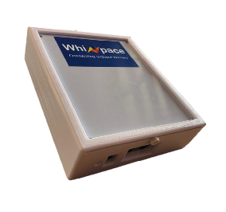

# Connect Whiznano Gateway to Azure IoT Hub in the cloud

## What you do

Connect Whiznano Gateway to an IoT hub that you create. 

## What you learn

-   How to create an IoT Hub
-   How to prepare Whiznano Gateway 

## What you need

To complete this operation, you need the following parts:

-   [Whiznano Gateway](https://www.whizpace.com/products-and-services)
-   [TeraTerm Serial Utility](https://osdn.net/projects/ttssh2/downloads/72009/teraterm-4.105.exe/)
-   Internet Connection

## Create an IoT hub

### To create your IoT hub in the Azure portal, follow these steps:

1.  Sign in to the [Azure portal](https://portal.azure.com/).
2.  Click **New** > **Internet of Things** > **IoT Hub**.

    

3.  In the **IoT hub** pane, enter the necessary information for your IoT hub:

    

   -   **Name**: The name for your IoT hub. If the name you enter is valid, a green check mark appears.
   -   **Pricing and scale tier**: Select the free F1 tier for this demo. See [pricing and scale tier](https://azure.microsoft.com/pricing/details/iot-hub/).
   -   **Resource group**: Create a resource group to host the IoT hub, or use an existing one. See [Using resource groups to manage your Azure resources](../azure-resource-manager/resource-group-portal.md).
   -   **Location**: Select the closest location to you where the IoT hub is created.
   -   **Pin to dashboard**: Select this option for easy access to your IoT hub from the dashboard.

4.  Click **Create**. It could take a few minutes for your IoT hub to be created. You can see progress in the **Notifications** pane.

    

5.  After your IoT hub is created, click it from the dashboard. Make a note of the **Hostname** value that is used later in this article, and then click **Shared access policies**.

    

6.  In the **Shared access policies** pane, click the **iothubowner** policy, and then copy and save the **Connection string** value for your IoT hub. You use this value later in this article. For more information, see [Control access to IoT Hub](iot-hub-devguide-security.md).

    

You've now created your IoT hub. Ensure that you save the **Hostname** and **Connection string** values. They're used later in this article.

# Prepare the device

Set up your PC first. Ensure IP Address: 192.168.1.10, Subnet Mask: 255.255.255.0
-   Go to Control Panel
-   Network and Internet -> View network status and tasks
-   Left Hand Side of Screen. Click on “Change network setting”
-   Right Click on Ethernet -> Properties
-   Under Networking, Select Internet Protocol (IPv4) -> Click on Properties
-   Select Use the following IP Address:  

  

1.  Whiznano Gateway comes with pre-installed IoT Central Application.

2.  User needs to open up Tera Term software to connect to Gateway.

    

3.  Enter username as “root” with no password and proceed.

4.  Key in command as shown in the figure below. 
(For e.g. **nanogateway**(space)**connection_string**)

    

## Next steps

You have successfully connected Whiznano Gateway to your IoT hub. 

You have now learned how to run a sample application that collects sensor data and sends it to your IoT hub. To explore how to store, analyze and visualize the data from this application in Azure using a variety of different services, please click on the following lessons:

-   [Manage cloud device messaging with iothub-explorer]
-   [Save IoT Hub messages to Azure data storage]
-   [Use Power BI to visualize real-time sensor data from Azure IoT Hub]
-   [Use Azure Web Apps to visualize real-time sensor data from Azure IoT Hub]
-   [Weather forecast using the sensor data from your IoT hub in Azure Machine Learning]
-   [Remote monitoring and notifications with Logic Apps]   

[Manage cloud device messaging with iothub-explorer]: https://docs.microsoft.com/en-us/azure/iot-hub/iot-hub-explorer-cloud-device-messaging
[Save IoT Hub messages to Azure data storage]: https://docs.microsoft.com/en-us/azure/iot-hub/iot-hub-store-data-in-azure-table-storage
[Use Power BI to visualize real-time sensor data from Azure IoT Hub]: https://docs.microsoft.com/en-us/azure/iot-hub/iot-hub-live-data-visualization-in-power-bi
[Use Azure Web Apps to visualize real-time sensor data from Azure IoT Hub]: https://docs.microsoft.com/en-us/azure/iot-hub/iot-hub-live-data-visualization-in-web-apps
[Weather forecast using the sensor data from your IoT hub in Azure Machine Learning]: https://docs.microsoft.com/en-us/azure/iot-hub/iot-hub-weather-forecast-machine-learning
[Remote monitoring and notifications with Logic Apps]: https://docs.microsoft.com/en-us/azure/iot-hub/iot-hub-monitoring-notifications-with-azure-logic-apps

