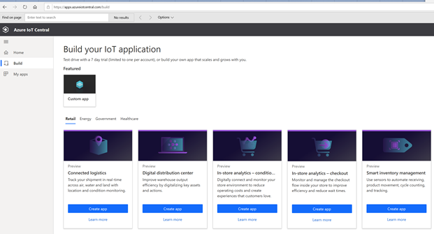
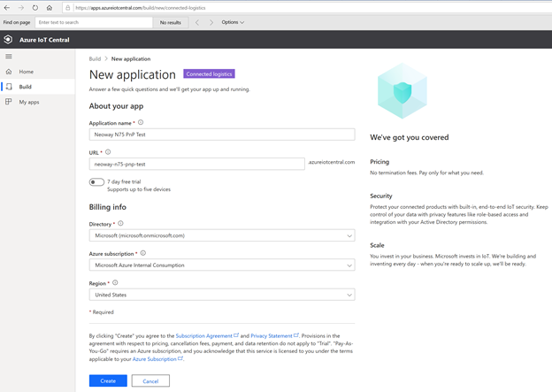
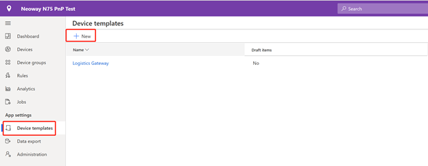
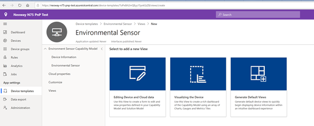
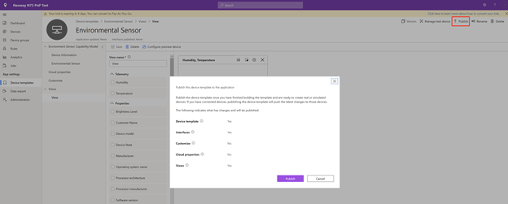
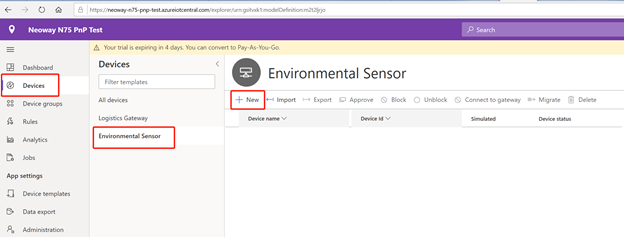
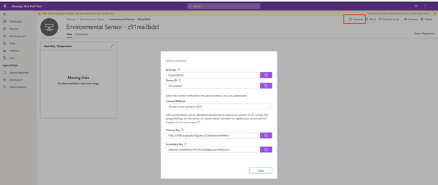
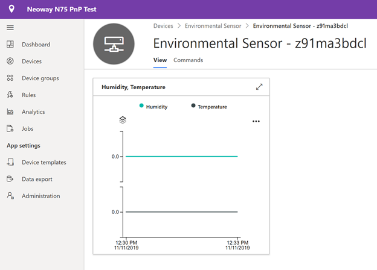

Connect N75 device to your Azure IoT Central Application
===
---

# Table of Contents

-   [Introduction](#Introduction)
-   [Prerequisites](#Prerequisites)
-   Create Azure IoT Central application
-   Device Connection Details
-   [Prepare the Device](#PrepareDevice)
-   [Integration with IoT Central](#IntegrationwithIoTCentral)

# Introduction

**About this document**

This document describes how to connect N75 to Azure IoT Central application using the IoT plug and Play model. Plug and Play simplifies IoT by allowing solution developers to integrate devices without writing any device code. Using Plug and Play, device manufacturers will provide a model of their device to cloud developers to be integrated quickly into IoT Central or any solution built on the Azure IoT platform. IoT Plug and Play will be open to the community by way of a definition language and SDKs.
N75 is an LTE Cat 4 module optimized specially for M2M and IoT applications. Adopting the 3GPP Rel. 11 LTE technology, it delivers 150Mbps downlink and 50Mbps uplink data rates. N75 supports Qualcomm® IZat™ location technology Gen8C Lite (GPS, GLONASS, BDS, Galileo and QZSS). The integrated GNSS greatly simplifies product design, and provides quicker, more accurate and more reliable position fix.

With low power consumption, Ultrawide operating temperature range, excellent RF performance, integration of Internet protocols, industry-standard interfaces, and abundant functionalities (USB serial drivers for Windows 7/8/8.1/10, Linux, Android), N75 is an optimal option for energy metering, telematics, industrial router, industrial PAD, video surveillance, environmental monitoring, etc.

N75 series can be used in most regions including North America, Europe, Japan where LTE networks are deployed. It also supports EDGE and HSPA+ networks for application in areas not covered by LTE networks.

# Prerequisites

You should have the following items ready before beginning the process:
-   [Azure Account](https://portal.azure.com/)
-   [Azure IoT Hub Instance](https://docs.microsoft.com/en-us/azure/iot-hub/about-iot-hub)
-   [Azure IoT Hub Device Provisioning Service](https://docs.microsoft.com/en-us/azure/iot-dps/about-iot-dps)
-   Provide Network connectivity (LTE) supported by the device
-   Its mandatory that the device code/software image is preinstalled in device to enable Plug and Play

# Create Azure IoT Central application
You should create an Azure IoT Central application at first according to the following steps:

Navigate to the [Azure IoT Central](https://aka.ms/iotcentral) Build site. Then sign in with a Microsoft personal, work, or school account.

Navigate to **Build** page, choose **Connected logistics **and click **Create app**.

Enter your own friendly application name. A unique **Application URL** based on the application name will be generated. You can use this URL to access your application.

Review other Terms and Conditions and select **Create** at the bottom of the page.

# Device Connection Details

This section describes how to add a device to your IoT Central application and get device connection details. Theses connection details will be used when **Integration with IoT Central**

Navigate to IoT Central application page, the default page is on Dashboard. To add a new device template, select + **New** on the **Device Templates** page.

Choose **IoT Device** from the list of custom device templates, select **Next: Customize**, then select **Next: Review**, and then select **Create**. Enter **Environmental Sensor** as the name of your device template.

Download `EnvironmentalSensorInline.capabilitymodel.json` file that contains the [IoT Plug and Play](https://docs.microsoft.com/en-us/azure/iot-pnp/overview-iot-plug-and-play) device capability model. You can download it from [here](https://raw.githubusercontent.com/Azure/IoTPlugandPlay/master/samples/EnvironmentalSensorInline.capabilitymodel.json). 

After you download the file, open it in a text editor, and replace the two instances of <YOUR_COMPANY_NAME_HERE> with ‘neoway’. 

Note: only the characters a-z, A-Z, 0-9, and underscore permit.

Back to Device templates > Environmental Sensor page. Choose **Import Capability Model** to create a new device capability model from a JSON file. Navigate to the folder where you saved the **EnvironmentalSensorInline.capabilitymodel.json** file on your local machine. Select the file and then select **Open**. 

In order to interact with your device, you should create a view to display relevant information about your device.

Select **Views** and then **Visualizing the Device**.

select **Humidity** and **Temperature**, and then select **Combine**. select the **Change Visualization** button at the top of the tile if you want to view this chart in a different format.

Select **Save** to save your view.
**Publish device template**

**After create device template**, Select **Publish** button at the right top of the tile

On the **Publish a Device Template** dialog, choose **Publish**. After a device template is published, it's visible on the **Devices** page and to the operator.
Navigation to Devices and select the device template you create just now. Then select **New**

Use the suggested **Device ID** or enter your own lowercase **Device ID**. You can also enter a name for your new device. Select **Create**.

Select the device and you will see details about it, Select the Connect button, you can get the device connection details. Record the ID Scope, Device ID and Primary key.

# Prepare the Device

***Hardware Environmental setup***

Materials prepared: N75 EVB device , debug tool,5V/2A power adapter

Connected N75 EVB device with USB cable

Use the 5V/2A power adapter to power the module

***Software Environmental Setup***

Compilation Environment 

**OS:** Ubuntu 64-bit OS, version 12.04 or 14.04,16.04

**Compiler:** neoway-arm-oe-linux.tar.gz (The tool package is saved in the /tool/ directory of the SDK package)

**Preparation:**

This section describes how to use a device capability model to create an IoT Plug and Play Preview device.

Firstly, you should install Azure IoT tools on Windows 10

Use the following steps to install the [Azure IoT Tools for VS Code](https://marketplace.visualstudio.com/items?itemName=vsciot-vscode.azure-iot-tools) extension pack:

-   In VS Code, select the Extensions tab.
-   Search for Azure IoT Tools.
-   Select Install.

Then, Author your model on VS Code:

Create a pnp\_app directory in your local drive. Download the [Device Capability Model](https://github.com/Azure/IoTPlugandPlay/blob/master/samples/EnvironmentalSensorInline.capabilitymodel.json) and Interface Sample files to the pnp\_app folder.

Note: the DCM file is the same with DCM file that used to create device template.

Open pnp\_app folder with VS Code. In the files you downloaded, replace <YOUR_COMPANY_NAME_HERE> in the @id and schema fields with your own name.
Note: Only characters a-z, A-Z, 0-9, and underscore permitted).

***Generate the C code stub***

With the folder with DCM files open, use **Ctrl+Shift+P** to open the command palette, enter **IoT Plug and Play**, and select **Generate Device Code Stub.**

Enter the project name **sample\_device**, it will be the name of your device application.

Choose **Via DPS (Device Provisioning Service) symmetric key** as connection method.
Choose **ANSI C** as your language.
Choose **CMake Project on Linux** as your project template.
Choose **Via Source Code** as the way to include the SDK.

VS Code opens a new window with generated device code stub files.

***Get Azure IoT device SDK for C on Ubuntu***

Open a command prompt. Execute the following command to clone the [Azure IoT C SDK](https://github.com/Azure/azure-iot-sdk-c) GitHub repository:

    git clone https://github.com/Azure/azure-iot-sdk-c --recursive -b public-preview

You should expect this operation to take several minutes to complete.

Create a pnp\_app subdirectory in the root of the local clone of the repository. You use this folder for the device model files and device code stub:

    cd azure-iot-sdk-c
    mkdir pnp_app

***Build the code***

Copy **sample\_device** folder generated below to the pnp\_app directory under azure- tot -sdk-c.

open `CMakeLists.txt` in the device SDK root folder.

Add the line below at the bottom of the `CMakeLists.txt` file to include the device code stub folder when compiling:

    add_subdirectory(pnp_app/sample_device)

Run the following commands to build the device SDK and the generated code stub:
	
    cp repo/neoway-toolchain-iot-c.make ../azure-iot-sdk-c/build_all/linux

    cd ../azure-iot-sdk-c/build_all/linux

    ./build.sh --provisioning --toolchain-file neoway-toolchain-iot-c.cmake -cl --sysroot=…/neoway/N720A_OPEN_LINUX_Q201_SDK_V3.02/tool/neoway-arm-oe-linux/sysroots/armv7a-vfp-neon-oe-linux-gnueabi

Follow the steps to compile the code.

Step1: Use command t**ar -xzvf neoway-arm-oe-linux.tar.gz**  to decompress this package on Ubuntu system 

Step2:  Use command `source ./neoway-env-init.sh` to initialize the environment variables of the system.  

Step3: Use command `make` under example folder to compile the code, and generate the executable file.

Step4: Copy the executable file to the debugging system (windows).

#### Debugging Environment 

**OS:** Windows 7 /8/10

**Debugging tool:** Android Debug Bridge (ADB) version 1.0.31 (Windows OS is recommended), ADB Tools ( /tool/fastboot.rar ) used on Windows is in the SDK package.

You should have the following steps to set up debugging environment:

Step1: Install USB drivers on Windows: Android\_usb\_windows\_20171016.rar, refer to document -Neoway\_N75\_USB\_Driver\_Installation\_Guide_(Windows)

Step2: Decompress the /tool/fastboot.rar on Windows system.

Step3: Double click to run the cmd.bat file in the fastboot folder.

Follow the steps to copy the pnp program into the N75 device and run inside of the N75

Step1: Use command `adb push <file path>/<file name>  /data/` to push the executable file into the N75 module.
Note: <file path> is the executable file‘s path. <file name> is the executable file’s name.

Step2: Use command `adb shell chmod <file name> 755` to modify the file permissions
Note: <file name> is the executable file’s name.

Step3: Use command `adb shell` to enter the shell of the N75.

Step4: Use command “/data/<file name>” to run the executable file in the shell.

# Integration with IoT Central

After the build completes successfully, run your application passing the device connection details as parameter.

    cd ~/pnp_app/sample_device/cmake
    ./sample_device "{DPS ID Scope}" "{DPS Symmetric key}" "{Device ID}"

The device application starts connecting to IoT Central.

Go to IoT Central, open the related device. you can get the device data at the view page.

