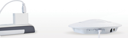
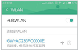
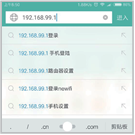
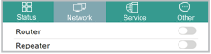
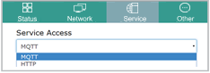
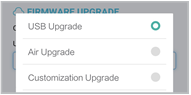
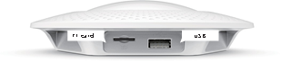

Instructions for using G1-B Gateway
===

### One, quick settings:

There is only three steps to open the smart gateway Bluetooth:

1.  Connect the power or POE

    Connect the power adapter for G1-B gateway or the network cable with POE function, press the key ON/OFF for the gateway power.
 
    

2.	Connect with the WiFi wireless network

    Wait for the top lights of the gateway to be dynamically completed. Use the mobile device or notebook to search and connect the WiFi wireless network named **GW-XXXXXXXXXXXX** without passwords.

    

3.	Open browser

    Turn off the 2G/3G/4G data flow of the mobile device, open the browser, enter 192.168.99.1, and go to the configuration page.
    (note: For detailed configuration instructions, please refer to the product manualof the gateway）

    

### Two,  functional features:

-   2 modes of network 
    -   Wire relay (router)
    -   Wireless relay (repeater)

    

-   2 kinds of upload protocols
    -   MQTT
    -   HTTP

    

-   2 power supply modes
    -   The power adapter
    -   Network port POE power supply

-   3 upgrades ways
    -   USB upgrade
    -   Air upgrade
    -   Customization upgrade

    

-   3 mounting methods
    -   Ceiling
    -   Anchored
    -   Horizontal installation

### Top  color lamp status description:

-   Top  color lamp status description:

<table>

<tbody>

<tr>

<td width="88">

Static six color lamp

</td>

<td width="295">

Indicates that the gateway is starting

</td>

</tr>

<tr>

<td width="88">

Dynamic white light

rotation

</td>

<td width="295">

Indicates that the gateway has been started

</td>

</tr>

<tr>

<td width="88">

Dynamic six color

lamp rotation

</td>

<td width="295">

Indicates that the gateway is not connected to the network

</td>

</tr>

<tr>

<td width="88">

Dynamic breathing lamp

</td>

<td width="295">

Indicates that the gateway is already connected to the network (Note: The gateway is in the dynamic breathing lamp by default, it can step into the energy-saving mode one minute after the extinction of lights, you also can set up bright mode in the configuration page if rich enough.）

</td>

</tr>

<tr>

<td width="88">

Lights go out

</td>

<td width="295">

Indicates that the gateway is not powered or in energy-saving mode

</td>

</tr>

</tbody>

</table>

### Port and button:(to be illustrated) 

   

<table>

<tbody>

<tr>

<td width="98">

Power interface(IN)

</td>

<td width="293">

Connects the G1-B gateway to the power adapter

</td>

</tr>

<tr>

<td width="98">

Power switch(ON/OFF)

</td>

<td width="293">

Gateway power switch

</td>

</tr>

<tr>

<td width="98">

Reset key

</td>

<td width="293">

Restore factory settings

(when the top lamp is in dynamic mode, press the reset button for more than 5 seconds and then release it. The lamp will be extinguished and after a few seconds, it is in the static six color

lamp state which indicating the reset is successful)

</td>

</tr>

</tbody>

</table>

   

<table>

<tbody>

<tr>

<td width="98">

TF card

</td>

<td width="293">

Support TF memory card reader

</td>

</tr>

<tr>

<td width="98">

USB

</td>

<td width="293">

Supports updating gateway firmware via USB

</td>

</tr>

<tr>

<td width="98">

POE Fast Ethernet port

</td>

<td width="293">

Supports POE and power supply connected to the network gateway

</td>

</tr>

</tbody>

</table>

   

### Three,common problems

**Q: Browser input 192.168.99.1, why cannot access the configuration page?**

**A:**

1.  Make sure that the mobile device is connected to the WiFi SSID: issued by the G1-B gateway-XXXXXXXXXXXX;

2.  Confirms that the 2G/3G/4G dataflow of the mobile device is closed;

3.  Make sure that the AP LAN IP is changed to another value (AP, LAN, IP, default is `192.168.99.1`). If you have changed, enter the AP LAN IP in the browser and the modified value will go to the configuration page.
**Remarks：** Use the mobile device to view the gateway WiFi AP LAN IP, WiFi property, a router is the value of AP LAN IP, or directly restore factory settings, AP LAN IP defaults to `192.168.99.1`.

**Q: Configure the network, in the dynamic six colored lamp rotation mode cannot be networked?**

**A:**

-   Check network:
    -   Wire relay (router) mode:
		-   Make sure that the higher level router can be networked;
		-   Confirm to insert the network cable that connects the superior router.
    -   Wireless relay (repeater) mode:
        -   Make sure that the higher level router can be networked;
        -   Confirm to insert the network cable that connects the superior router.

-   Check server:

    If the above confirmation is correct, verify that the MQTT/HTTP server you configured is online and that the G1-B gateway determines the network status by connecting the server you configured.

**Q： Can the G1-B gateway relay wirelessly connect to another G1-B gateway?**

**A:** Yes, but you need to set up the AP LAN IP address which is not the same as the
gateway section of the higher G1-B gateway.

**Q: Is the mobile device connected to the G1-B gateway that has been properly assigned to the network?**

**A：** Yes, there is only insufficient bandwidth and all the net should be accessed.

### Four, warranty documents

You have right to repair, replace and return the goods according to these regulations within the validity period of warranty, the validity period start from the day you purchase it and should deduct the time of logistics and maintenance.

   (1)	You can choose to replace or repair free of charge after confirmation of our compa- ny’s sales staff if any fault listed in the performance fault table occur about Minewtech G1-B gateway within 7 days after your purchase.

   (2)	You can choose to return, replace or repair free of charge after confirmation of our company’s sales staff if any fault listed in the performance fault table occur about Minew- tech G1-B gateway since your purchase from 8 to 15 days.

   (3)	You can choose to repair free of charge after confirmation of our company’s sales staff if any fault listed in the performance fault table occur about Minewtech G1-B gateway within 12 months of purchase.

-   Performance fault table:

<table>

<tbody>

<tr>

<td width="88">

Name

</td>

<td width="295">

Performance failure

</td>

</tr>

<tr>

<td rowspan="2" width="88">

G1-B gateway

</td>

<td width="295">

Not working properly after boot

</td>

</tr>

<tr>

<td width="295">

The shell cracking and the damage caused by

the product material structure

</td>

</tr>

</tbody>

</table>

### Five. Important remind

-   The following conditions are not covered by the free warranty:
    -   Damage caused by the use, maintenance and improper storage of the consumers;
    -   Damage caused by repairs and modifications without the right of the company;
    -   Damage caused by force majeure.
    -   Failure to comply with performance faults listed in the performance fault table.
    -   Out of warranty period
