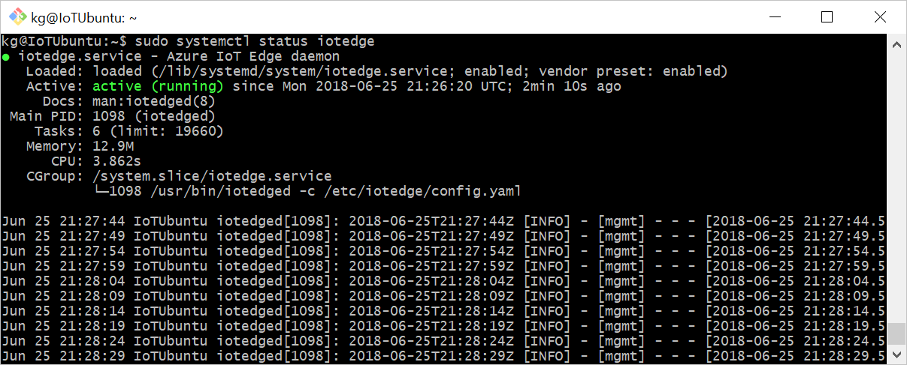
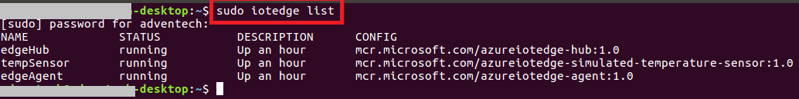
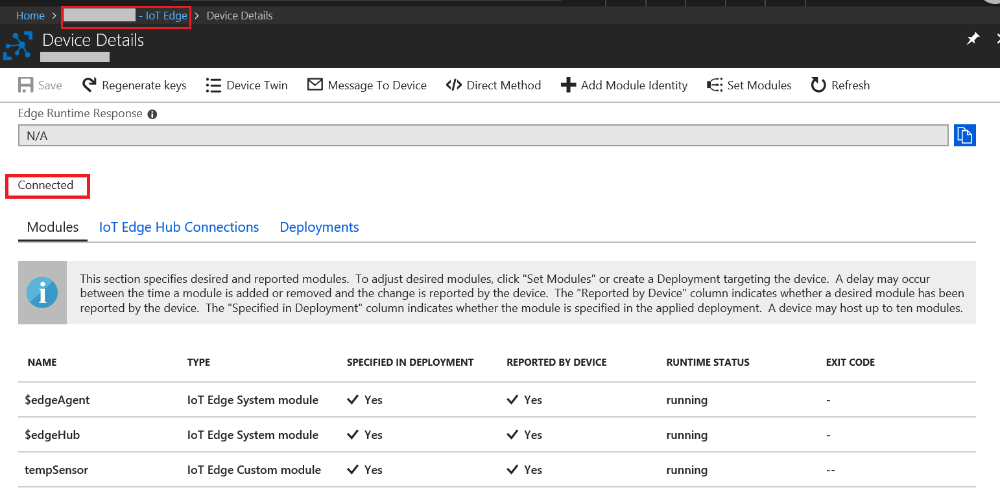

Run Azure IoT Edge Runtime on Kunbus Revolution Pi (RevPi) Core, Connect, or Compact device running Debian Linux / Raspbian
===
---

# Table of Contents

-   [Introduction](#Introduction)
-   [Step 1: Prerequisites](#Prerequisites)
-   [Step 2: Prepare your Device](#PrepareDevice)
-   [Step 3: Manual Test for Azure IoT Edge on device](#Manual)
-   [Step 4: Additional information](#Additionalinformation)
-   [Step 5: Additional Links](#AdditionalLinks)

# Introduction

**About this document**

This document describes how to connect Kunbus Revolution Pi (RevPi) Connect(+), Core(+), or Compact device running Debian Linux / Raspbian with Azure IoT Edge Runtime pre-installed and Device Management. This multi-step process includes:

-   Configuring Azure IoT Hub
-   Registering your IoT device
-   Build and Deploy client component to test device management capability 

# Step 1: Prerequisites

You should have the following items ready before beginning the process:

-   [Create an Azure account](https://azure.microsoft.com/en-us/free/)
-   [Sign up to Azure Portal](https://portal.azure.com/#home)
-   [Setup your IoT hub](https://github.com/Azure/azure-iot-device-ecosystem/blob/master/setup_iothub.md)
-   Kunbus Revolution Pi (RevPi) Connect(+), Core(+), or Compact device

# Step 2: Prepare your Device and deploy IoT Edge runtime

Estimated time: 30min

- You can find written and video tutorials on how to physically setup the RevPi in the [Support/Tutorials](https://revolution.kunbus.com/tutorials/) section on the Kunbus homepage.
- Connect to the RevPi via SSH (e.g. with Putty or the SSH Client of Windows 10). Default login data is written on the RevPi, please change them after first login.
- If you have less than 500 MB free space available (e.g. on the non-plus version with 4 GB eMMC), please refer to [Step 4: Additional information](#Additionalinformation) how to free up some space.
  - To see free space use *df -h* and look for the "/" mount.
- [Install Azure IoT Edge runtime](https://docs.microsoft.com/en-us/azure/iot-edge/how-to-install-iot-edge?view=iotedge-2018-06&tabs=linux) - Use Raspberry Pi OS download
  - If you want to verify the Moby installation and the command *./check-config.sh* fails you need to activate the file */proc/config.gz* containing the kernel config by the following command (then just rerun *./check-config.sh*):
    
        sudo modprobe configs

  - The section *Generally Necessary* and *Network Drivers* should be all enabled (it is ok if  *CONFIG_BRIDGE_VLAN_FILTERING* is missing).
- Stop Apache HTTP server to let IoT EdgeHub listen on port 443
  
        sudo service apache2 stop

- Setup IoT Edge in Azure and Device in either way (symmetric key is easier for getting started, X.509 should be used in production):
  - [Setup IoT Edge via symmetric keys](https://docs.microsoft.com/en-us/azure/iot-edge/how-to-manual-provision-symmetric-key?view=iotedge-2018-06&tabs=azure-portal%2Clinux)
  - [Setup IoT Edge via X.509 certificate](https://docs.microsoft.com/en-us/azure/iot-edge/how-to-manual-provision-x509?view=iotedge-2018-06&tabs=azure-portal%2Clinux)
- [Add the Edge Modules](https://docs.microsoft.com/en-us/azure/iot-edge/quickstart-linux?view=iotedge-2018-06#deploy-a-module)
  - Please note: This page also describes how to create a virtual IoT Edge device. You can ignore all content before the "Deploy a module" section (which is directly linked).

# Step 3: Manual Test for Azure IoT Edge on device

This section walks you through the test to be performed on the Edge devices running the Linux operating system such that it can qualify for Azure IoT Edge certification.

## 3.1 Edge RuntimeEnabled (Mandatory)

**Details of the requirement:**

The following components were installed in step 2:

-   Azure IoT Edge Security Daemon
-   Daemon configuration file
-   Moby container management system
-   A version of `hsmlib` 

*Edge Runtime Enabled:*

**Check the iotedge daemon command:** 

Open the command prompt on your IoT Edge device , confirm that the Azure IoT edge Daemon is under running state

    systemctl status iotedge

 

Open the command prompt on your IoT Edge device, confirm that the module deployed from the cloud is running on your IoT Edge device

    sudo iotedge list

  

On the device details page of the Azure, you should see the runtime modules - edgeAgent, edgeHub and tempSensor modueles are under running status

 

# Step 4: Additional information

If you encounter errors please check those steps for diagnosis and typical errors first:
- [Troubleshoot](https://docs.microsoft.com/de-de/azure/iot-edge/troubleshoot?view=iotedge-2018-06)
- [Common Errors](https://docs.microsoft.com/de-de/azure/iot-edge/troubleshoot-common-errors?view=iotedge-2018-06)

If you need more space you can remove packages no longer required (you can install them later if required), e.g.:

    sudo apt-get purge nodered bluej greenfoot geany python-pygame procon-web-iot teamviewer-revpi realvnc-vnc-server  oracle-java8-jdk

    sudo apt clean

If you have questions or need support, please contact our partner erminas or use our support forum:
- [erminas.com](https://erminas.com/)
- [info@erminas.de](mailto:info@erminas.de?subject=Question%20about%20RevPi%20and%20Azure)
- [Kunbus Support Forum](https://revolution.kunbus.de/forum/index.php)

# Step 5: Additional Links

-   [Kunbus RevPi homepage](https://revolution.kunbus.de/)
-   [What is Azure IoT Edge](https://docs.microsoft.com/en-us/azure/iot-edge/about-iot-edge?view=iotedge-2018-06)
-   [Azure IoT Edge 1.0.10 release is now available](https://azure.microsoft.com/en-us/updates/iot-edge1-0-10/)
-   [Azure IoT Edge supported systems](https://docs.microsoft.com/en-us/azure/iot-edge/support?view=iotedge-2018-06)
-   [Develop your own IoT Edge modules](https://docs.microsoft.com/en-us/azure/iot-edge/module-development?view=iotedge-2018-06)

This Get Started guide was created by [erminas](https://erminas.com/) for [Kunbus](https://revolution.kunbus.com/).