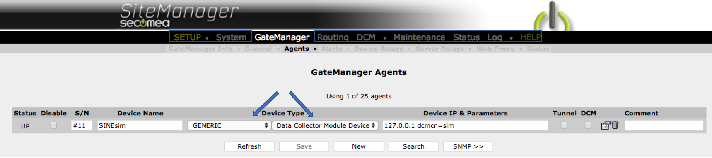
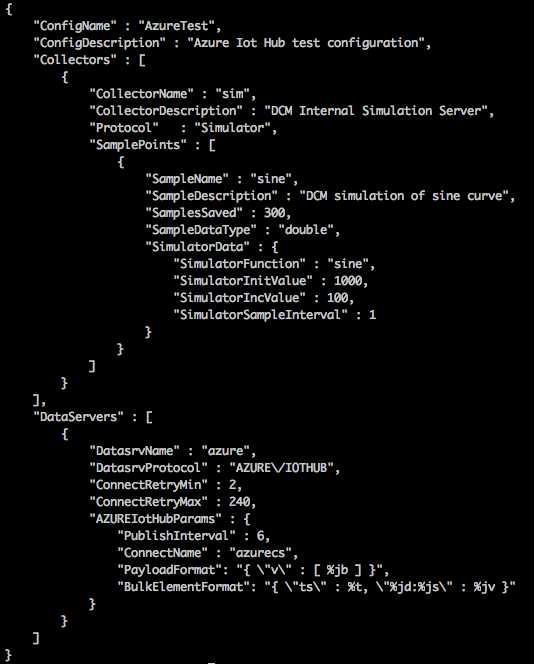
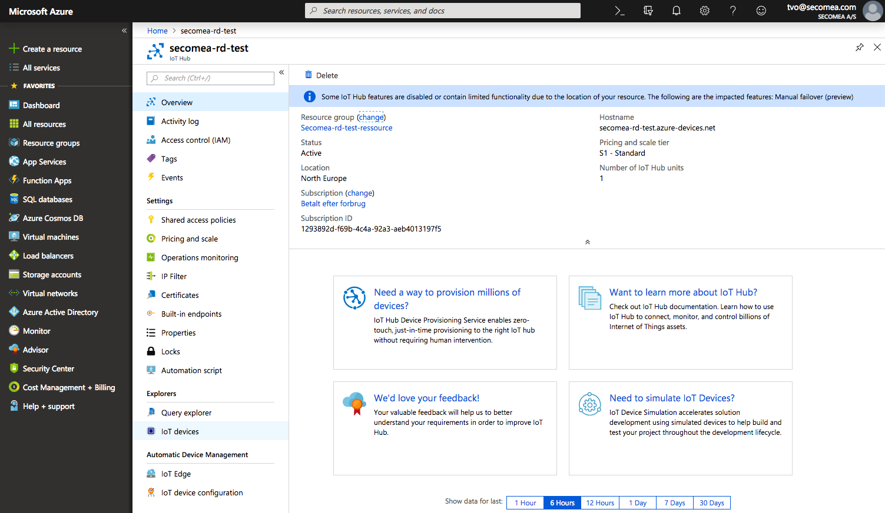
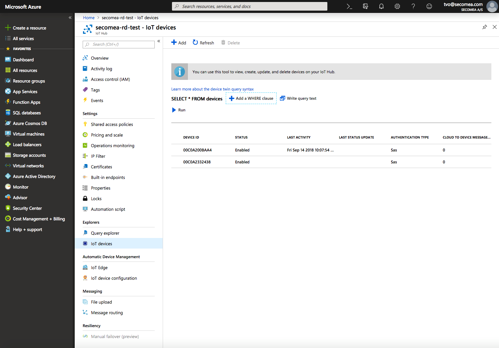
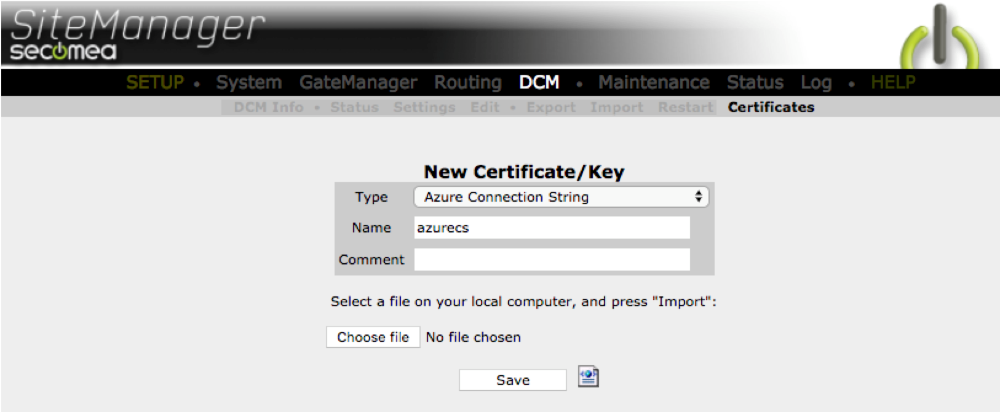
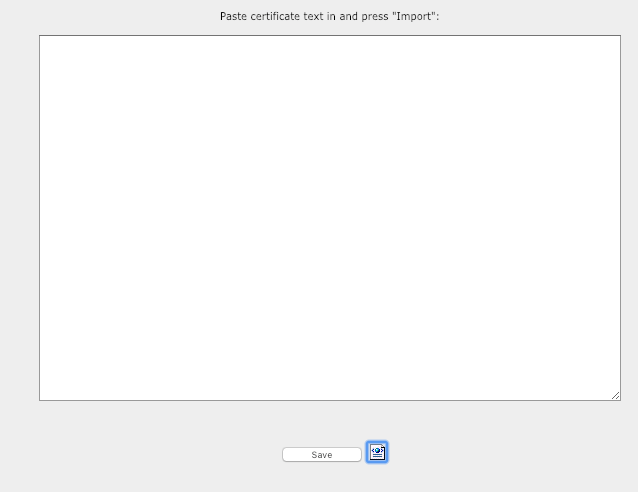
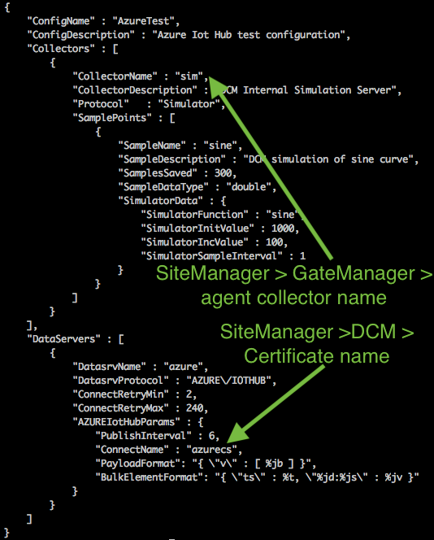

Run a simple Sine simulator on a Secomea SiteManager and send data to Azure IoT hub
===
---

# Table of Contents

-   [Introduction](#Introduction)
-   [Step 1: Prerequisites](#Prerequisites)
-   [Step 2: Configure your Secomea SiteManager](#PrepareDevice)
-   [Step 3: Configure Azure IoT Hub](#Build)
-   [Next Steps](#NextSteps)

# Introduction

**About this document**

This document describes how to configure a simple Sine simulator on the Secomea SiteManager, and upload the data to Azure IoT Hub. This multi-step process includes:

-   Configuring the SiteManager
- 	Configuring Azure IoT Hub
-   Registering your IoT device

# Step 1: Prerequisites

You should have the following items ready before beginning the process:

-   Knowledge of SiteManager configuration. See SiteManager getting started guides. <https://kb.secomea.com/hc/en-us/categories/115000903305-SiteManager>
-   Your SiteManager should be up-and-running with V9 or later
-   A working Azure IoT Hub account

# Step 2: Prepare your Secomea SiteManager

Goto SiteManager GUI and create an agent with DCM enabled.
(Choose a Generic / Data Collector Module device)

 
Click the parameter details icon   
 
Add a DCM collector name (dcmcn) for associating the Agent and the DCM collector config.

(Remember the name for later use) 

Click save
  

Goto DCM > import and import the below configuration file (Can be downloaded by clicking the picture)
  

Goto DCM > Status and copy the device **Edge ID** value. 
  

# Step 3: Configure Azure IoT Hub

Log in to your Azure account and go to Iot Hub->`<your resource name>`->IoT Devices
 

Go to Iot Hub-><your resource name>->IoT Devices
 

Press the [Add] button and fill in the device Edge ID, select Authentication Type **Symetric Key** and press [Save]
 

Click on the device Edge ID in your list of IoT Devices to view the Certificates and Keys. 

Now copy the **Connection String -- Primary Key** into your clipboard.

Log back into the SiteManager GUI and go into DCM->Certificates and press [New]. Select type **Azure Connection String**, give it a name (fx. azurecs) click the document icon (next to save) 

 Paste the connection string from the clipboard. Press [Save]. 

Go to SiteManager GUI DCM->Edit and enter this configuration, where the **ConnectName** field value is the name of the connection string value you created in the previous step  (eg. azurecs).
 
 

Goto DCM > Restart and restart the DCM including the Store'n'forward DB. 
Goto DCM > Status and check that the dataserver is connected and sending data to the cloud. 

# Next Steps

You have now learned how to run a sample application that collects sensor data and sends it to your IoT hub. To explore how to store, analyze and visualize the data from this application in Azure using a variety of different services, please click on the following lessons:

-   [Manage cloud device messaging with iothub-explorer]
-   [Save IoT Hub messages to Azure data storage]
-   [Use Power BI to visualize real-time sensor data from Azure IoT Hub]
-   [Use Azure Web Apps to visualize real-time sensor data from Azure IoT Hub]
-   [Weather forecast using the sensor data from your IoT hub in Azure Machine Learning]
-   [Remote monitoring and notifications with Logic Apps]   

[Manage cloud device messaging with iothub-explorer]: https://docs.microsoft.com/en-us/azure/iot-hub/iot-hub-explorer-cloud-device-messaging
[Save IoT Hub messages to Azure data storage]: https://docs.microsoft.com/en-us/azure/iot-hub/iot-hub-store-data-in-azure-table-storage
[Use Power BI to visualize real-time sensor data from Azure IoT Hub]: https://docs.microsoft.com/en-us/azure/iot-hub/iot-hub-live-data-visualization-in-power-bi
[Use Azure Web Apps to visualize real-time sensor data from Azure IoT Hub]: https://docs.microsoft.com/en-us/azure/iot-hub/iot-hub-live-data-visualization-in-web-apps
[Weather forecast using the sensor data from your IoT hub in Azure Machine Learning]: https://docs.microsoft.com/en-us/azure/iot-hub/iot-hub-weather-forecast-machine-learning
[Remote monitoring and notifications with Logic Apps]: https://docs.microsoft.com/en-us/azure/iot-hub/iot-hub-monitoring-notifications-with-azure-logic-apps
[setup-devbox-windows]: https://github.com/Azure/azure-iot-sdk-c/blob/master/doc/devbox_setup.md
[lnk-setup-iot-hub]: ../setup_iothub.md
[lnk-manage-iot-hub]: ../manage_iot_hub.md
