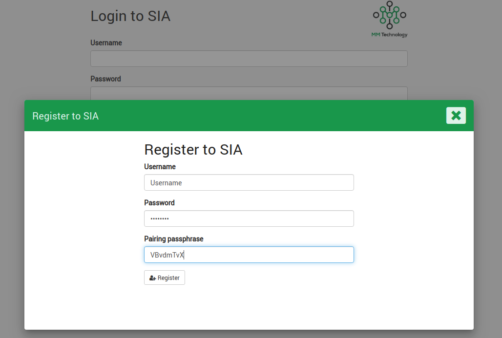
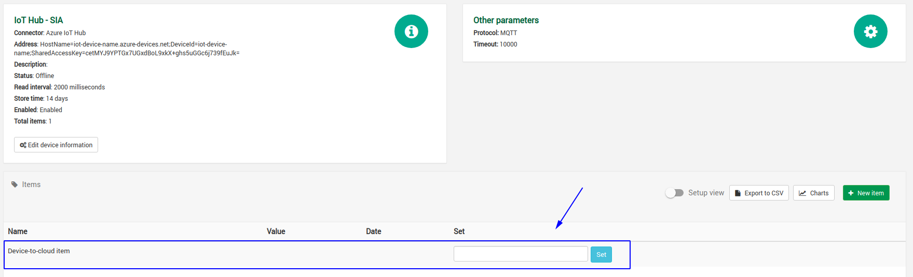
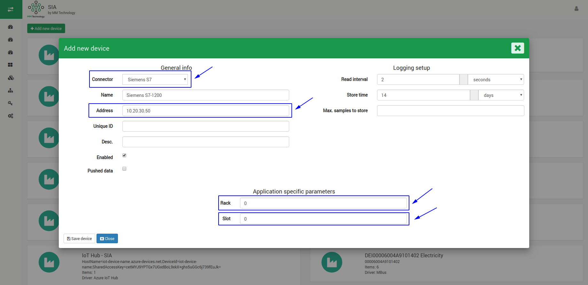
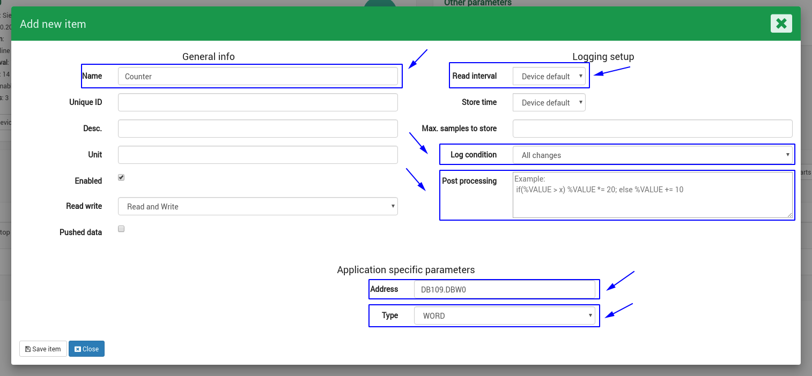
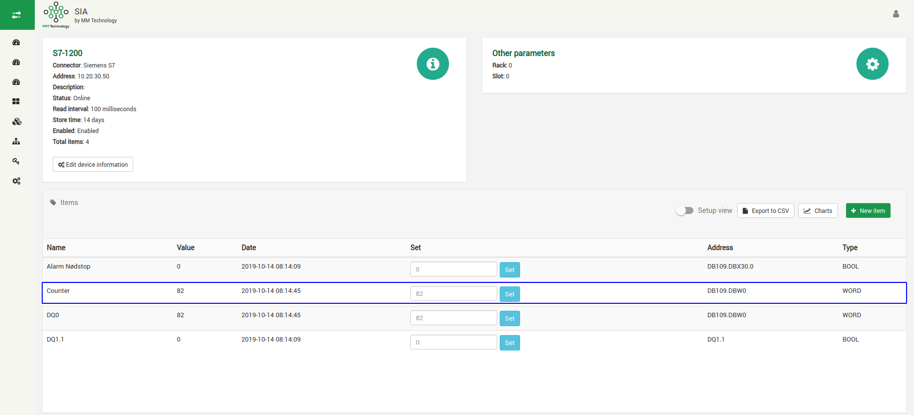
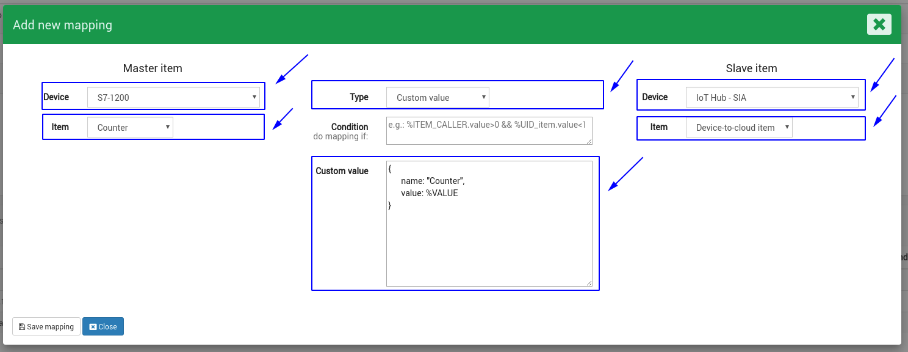
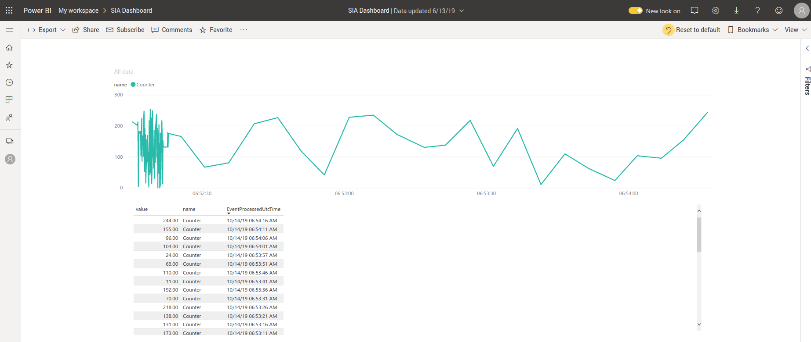

Connect industrial equipment & sensors to Azure IoT Hub with SIA
===
---

# Table of Contents

-   [Introduction](#introduction)
-   [Supported protocols & devices](#supported-protocols--devices)
-   [Prerequisites](#prerequisites)
-   [Getting SIA up and running](#getting-sia-up-and-running)
-   [Configuring an Azure IoT Hub connection on SIA](#configuring-an-azure-iot-hub-connection-on-sia)
   -   [Creating an IoT Hub and getting the Connection String](#creating-an-iot-hub-and-getting-the-connection-string)
   -   [Create an instance of the IoT Hub on SIA](#create-an-instance-of-the-iot-hub-on-sia)
-   [Connecting industrial equipment & sensors](#connecting-industrial-equipment--sensors)
   -   [Create an instance of S7-1200 PLC](#create-an-instance-of-s7-1200-plc)
   -   [Mapping data points from S7-1200 to IoT Hub](#mapping-data-points-from-s7-1200-to-iot-hub)
   -   [Visualizing the data in Power BI](#visualizing-the-data-in-power-bi)
-   [Questions, support and service](#questions-support-and-service)

# Introduction

This documentation describes how to connect industrial equipment and sensors to Azure IoT Hub using the SIA platform.
In the documentation the following will be covered:
-   [Getting SIA up and running](#Getting-SIA-up-and-running)
-   [Configuring an Azure IoT Hub on SIA](#configuring-an-azure-iot-hub-connection-on-sia)
-   [Connecting industrial equipment & sensors](#connecting-industrial-equipment--sensors)

# Supported protocols & devices

SIA supports the following protocols, devices & systems that can be connected to Azure IoT Hub:
-   OPC-UA client
-   Wireless MBus
-   MBus
-   BACnet IP
-   BACnet MS/TP
-   Modbus TCP
-   Modbus RTU
-   Siemens S7 protocol
-   Siemens S7 protocol ext. (!LOGO, S7-200)
-   Allen-Bradley Ethernet/IP
-   Beckhoff TwinCAT ADS
-   Universal Robot RTDE
-   Omron FINS
-   Omron Host Link
-   Mitsubishi MC
-   CAMP NITP (TI 50x PLCs)
-   IFM VSE (vibration diagnostic module)
-   MS SQL (ODBC)
-   MySQL
-   Socket

# Prerequisites

Before starting make sure you have the following components ready:
-   A SIA device
-   9-36V DC power supply
-   A laptop to configure SIA
-   Network access for connecting SIA to Azure IoT Hub 
-   Industrial equipment or sensor to generate data (PLC, Sensors, Simulator etc.)

# Getting SIA up and running

In order to get SIA up and running the following steps are carried out:
-   Connect 9-36V DC power supply to the assigned voltage input
   -   Wait for SIA to power up.
-   Connect a ethernet cable from SIA to the client computer on port 1 (X1)
   -   The default IP of SIA is `10.20.30.40`.
   -   Change the IP of the client computer to be in the same subnet (e.g. 10.20.30.45)
-   Open a webbrowser and navigate to `http://10.20.30.40` (the IP of SIA)
   -   Create a local user by using using the provided PIN code.
   -   Login and you are ready to start the configuration

# Configuring an Azure IoT Hub connection on SIA

To create Connectivity between the industrial equipment & sensors the following steps needs to be carried out:
-   [Create an IoT Hub and getting the Connection String](#creating-an-iot-hub-and-getting-the-connection-string)
-   [Create an instance of the IoT Hub on SIA](#create-an-instance-of-the-iot-hub-on-sia)

After these steps it is ready to connect to industrial equipment & sensors.

## Creating an IoT Hub and getting the Connection String

-   Login to [Azure portal](https://portal.azure.com/)
-   Go to the IoT Hub service and select the desired resource
-   Find or add an IoT device under the resource to stream data to
-   Note down the Connection String for the IoT device which will be in the following format
  
        HostName=iot-device-name.azure-devices.net;DeviceId=iot-device-name;SharedAccessKey=cetMYJ9YPTGx7UGxdBoL9xkX+ghs5uGGc6j739fEuJk=

For further information of how to create an IoT Hub and devices please refer to:  
<https://catalog.azureiotsolutions.com/docs?title=Azure/azure-iot-device-ecosystem/setup_iothub>

## Create an instance of the IoT Hub on SIA

To create Connectivity between the industrial equipment and Azure IoT Hub we need to add an instance of the IoT device on SIA.
First make a new instance on SIA using the *Azure IoT Hub Connector*.  

Go to *'Devices'* in the menu and click *'Add new device'* 

 
  
A new IoT Hub instance is now created and a *'Device to Cloud item'* are automatically added. This item will be used later for mapping data points to the IoT device in the Azure.  

   
**Now let's Connect some industrial data to the Azure IoT Hub!**
  
# Connecting industrial equipment & sensors

This section will demonstrate how to connect industrial equipment & sensors to the Azure IoT Hub.  
For this example we will use a *Siemens S7-1200 PLC* and send its data to the IoT Hub.
To achieve this the following steps needs to be carried out:

-   [Create an instance of S7-1200 PLC](#create-an-instance-of-s7-1200-plc)
-   [Mapping data points from S7-1200 to IoT Hub](#create-an-instance-of-the-iot-hub-on-sia)
-   [Visualizing the data in Power BI](#create-an-instance-of-the-iot-hub-on-sia)

**NOTE:** This example takes case in a *S7-1200* but it could be any device using one of the protocols given in [Supported protocols & devices](#supported-protocols--devices)  

## Create an instance of S7-1200 PLC
This subsection will show how to add an industrial device. In this case a Siemens S7-1200 device.  
To add a device follow the steps:
-   Go to *'Devices'* page & click *'Add new device'*
-   Select the desired Connector (driver) in from the Connector menu
-   *Address* > Add the IP of the S7-1200
-   *Read interval* > Set the default read interval
-   *Rack* > Rack of the PLC
-   *Slot* > Slot of the PLC
-   Leave the other options as for now
-   Press *'Save Device'*  

After the industrial equipment is added (PLC of type S7-1200 in this case) navigate into it from the list of devices.
Now the internal data points on the equipment that needs to be mapped to the Azure IoT Hub is to be added to SIA.

-   Go to *'Devices'* page & click on the newly added device (named S7-1200 in this example)
-   Click *'New item'* in the Items table. An item is a data point.
-   *Name* > Visual name of the item. Use a describing name.
-   *Read interval* > Insert individual read interval if the default set from the device is not going to be used
-   *Log condition* > Select how and when to send the data to the IoT Hub. The following can be used:
   -   *All* > Sends all the data for every read
   -   *All changes* > Only sends when the value changes
   -   *Deadband* > If the value changes withing a deadband (e.g. 10% for percentage change or e.g. 4 for numerical change)
   -   *Equals* > If value equals a specific value
   -   *Trigger high/low* > If the value above or below a certain value should be send
-   *Post processing* > Post process the value. Can e.g. be used for scaling (e.g. %VALUE / 100)
-   *Address* > Internal variable address in the PLC (specific for Siemens S7 Connector)
-  *Type* > The type of the interval variable in the PLC (specific for Siemens S7 Connector)
-   Press *'Save item'*
  

  
In the items you will see the added items and their corresponding values.  
Now the Azure IoT Hub and the industrial data points are added to SIA. The next step is to map them together to create the Connectivity.  
It will be covered in [*Mapping data points from S7-1200 to IoT Hub*](#mapping-data-points-from-s7-1200-to-iot-hub)
  

## Mapping data points from S7-1200 to IoT Hub

This subsection will show how to add mapping between the industrial data points and Azure IoT Hub. 
To create such mapping navigate to the industrial device from where the data is read:

-   Go to **Devices** page & click on the industrial device (named S7-1200 in this example)
-   Scroll down to the mappings table in on the indivudla device page. Click **New mapping**
-   Configure the data mapping.
-   *Master item* (item that decides when to transmit data)
   -   *Device* > Select the device from where the data is coming from (in this example *'S7-1200'*)
   -   *Item* > Select the data point (in this example *'Counter'*)
-   *Type* > How to format the data
   -   *Parse value directly* > Send the data as it is read from the industrial device
   -   *Custom value* > Customize the payload to send
-   *Condition* > Condition the transmission and control how and when to transmit the data. (e.g. if an alarm is high or other conditions)
-   *Slave item* (item to receive the data)
   -   *Device* > Select the device that is going to receive the data (in this example *'IoT Hub - SIA'*)
   -   *Item* > Destination for the data. For Azure IoT Hub it is always the item *'Device-to-cloud item'*
-   Press *'Save mapping'* and the data will now start flowing to the Azure IoT Hub.

  
Thats it! Now the data is flowing from any industrial device & sensor to the IoT Hub. The principles is the same for all the different protocols and systems that SIA supports.

## Visualizing the data in Power BI
From the Azure IoT Hub a *'Stream Analytics'* is created to forward the data to *Power BI* for demonstrating it.  
The data can be used just the way you want it now when it is available in the IoT Hub.  
  
If you want to try to forward the data to *Power BI* the following link and guide can be used:  
<https://docs.microsoft.com/en-us/azure/iot-hub/iot-hub-live-data-visualization-in-power-bi#create-configure-and-run-a-stream-analytics-job>

# Questions, support and service

You have now learned how to get industrial data to Azure IoT Hub and are ready to start deploying SIA to achieve easy Connectivity.  
If a specific Connector is missing for your equipment please let us know and we will look into this. 
    
For further information or support please contact us at:   

[info@mmtec.io](maito:info@mmtec.io)

[www.mmtec.io](mailto:www.mmtec.io)