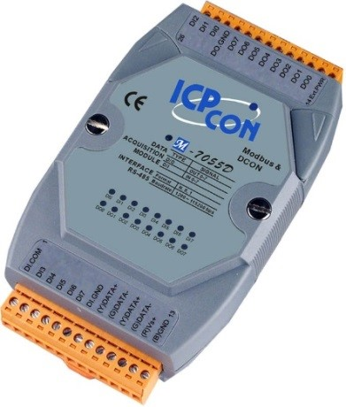
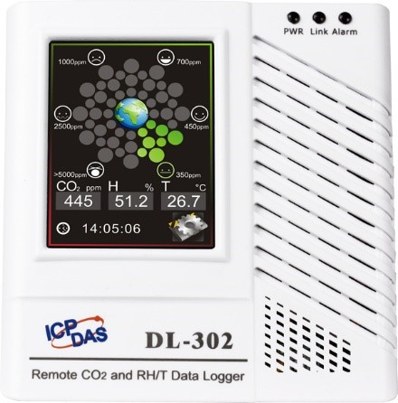
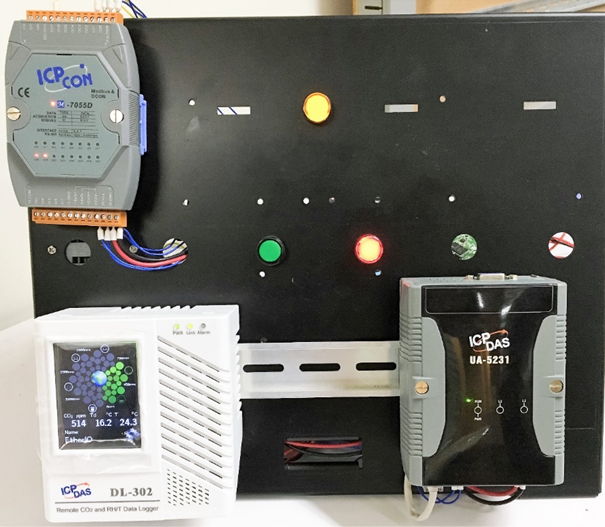
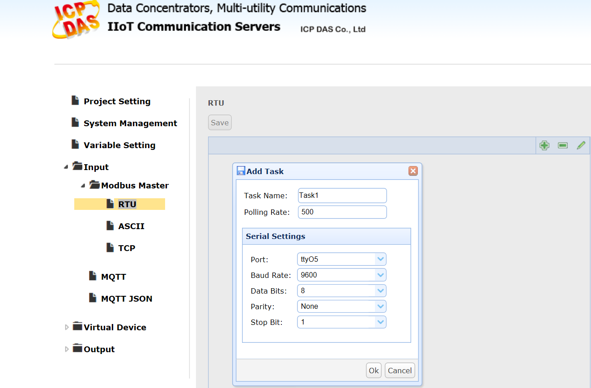
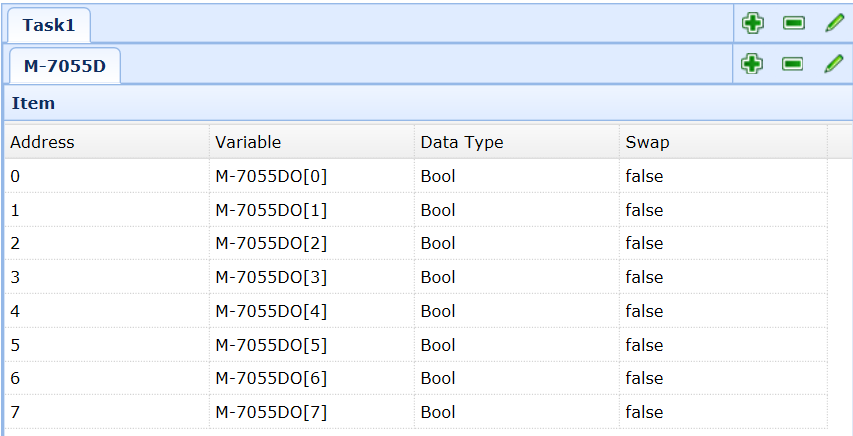
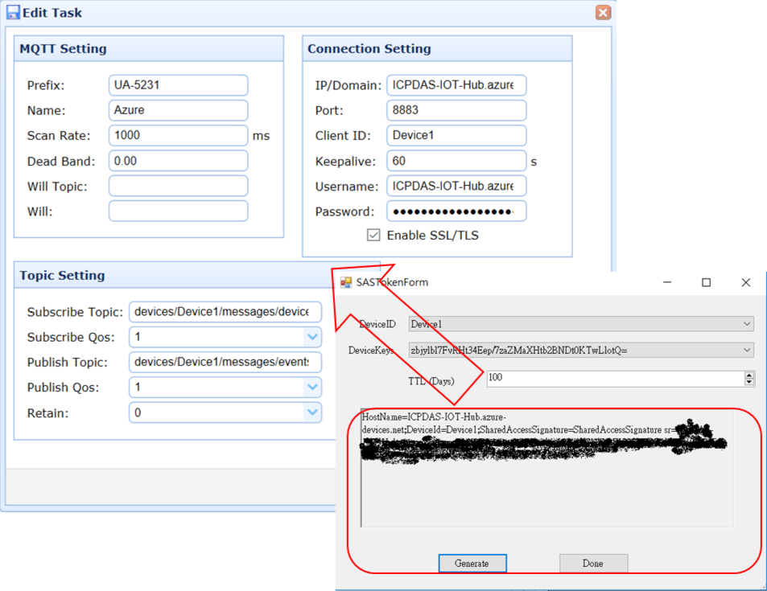
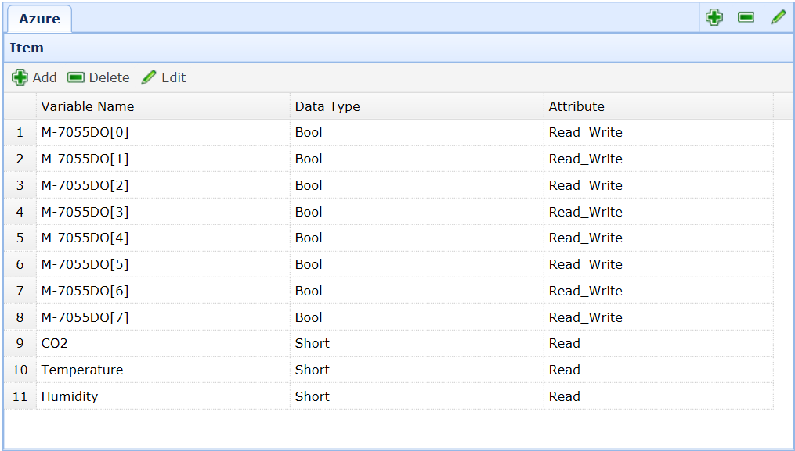

Run a simple C sample on UA-5231 device running Ubuntu Linux
===
---

# Table of Contents

-   [Introduction](#Introduction)
-   [Step 1: Prerequisites](#Step-1-Prerequisites)
-   [Step 2: Prepare your Device](#Step-2-PrepareDevice)
-   [Step 3: Build and Run the Sample](#Step-3-Build)
-   [Next Steps](#NextSteps)

# Introduction

**About this document**

This document describes how to connect WISE-5231 device to Azure IoT Hub.

This multi-step process includes:
-   Configuring Azure IoT Hub
-   Registering your IoT device
-   Build and deploy Azure IoT SDK on device

# Step 1: Prerequisites

-   [Setup your IoT hub][lnk-setup-iot-hub]
-   [Provision your device and get its credentials][lnk-manage-iot-hub]
-   UA-5231 device
-   Computer with a browser
-   I/O modules for connecting with UA-5231 device. 

    In this example, we use the following Modbus sensor and I/O product from ICP DAS.

    > M-7055D: 8-channel Digital Input and 8-channel Digital Output Module

      

    > DL-302: CO2/Temperature/Humidity Module

      

 

# Step 2: Prepare your Device

In this section, you will configure your UA-5231 device and connect with Modbus sensor and I/O product from ICP DAS (using M-7055D and DL-302 for the example).

  

-   Follow the instruction described in this [Quick Start](http://wise.icpdas.com/downloads/manual/WISE-52xx_quick%20start_v1.0.3.pdf) to Connect to the Web interface of UA-5231.
-   Follow the instruction described in this [User Manual](http://ftp.icpdas.com/pub/cd/8000cd/napdos/7000/manual/7000dio.pdf) to set M-7055D and Module parameters as follows:
    -   Serial port parameters: 9600 N,8,1 (Default)
    -   Modbus Address:1 (Default)

    

# Step 3: Run the sample

Follow the steps below to configure the UA-5231 and deploy Azure communication.

-   Connect to UA-5231 web server via browser, login with the default password **root**.

-   Go to **Input >> Modbus Master >> RTU** page to add serial setting of tty05

    

-   In same page to add M-7055D and DL-302

    

    

-   Go to **Output >> MQTT JSON** to add a communication for Azure.

    

-   Please refer [Communicate with your IoT hub using the MQTT protocol](https://docs.microsoft.com/en-us/azure/iot-hub/iot-hub-mqtt-support).

    Input the SAS Token to **Edit Task** page

    

-   Configure M-7055D and DL-302 I/O variable in the Azure communication setting.

    

-   Run the UA-5231 then use the Device Explorer to verify if the IoT Hub receives the messages from UA-5231.

## Resource

-   ICP DAS UA-5231 user’s manual:

    <http://ftp.icpdas.com.tw/pub/cd/ua-5000/user_manual/>

# Next Steps

You have now learned how to run a sample application that collects sensor data and sends it to your IoT hub. To explore how to store, analyze and visualize the data from this application in Azure using a variety of different services, please click on the following lessons:

-   [Manage cloud device messaging with iothub-explorer]
-   [Save IoT Hub messages to Azure data storage]
-   [Use Power BI to visualize real-time sensor data from Azure IoT Hub]
-   [Use Azure Web Apps to visualize real-time sensor data from Azure IoT Hub]
-   [Weather forecast using the sensor data from your IoT hub in Azure Machine Learning]
-   [Remote monitoring and notifications with Logic Apps]   

[Manage cloud device messaging with iothub-explorer]: https://docs.microsoft.com/en-us/azure/iot-hub/iot-hub-explorer-cloud-device-messaging
[Save IoT Hub messages to Azure data storage]: https://docs.microsoft.com/en-us/azure/iot-hub/iot-hub-store-data-in-azure-table-storage
[Use Power BI to visualize real-time sensor data from Azure IoT Hub]: https://docs.microsoft.com/en-us/azure/iot-hub/iot-hub-live-data-visualization-in-power-bi
[Use Azure Web Apps to visualize real-time sensor data from Azure IoT Hub]: https://docs.microsoft.com/en-us/azure/iot-hub/iot-hub-live-data-visualization-in-web-apps
[Weather forecast using the sensor data from your IoT hub in Azure Machine Learning]: https://docs.microsoft.com/en-us/azure/iot-hub/iot-hub-weather-forecast-machine-learning
[Remote monitoring and notifications with Logic Apps]: https://docs.microsoft.com/en-us/azure/iot-hub/iot-hub-monitoring-notifications-with-azure-logic-apps
[lnk-setup-iot-hub]: ../setup_iothub.md
[lnk-manage-iot-hub]: ../manage_iot_hub.md
