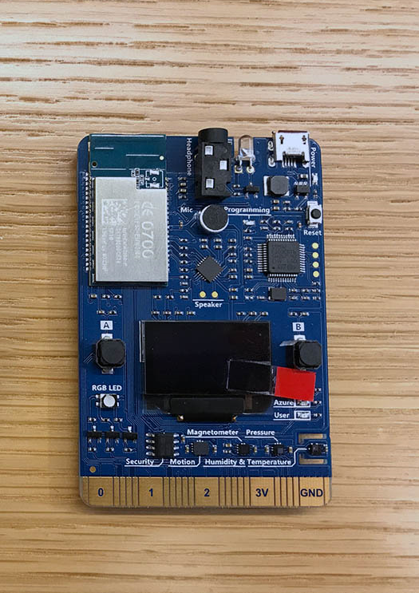
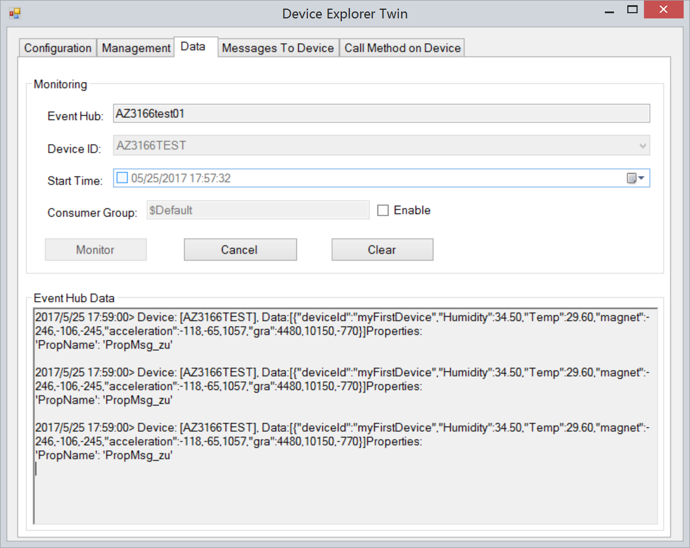

Run a simple C sample on AZ3166 device running Mbed
===
---

# Table of Contents

-   [Introduction](#Introduction)
-   [Step 1: Prepare Device](#Step_1_Prepare_Device)
-   [Step 2: Prepare SDK](#Step_2_Prepare_SDK)
-   [Step 3: Build and Run the sample](#Step_3_Build_and_Run_the_sample)
-   [Step 4: Results](#Results)
-   [Next Steps](#NextSteps)

# Introduction

AZ3166 is an IoT development kit based on EMW3166 developed by Shanghai MXCHIP Information Technology Co., Ltd. and Microsoft asia-pacific technology Co., Ltd. The development kit provides a smart hardware solution. It is compatible with Arduino with abundant peripherals and sensors. AZ3166 could be used for the development of IoT and smart hardware prototype, making it continent to verify the software and function of users. Product could connect to Azure and mobile phone fast and safely. With AZ3166, customers could cut down the period of research. AZ3166 has software and hardware and would be supported with developer community, including development kit and demo for quick connection to cloud service. Control and operation could be obtained by mobile phone or tablet.

In this guide you could know how to connecting AZ3166 to Azure, sending and receiving data through Azure. 

# Step 1: Prepare your Device

**What you need**

 - AZ3166 board
 - Micro USB cable

Main control unit of AZ3166 is EMW3166 - a low power consumption Wi-Fi module developed by MXCHIP, with DAP Link emulator and 128x64 OLED and other resources such as LED light. Sensors are integrated on the board including Motion sensor, Magnetometer sensor, Atmospheric pressure sensor, Temperature and humidity sensor. The development kit also has audio processing unit to connect to Azure for vioce recognition and voice play. 

# Step 2: Prepare SDK

**Download SDK**

SDK could be download from [here](https://github.com/Neo117/AZ3166-connect-Azure).

**Compiling Environment**

 - Python is required in compiling. Download python from [here](https://www.python.org/downloads/release/python-2713/).
 - mbed CLI. For how to Install mbed CLI, please follow the link: [https://docs.mbed.com/docs/mbed-os-handbook/en/latest/dev_tools/cli/](https://docs.mbed.com/docs/mbed-os-handbook/en/latest/dev_tools/cli/)
 - GNU ARM Embedded Toolchain 4.9-2015-q3 is required in compiling. Download [here](https://www.python.org/downloads/release/python-2713/).

After install mbed CLI and GNU ARM Embedded Toolchain, configure mbed in sdk file by using cmd command:

<pre>
mbed config -G GCC_ARM_PATH ****
</pre>

# Step 3: Build and Run the sample

**A. Configure WiFi**

Configure WiFi in mbed_app.json. Input Wifi SSID and password in main.app as shown below.

<pre>
        "wifi-ssid": {
            "value": "\"****\""
        },
        "wifi-password": {
            "value": "\"****\""
        }
</pre>

**B. Configure Device Registration**

 -	[Regist azure.microsoft account](https://azure.microsoft.com/zh-cn/free/) to get free account for iothub.
 -	Add iothub service in azure cloud control center.
 -	Install [Azure tool(Azure CLI)](https://docs.microsoft.com/zh-cn/azure/iot-hub/iot-hub-raspberry-pi-kit-node-lesson2-get-azure-tools-win32) on your computer.
 -	Click [here](https://github.com/Azure/azure-iot-sdk-csharp/blob/master/tools/DeviceExplorer/doc/how_to_use_device_explorer.md) to download and install DeviceExplorer，you will register your device using DeviceExplorer. Fllowing [here](https://github.com/Azure/azure-iot-device-ecosystem/blob/master/iotcertification/iot_certification_port_c_libraries_other_platforms/iot_certification_port_c_libraries_other_platforms.md) to study how to regist your device.
 - Configure device information in iothub_client_sample_mqtt.c. As shown below.

<pre>
static const char* connectionString = "HostName=****;DeviceId=****;SharedAccessKey=****";
</pre>

**C. Build the Sample**

Use the following command(Command Prompt on Windows, or Terminal on Mac OS X)

<pre>
     mbed compile -m AZ3166 -t GCC_ARM
</pre>

After compile the sample. a `.bin` file with the same name of the SDK would be generated in the path: `...\mbed-wifi-example\BUILD\AZ3166\GCC_ARM`.

**D. Download Firmware to DevKit**

Once the DevKit is connected, you will see a new USB mass storage device in your File Explorer.

Drag & drop the `.bin` file you compiled to AZ3166 device.

Wait until file copied, the DevKit will reboot to the latest firmware.

# Step 4: Results

Az3166 would send data to Iothub-explorer and Iothub-explorer would receive the data.

At the same time,you can send message to Az3166 from iothub-explorer.

# Next steps

You have now learned how to run a sample application that collects sensor data and sends it to your IoT hub. To explore how to store, analyze and visualize the data from this application in Azure using a variety of different services, please click on the following lessons:

 - [Manage cloud device messaging with iothub-explorer](https://docs.microsoft.com/en-us/azure/iot-hub/iot-hub-explorer-cloud-device-messaging)
 - [Save IoT Hub messages to Azure data storage](https://docs.microsoft.com/en-us/azure/iot-hub/iot-hub-store-data-in-azure-table-storage)
 - [Use Power BI to visualize real-time sensor data from Azure IoT Hub](https://docs.microsoft.com/en-us/azure/iot-hub/iot-hub-live-data-visualization-in-power-bi)
 - [Use Azure Web Apps to visualize real-time sensor data from Azure IoT Hub](https://docs.microsoft.com/en-us/azure/iot-hub/iot-hub-live-data-visualization-in-web-apps)
 - [Weather forecast using the sensor data from your IoT hub in Azure Machine Learning](https://docs.microsoft.com/en-us/azure/iot-hub/iot-hub-weather-forecast-machine-learning)
 - [Remote monitoring and notifications with Logic Apps](https://docs.microsoft.com/en-us/azure/iot-hub/iot-hub-monitoring-notifications-with-azure-logic-apps)
