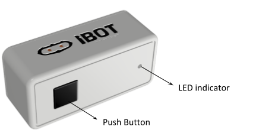
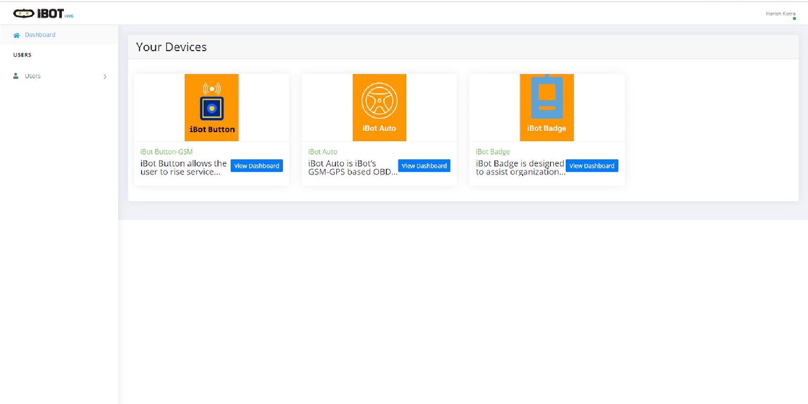
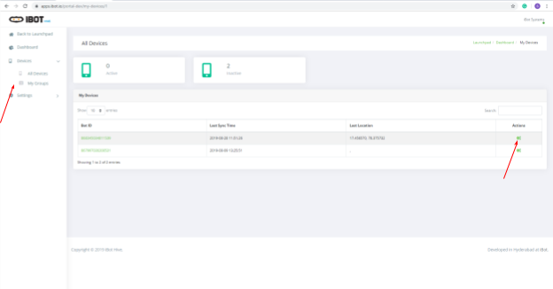
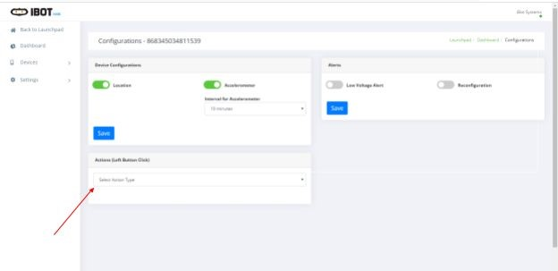
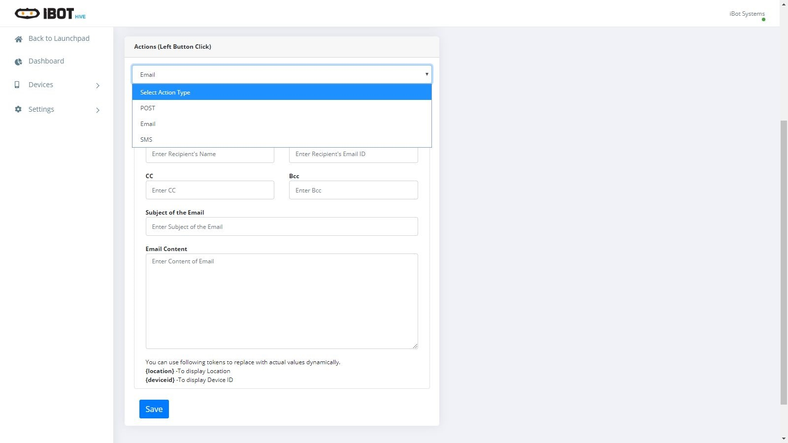

Run a simple C sample on iBot Button device running Mbed
===
---

# Configure iBot Button

-   [Configure iBot Button](#Introduction)
-   [Step 1: Prerequisites](#Prerequisites)
-   [Step 2: Prepare your Device](#PrepareDevice)
-   [Step 3: Run a Sample Action](#Build)
-   [Step 4: RGB LED Indications](#RGBLEDIndications)
-   [Next Steps](#NextSteps)

# Configure iBot Button
Following are the multistep process involved in configuring the Button,

1.  Prerequisites
2.  Prepare the device
3.  Run a Sample

# Step 1: Prerequisites

User must have the following items ready before starting the process,

1.  iBot Button
2.  Login credentials of iBot Portal 

**Note:** ​iBot Portal is a responsive app,  which helps to configure the iBot Button. The device is preprogrammed to send/receive data from Microsoft IoT Hub. 
 

# Step 2: Prepare your Device

1.  Make sure the battery is placed inside the device.
2.  Click the button and check if the device is showing red, blue and green lights sequentially. This indicates that the device is connected and able to send data to the cloud. 

# Step 3: Run a Sample Action

Use the following steps to run a sample action using iBot Button. 

**Step 1:**​ Login to the iBot portal,
 
<https://apps.ibot.io/portal/>

**Step 2:**​ Click on the iBot Button Dashboard, 

**Step 3:​** Select the Button ID, 

**Step 4:** ​Click on ‘All devices’ and then click on ‘Actions’.

**Step 6:​** Click on Actions, 

**Step 7​:** From the drop down, select the required action,

**Step 8:** Once the configuration is done on the Portal, press the Button to trigger the Action. 

# Step 4: RGB LED Indications 

Sl.No.|RGB LED|Action
-|-|-
1|Red|Searching for network 
2|Blue|Searching for internet 
3|Green|Sending Data to the cloud 
4|Pink|Searching for GPS 
5|Yellow|Reconfiguration 
 

# Next Steps

You have now learned how to run a sample application that collects sensor data and sends it to your IoT hub. To explore how to store, analyze and visualize the data from this application in Azure using a variety of different services, please click on the following lessons:

-   [Manage cloud device messaging with iothub-explorer]
-   [Save IoT Hub messages to Azure data storage]
-   [Use Power BI to visualize real-time sensor data from Azure IoT Hub]
-   [Use Azure Web Apps to visualize real-time sensor data from Azure IoT Hub]
-   [Weather forecast using the sensor data from your IoT hub in Azure Machine Learning]
-   [Remote monitoring and notifications with Logic Apps]   

[Manage cloud device messaging with iothub-explorer]: https://docs.microsoft.com/en-us/azure/iot-hub/iot-hub-explorer-cloud-device-messaging
[Save IoT Hub messages to Azure data storage]: https://docs.microsoft.com/en-us/azure/iot-hub/iot-hub-store-data-in-azure-table-storage
[Use Power BI to visualize real-time sensor data from Azure IoT Hub]: https://docs.microsoft.com/en-us/azure/iot-hub/iot-hub-live-data-visualization-in-power-bi
[Use Azure Web Apps to visualize real-time sensor data from Azure IoT Hub]: https://docs.microsoft.com/en-us/azure/iot-hub/iot-hub-live-data-visualization-in-web-apps
[Weather forecast using the sensor data from your IoT hub in Azure Machine Learning]: https://docs.microsoft.com/en-us/azure/iot-hub/iot-hub-weather-forecast-machine-learning
[Remote monitoring and notifications with Logic Apps]: https://docs.microsoft.com/en-us/azure/iot-hub/iot-hub-monitoring-notifications-with-azure-logic-apps
[setup-devbox-linux]: https://github.com/Azure/azure-iot-sdk-c/blob/master/doc/devbox_setup.md
[lnk-setup-iot-hub]: ../setup_iothub.md
[lnk-manage-iot-hub]: ../manage_iot_hub.md