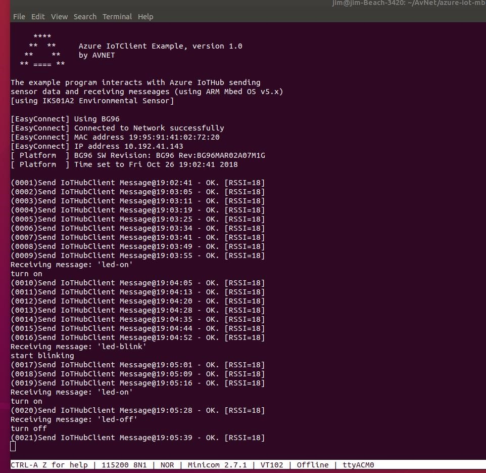
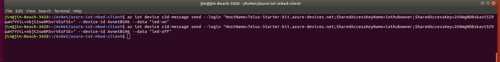
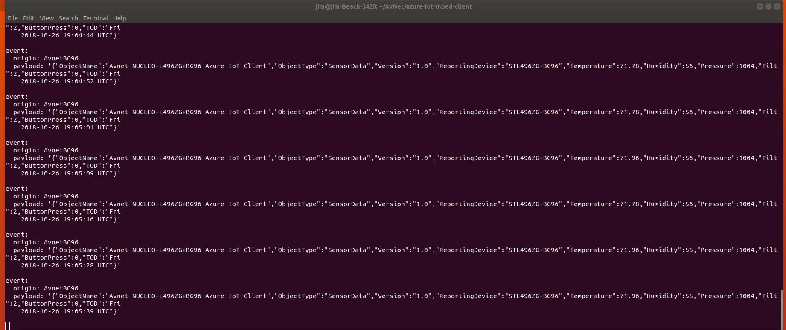
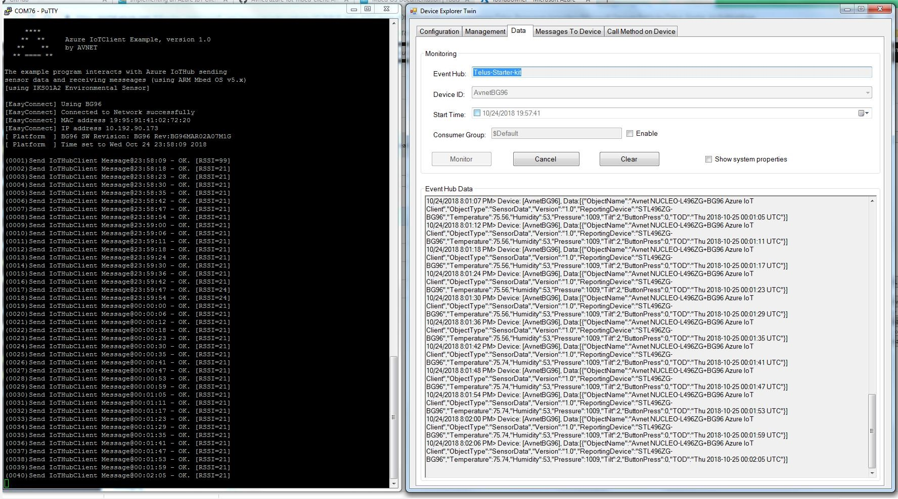
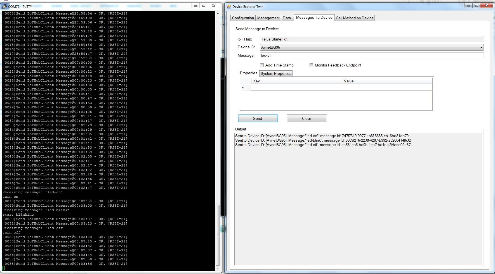

TELUS LTE-M IoT Starter Kit running Mbed OS, v5.9
===
---

# Table of Contents

-   Instructions for using this template
-   TELUS LTE-M IoT Starter Kit
-   Connect the sensors
-   Build and Run the sample
-   Send Device Events to IoT Hub
-   Receive messages from IoT Hub
-   Next steps

# TELUS LTE-M IoT Starter Kit

The TELUS LTE-M IoT Starter Kit includes:

-   TELUS LTE-M IoT Starter Kit device.
-   Kit URL: <http://cloudconnectkits.org/product/telus-iot-starter-kit>
-   Avnet Quectel BG96 LTE Modem Shield
-   X-NUCLEO-IKS01A2 Sensor Board
-   NUCLEO-L496ZG Microcontroller Board
-   LTE Wideband Flex Antenna with SMA connector
-   GPS Flex Antenna with SMA connector
-   MicroUSB Cable (system power/programming/debug)
-   Telus Cellular Network Starter SIM
    (150 MB data, 150 SMS messages, valid for 6 months)

 

**Board Stack Up**

When all boards are assembled, the stack up resembles:

 

**Insert SIM Card**

To insert a SIM card, slide the metal retaining clip in direction of the PWR KEY Push-button switch, then lift this up and inserting the SIM with notched corner facing outwards as shown below. Lock the SIM into place by pressing on the SIM holder and sliding the metal retaining clip back in the other direction.

 

**Connect the LTE and GPS Antennas**

Attach the LTE antenna to the SMA connector next to the USB connector on the BG96 board.
Attach the GPS antenna to the SMA connector next to the PWRKEY switch on the BG96 board.
Tighten by finger both of the SMA retaining nuts

**Connect the USB Cable**

Apply power by connecting the provided microUSB cable from NUCLEO-L476 board, to the Computer.

The USB ST-Link and UART interfaces should enumerate.

# Build and Run the sample

### Required Software Environment

To build the Azure sample program, you must use the Mbed Command Line Interface (CLI). You also need to have the GIT revision control system and the GNU ARM tool chain installed. The URLs for these tools are:

-   GIT, installed from <https://gist.github.com/derhuerst/1b15ff4652a867391f03>

-   mbed-cli, installed from: <https://github.com/ARMmbed/mbed-cli>

-   The latest GNU ARM Embedded Tool chain, installed from: <https://developer.arm.com/open-source/gnu-toolchain/gnu-rm/downloads>

After all tools are installed on your development machine, continue downloading the example program, building it, and load/execute.

### Example Program Source Code

Source code is available on github.com. Import this code using the mbed-cli by issuing the command:

-   mbed import <https://github.com/Avnet/azure-iot-mbed-client>

### [Build Options](https://github.com/Avnet/azure-iot-mbed-client)

Once the code has been downloaded, from within the- iot`azure-mbed-client` directory, you must mo the following files to successfully use the example program.

1.	Set the **connectionString** that is located in **AvnetBG96\_azure\_client.cpp** (on/around source line 66). This variable should be set to the Connection string that you created when registering your IoTHub/device.

2.	If necessary for your cellular provider, change the APN. The default APN used is **m2m-west.telus.iot**. You can modify DEFAULT_APN by editing the macro in **mbed_app.json**, e.g.

        "macros": [
        "DEFAULT_APN=\"m2m.com.attz\""
        ],

After these changes, you build the executable image by issuing the command:

        mbed compile -t GCC_ARM -m NUCLEO_L496ZG --profile toolchain_debug.json

The results of the compile/link is similar to the following (note: the errors are known and cause no issue, a log of the compile/link is attached separately):

 

The executable image is at: **./BUILD/NUCLEO_L496ZG/GCC_ARM/azure-iot-mbed-client.bin**
 

Copy the executable image to the NUCLEO-L496ZG board that is attached to your PC. After the image finishes copying, the board will reset and execution will begin.

## Interacting with Azure/IoT Hub

You can monitor or send messages to your device using either Device Explorer or the Azure CLI. Output from both are provided. There is no sequence number in the message, instead, a time of day (TOD) stamp is put into the message and also displayed on the console. Using te TOD, you can verify that the message from the device was received by Azure IoT Hub.

### Interactions between IoT Hub and the Device using Azure CLI

Console Output:

 

The Device Console window shows the device sending messages to Azure and towards the bottom, receiving messages from Azure. The messages from Azure result in the RED LED either coming on, blinking, or going off on the NUCELO-L496ZG board.

Commands sent to the Device:

 

The Azure CLI displays messages that the device sends to it:

 

# Send Device Events to IoT Hub and Display using DeviceExplorer

Commands sent from the Device to Azure IoT Hub:

 

Commands sent to the Device from Azure IoT Hub:

 

# Next steps

You have now learned how to run a sample application that collects sensor data and sends it to your IoT hub. To explore how to store, analyze and visualize the data from this application in Azure using a variety of different services, please click on the following lessons:

-   [Manage cloud device messaging with iothub-explorer](https://docs.microsoft.com/en-us/azure/iot-hub/iot-hub-explorer-cloud-device-messaging)
-   [Save IoT Hub messages to Azure data storage](https://docs.microsoft.com/en-us/azure/iot-hub/iot-hub-store-data-in-azure-table-storage)
-   [Use Power BI to visualize real-time sensor data from Azure IoT Hub](https://docs.microsoft.com/en-us/azure/iot-hub/iot-hub-live-data-visualization-in-power-bi)
-   [Use Azure Web Apps to visualize real-time sensor data from Azure IoT Hub](https://docs.microsoft.com/en-us/azure/iot-hub/iot-hub-live-data-visualization-in-web-apps)
-   [Weather forecast using the sensor data from your IoT hub in Azure Machine Learning](https://docs.microsoft.com/en-us/azure/iot-hub/iot-hub-weather-forecast-machine-learning)
-   [Remote monitoring and notifications with ​​Logic ​​Apps](https://docs.microsoft.com/en-us/azure/iot-hub/iot-hub-monitoring-notifications-with-azure-logic-apps)
-   [Device management with iothub-explorer](https://docs.microsoft.com/en-us/azure/iot-hub/iot-hub-device-management-iothub-explorer)
