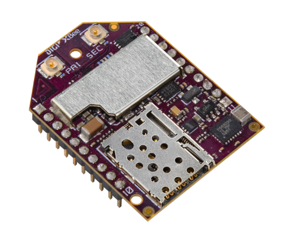

Run a simple Micropython sample on an XBee 3 Cellular device
===
---

# Table of Contents

-   [Introduction](#Introduction)
-   [Step 1: Prerequisites](#Prerequisites)
-   [Step 2: Prepare your Device](#PrepareDevice)
-   [Step 3: Build and Run the Sample](#Build)
-   [Next Steps](#NextSteps)

# Introduction

**About this document**

This document describes how to connect an XBee3 Cellular device with Azure IoT SDK. This multi-step process includes:
-   Configuring Azure IoT Hub.
-   Registering your IoT device.
-   Configuring your IoT device.
-	Run the micropython sample.

**About the XBee 3 Cellular**

The XBee3 Cellular device is a micropython enabled device that allows connection to Azure.

-   XBee3 Cellular's picture

# Step 1: Prerequisites

Before executing any of the steps below, read through each process, step by step
to ensure end-to-end understanding.

You should have the following items ready before beginning the process:

-   [An XBee 3 Cellular device][xbee3-location]

-   [PyCharm][pycharm-location]

-   [Digi XBee MicroPython PyCharm Plugin][setup-python-plugin]

# Step 2: Prepare your Device

-   Configure Azure IoT Hub and Register your device.
This will allow you to get the IoT Hub Connection String which will be needed later.

-   Run [PyCharm][pycharm-location].

-   Install the [Digi XBee MicroPython PyCharm Plugin][setup-python-plugin].

-   Select "Import XBee MicroPython Sample Project".

-   Select your XBee 3 device from the list.

-   Select the "Cellular -> Microsoft Azure" Micropython sample.

-   The project's main.py file should be displayed in PyCharm.
Search for the string "IoTHubConnectionString".

-   Look for the following line: IoTHubConnectionString = "FILL_ME_IN"

-   Replace the above placeholder with device connection string you obtained in the first step, and save the changes.

# Step 3: Build SDK and Run the sample

-   In Pycharm, select "Run".  It will attempt to discover the XBee 3 device connected to your system.
If it cannot find it, select the gear button and ensure that the proper COM port, serial port, etc are
selected.

-   Once found, the Digi XBee Micropython PyCharm Plugin uploads
the needed files to XBee 3 Cellular device, and then runs the sample.

# Next Steps

You have now learned how to run a sample application that collects data and sends it to your IoT hub. To explore how to store, analyze and visualize the data from this application in Azure using a variety of different services, please click on the following lessons:

-   [Manage cloud device messaging with iothub-explorer]
-   [Save IoT Hub messages to Azure data storage]
-   [Use Power BI to visualize real-time sensor data from Azure IoT Hub]
-   [Use Azure Web Apps to visualize real-time sensor data from Azure IoT Hub]
-   [Weather forecast using the sensor data from your IoT hub in Azure Machine Learning]
-   [Remote monitoring and notifications with Logic Apps]   

[Manage cloud device messaging with iothub-explorer]: https://docs.microsoft.com/en-us/azure/iot-hub/iot-hub-explorer-cloud-device-messaging
[Save IoT Hub messages to Azure data storage]: https://docs.microsoft.com/en-us/azure/iot-hub/iot-hub-store-data-in-azure-table-storage
[Use Power BI to visualize real-time sensor data from Azure IoT Hub]: https://docs.microsoft.com/en-us/azure/iot-hub/iot-hub-live-data-visualization-in-power-bi
[Use Azure Web Apps to visualize real-time sensor data from Azure IoT Hub]: https://docs.microsoft.com/en-us/azure/iot-hub/iot-hub-live-data-visualization-in-web-apps
[Weather forecast using the sensor data from your IoT hub in Azure Machine Learning]: https://docs.microsoft.com/en-us/azure/iot-hub/iot-hub-weather-forecast-machine-learning
[Remote monitoring and notifications with Logic Apps]: https://docs.microsoft.com/en-us/azure/iot-hub/iot-hub-monitoring-notifications-with-azure-logic-apps
[xbee3-location]: https://www.digi.com/products/embedded-systems/digi-xbee/cellular-modems
[pycharm-location]: https://www.jetbrains.com/pycharm/download
[setup-python-plugin]: https://www.digi.com/products/embedded-systems/digi-xbee/digi-xbee-tools/digi-xbee-pycharm-ide-plug-in

