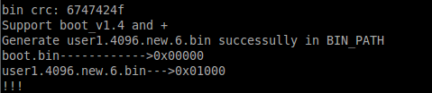
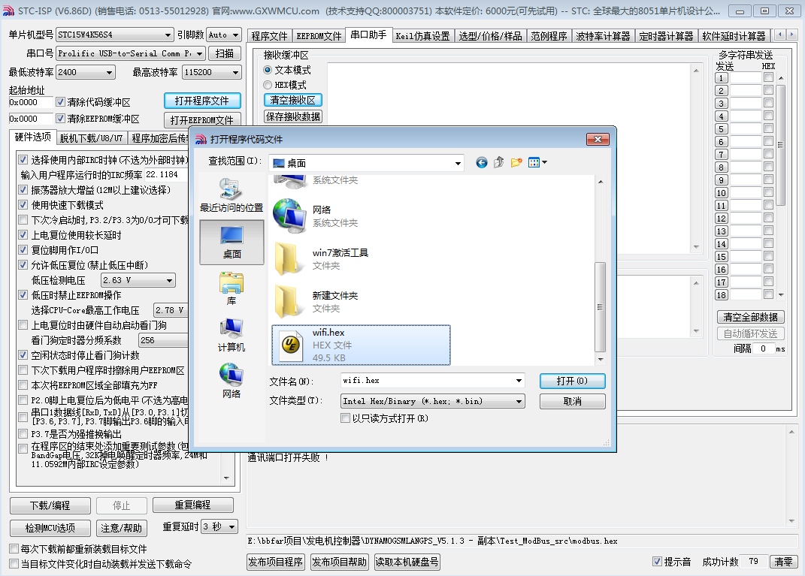
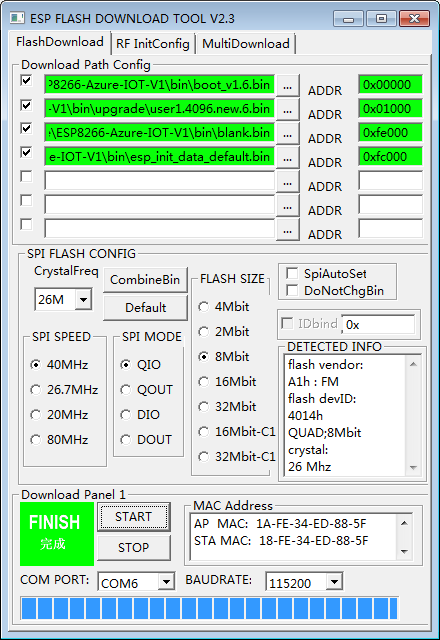
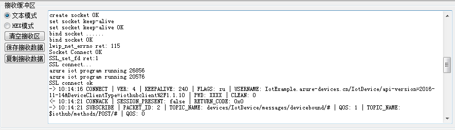
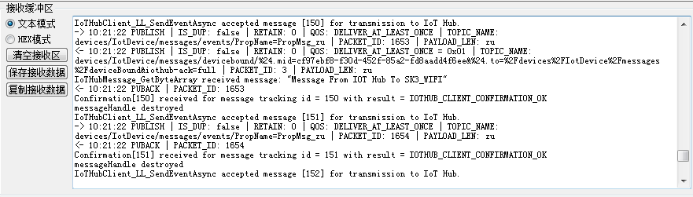

Run a simple C sample on External transport DTU device running No OS
===
---

# Table of Contents

-   [Introduction](#Introduction)
-   [Step 1: Prerequisites](#Prerequisites)
-   [Step 2: Prepare your Device](#PrepareDevice)
-   [Step 3: Build and Run the Sample](#Build)
-   [Next Steps](#NextSteps)

# Introduction

**About this document**

This document describes how to connect External transport DTU device with Azure IoT SDK. This multi-step process includes:

-   Configuring Azure IoT Hub
-   Registering your IoT device
-   Build and deploy Azure IoT SDK on device

# Step 1: Prerequisites

You should have the following items ready before beginning the process:

-   Windows 7 environment
-   Oracle VM Ubuntu environment
-   [Setup your IoT hub][lnk-setup-iot-hub]
-   [Provision your device and get its credentials][lnk-manage-iot-hub]
-   External transport DTU device for running the demo.

# Step 2: Prepare your Device

-   Get Build Environment ready.
-   Follow this [guide](https://espressif.com/en/support/explore/get-started/esp8266/getting-started-guide)
    -   Under section 3.3. ESP8266 Toolkit, download VirtualBox and the lubuntu image.
-   Make sure to share a local folder with the VM
-   Get [esptool.py](https://github.com/espressif/esptool) on your host machine

        git clone https://github.com/meijjun/WIFI_DTU.git

-   For External transport DTU device Develop and Compile environment, refer <http://www.bbfar.com/bbs/forum.php?mod=forumdisplay&fid=182>
-   Connect the device to internet.
-   On host PC, run ***adb shell*** and execute following commands:

        ./adb devices
        ./adb shell

-  	Turn on Wifi and configure to connect to internet (commands to configure wifi to connect to internet automatically...)

# Step 3: Build and Run the sample

## 3.1 Modify and Build the Samples

-   Update the following files within this solution:

    #### /examples/project\_template/user/user\_main.c

    Update these values with your own wifi ssid and password for ESP8266 to connect

        uint8 ssid[] = uint8 password[] =

    #### /examples/project\_template/gen\_misc4.sh

    Update these variables to the path of the shared folder on the VM

        export SDK_PATH=~/ESP8266-Azure-IOT export BIN_PATH=~/ESP8266-Azure-IOT/bin

    #### /examples/project\_template/user/iothub\_client\_sample\_mqtt.c

    Update the connectionString variable to the device-specific connection string you got earlier from the Setup Azure IoT step.

        static const char* connectionString = '[azure connection string]'

    The azure connection string contains Hostname, DeviceId, and SharedAccessKey in the format:

        "HostName=<host_name>;DeviceId=<device_id>;SharedAccessKey=<device_key>"

-   Now you are ready to compile From the VM. Run the following command from a terminal:

        ./gen_misc4.sh

-   Once compilation is completed successfully, you should see something that looks like the following:

    

## 3.2 Run and Validate the Samples

In this section you will run the Azure IoT client SDK samples to validate communication between your device and Azure IoT Hub. You will send messages to the Azure IoT Hub service and validate that IoT Hub has successfully receive the data. You will also monitor any messages sent from the Azure IoT Hub to client.

### 3.2.1 Use FLASH\_DOWNLOAD\_TOOLS tools to upgrade WIFI firmware:

-   Download [wifi.hex](https://github.com/meijjun/SK3_WIFI/blob/master/wifi.hex) into External transport DTU device.
-   Upgrade WIFI firmware

    

    

    

    

### 3.2.2 Send Device Events to IoT Hub

-   See [Manage IoT Hub]([lnk-manage-iot-hub]) to learn how to observe the messages IoT Hub receives from the application.
-   Power on External transport DTU device, will connect IOT Hub automatically, and send data to IOT Hub. In serial log will display corresponding information.

    

-   check the message is right. If not, then you may have incorrectly copied the device hub connection information.

### 3.2.3 Receive messages from IoT Hub
-   See [Manage IoT Hub]([lnk-manage-iot-hub]) to learn how to observe the messages IoT Hub receives from the application.
-   In External transport DTU device log, you can see the received data.

    

# Next Steps

You have now learned how to run a sample application that collects sensor data and sends it to your IoT hub. To explore how to store, analyze and visualize the data from this application in Azure using a variety of different services, please click on the following lessons:

-   [Manage cloud device messaging with iothub-explorer]
-   [Save IoT Hub messages to Azure data storage]
-   [Use Power BI to visualize real-time sensor data from Azure IoT Hub]
-   [Use Azure Web Apps to visualize real-time sensor data from Azure IoT Hub]
-   [Weather forecast using the sensor data from your IoT hub in Azure Machine Learning]
-   [Remote monitoring and notifications with Logic Apps]   

[Manage cloud device messaging with iothub-explorer]: https://docs.microsoft.com/en-us/azure/iot-hub/iot-hub-explorer-cloud-device-messaging
[Save IoT Hub messages to Azure data storage]: https://docs.microsoft.com/en-us/azure/iot-hub/iot-hub-store-data-in-azure-table-storage
[Use Power BI to visualize real-time sensor data from Azure IoT Hub]: https://docs.microsoft.com/en-us/azure/iot-hub/iot-hub-live-data-visualization-in-power-bi
[Use Azure Web Apps to visualize real-time sensor data from Azure IoT Hub]: https://docs.microsoft.com/en-us/azure/iot-hub/iot-hub-live-data-visualization-in-web-apps
[Weather forecast using the sensor data from your IoT hub in Azure Machine Learning]: https://docs.microsoft.com/en-us/azure/iot-hub/iot-hub-weather-forecast-machine-learning
[Remote monitoring and notifications with Logic Apps]: https://docs.microsoft.com/en-us/azure/iot-hub/iot-hub-monitoring-notifications-with-azure-logic-apps
[lnk-setup-iot-hub]: ../setup_iothub.md
[lnk-manage-iot-hub]: ../manage_iot_hub.md
