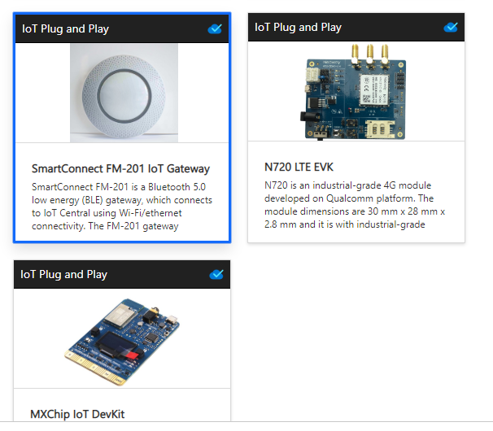
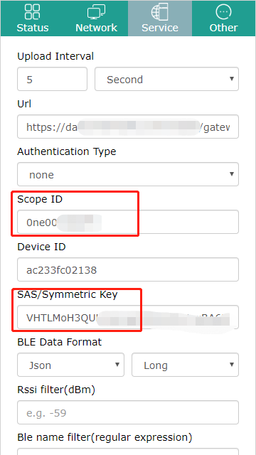
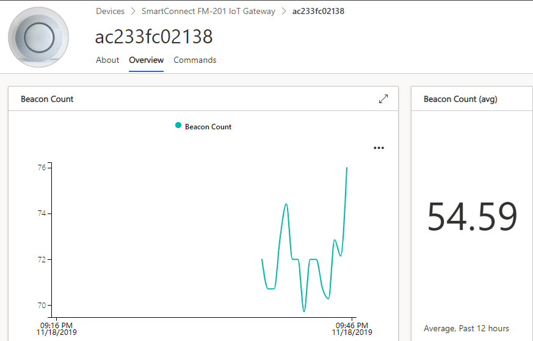

# Implement Azure IoT PnP on SmartConnect FM-201 IoT Gateway based on Azure IoT C public preview SDK.

In this tutorial, you will learn how to use the G1 gateway to send data to Azure IoT Central with Azure IoT plug and play.

## Features implemented

-   Azure IoT Plug and Play.
-   Register device by IoT Hub Device Provisioning Service base on SAS Key.
-   Telemetry data sent for Beacon Count/Location.
-   All parameters of the Service tab can be configured as Properties.
-   Cloud to device command(Support upgrading firmware, reboot the gateway,etc).

## What you need

-   SmartConnect FM-201 IoT Gateway
-   An active Azure subscription. If you do not have one, you can register via one of these two methods:
    -   Activate a [free 30-day trial Microsoft Azure account](https://azure.microsoft.com/free/).
    -   Claim your [Azure credit](https://azure.microsoft.com/pricing/member-offers/msdn-benefits-details/) if you are MSDN or Visual Studio subscriber.

## Create Azure IoT Central application

1.  Use your Azure account log into [Azure IoT Central](https://apps.azureiotcentral.com).
2.  Create a **free preview application**.

    

3.  Select **Device templates** and then click **+ New** to create device template.

    

4.  Choose the pre-certified device (SmartConnect FM-201 IoT Gateway) to create Device template.

    

5.  Select **Administration** and then click **Device connection**, make a note of **ID Scope**.

     

6.  Click **View Keys**， and make a note of **Primary Key**.

     Get 

## Configure Service

1.  Access to the configuration page of gateway, and then click **Service** tab. Configure **Scope ID** with **ID Scope**,  **SAS/Symmetric Key** with **Primary Key**. Don't forget to click **Apply** to save configuration.

     

2.  [Instructions for using G1-B Gateway](https://github.com/Azure/azure-iot-device-ecosystem/blob/master/get_started/linux-pnp-smartconnect-fm-201-iot-gateway-c.md)

## View the device in Portal of Azure IoT Central

  1.  In your IoT Central application, go to the **Devices** page and select the device you configured in previous step. The device will be automatically registered when the device boots up.

      

    After a couple of minutes, this page will show the telemetry data.

  2.  Select the **About** page to see the property values the device sent. Refer  to [Properties](#Properties).
  3.  Select the **Commands** page to call commands on the device. Refer to [commands](#Commands).

      

### Properties

| Key             | Value                                  | Remark                                                       |
| --------------- | ------------------------------------------------- | ------------------------------------------------------------ |
| hUrl            | Url of Http server                                | The value of Url begins with http:// or https://.  G1 gateway uses the HTTP's POST method to upload the data to the HTTP server.http://iot.beaconyun.com:8080/gw/${gatewayMac}/status |
| auth            | HTTP authentication type                          | Optional value:none,basic Default value is none          |
| httpUser        | username of HTTP basic authentication             | username of HTTP basic authentication                        |
| httpPass        | Password of HTTP basic authentication             | Password of HTTP basic authentication                        |
| scopeId         | Scope ID                                          | scopeId of azure iot central                                 |
| deviceId        | Device ID                                         | deviceId of azure iot central                                |
| sasKey          | SAS/Symmetric Key                                 | sasKey of azure iot central                                  |
| uploadInterval  | Upload Interval                                   | Timing upload interval,value in milliseconds                 |
| isJsonFormat    | Json or Binary                                    | Optional Value:Json,Binary Default value is Json         |
| isLongFormat    | Long or Short                                     | Optional Value:Long,Short  Default value is Long         |
| isUploadUnkown  | YES/NO                                            | Whether to upload data of the Unknown type                   |
| isUploadIBeacon | YES/NO                                            | Whether to upload data of the iBeacon type                   |
| isUploadS1      | YES/NO                                            | Whether to upload data of the S1 type                        |
| isUploadGateway | YES/NO                                            | Whether to upload data of the Gateway type                   |
| isFilterDupData | YES/NO                                            | Duplicate data within the time interval be fileter to upload or not |
| rssi            | Filtering by rssi value                           | Only upload the rssi data that the signal intensity is greater than that, unit is dBm.  When not filled, it is not filtered, and the value of -100 < RSSI <0 can be filled |
| regex           | filtering ble name through regular expression | Ble name’s regular expression Example: 1.Just want to receive the BLE name which start with MiniBeacon,the regular expression can be ^MiniBeacon.\* 2.Just wan to receive the BLE name which start with MiniBeacon or start with HelloBeacon ,the regular expression can be ^MiniBeacon.\*\\\|^HelloBeacon.\* |
| macReg          | filtering ble mac through regular expression      | The regular expression of BLE mac address you wanna recevice. Example: 1.Just want to receive the BLE mac  which start with AC233FC,the regular expression can be ^AC233FC.* 2.Just wan to receive the BLE mac which start with AC233FC or start with D678,the regular expression can be ^AC233FC.\*\\\|^D678.\* |
| rawReg          | filtering raw data through regular expression     | The regular expression of Raw Data you wanna recevice. Example: 1.Just want to receive the Raw Data  which start with 020106,the regular expression can be ^020106.* 2.Just wan to receive the Raw Data which start with 020106 or start with 1EEF ,the regular expression can be ^020106.\*\\\|^1EEF.\* |
| isLongBright | YES/NO                        | Enable leds long brighly?                          |
| disableLED   | YES/NO                        | Disable leds permanently?                          |
| isActive   | YES/NO                        | Enable Active Scanning             |
| scanInterval      | 100~5000                  | in milliseconds uints                                        |
| scanWindow     | 100~5000    | in milliseconds uints                                         |
| interfaceId  | string  | interface ID  |
| interfaceName  | string | interface Name |
| modelId      | string     | capability model id  |

### Commands

#### Firmware Upgrade

This command is used to  upgrade the gateway’s firmware to the specified version.

There are two ways to upgrade: ***public*** type (the upgrade firmware downloaded from our company's HTTP server,which is equivalent to the *OTA Upgrade* on the Web configuration page), and ***self*** type (the upgrade firmware downloaded from the custom HTTP server, which is equivalent to the *LAN Upgrade* on the Web configuration page).

The message data field is described in detail as follows:

| Field    | Name                                  | Required                                 | Value                                                        |
| -------- | ------------------------------------- | ---------------------------------------- | ------------------------------------------------------------ |
| type     | Upgrade type                          | NO                                       | Optional value: ***public***,***self*** Default value is ***public*** |
| isSave   | Whether to save the configuration     | NO                                       | Optional value: YES,NO Default value is NO               |
| version  | Target firmware version               | NO(Required if the type is ***public***) | Upgrade to the specified version.                            |
| urlpath  | URL path of HFS                       | NO(Required if the type is ***self***)   | the URL path of the HTTP server where the firmware is located at . The gateway will download the firmware from {urlpath}/{filename}. |
| filename | Firmware file name in URL Path of HFS | NO(Required if the type is ***self***)   | The gateway will download the firmware from {urlpath}/{filename}. |
