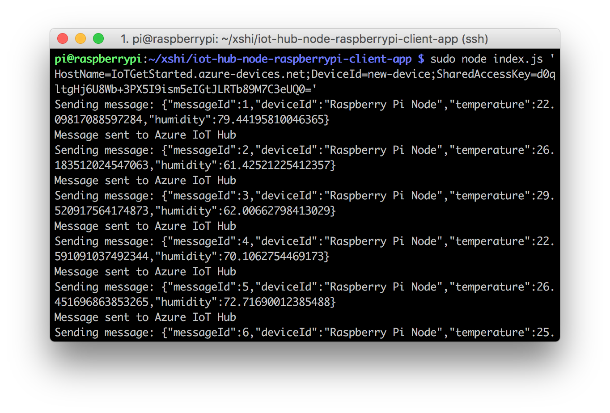

Run a simple Node sample on Raspberry PI2/PI3 device running Raspbian
===
---

# Table of Contents

-   [Introduction](#Introduction)
-   [Step 1: Prerequisites](#Prerequisites)
-   [Step 2: Prepare your Device](#PrepareDevice)
-   [Step 3: Build and Run the Sample](#Build)
-   [Supported Kits](#SupportedKits)
    -    [1. Raspberry Pi to Cloud kit](#Kit01)
        -    [Connect the sensors](#Kit01-ConnectSensors)
        -    [Build and Run the sample](#Kit01-BuildRunSample)
        -    [Send Device Events to IoT Hub](#Kit01-SendMessage)
        -    [Receive messages from IoT Hub](#Kit01-ReceiveMessage)
        -    [Next steps](#Kit01-NextSteps)
   

<a name="Introduction"></a>
# Introduction

**About this document**

This document describes how to build and run the **simple_sample_http.js** Node.js sample application. This multi-step process includes:
-   Configuring Azure IoT Hub
-   Registering your IoT device
-   Build and deploy Azure IoT SDK on device

<a name="Prerequisites"></a>
# Step 1: Prerequisites

You should have the following items ready before beginning the process:
-   Computer with Git client installed and access to the
    [azure-iot-sdks](https://github.com/Azure/azure-iot-sdks) GitHub public repository.
-   [Prepare your development environment](node-devbox-setup.md).
-   [Setup your IoT hub][lnk-setup-iot-hub]
-   [Provision your device and get its credentials][lnk-manage-iot-hub]

<a name="PrepareDevice"></a>
# Step 2: Prepare your Device

-   Make sure desktop is ready as per instructions given on [Prepare your development environment][lnk-setup-devbox].

<a name="Build"></a>
# Step 3: Build and Run the sample

-   Get the following sample files from https://github.com/Azure/azure-iot-sdk-node/tree/master/device/samples
    -   **package.json**
    -   **simple_sample_device.js**

-   Place the files in the folder of your choice on the target machine/device

-   Open the file **simple_sample_device.js** in a text editor.

-   Locate the following code in the file:

    ```
    var connectionString = '[IoT Device Connection String]';
    ```

-   Replace `[IoT Device Connection String]` with the connection string for your device. Save the changes.

-   From the shell or command prompt you used earlier to run the **iothub-explorer** utility, use the following command to receive device-to-cloud messages from the sample application (replace <device-id> with the ID you assigned your device earlier):

    ```
    node iothub-explorer.js monitor-events <device-id> --login "<iothub-connection-string>" 
    ```

-   Open a new shell or Node.js command prompt and navigate to the folder where you placed the sample files. Run the sample application using the following commands:

    ```
    npm install
    node simple_sample_device.js
    ```

-   The sample application will send messages to your IoT hub, and the **iothub-explorer** utility will display the messages as your IoT hub receives them.

## Experimenting with various transport protocols
The same sample can be used to test AMQP, AMQP over Websockets, HTTP and MQTT. In order to change the transport, uncomment whichever you want to evaluate in the `require` calls on top of the sample code and pass it to the call to Client.fromConnectionString() when creating the client.

## Debugging the samples (and/or your code)
[Visual Studio Code](https://code.visualstudio.com/) provides an excellent environment to write and debug Node.js code:
-   [Debugging with Visual Studio Code](./node-debug-vscode.md)

<a name="SupportedKits"></a>
# Supported Kits

<a name="Kit01"></a>
## 1. Raspberry Pi to Cloud kit

The Raspberry Pi to Cloud kit includes:

-   Raspberry Pi 2 and Raspberry Pi 3 devices.

# What you need


-   The Raspberry Pi 2 or Raspberry Pi 3 board.
-   An active Azure subscription. If you don't have an Azure account, [create a free Azure trial account](https://azure.microsoft.com/free/) in just a few minutes.
-   A monitor, a USB keyboard, and mouse that connect to Pi.
-   A Mac or a PC that is running Windows or Linux.
-   An Internet connection.
-   A 16 GB or above microSD card.
-   A USB-SD adapter or microSD card to burn the operating system image onto the microSD card.
-   A 5-volt 2-amp power supply with the 6-foot micro USB cable.

The following items are optional:

-   An assembled Adafruit BME280 temperature, pressure, and humidity sensor.
-   A breadboard.
-   6 F/M jumper wires.
-   A diffused 10-mm LED.

<a name="Kit01-ConnectSensors"></a>
## Connect the sensors

Use the breadboard and jumper wires to connect an LED and a BME280 to Pi as follows. If you don’t have the sensor, skip this section.

1.  **Fritzing diagram**

    

2.  **Wiring matrix**

    For sensor pins, use the following wiring:

    | Start (Sensor & LED)     | End (Board)            | Cable Color   |
    | -----------------------  | ---------------------- | ------------: |
    | VDD (Pin 5G)             | 3.3V PWR (Pin 1)       | White cable   |
    | GND (Pin 7G)             | GND (Pin 6)            | Brown cable   |
    | SCK (Pin 8G)             | I2C1 SDA (Pin 3)       | Orange cable  |
    | SDI (Pin 10G)            | I2C1 SCL (Pin 5)       | Red cable     |
    | LED VDD (Pin 18F)        | GPIO 24 (Pin 18)       | White cable   |
    | LED GND (Pin 17F)        | GND (Pin 20)           | Black cable   |

    Click to view [Raspberry Pi 2 & 3 Pin mappings](https://developer.microsoft.com/windows/iot/docs/pinmappingsrpi) for your reference.

3.  **Picture**

    After you've successfully connected BME280 to your Raspberry Pi, it should be like below image.

    

<a name="Kit01-BuildRunSample"></a>
## Build and Run the sample

### Clone sample application and install the prerequisite packages

1.  Use one of the following SSH clients from your host computer to connect to your Raspberry Pi.
    - [PuTTY](http://www.putty.org/) for Windows.
    - The built-in SSH client on Ubuntu or macOS.

2.  Clone the sample application by running the following command:

        git clone https//github.com/Azure-samples/iot-hub-node-raspberry-pi-clientapp

3.  Install all packages by the following command. It includes Azure IoT device SDK, BME280 Sensor library and Wiring Pi library.

        cd iot-hub-node-raspberry-pi-clientapp
        npm install

    > [!NOTE] 
    It might take several minutes to finish this installation process depending on your network connection.

### Configure the sample application

1.  Open the config file by running the following commands:

        nano config.json

    

    There are two items in this file you can configure. The first one is `interval`, which defines the time interval between two messages that send to cloud. The second one `simulatedData`,which is a Boolean value for whether to use simulated sensor data or not.

    If you **don't have the sensor**, set the `simulatedData` value to `true` to make the sample application create and use simulated sensor data.

2.  Save and exit by pressing Control-O > Enter > Control-X.

### Run the sample application

1.  Run the sample application by running the following command:

        sudo node index.js '<your Azure IoT hub device connection string>'

    > [!NOTE] 
    Make sure you copy-paste the device connection string into the single quotes.

    You should see the following output that shows the sensor data and the messages that are sent to your IoT hub.

    

<a name="Kit01-SendMessage"></a>
## Send Device Events to IoT Hub

-   See [Manage IoT Hub][lnk-manage-iot-hub] to learn how to observe the messages IoT Hub receives from the application.

<a name="Kit01-ReceiveMessage"></a>
## Receive messages from IoT Hub

-   See [Manage IoT Hub][lnk-manage-iot-hub] to learn how to send cloud-to-device messages to the application.

<a name="Kit01-NextSteps"></a>
## Next steps

-   [Manage message exchanges between your device and IoT Hub using
    iothub-explorer](https://docs.microsoft.com/en-us/azure/iot-hub/iot-hub-explorer-cloud-device-messaging)
-   [Store data in Azure Storage](https://docs.microsoft.com/en-us/azure/iot-hub/iot-hub-store-data-in-azure-table-storage)
-   [Visualize data using PowerBI](https://docs.microsoft.com/en-us/azure/iot-hub/iot-hub-live-data-visualization-in-power-bi)
-   [Visualize data using Web Apps](https://docs.microsoft.com/en-us/azure/iot-hub/iot-hub-live-data-visualization-in-web-apps)
-   Use Machine Learning to predict upcoming data
-   Integrate with Logic Apps to email user about data anomalies


[lnk-setup-iot-hub]: ../setup_iothub.md
[lnk-manage-iot-hub]: ../manage_iot_hub.md
[lnk-setup-devbox]: node-devbox-setup.md
