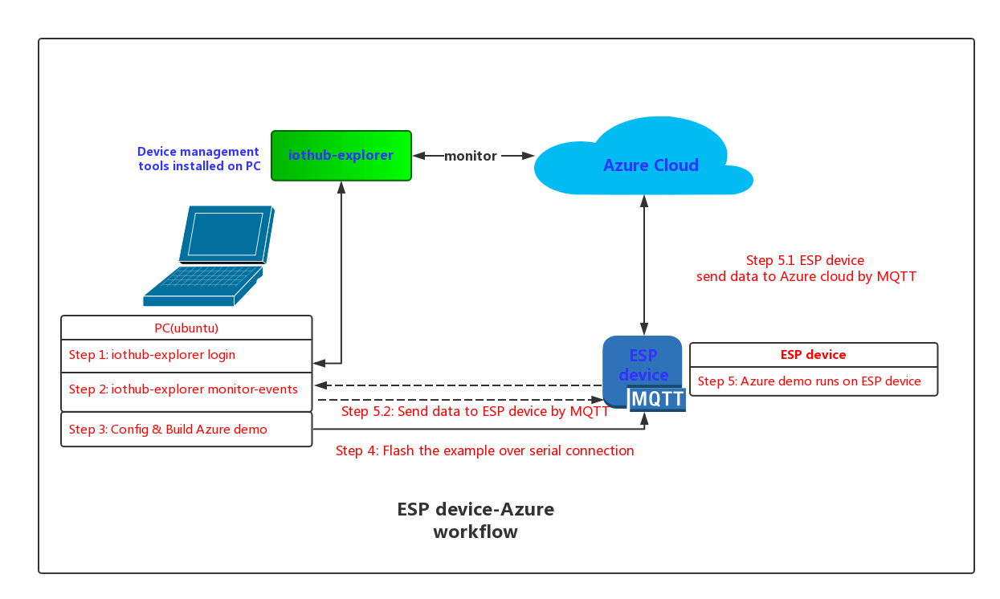

Run a simple C sample on ESP Device Family running RTOS
===
---

### A MQTT Demo that Connect ESP device to Azure Cloud 

# Table of Contents

-   [Introduction](#Introduction)
-   [Step 1: Prerequisites](#prerequisites)
-   [Step 2: Prepare your iothub](#prepare)
-   [Step 3: SDK and Tools Preparation](#tools_prepare)
-   [Step 4: Configuring and building](#config_build)
-   [Step 5: Result shows](#results)
-   [TroubleShoot](#troubleshoot)

# Introduction

Espressif offers a wide range of fully-certified Wi-Fi & BT modules powered by our own advanced SoCs. For more details, click [here](https://www.espressif.com/en/products/hardware/modules)

Azure cloud is one of wonderful cloud that could collect data from lot device or push data to lot device,for more details, click [here](https://www.azure.cn/home/features/iot-hub/)

**Aim:**

This page would guide you connecting your device(ESP device or lot device with ESP devide) to Azure by MQTT protocol, and then send data to Azure,receive message from Azure.Main workflow:

 
 

# Step 1: Prerequisites

-   **Ubuntu environment** for building your demo.
-   **ESP device** for running the demo.  

    Any [ESP device](https://www.espressif.com/en/products/hardware/modules) is okey to run the this demo.
 

# Step 2: Prepare your iothub

Follow the guide [here](https://github.com/ustccw/RepoForShareData/blob/master/Microsoft/AzureData/start_Iothub.docx)

You would get an **iothub login connect string** like that:

    HostName=yourname-ms-lot-hub.azure-devices.cn;SharedAccessKeyName=iothubowner;SharedAccessKey=zMeLQ0JTlZXVcHBVOwRFVmlFtcCz+CtbDpUPBWexbIY=

# Step 3: SDK and Tools Preparation

## 3.1 iothub-explorer install

The iothub-explorer tool enables you to provision, monitor, and delete devices in your IoT hub. It runs on any operating system where Node.js is available.

-   Download and install Node.js from [here](https://nodejs.org/en/)
-   From a command line (Command Prompt on Windows, or Terminal on Mac OS X), execute the following:

        npm install -g iothub-explorer

    if success, you can get version information like:

        shell
        $ node -v
        v6.9.5
        $ iothub-explorer -V
        1.1.6

    **if failed, please click [here](http://thinglabs.io/workshop/esp8266/setup-azure-iot-hub/)**
  
    **after finished:**  

    then you can use your iothub-explorer to manager your iot-device.click [here](https://github.com/ustccw/RepoForShareData/blob/master/Microsoft/AzureData/iothub-explorer)  

    login with:   **iothub login connect string** that got from Step 2

    then you can get one **device connect string** after you create one device like that:

        "HostName=esp-hub.azure-devices.net;DeviceId=yourdevice;SharedAccessKey=L7tvFTjFuVTQHtggEtv3rp+tKEJzQLLpDnO0edVGKCg=";

    keep this **device connect string** in mind.
  
## 3.2 Get SDK
 
To get AZURE-SDK click [here](https://github.com/espressif/esp-azure)    
 
This SDK can implement that connect ESP device to Azure by MQTT protocol.  

-   For ESP32 platform:

    you should get [ESP-IDF](https://github.com/espressif/esp-idf)  
    this SDK can make ESP32-series device work well  

-   For ESP8266 platform:

    you should get [ESP8266-RTOS-SDK](https://github.com/espressif/ESP8266_RTOS_SDK)  
    this SDK can make ESP8266-series device work well  

## 3.3 Get Compiler

Follow the guide: 

-   For ESP32 [platform](https://github.com/espressif/esp-idf/blob/master/README.md)
 
-   For ESP8266 [platform](https://github.com/espressif/ESP8266_RTOS_SDK/blob/master/README.md)
 

# Step 4: Configuring and building

## 4.1 Update Variables

   [esp-azure/main/iothub\_client\_sample\_mqtt.c](https://github.com/espressif/esp-azure/blob/master/main/iothub_client_sample_mqtt.c)

Update the connectionString variable to the device-specific connection string you got earlier from the Setup Azure IoT step:

    static const char* connectionString = '[azure connection string]';

The azure connection string contains **Hostname, DeviceId, and SharedAccessKey** in the format:

    "HostName=<host_name>;DeviceId=<device_id>;SharedAccessKey=<device_key>"

## 4.2 config your WiFi and serial port

    make menuconfig

-   set WiFi SSID and Password under `Example configuration`
-   set serial port under `Serial flasher config`
 
## 4.3 build your demo and flash to ESP device

    $make flash

**If failed,try:**

-   make sure that ESP device had connected to PC by serial port 
-   make sure you flash to correct serial port
-   try type command:

        sudo usermod -a -G dialout $USER
 

# Step 5: Result shows

-   **iothub result show:**  
    login iothub-explorer,and monitor events:

        iothub-explorer monitor-events AirConditionDevice_001 --login 'HostName=youriothub-ms-lot-hub.azure-devices.cn;SharedAccessKeyName=iothubowner;SharedAccessKey=zMeLQ0JTlZXVcHBVOwRFVmlFtcCz+CtbDpUPBWexbIY='

-   **ESP device result show:**

        make monitor

ESP device would send data to azure cloud, you would receive data at iothub.

# TroubleShoot

-   Close some firewall settings
-   Build failed,try:
-   Git submodule init
-   Git submodule update
-   Export your compiler path 
-   Export your IDF path
-   Get start with <https://www.espressif.com/en/support/download/documents>
-   Make sure you had input correct device connect-string which get from Step 3
 