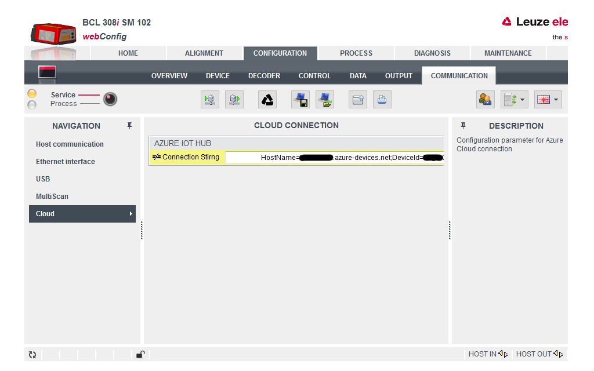
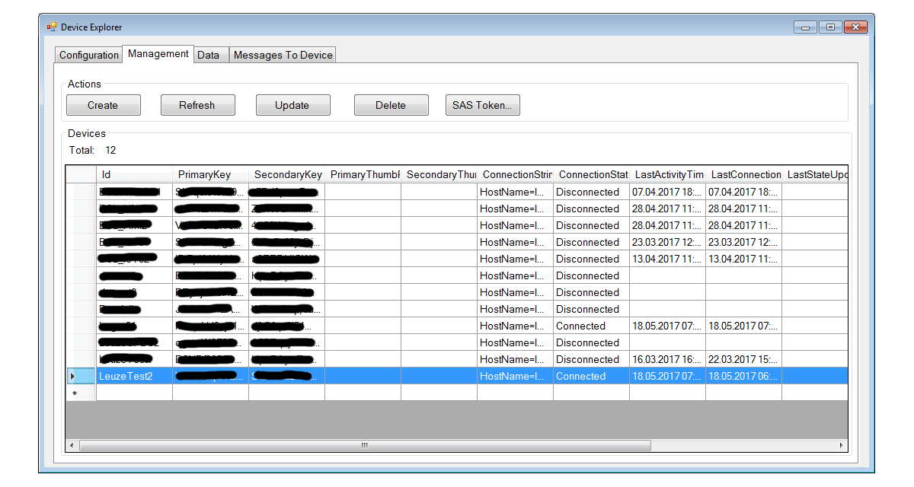
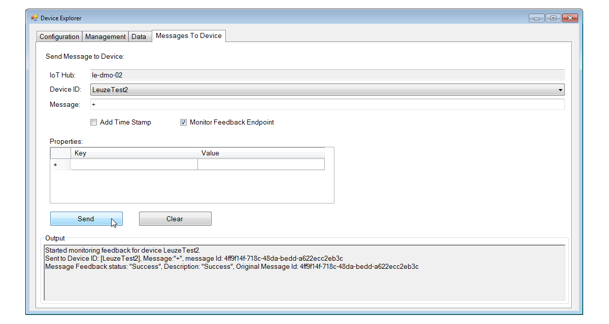

Connect BCL 308i device running IOX real time OS  with Azure IoT SDK to IoT Hub
===
---

# Table of Contents

-   [Introduction](#Introduction)
-   [Step 1: Prerequisites](#Prerequisites)
-   [Step 2: Prepare your Device](#PrepareDevice)
-   [Step 3: Connect your Device to the Cloud](#ConenctToCloud)
-   [Next Steps](#NextSteps)

# Introduction

**About this document**

This document describes how to connect the __Leuze electronic__ stationary industry bar code reader __BCL 308i__ device running IOX real time OS with Azure IoT SDK. This multi-step process includes:
-   Prepare your device for cloud connection
-   Connect your device to Azure IoT Hub

# Step 1: Prerequisites

You should have the following items ready before beginning the process:

-   [Setup your IoT hub][lnk-setup-iot-hub]
-   [Provision your device and get its credentials][lnk-manage-iot-hub]
-   Ensure that the ***Leuze USB driver for BCL 3xx*** has been installed. If not, it can be downloaded from [here](http://www.leuze.com).
-   Connect the __BCL 308i__ with its integrated USB service interface to your PC-side USB interface.
  

# Step 2: Prepare your Device

## Configure BCL 308i for Azure IoT Hub by using the integrated webConfig tool

1. Open the integrated webConfig tool by starting a web browser and navigate to http://192.168.61.100 (the fix IP address of the integrated service interface)

2. After the start screen has finished loading press the operation mode switch below of the device image at the top left corner and ensure that ***Service*** is active:

  

3. Navigate to ***Configuration / Communication / Ethernet interface***.

  

4. Enter suitable IP Address settings according to your network environment (DHCP or fix IP settings) which allow the device to connect to the internet.

5. Enter a suitable DNS server address (e.g. 8.8.8.8 for Google DNS).

6. Enter suitalbe NTP settings (server address or server name e.g. "0.pool.ntp.org").

7. Navigate to ***Configuration / Communication / Cloud***.

  

8. Entere the IoT Hub Connection String four your device.

9. Make the parameter changes persistent by pressing the parameter transfer button (first button from left in the center top tool bar).

  

# Step 3: Connect your Device to the Cloud

1. Connect the __BCL 308i__ with its Ethernet Host Interface to the internet

2. Restart the device

3. Launch the Device Explorer as described in [Provision your device and get its credentials][lnk-manage-iot-hub] and navigate to ***Management*** tab. Check the Connection State of your device in the list.

  

4. Navigate to the ***Data*** tab of the Device Explorer and select your device from the drop-down list of device IDs and click ***Monitor*** button. The Device Explorer is now monitoring data sent from the selected device to the IoT Hub.

  

5. Navigate to to the ***Message To Device*** tab of the Device Explorer and and select your device from the drop-down list of device IDs. Enter a **+** (plus) character into the ***Message*** field and press the ***Send*** Button. The device should activate its laser beam.

  

6. Enter a **-** (minus) character into the ***Message*** field and press the ***Send*** while the laser beam of the device is activated. The device should deactivate its laser beam.

  

## Documentation

The documentation for __BCL 308i__ can be found [here](http://www.leuze.com).

# Next Steps

You have now learned how to run a sample application that collects sensor data and sends it to your IoT hub. To explore how to store, analyze and visualize the data from this application in Azure using a variety of different services, please click on the following lessons:

-   [Manage cloud device messaging with iothub-explorer]
-   [Save IoT Hub messages to Azure data storage]
-   [Use Power BI to visualize real-time sensor data from Azure IoT Hub]
-   [Use Azure Web Apps to visualize real-time sensor data from Azure IoT Hub]
-   [Weather forecast using the sensor data from your IoT hub in Azure Machine Learning]
-   [Remote monitoring and notifications with Logic Apps]   

[Manage cloud device messaging with iothub-explorer]: https://docs.microsoft.com/en-us/azure/iot-hub/iot-hub-explorer-cloud-device-messaging
[Save IoT Hub messages to Azure data storage]: https://docs.microsoft.com/en-us/azure/iot-hub/iot-hub-store-data-in-azure-table-storage
[Use Power BI to visualize real-time sensor data from Azure IoT Hub]: https://docs.microsoft.com/en-us/azure/iot-hub/iot-hub-live-data-visualization-in-power-bi
[Use Azure Web Apps to visualize real-time sensor data from Azure IoT Hub]: https://docs.microsoft.com/en-us/azure/iot-hub/iot-hub-live-data-visualization-in-web-apps
[Weather forecast using the sensor data from your IoT hub in Azure Machine Learning]: https://docs.microsoft.com/en-us/azure/iot-hub/iot-hub-weather-forecast-machine-learning
[Remote monitoring and notifications with Logic Apps]: https://docs.microsoft.com/en-us/azure/iot-hub/iot-hub-monitoring-notifications-with-azure-logic-apps
[setup-devbox-linux]: https://github.com/Azure/azure-iot-sdk-c/blob/master/doc/devbox_setup.md
[lnk-setup-iot-hub]: ../setup_iothub.md
[lnk-manage-iot-hub]: ../manage_iot_hub.md

