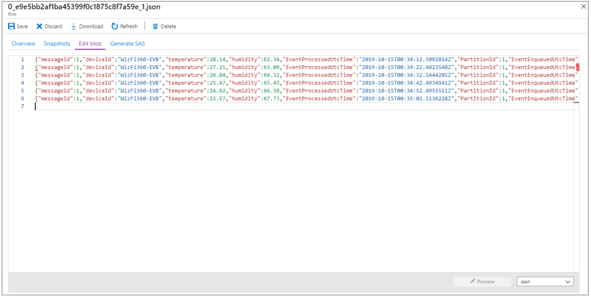

Get Started with Microsoft Azure using WIZnet Wi-Fi module WizFi360
===
---

# Table of Contents

-   [Introduction](#Introduction)
-   [Step 1: Prerequisites](#Prerequisites)
-   [Step 2: Prepare your Device](#PrepareDevice)
-   [Step 3: Connect to Azure Services](#Build)
-   [Next Steps](#NextSteps)

# Introduction

**About this document**

This document describes how to connect WizFi360 device with Microsoft Azure Services. This multi-step process includes:
-   Configuring Azure IoT Hub
-   Registering your IoT device
-   Connect with Azure IoT and transmit data

**About WizFi360**

[WizFi360] is a low cost and low-power consumption industrial-grade WiFi module. It is compatible with IEEE802.11 b/g/n standard and supports SoftAP, Station and SoftAP+Station modes. The serial port baud rate can be up to 2Mbps, which can meet the requirement of various applications.

WizFi360 is available in 2 options - with pattern antenna (WizFi360-PA) and antenna connector (WiZFi360-C).
-   WizFi360 picture

For experiment, test and verification of module functions development board [WizFi360-EVB-Shield] was used.

-   WizFi360-EVB-Shield picture

# Step 1: Prerequisites

You should have the following items ready before beginning the process:
-   Desktop of laptop computer
-   MicroUSB cable
- 	MS Azure Account
-   WizFi360-EVB-Shield
-   Preferred Serial Terminal (TeraTerm, YAT, etc.)

# Step 2: Prepare your Device

First of all, it is necessary to configure Azure environment. 
Please refer to link below and follow quickstart guide till "Run the IoT Simulator" section.
- [Quickstart: Create a Stream Analytics job by using the Azure portal]

< **Note** >: Please write down following data that will be used in WizFi360AT commands:
-   IoT Hub name
-   IoT device ID
-   IoT device primary key

Now it is possible to connect to Azure services.

# Step 3: Connect to Azure services

To connect to Azure services it is needed to set up network connection first.

Please run following AT commands:

1.  Set Wifi station mode

| Command | Response |
|:--------|:--------|
| AT+CWMODE_CUR=1 // station mode | OK |

2.  Set DHCP Enable

| Command | Response |
|:--------|:--------|
| AT+CWDHCP_CUR=1,1 // DHCP enable on Station mode | OK |

3.  Get possible Wi-Fi AP List for connection

| Command | Response |
|:--------|:--------|
| AT+CWLAP  | +CWLAP : (3,"ssid",-57,"mac address",1,1) // encryption method, ssid, rssi, mac address, channel, wps |

4.  Connect to Wi-Fi AP

| Command | Response |
|:--------|:--------|
| AT+CWJAP_CUR="ssid","password"  | WIFI CONNECTED   WIFI GOT IP |

5.  Query WizFi360 device' IP address

| Command | Response |
|:--------|:--------|
| AT+CIPSTA_CUR?  | +CIPSTA_CUR:ip:”192.168.10.13”   +CIPSTA_CUR:gateway:”192.168.10.1”   +CIPSTA_CUR:network:”255.255.255.0” |

Then run following AT commands to connect to Azure services.

1.  Set Azure connection

| Command | Response |
|:--------|:--------|
| AT+AZSET="iothub_name","device_id","device_key" | OK |

2. Set MQTT Topic

| Command | Response |
|:--------|:--------|
| AT+MQTTTOPIC="/devices/{device_id}/messages/events/","/devices/{device_id}/messages/devicebound/#"  Example  AT+MQTTTOPIC="/devices/testDevice/messages/events/","/devices/testDevice/messages/devicebound/#"| OK |

> Note: 
> MQTT Topic follows the rules defined in Azure IoT Hub. 
> Refer to reference: [Communicate with your IoT hub using the MQTT protocol: Using the MQTT protocol directly (as a device)]

3. Connect to Azure

| Command | Response |
|:--------|:--------|
| AT+AZCON | OK |

4. Publish data

| Command | Response |
|:--------|:--------|
| AT+MQTTPUB="{"deviceId":"WizFi360","temperature":28.16,"humidity":46.04}" | OK |

> Note:
> Publish data can be in any type, but the ‘Event Serialization Format’ of job input configuration settings in the Stream Analytics is the JSON format.
> When pubslihing data, Stream Analytics must be running state for data to be send to output (storage)

Finally, we are now able to check our transmitted data.
To do so, it is necessary to access to [Azure Portal]
In order to check published data, it is necessary to enter the storage service that was configured as the job output of Azure Stream Analytics.

Follow eblow path through the Azure portal:
-   **Home > Storage accounts > (Account Name) - Containers > container1** 
- Select **blob** and Click **Edit blob** tab

# Next Steps

You have now learned how to run a sample application that collects sensor data and sends it to your IoT hub. To explore how to store, analyze and visualize the data from this application in Azure using a variety of different services, please click on the following lessons:

-   [Manage cloud device messaging with iothub-explorer]
-   [Save IoT Hub messages to Azure data storage]
-   [Use Power BI to visualize real-time sensor data from Azure IoT Hub]
-   [Use Azure Web Apps to visualize real-time sensor data from Azure IoT Hub]
-   [Weather forecast using the sensor data from your IoT hub in Azure Machine Learning]
-   [Remote monitoring and notifications with Logic Apps]   

[Manage cloud device messaging with iothub-explorer]: https://docs.microsoft.com/en-us/azure/iot-hub/iot-hub-explorer-cloud-device-messaging
[Save IoT Hub messages to Azure data storage]: https://docs.microsoft.com/en-us/azure/iot-hub/iot-hub-store-data-in-azure-table-storage
[Use Power BI to visualize real-time sensor data from Azure IoT Hub]: https://docs.microsoft.com/en-us/azure/iot-hub/iot-hub-live-data-visualization-in-power-bi
[Use Azure Web Apps to visualize real-time sensor data from Azure IoT Hub]: https://docs.microsoft.com/en-us/azure/iot-hub/iot-hub-live-data-visualization-in-web-apps
[Weather forecast using the sensor data from your IoT hub in Azure Machine Learning]: https://docs.microsoft.com/en-us/azure/iot-hub/iot-hub-weather-forecast-machine-learning
[Remote monitoring and notifications with Logic Apps]: https://docs.microsoft.com/en-us/azure/iot-hub/iot-hub-monitoring-notifications-with-azure-logic-apps
[setup-devbox-windows]: https://github.com/Azure/azure-iot-sdk-c/blob/master/doc/devbox_setup.md
[lnk-setup-iot-hub]: ../setup_iothub.md
[lnk-manage-iot-hub]: ../manage_iot_hub.md
[WizFi360]: https://wizwiki.net/wiki/doku.php/products:wizfi360:start
[WizFi360-EVB-Shield]: https://wizwiki.net/wiki/doku.php/products:wizfi360:board:wizfi360-evb:start
[Quickstart: Create a Stream Analytics job by using the Azure portal]: https://docs.microsoft.com/en-us/azure/stream-analytics/stream-analytics-quick-create-portal#next-steps
[Communicate with your IoT hub using the MQTT protocol: Using the MQTT protocol directly (as a device)]: https://docs.microsoft.com/en-us/azure/iot-hub/iot-hub-mqtt-support#using-the-mqtt-protocol-directly-as-a-device
[Azure Portal]: https://portal.azure.com
[WizFi360]: ./media/WizFi360.PNG
[WizFi360-EVB]: ./media/wizfi360-evb.jpg
[DataInAzure]: ./media/data_in_azure.PNG
