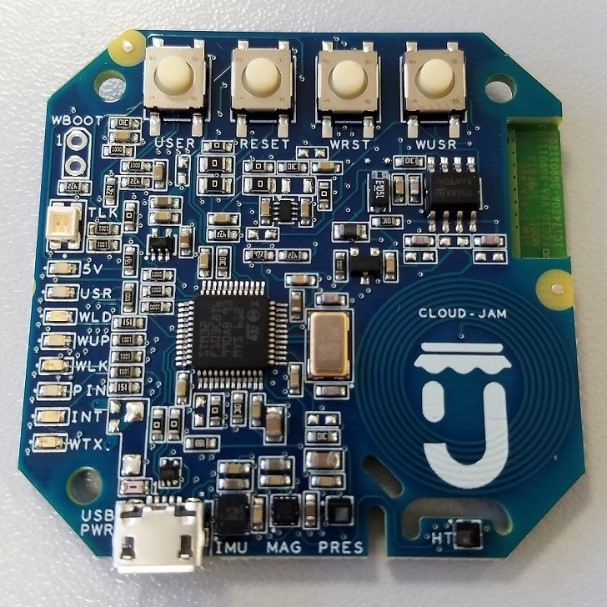
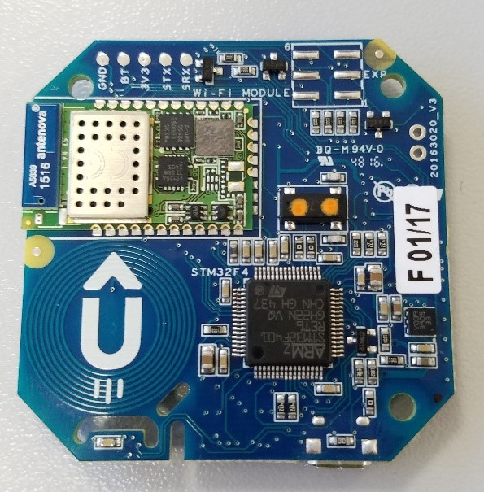
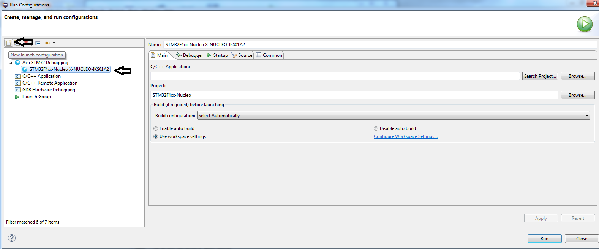
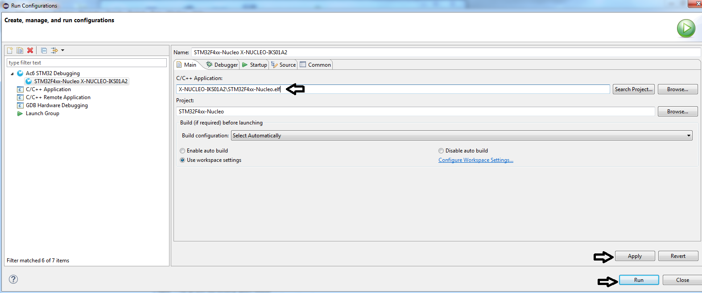
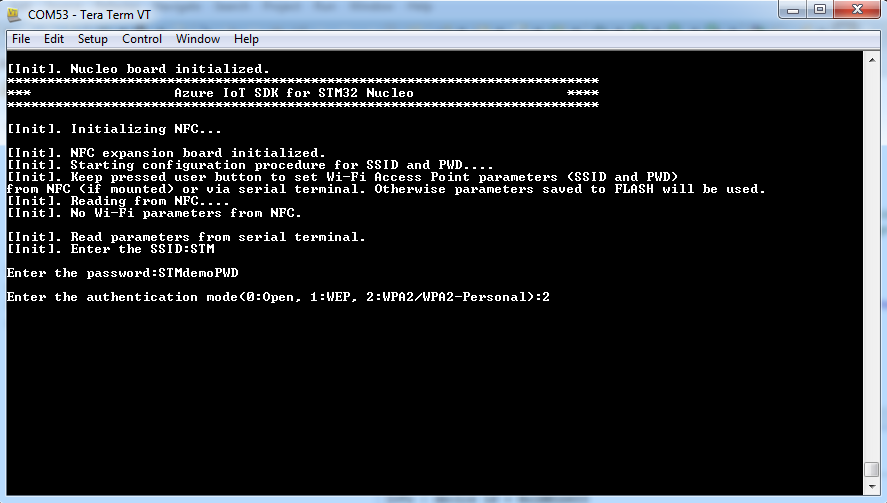
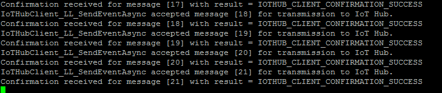
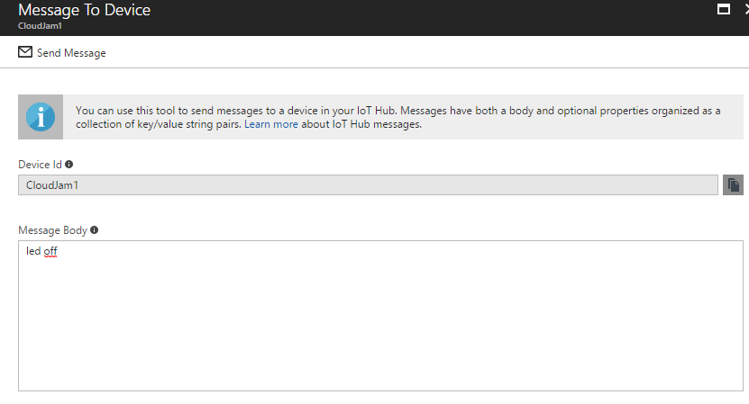
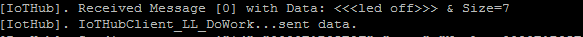

Run a C sample on RushUp Cloud-JAM
===
---

# Table of Contents

-   [Introduction](#Introduction)
-   [Step 1: Prerequisites](#Prerequisites)
-   [Step 2: Prepare your Device](#PrepareDevice)
-   [Step 3: Build and Run the Sample](#Build)
-   [Next Steps](#NextSteps)

# Introduction

**About this document**

This document describes how to connect RushUp [Cloud-JAM](http://rushup.tech/) board to the Microsoft Azure IoT Hub, by leveraging on Azure IoT Device SDK. This multi-step process includes:

-   Configuring Azure IoT Hub
-   Registering STM32 Cloud-JAM to Azure IoT Hub
-   Build and deploy Azure IoT SDK on Cloud-JAM

Cloud-JAM is the product accelerator (production grade solution) of ST functional pack P-NUCLEO-AZURE1 that combines:

-	NUCLEO F401RE
-	NUCLEO SHIELD IKS01A2
-	NUCLEO SHIELD NFC01A1
-	NUCLEO SHIELD IDW01M1

At a firmware level the Cloud-Jam works the same way as those 4 hardware combined.

So any project or binary created for STM32F401RE microcontroller can be run or debugged on the Cloud- JAM.

# Step 1: Prerequisites

You should have the following items ready before beginning the process:

## Development environment
-   One among these three IDEs installed in your PC: [Keil MDK-ARM](http://www.keil.com/), [IAR Embedded Workbench](http://www.iar.com/), [AC6 System Workbench for STM32](http://www.openstm32.org/System+Workbench+for+STM32)
-   A serial terminal installed in your PC (e.g. [TeraTerm](https://ttssh2.osdn.jp/))
-   [Setup your IoT hub][lnk-setup-iot-hub]
-   [Provision your device and get its credentials][lnk-manage-iot-hub]

**Note:**
[SystemWorkbench for STM32](http://www.openstm32.org/System+Workbench+for+STM32) is the free integrated development environment for STM32, and it is used as reference in this guide.

## Hardware components
-   RushUp [Cloud-JAM](http://www.rushup.tech/) board

# Step 2: Prepare your Device

Connect the Cloud-JAM board to your PC using a micro USB cable.

**TOP VIEW**

**BOTTOM VIEW**

# Step 3: Build and Run the sample

## 3.1 Build SDK and sample code

1.  Download [FP-CLD-AZURE1 Function Pack](https://github.com/rushup/Cloud-JAM-AzureIoTHub). The Function Pack contains all the required drivers to use the STM32 Nucleo board with Wi-Fi, Sensors and NFC expansion boards, together with pre-integrated Microsoft Azure IoT SDK.

2.  Unzip the package and open one of the pre-configured project files available in  `Projects/Multi/Applications/HTTPS_Azure`, according to the IDE installed (for [SystemWorkbench for STM32](http://www.openstm32.org/System+Workbench+for+STM32) project files can be found inside folder `SW4STM32`). In SystemWorkbench for STM32 select the project from menu `File -> Import -> Existing Projects into Workspace`; browse folders and select as root directory `Projects/Multi/Applications/HTTPS_Azure/SW4STM32/STM32F401RE-Nucleo` then click `Finish`.

3.  Open file `AzureIOTSDKConfig.h` (inside folder `Projects/Multi/Applications/HTTPS_Azure/Inc`) and update `AZUREIOTHUBCONNECTIONSTRING` with the credentials retrieved once completed device registration in IoT Hub as described in [Step 1.1](#Prerequisites).

4.  Build the project according to the selected IDE. In SystemWorkbench for STM32, select the Build configuration with `Project -> Build Configurations -> Set Active` based on the sensors expansion board mounted (see picture below); then select `Project -> Build All` (or shortcut `Ctrl+B`). 

5.  Flash the binary to Cloud-JAM board according to the selected IDE. In SystemWorkbench for STM32 select `Run -> Run Configurations`; click on `New launch configuration` (see below) and select X-NUCLEO-IKS01A2; then in text box `C/C++ Applications` type in  `X-NUCLEO-IKS01A2\STM32F4xx-Nucleo.elf`; then click on `Apply` and `Run`.

## 3.2 Connect STM32 Nucleo board to a WiFi access point

Configure your serial terminal (e.g. [TeraTerm](https://ttssh2.osdn.jp/)) with the following parameters to visualize log messages from Nucleo board:

-   BaudRate : 460800
-   Data : 8 bit
-   Parity : none
-   Stop : 1 bit
-   Flow Control : none

In order to set or to overwrite WiFi access point parameters (SSID and Password), keep pressed USER button in STM32 Nucleo after RESET.

If SSID and Password were previously written to NFC with a mobile application (i.e. [ST25 application](https://play.google.com/store/apps/details?id=com.st.demo) for Android can be used), these will be read and used to connect with the Access Point. In order to copy parameters to NFC board, an Android mobile phone equipped with an NFC WriteTag application need to be used.

Alternatively WiFi parameters can be entered using serial terminal (see below), or directly set in source code by using `X_CLOUD_SSID, X_CLOUD_KEY` defines in file `AzureIOTSDKConfig.h`(`EMBEDDED_WIFI_PARAMETERS` has also to be set to 1 in the latter case).

After first time WiFi parameters are set, these are permanently written to FLASH memory and used each time the board is RESET, unless USER button is kept pressed.

USER LED onboard Nucleo is turned on once WiFi has joined AP and connection with Azure IoT Hub is established.

## 3.3 Send Device Events to IoT Hub

Once connected to Azure IoT Hub, the application transmits sample data read from sensor board (motion MEMS, temperature, pressure, humidity) using HTTPS protocol.

See [Manage IoT Hub][lnk-manage-iot-hub] to learn how to observe in DeviceExplorer the messages IoT Hub receives from Cloud-JAM.

Messages sent to Azure IoT are also printed in serial terminal interface.

## 3.4 Receive messages from IoT Hub

See [Manage IoT Hub][lnk-manage-iot-hub] to learn how to send cloud-to-device messages Cloud-JAM. Messages received by Cloud-JAM are printed over serial terminal interface once received. Some cloud-to-device messages are also interpreted by the embedded application:

-   quit : quit application
-   reset : reset board
-   led on : LED2 onboard Nucleo on
-   led off : LED2 off
-   delay : change samples frequency

On the board:

A QuickStart guide to setup and run the application can also be downloaded [here](http://www.st.com/content/ccc/resource/sales_and_marketing/presentation/product_presentation/group0/1f/8c/03/3b/a4/da/49/b4/FP-CLD-AZURE1 quick start guide/files/fp-cld-azure1_quick_start_guide.pdf/jcr:content/translations/en.fp-cld-azure1_quick_start_guide.pdf).

# Next Steps

You have now learned how to run a sample application that collects sensor data and sends it to your IoT hub. To explore how to store, analyze and visualize the data from this application in Azure using a variety of different services, please click on the following lessons:

-   [Manage cloud device messaging with iothub-explorer]
-   [Save IoT Hub messages to Azure data storage]
-   [Use Power BI to visualize real-time sensor data from Azure IoT Hub]
-   [Use Azure Web Apps to visualize real-time sensor data from Azure IoT Hub]
-   [Weather forecast using the sensor data from your IoT hub in Azure Machine Learning]
-   [Remote monitoring and notifications with Logic Apps]   

[Manage cloud device messaging with iothub-explorer]: https://docs.microsoft.com/en-us/azure/iot-hub/iot-hub-explorer-cloud-device-messaging
[Save IoT Hub messages to Azure data storage]: https://docs.microsoft.com/en-us/azure/iot-hub/iot-hub-store-data-in-azure-table-storage
[Use Power BI to visualize real-time sensor data from Azure IoT Hub]: https://docs.microsoft.com/en-us/azure/iot-hub/iot-hub-live-data-visualization-in-power-bi
[Use Azure Web Apps to visualize real-time sensor data from Azure IoT Hub]: https://docs.microsoft.com/en-us/azure/iot-hub/iot-hub-live-data-visualization-in-web-apps
[Weather forecast using the sensor data from your IoT hub in Azure Machine Learning]: https://docs.microsoft.com/en-us/azure/iot-hub/iot-hub-weather-forecast-machine-learning
[Remote monitoring and notifications with Logic Apps]: https://docs.microsoft.com/en-us/azure/iot-hub/iot-hub-monitoring-notifications-with-azure-logic-apps
[lnk-setup-iot-hub]: ../setup_iothub.md
[lnk-manage-iot-hub]: ../manage_iot_hub.md

