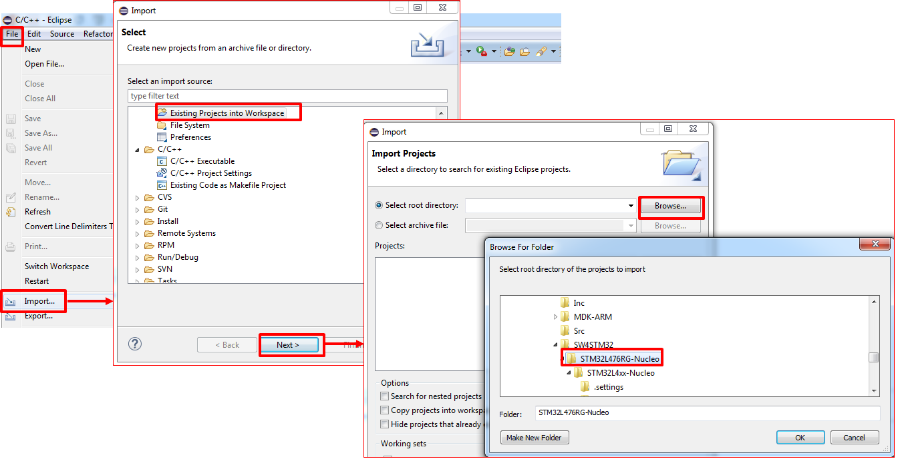
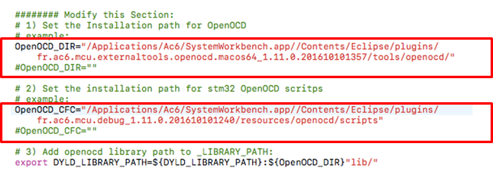
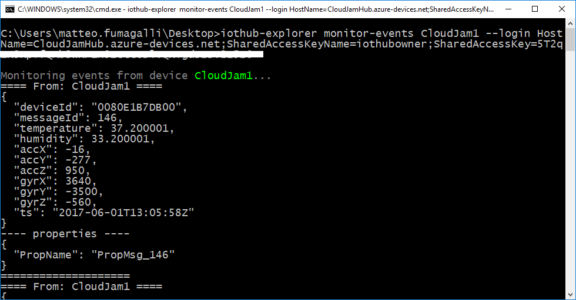
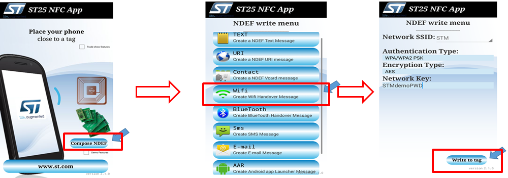
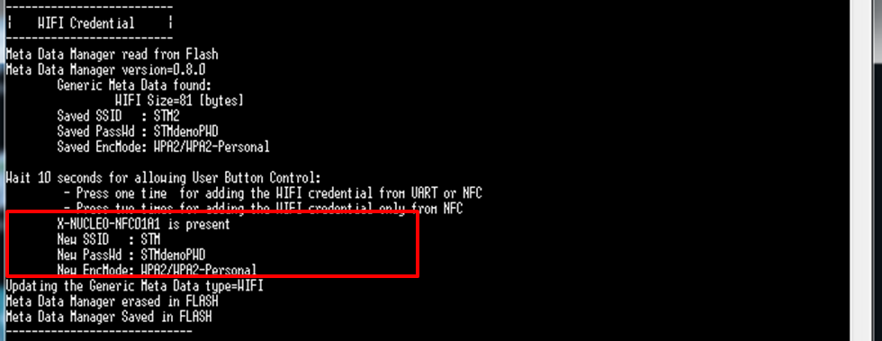

Run a C sample on RushUp Cloud-JAM L4
===
---

# Table of Contents

-   [Introduction](#Introduction)
-   [Step 1: Prerequisites](#Prerequisites)
-   [Step 2: Prepare your Device](#PrepareDevice)
-   [Step 3: Build and Run the Sample](#Build)
-   [Trigger remote firmware update using Direct Methods](#FirwareUpdate)
-   [Use NFC to configure Wi-Fi Access Point parameters](#NFC)
-   [Next Steps](#NextSteps)

# Introduction

**About this document**

This document describes how to connect RushUp [Cloud-JAM L4](http://rushup.tech/) board to the Microsoft Azure IoT Hub, by leveraging on Azure IoT Device SDK. This multi-step process includes:

-   Configuring Azure IoT Hub
-   Registering STM32 Cloud-JAM L4 to Azure IoT Hub
-   Build and deploy Azure IoT SDK on Cloud-JAM L4

Cloud-JAM L4 is the product accelerator (production grade solution) of ST's functional pack P-NUCLEO-AZURE1 that combines:

-   NUCLEO L476RG
-   NUCLEO SHIELD IKS01A2
-   NUCLEO SHIELD NFC01A1
-   NUCLEO SHIELD IDW01M1

At a firmware level the Cloud-Jam L4 works the same way as those 4 hardware combined.

So any project or binary created for STM32L476RG microcontroller can be run or debugged on the Cloud- JAM L4.

# Step 1: Prerequisites

You should have the following items ready before beginning the process:

## Development environment
-   One among these three IDEs installed in your PC: [Keil MDK-ARM](http://www.keil.com/), [IAR Embedded Workbench](http://www.iar.com/), [AC6 System Workbench for STM32](http://www.openstm32.org/System+Workbench+for+STM32)
-   For WindowsOS, the [STM32 ST-Link Utility](http://www.st.com/content/st_com/en/products/embedded-software/development-tool-software/stsw-link004.html) (requires registration to my.st.com)
-   A serial terminal installed in your PC (e.g. [TeraTerm](https://ttssh2.osdn.jp/) for Windows)
-   [Setup your IoT hub][lnk-setup-iot-hub]
-   [Provision your device and get its credentials][lnk-manage-iot-hub]

**Note:**
[SystemWorkbench for STM32](http://www.openstm32.org/System+Workbench+for+STM32) is the free integrated development environment for STM32, and it is used as reference in this guide.

## Hardware components
-   RushUp [Cloud-JAM L4](http://www.rushup.tech/) board

# Step 2: Prepare your Device

Connect the Cloud-JAM L4 board to your PC using a micro USB cable.

**TOP VIEW**

**BOTTOM VIEW**

# Step 3: Build and Run the sample

## 3.1 Build SDK and sample code

### Check pre-requisites

1.  One of the following IDE installed: [Keil MDK-ARM](http://www.keil.com/), [IAR Embedded Workbench](http://www.iar.com/), [AC6 System Workbench for STM32](http://www.openstm32.org/System+Workbench+for+STM32) ([SystemWorkbench for STM32](http://www.openstm32.org/System+Workbench+for+STM32) is used as reference in this tutorial; requires Java SW JRE 7 or newer)
2.  [STM32 ST-Link Utility][http://www.st.com/content/st_com/en/products/embedded-software/development-tool-software/stsw-link004.html] (Windows OS only)
3.  Serial line monitor (i.e. [TeraTerm](https://ttssh2.osdn.jp/) for WindowsOS; [TeraTerm](https://ttssh2.osdn.jp/) is used as reference in this tutorial)
4.  For NFC usage, any Android application capable to read/write NFC tag ([ST25 NFC App](https://play.google.com/store/apps/details?id=com.st.demo) is used as reference in this tutorial)
5.  [DeviceExplorer](https://github.com/Azure/azure-iot-sdk-csharp/tree/master/tools/DeviceExplorer) (Windows OS only) or [iothub-explorer](https://github.com/Azure/iothub-explorer) ([iothub-explorer](https://github.com/Azure/iothub-explorer) is used as reference in this guide, requires Node.js version 4.x or newer)
6.  Set-up your IoT Hub following instructions provided [here](https://catalog.azureiotsuite.com/docs?title=Azure/azure-iot-device-ecosystem/setup_iothub)

### Download firmware

Download [FP-CLD-AZURE1 Function Pack](https://github.com/rushup/Cloud-JAM-L4-AzureIoTHub). The Function Pack contains all the required drivers to use the [Cloud-JAM L4](http://rushup.tech/) board with Wi-Fi, Sensors and NFC expansion boards, together with pre-integrated Microsoft Azure IoT SDK.

**Note:** *Use this software only for test. For production, download the last software of libraries from ST’s website.*

### Import solution file

Unzip the package and open one of the pre-configured project files available in  `Projects/STM32L476RG-Nucleo/Applications/Azure_Sns_DM`, according to the IDE installed (for [SystemWorkbench for STM32](http://www.openstm32.org/System+Workbench+for+STM32) project files can be found inside folder `SW4STM32`). In [SystemWorkbench for STM32](http://www.openstm32.org/System+Workbench+for+STM32) select the project from menu `File -> Import -> Existing Projects into Workspace`; browse folders and select as root directory `Projects/STM32L476RG-Nucleo/Applications/Azure_Sns_DM/SW4STM32/STM32L476RG-Nucleo` then click `Finish`.

### Insert connection string

Open file `azure1_config.h` and update `AZUREDEVICECONNECTIONSTRING` with the credentials retrieved once completed device registration in IoT Hub as described in [here](https://catalog.azureiotsuite.com/docs?title=Azure/azure-iot-device-ecosystem/setup_iothub). You have also to set here SSID and Password for Wi-Fi access point by replacing `AZURE_DEFAULT_SSID` and `AZURE_DEFAULT_SECKEY`.

### Build the project

Build the project according to the selected IDE. In [SystemWorkbench for STM32](http://www.openstm32.org/System+Workbench+for+STM32), click on `Project -> Build All` (or shortcut `Ctrl+B`). 

### Flash the binary

Flash the binary to Cloud-JAM L4 board. The sample application you have compiled include a procedure to implement Over-The-Air (OTA) Firmware upadate, which can be combined with [Azure IoT Hub primitives for device management](https://docs.microsoft.com/en-us/azure/iot-hub/iot-hub-device-management-overview) (see following sections). Firmware update procedure requires a bootloader to be installed together with the Firmware binary; in order to properly flash both, scripts are provided for each IDE used. In [SystemWorkbench for STM32](http://www.openstm32.org/System+Workbench+for+STM32) scripts for Windows/OSx/Linux can be found in `Projects/STM32L476RG-Nucleo/Application/Azure_Sns_DM/SW4STM32/STM32L476RG-Nucleo`. In Windows simply click on `CleanAzure1mbedTLS.bat`

For OSx/Linux, scripts require configuration according to your setup; edit `OpenOCD_DIR` and `OpenOCD_CFC` variables as shown in the following picture, following the installation path of openocd binaries (`tools/openocd/`) and scripts (`openocd/scripts`).

### Configure your serial terminal and start the application

Configure your serial terminal as shown in the following picture for TeraTerm (baudrate set to 115200):

Reset the kit by pressing the RESET button on Cloud-JAM L4 board to start the application.

## 3.2 Send Device Events to IoT Hub

After RESET, the application join the Wi-Fi access point and connect to your Azure IoT Hub. When connection is established, the application transmits periodically messages containing inertial and environmental data read from the board.

USER LED onboard blinks once connection with Azure IoT Hub is established. Application can be stopped by pressing USER button.

Messages successfully transmitted to your Azure IoT Hub are printed over your serial terminal interface.

To visualize messages received in IoT Hub with iothub-explorer, open Node.js command prompt and insert the following commands:

    iothub-explorer login <iot-hub-connection-string>
    iothub-explorer monitor-events <device name> --login <iot-hub-connection-string>

## 3.3 Receive messages from IoT Hub

To send a message from IoT Hub to [Cloud-JAM L4](http://rushup.tech/) board with iothub-explorer, open Node.js command prompt and insert the following commands:

    iothub-explorer send <device name> <message> --ack=full

Messages received by STM32 Cloud-JAM L4 are printed over serial terminal interface once received. Some cloud-to-device messages are also interpreted by the application:

-   Pause : pause the application
-   Play : restart the application after a pause
-   LedOn/LedOff : turn on/off LED2 onboard Nucleo
-   LedBlink : LED2 onboard Nucleo will blink for each message transmitted

See [Manage IoT Hub][lnk-manage-iot-hub] to learn more on how to send cloud-to-device messages from IoT Hub.

# Trigger remote firmware update using Direct Methods and monitor device status with Reported Properties

The application support firmware update procedure; when triggered, it stops its normal exection, download and install a new firmware version. By using direct methods, it is possible to trigger firmware update procedure using iothub-explorer; open Node.js command prompt and insert the following commands:

    iothub-explorer device-method <device name> <method name> <method properties> <timeout>

where

-   `<method name>`: `FirmwareUpdate`
-   `<method properties>`: URL of the web-link where the new firmware version is hosted; to be written in the format `"{\"FwPackageUri\":\"https:....\"}"`
-   `<timeout>`: timeout to receive feedback from device

It is possible to monitor the execution of the firmware update procedure in the serial terminal:

The application also reports its current status to the IoT Hub; device status can be monitored in iothub-explorer with the following command:

    iothub-explorer get-twin <device name>

# Use NFC to configure Wi-Fi Access Point parameters

-   Install in an Android phone [ST25 NFC App](https://play.google.com/store/apps/details?id=com.st.demo) mobile app
-   Launch the application; click on Compose NDEF then select in menu the Wi-Fi option. Insert SSID and Password, then approach the mobile phone to the NFC expansion board and click on `Write to tag`

-   Press Reset Button to restart the application
-   Press twice the User Button (Blue Button) when requested (after 3 seconds timeout default values will be used). The application will read NDEF parameters from NFC and will connect to the Access Point.

# Next Steps

You have now learned how to run a sample application that collects sensor data and sends it to your IoT hub. To explore how to store, analyze and visualize the data from this application in Azure using a variety of different services, please click on the following lessons:

-   [Manage cloud device messaging with iothub-explorer]
-   [Save IoT Hub messages to Azure data storage]
-   [Use Power BI to visualize real-time sensor data from Azure IoT Hub]
-   [Use Azure Web Apps to visualize real-time sensor data from Azure IoT Hub]
-   [Weather forecast using the sensor data from your IoT hub in Azure Machine Learning]
-   [Remote monitoring and notifications with Logic Apps]   

[Manage cloud device messaging with iothub-explorer]: https://docs.microsoft.com/en-us/azure/iot-hub/iot-hub-explorer-cloud-device-messaging
[Save IoT Hub messages to Azure data storage]: https://docs.microsoft.com/en-us/azure/iot-hub/iot-hub-store-data-in-azure-table-storage
[Use Power BI to visualize real-time sensor data from Azure IoT Hub]: https://docs.microsoft.com/en-us/azure/iot-hub/iot-hub-live-data-visualization-in-power-bi
[Use Azure Web Apps to visualize real-time sensor data from Azure IoT Hub]: https://docs.microsoft.com/en-us/azure/iot-hub/iot-hub-live-data-visualization-in-web-apps
[Weather forecast using the sensor data from your IoT hub in Azure Machine Learning]: https://docs.microsoft.com/en-us/azure/iot-hub/iot-hub-weather-forecast-machine-learning
[Remote monitoring and notifications with Logic Apps]: https://docs.microsoft.com/en-us/azure/iot-hub/iot-hub-monitoring-notifications-with-azure-logic-apps
[lnk-setup-iot-hub]: ../setup_iothub.md
[lnk-manage-iot-hub]: ../manage_iot_hub.md

