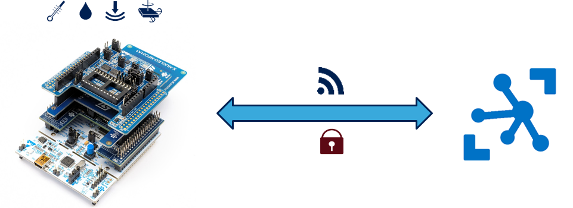
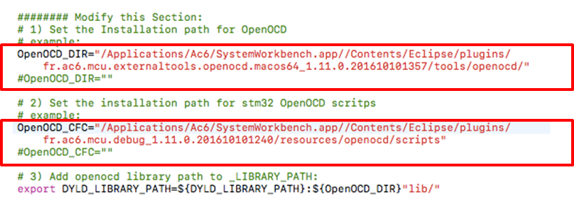
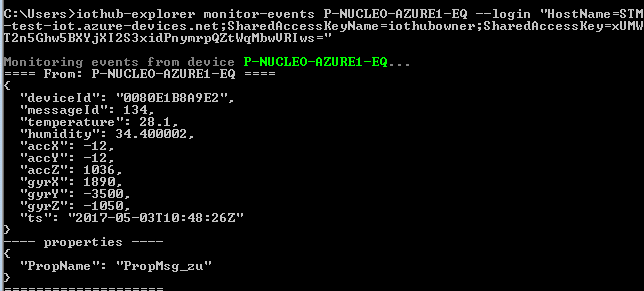
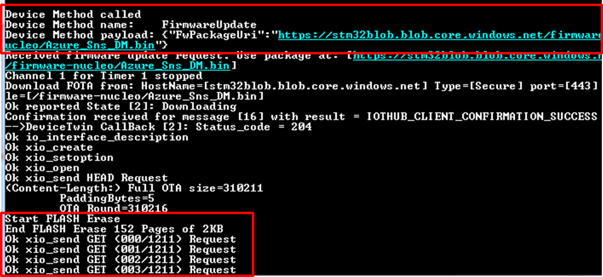
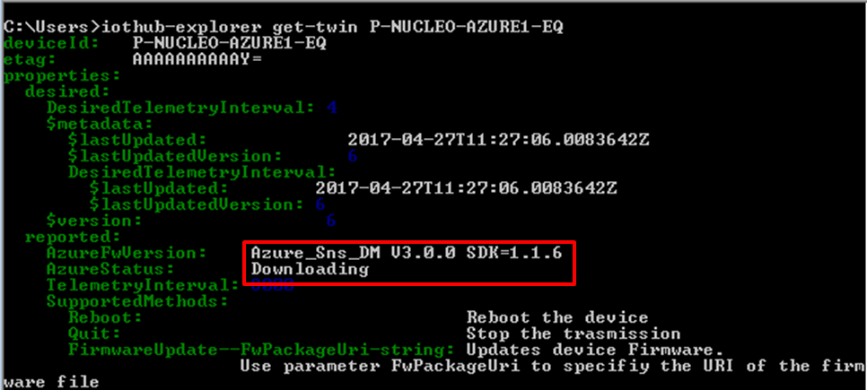
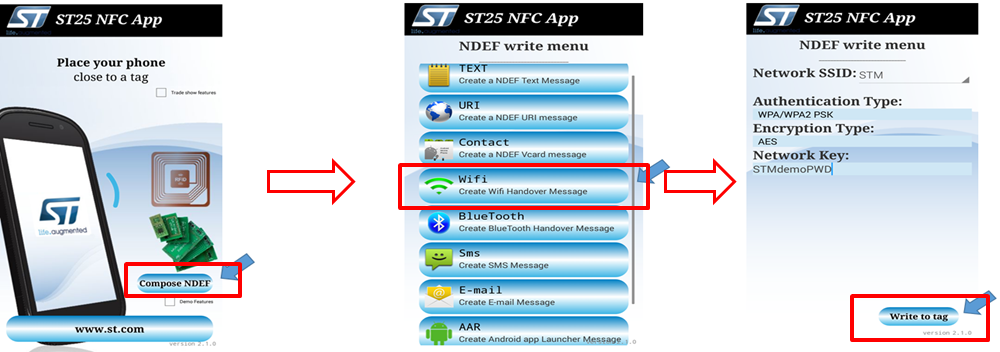
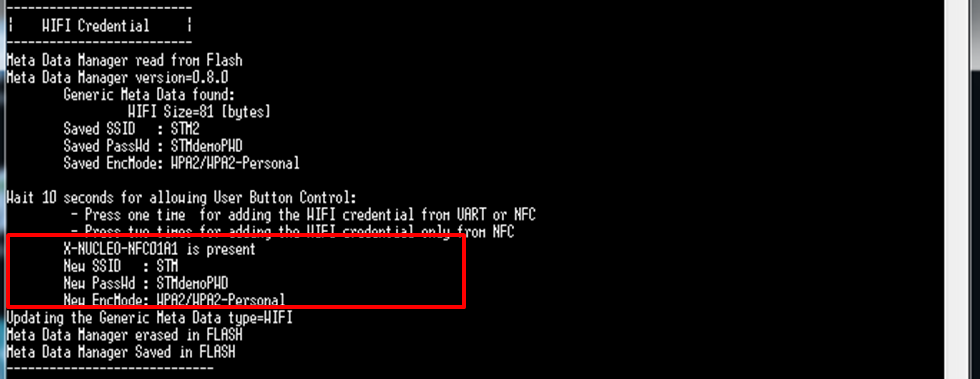

Run a simple C sample on STM32 NUCLEO-L476RG 
===
---

# Table of Contents
-   [Introduction](#Introduction)
-   [Step 1: Prerequisites](#Prerequisites)
-   [Step 2: Prepare your Device](#PrepareDevice)
-   [Step 3: Build and Run the Sample](#Build)
    -   [Option 1: Use the development board, without sensors](#Device-Sample)
    -   [Option 2: Use the P-NUCLEO-AZURE1 kit from ST Microelectronics](#Kit01-Sample)
-   [Next Steps](#NextSteps)

<a name="Introduction"></a>
# Introduction

**About this document**

This document describes how to connect STM32 [NUCLEO-L476RG][lnk-nucleo-l4] board together with [WiFi expansion board][lnk-nucleo-wifi] to the Microsoft Azure IoT Hub, by leveraging on Azure IoT Device SDK. This multi-step process includes:
-   Configuring Azure IoT Hub
-   Registering STM32 [NUCLEO-L476RG][lnk-nucleo-l4] to Azure IoT Hub
-   Build and deploy Azure IoT SDK on STM32 Nucleo
 

<a name="Prerequisites"></a>
# Step 1: Prerequisites

You should have the following items ready before beginning the process.

## 1.1 Development environment
- One among these three IDEs installed in your PC: [Keil MDK-ARM][lnk-ide-keil], [IAR Embedded Workbench][lnk-ide-iar], [AC6 System Workbench for STM32][lnk-ide-sw4stm32]
- For WindowsOS, the [STM32 ST-Link Utility][lnk-stlink] (requires registration to my.st.com)
- A serial terminal installed in your PC (e.g. [TeraTerm][lnk-teraterm] for Windows) 
- [Setup your IoT hub][lnk-setup-iot-hub]
- [Provision your device and get its credentials][lnk-manage-iot-hub]

#### NOTE
[SystemWorkbench for STM32][lnk-ide-sw4stm32] is the free integrated development environment for STM32, and it is used as reference in this guide.

## 1.2 Hardware components
 - STM32 [NUCLEO-L476RG][lnk-nucleo-l4] development board 
 - Wi-Fi expansion board for STM32 Nucleo ([X-NUCLEO-IDW01M1][lnk-nucleo-wifi])
 

<a name="PrepareDevice"></a>
# Step 2: Prepare your Device
Combine [NUCLEO-L476RG][lnk-nucleo-l4] with [Wi-Fi expansion board][lnk-nucleo-wifi] as shown in the figure below. Then connect the [NUCLEO-L476RG][lnk-nucleo-l4] board to your PC using a mini USB cable.

![][1]
 

<a name="Build"></a>
# Step 3: Build and Run the sample 

<a name="Device-Sample"></a>
## Option 1: Use the development board, without sensors

<a name="Load"></a>
### 3.1 Build SDK and sample code

1. Download [FP-CLD-AZURE1][lnk-fp-cld-azure] Function Pack. The Function Pack contains all the required drivers to use the [NUCLEO-L476RG][lnk-nucleo-l4] board with Wi-Fi expansion boards, together with pre-integrated Microsoft Azure IoT SDK. 
2. Unzip the package and open one of the pre-configured project files available in ```Projects/STM32L476RG-Nucleo/Applications/Azure_Sns_DM```, according to the IDE installed (for [SystemWorkbench for STM32][lnk-ide-sw4stm32] project files can be found inside folder ```SW4STM32```). 
3. In [SystemWorkbench for STM32][lnk-ide-sw4stm32] select the project from menu ```File -> Import -> Existing Projects into Workspace```; browse folders and select as root directory ```Projects/STM32L476RG-Nucleo/Applications/Azure_Sns_DM/SW4STM32/STM32L476RG-Nucleo``` then click ```Finish```.
![][2]
4. Open  file ```azure1_config.h``` and update ```AZUREDEVICECONNECTIONSTRING``` with the credentials retrieved once completed device registration in IoT Hub as described in [Step 1.1][lnk-setup-iot-hub]. You have also to set here SSID and Password for Wi-Fi access point by replacing ```AZURE_DEFAULT_SSID``` and ```AZURE_DEFAULT_SECKEY```.
![][3]
5. Build the project according to the selected IDE. In [SystemWorkbench for STM32][lnk-ide-sw4stm32], click on ```Project -> Build All``` (or shortcut ```Ctrl+B```).
![][4]
6. Flash the binary to [NUCLEO-L476RG][lnk-nucleo-l4] board. The sample application you have compiled include a procedure to implement Over-The-Air (OTA) Firmware upadate, which can be combined with [Azure IoT Hub primitives for device management][lnk-dev-man]. 
Firmware update procedure requires a bootloader to be installed together with the Firmware binary; in order to properly flash both, scripts are provided for each IDE used. 
In [SystemWorkbench for STM32][lnk-ide-sw4stm32] scripts for Windows/OSx/Ubuntu can be found in ```Projects/STM32L476RG-Nucleo/Application/Azure_Sns_DM/SW4STM32/STM32L476RG-Nucleo```. 
In Windows simply click on ```CleanAzure1mbedTLS.bat```; for OSx and Ubuntu, scripts require configuration according to your setup, please refer to ```readme.txt``` in 
folder ```Projects/STM32L476RG-Nucleo/Application/Azure_Sns_DM``` to learn how to properly edit them. 


### 3.2 Connect and send messages to Azure IoT Hub 

To visualize log messages from [NUCLEO-L476RG][lnk-nucleo-l4] board, configure your serial terminal (e.g. [TeraTerm][lnk-teraterm] for Windows) with the following parameters 
- BaudRate : 115200
- Data : 8 bit
- Parity : none
- Stop : 1 bit 
- Flow Control : none

Press ```RESET``` button onboard [NUCLEO-L476RG][lnk-nucleo-l4] to restart the application; 
```LED2``` will blink once connection with Azure IoT Hub is established. Once connected to the IoT Hub, the application transmits periodically messages containing emulated sensors data.
Application can be stopped by pressing ```USER``` button. 
Messages successfully transmitted to your Azure IoT Hub are also printed over your serial terminal interface. 

### 3.3 Receive messages from IoT Hub

See [Manage IoT Hub][lnk-manage-iot-hub] to learn how to send cloud-to-device messages from IoT Hub.
Messages received by STM32 [NUCLEO-L476RG][lnk-nucleo-l4] are printed over serial terminal interface once received. 
Some cloud-to-device messages are also interpreted by the application: 
- Pause : pause the application (message to be entered in the form ```{"Name":"Pause", "Parameters":{}}``` )
- Play : restart the application after a pause (message to be entered in the form ```{"Name":"Play", "Parameters":{}}``` )
- LedOn/LedOff : turn on/off LED2 onboard Nucleo (message to be entered in the form ```{"Name":"LedOn", "Parameters":{}}``` )
- LedBlink : LED2 onboard Nucleo will blink for each message transmitted (message to be entered in the form ```{"Name":"LedBlink", "Parameters":{}}``` ).

The application also support [direct methods][lnk-direct-methods] and [desired properties][lnk-desired-prop] as alternative methods to remotely control the device.
 
<a name="Kit01-Sample"></a>
## Option 2: Use the P-NUCLEO-AZURE1 kit from ST Microelectronics

### [P-NUCLEO-AZURE1][lnk-p-nucleo-azure1] kit

The [P-NUCLEO-AZURE1][lnk-p-nucleo-azure1] kit includes:

-   IoT Wi-Fi node based on STM32 NUCLEO-L476RG (STM32 [NUCLEO-L476RG][lnk-nucleo-l4] + [Wi-Fi expansion board][lnk-nucleo-wifi]) 
-   [X-NUCLEO-IKS01A2][lnk-nucleo-mems] (Motion MEMS and environmental sensor expansion board for STM32 Nucleo)
-   [X-NUCLEO-NFC01A1][lnk-nucleo-nfc] (Dynamic NFC tag expansion board based on M24SR for STM32 Nucleo)
-   Micro USB to USB cable 



### Connect the sensors 

Combine STM32 NUCLEO-L476RG, Wi-Fi, Sensors and NFC expansion boards using the ST morpho and Arduino UNO R2 connectors, 
following the order shown in the picture. 


Then connect P-NUCLEO-AZURE1 to your laptop using the Micro USB to USB cable.

### Build and Run the sample

#### Check pre-requisites

  1. One of the following IDE installed: [Keil MDK-ARM][lnk-ide-keil], [IAR Embedded Workbench][lnk-ide-iar], [AC6 System Workbench for STM32][lnk-ide-sw4stm32] ([SystemWorkbench for STM32][lnk-ide-sw4stm32] is used as reference in this tutorial; requires Java SW JRE 7 or newer)
  2. [STM32 ST-Link Utility][lnk-st-link] (Windows OS only)
  3. Serial line monitor (i.e. [TeraTerm][lnk-teraterm] for WindowsOS; [TeraTerm][lnk-teraterm] is used as reference in this tutorial)
  4. For NFC usage, any Android application capable to read/write NFC tag ([ST25 NFC App][lnk-nfc-app] is used as reference in this tutorial)
  5. [DeviceExplorer][lnk-dev-exp] (Windows OS only) or [iothub-explorer][lnk-iot-exp] ([iothub-explorer][lnk-iot-exp] is used as reference in this guide, requires Node.js version 4.x or newer)
  6. Set-up your IoT Hub following instructions provided [here][lnk-setup-iot-hub]

#### Download firmware

Download [FP-CLD-AZURE1][lnk-fp-cld-azure] Function Pack. 
The Function Pack contains all the required drivers 
to use the [NUCLEO-L476RG][lnk-nucleo-l4] board with Wi-Fi, sensors and NFC expansion boards, 
together with pre-integrated Microsoft Azure IoT SDK. 

#### Import solution file

Unzip the package and open one of the pre-configured project files available 
in ```Projects/STM32L476RG-Nucleo/Applications/Azure_Sns_DM```, according to the IDE installed 
(for [SystemWorkbench for STM32][lnk-ide-sw4stm32] project files can be found inside folder ```SW4STM32```). 
In [SystemWorkbench for STM32][lnk-ide-sw4stm32] select the project 
from menu ```File -> Import -> Existing Projects into Workspace```; browse 
folders and select as root 
directory ```Projects/STM32L476RG-Nucleo/Applications/Azure_Sns_DM/SW4STM32/STM32L476RG-Nucleo``` then 
click ```Finish```.


#### Insert connection string

Open  file ```azure1_config.h``` and update ```AZUREDEVICECONNECTIONSTRING``` with the credentials 
retrieved once completed device 
registration in IoT Hub as described in [here][lnk-setup-iot-hub]. You have also to set here SSID and 
Password for Wi-Fi access point 
by replacing ```AZURE_DEFAULT_SSID``` and ```AZURE_DEFAULT_SECKEY```.


#### Build the project 

Build the project according to the selected IDE. In [SystemWorkbench for STM32][lnk-ide-sw4stm32], click on ```Project -> Build All``` (or 
shortcut ```Ctrl+B```).


#### Flash the binary 

Flash the binary to [NUCLEO-L476RG][lnk-nucleo-l4] board. 
The sample application you have compiled include a procedure to implement 
Over-The-Air (OTA) Firmware upadate, which can be combined with [Azure IoT Hub primitives for device management][lnk-dev-man] (see following sections). 
Firmware update procedure requires a bootloader to be installed together with the Firmware binary; in order to properly flash both, scripts are 
provided for each IDE used. 
In [SystemWorkbench for STM32][lnk-ide-sw4stm32] scripts for Windows/OSx/Linux can be found 
in ```Projects/STM32L476RG-Nucleo/Application/Azure_Sns_DM/SW4STM32/STM32L476RG-Nucleo```. 
In Windows simply click on ```CleanAzure1mbedTLS.bat```


For OSx/Linux, scripts require configuration according to your setup; edit ```OpenOCD_DIR``` and ```OpenOCD_CFC``` variables as shown 
in the following picture,
following the installation path of openocd binaries (```tools/openocd/```) and scripts (```openocd/scripts```). 



#### Configure your serial terminal and start the application

Configure your serial terminal as shown in the following picture for TeraTerm (baudrate set to 115200):


Reset the kit by pressing the RESET button on [NUCLEO-L476RG][lnk-nucleo-l4] board to start the application.


### Send Device Events to IoT Hub

After RESET, the application join the Wi-Fi access point and connect to your Azure IoT Hub. When connection 
is established, 
the application transmits periodically messages containing inertial and environmental data read 
from [X-NUCLEO-IKS01A2][lnk-nucleo-mems] sensors board. 

LED2 onboard [NUCLEO-L476RG][lnk-nucleo-l4] blinks once connection with Azure IoT Hub is established. 
Application can be stopped by pressing USER button. 


Messages successfully transmitted to your Azure IoT Hub are printed over your serial terminal interface. 


To visualize messages received in IoT Hub with iothub-explorer, open Node.js command prompt and insert the 
following commands:
```
iothub-explorer login <iot-hub-connection-string>
iothub-explorer monitor-events <device name> --login <iot-hub-connection-string>
```




### Receive messages from IoT Hub

To send a message from IoT Hub to [NUCLEO-L476RG][lnk-nucleo-l4] board with iothub-explorer, open Node.js 
command prompt and insert the following commands:
```
iothub-explorer send <device name> <message> --ack=full
```


Messages received by STM32 [NUCLEO-L476RG][lnk-nucleo-l4] are printed over serial terminal interface once received. 
Some cloud-to-device messages are also interpreted by the application: 
-   Pause : pause the application
-   Play : restart the application after a pause
-   LedOn/LedOff : turn on/off LED2 onboard Nucleo
-   LedBlink : LED2 onboard Nucleo will blink for each message transmitted 

See [Manage IoT Hub][lnk-manage-iot-hub] to learn more on how to send cloud-to-device messages from IoT Hub.

### Trigger remote firmware update using Direct Methods and monitor device status with Reported Properties 

The application support firmware update procedure; when triggered, it stops its normal exection, download and install a new firmware version. 
By using [direct methods][lnk-direct-methods], it is possible to trigger firmware update procedure using iothub-explorer; 
open Node.js command prompt and insert the following commands:
```
iothub-explorer device-method <device name> <method name> <method properties> <timeout>
```

where
-   ```<method name>``` : ```FirmwareUpdate```
-   ```<method properties>``` : URL of the web-link where the new firmware version is hosted; to be written in the format ```"{\"FwPackageUri\":\"https:....\"}"```
-   ```<timeout>``` : timeout to receive feedback from device 

It possible to monitor the execution of the firmware update procedure in the serial terminal:



The application also reports its current status to the IoT Hub; device status can be monitored in iothub-explorer with the following command:

```
iothub-explorer get-twin <device name>
```




### Use NFC to configure Wi-Fi Access Point parameters  

[NFC expansion board][lnk-nucleo-nfc] can be used to configure embedded application parameters. 
In FP-CLD-AZURE1 NFC board is used for example to modify SSID and PWD for Wi-Fi AP.
-   Install in an Android phone [ST25 NFC App][lnk-nfc-app] mobile app
-   Launch the application; click on Compose NDEF then select in menu the Wi-Fi option. Insert SSID and Password, then approach the 
mobile phone to the NFC expansion board and click on ```Write to tag``` 




-   Press Reset Button to restart the application
-   Press twice the User Button (Blue Button) when requested (after 3 seconds timeout default values will be used). The application 
will read NDEF parameters from NFC and will connect to the Access Point.




<a name="Nextsteps"></a>
# Next steps

You have now learned how to run a sample application that collects sensor data and sends it to your IoT hub. To explore how to store, analyze and visualize the data from this application in Azure using a variety of different services, please click on the following lessons:

-   [Manage cloud device messaging with iothub-explorer](https://docs.microsoft.com/en-us/azure/iot-hub/iot-hub-explorer-cloud-device-messaging)
-   [Save IoT Hub messages to Azure data storage](https://docs.microsoft.com/en-us/azure/iot-hub/iot-hub-store-data-in-azure-table-storage)
-   [Use Power BI to visualize real-time sensor data from Azure IoT Hub](https://docs.microsoft.com/en-us/azure/iot-hub/iot-hub-live-data-visualization-in-power-bi)
-   [Use Azure Web Apps to visualize real-time sensor data from Azure IoT Hub](https://docs.microsoft.com/en-us/azure/iot-hub/iot-hub-live-data-visualization-in-web-apps)
-   [Weather forecast using the sensor data from your IoT hub in Azure Machine Learning](https://docs.microsoft.com/en-us/azure/iot-hub/iot-hub-weather-forecast-machine-learning)
-   [Remote monitoring and notifications with ​​Logic ​​Apps](https://docs.microsoft.com/en-us/azure/iot-hub/iot-hub-monitoring-notifications-with-azure-logic-apps)
-   [Device management with iothub-explorer](https://docs.microsoft.com/en-us/azure/iot-hub/iot-hub-device-management-iothub-explorer)


[lnk-setup-iot-hub]: ../setup_iothub.md
[lnk-manage-iot-hub]: ../manage_iot_hub.md
[lnk-nucleo-l4]:http://www.st.com/content/st_com/en/products/evaluation-tools/product-evaluation-tools/mcu-eval-tools/stm32-mcu-eval-tools/stm32-mcu-nucleo/nucleo-l476rg.html
[lnk-nucleo-wifi]:http://www.st.com/content/st_com/en/products/ecosystems/stm32-open-development-environment/stm32-nucleo-expansion-boards/stm32-ode-connect-hw/x-nucleo-idw01m1.html
[lnk-nucleo-fp]:http://www.st.com/content/st_com/en/products/embedded-software/mcus-embedded-software/stm32-embedded-software/stm32-ode-function-pack-sw/fp-cld-azure1.html
[lnk-ide-keil]:http://www.keil.com/
[lnk-ide-iar]:http://www.iar.com/
[lnk-ide-sw4stm32]:http://www.openstm32.org/System+Workbench+for+STM32
[lnk-teraterm]:https://ttssh2.osdn.jp
[lnk-stlink]:http://www.st.com/content/st_com/en/products/embedded-software/development-tool-software/stsw-link004.html   
[lnk-minicom]:https://help.ubuntu.com/community/Minicom 
[lnk-iothub-explorer]:https://github.com/Azure/iothub-explorer
[lnk-direct-methods]:https://docs.microsoft.com/en-us/azure/iot-hub/iot-hub-devguide-direct-methods
[lnk-desired-prop]:https://docs.microsoft.com/en-us/azure/iot-hub/iot-hub-devguide-device-twins
[lnk-dev-man]:https://docs.microsoft.com/en-us/azure/iot-hub/iot-hub-device-management-overview
[lnk-fp-cld-azure]:http://www.st.com/content/st_com/en/products/embedded-software/mcus-embedded-software/stm32-embedded-software/stm32-ode-function-pack-sw/fp-cld-azure1.html
[lnk-p-nucleo-azure1]:http://www.st.com/content/st_com/en/products/evaluation-tools/solution-evaluation-tools/communication-and-connectivity-solution-eval-boards/p-nucleo-azure1.html

[1]: ./media/nucleol4.png
[2]: ./media/nucleol4-sw-import.png
[3]: ./media/nucleol4-sw-connstring.png
[4]: ./media/nucleol4-sw-build.png
[5]: ./media/nucleol4-button.png
[6]: ./media/nucleol4-msg-sent-terminal.PNG

[lnk-nucleo-mems]:http://www.st.com/content/st_com/en/products/ecosystems/stm32-open-development-environment/stm32-nucleo-expansion-boards/stm32-ode-sense-hw/x-nucleo-iks01a2.html 
[lnk-nucleo-nfc]:http://www.st.com/content/st_com/en/products/ecosystems/stm32-open-development-environment/stm32-nucleo-expansion-boards/stm32-ode-connect-hw/x-nucleo-nfc01a1.html
[lnk-nfc-app]:https://play.google.com/store/apps/details?id=com.st.demo
[lnk-dev-exp]:https://github.com/Azure/azure-iot-sdk-csharp/tree/master/tools/DeviceExplorer
[lnk-iot-exp]:https://github.com/Azure/iothub-explorer 

