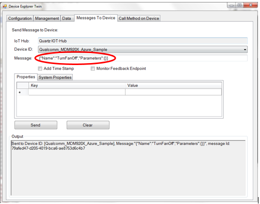

Run a simple C sample on MDM920x device running ThreadX OS
===
---

# Table of Contents

-   [Step 1: Introduction](#Introduction)
-   [Step 2: BUILDING AZURE IOT SDK FOR MDM920X](#Build)

# Step 1: Introduction

The document describes the steps required to install, build and run Azure IoT SDK for C on a MDM920x based development platform. 

## 1.1 PREREQUISITES

-   Download MDM920x LTE-IoT SDK from Qualcomm portal (<https://chipcode.qti.qualcomm.com>). The software package for MDM920x development kit
-   Download the following documents:

    80-P8101-35 (MDM920x ThreadX QAPI Usage Guide),
    80-P8101-33 (LTE-IoT SDK User Guide),
    80-PJ736-3 (Azure Porting layer User guide) and
    80-P8101-26 (Qualcomm Application Programming Interface for MDM920x ThreadX OS 3.0) from <https://createpoint.qti.qualcomm.com>.

## 1.2 BUILDING SAMPLE APPLICATIONS

-   MDM920x LTE-IoT SDK contains sample applications that demonstrate usage of Qualcomm APIs (QAPI) and provides a CLI -based interface to test chip features.

-   Refer to the MDM920x LTE-IoT SDK on steps to build the sample applications.

### 1.2.1 SUPPORTED TOOLCHAINS
The SDK contains build scripts for the following toolchains:

-   Snapdragon LLVM ARM compiler toolchain to build programs from C, C++ or ARM assembly language source for ARM-based processors. The toolchain supports Windows and Linux platform and can be downloaded from the Qualcomm website at: 

    **Linux:** <https://createpoint.qti.qualcomm.com/tools/#suite/2402/19982>

    **Windows:** <https://createpoint.qti.qualcomm.com/tools/#suite/2403/19981>

    Supported Version: 4.0.3

Add tool chain binaries path to environment variables.

**Linux:**

    export LLVMROOT=/pkg/qct/software/llvm/release/arm/4.0.3
    export TOOLCHAIN_PATH=$LLVMROOT/bin

**Windows:**

    set LLVMROOT=c:/apps/LLVM/4.0.3
    set TOOLCHAIN_PATH=$LLVMROOT/bin

-   ARM compiler toolchain to build programs from C, C++ or ARM assembly language source for ARM-based processors. The toolchain supports Windows and Linux platform and can be downloaded from the ARM website at: <https://developer.arm.com/products/software-development-tools/compilers/legacy-compiler-releases>

    Supported Version: 5.0.5

Add tool chain binaries path to environment variables.

**Linux:**

    export ARMCC5LIB=C:\Apps\ARMCT5.05\106\lib
    export ARMCC5BIN=C:\Apps\ARMCT5.05\106\bin
    export ARMCC5INC=C:\Apps\ARMCT5.05\106\include 
    export ARMLMD_LICENSE_FILE=<license_info>

**Windows:**

    set ARMCC5LIB=C:\Apps\ARMCT5.05\106\lib
    set ARMCC5BIN=C:\Apps\ARMCT5.05\106\bin
    set ARMCC5INC=C:\Apps\ARMCT5.05\106\include  
    set ARMLMD_LICENSE_FILE=<license_info>

### 1.2.2 OTHER REQUIREMENTS

**Cygwin:**

-   Support scripts on windows are shell script based and need Cygwin 2.10.0 or higher. 

**Trace32 JTAG:**

-   Trace32 is an USB based JTAG debugger used by flash and debug scripts are provided in the SDK. The drivers for Trace32 USB interface can be downloaded from: <https://www.lauterbach.com>

# Step 2: BUILDING AZURE IOT SDK FOR MDM920X
## 2.1 SETTING UP IOT HUB

An Azure IoT account is required to create an IoT Hub. Refer to the link below on how to create the IoT Hub:

    https://github.com/Azure/azure-iot-sdk-csharp/blob/master/doc/setup_iothub.md

## 2.2 CREATING A DEVICE

To communicate with the Azure IoT cloud a device instance must be created on the IoT Hub. The device can be created by a PC based tool called Device Explorer. The Device Explorer binary can be downloaded from below link:

    https://github.com/Azure/azure-iot-sdk-csharp/tree/master/tools/DeviceExplorer

   To create a new device-

   1.  Select the management tab, then click create.
   2.  In the pop-up window specify a Device ID
   3.  Click Create. The device is now created on the IoT Hub

Creating a Device:

## 2.3 IOT HUB DEVICE CONNECTION STRING

Each device has a unique connection string. The connection string is used by devices to-

-   Create a secure connection to the IoT Hub
-   Send Device to Cloud messages
-   Receive Cloud to Device messages
-   Response direct method

Connection string format-

    HostName=<Host Name>;DeviceId=<Device Name>;SharedAccessKey=<Device Key>

To obtain the device connection string, right-click on the device instance on selected device and select **Copy connection string for selected device**. Save this connection string for future use.

Connection String:

## 2.4 DOWNLOAD AZURE IOT SDK FOR C

Below steps assume that MDM920x LTE-IoT SDK has been installed at [target] location.

Azure SDK in MDM920x has been tested against branch 2018-03-02. Git client is required to clone the repository.

1.  Navigate to [target]\Azure_SDK directory
2.  Run the following command to clone the Azure IoT SDK C repository.

        git clone -b 2018-03-02 --recursive https://github.com/Azure/azure-iot-sdk-c.git

## 2.5 BUILDING DEMO APPLICATION WITH AZURE IOT SDK FOR C

Following steps should be followed to build the Azure application for the first time.

-   Azure SDK requires Qualcomm platform shim library (azure\_sdk\_port.lib) to be present under `[target]\AZURE_SDK\build\libs` directory
-   Navigate to the location of build scripts directory

    `cd [target]\AZURE_SDK\build\`

-   `build_azure_sdk_lib_llvm.sh` and `build_azure_sdk_lib_arm_cc.sh` are reference scripts to build the Azure IOT SDK for C library using LLVM and ARM RVCT compilers
-   `build_azure_sdk_app_llvm.sh` and `build_azure_sdk_app_arm_cc.sh` are reference scripts to build the Azure IOT application using LLVM and ARM RVCT compilers
-   `txm_module_preamble_llvm.S` and `txm_module_preamble_arm_cc.S` are preamble files that can be used as reference in generating an user space application binary for ThreadX OS

## 2.6 TEST PROCEDURE

As part of the Azure application, the caller is expected to perform the following operations.

1.  Attach with LTE/3G/NB-IoT cellular network
2.  Bring-up the data call successfully and obtain the IP address
3.  Configure the DNS server information to resolve the host names
4.  Certificate management to store the certificates securely in the device 
Refer to the documentation section for more information and these documents are available through <https://createpoint.qti.qualcomm.com>

Click **Refresh** on Device explorer, you will see the device in connected state:

/ ***Sending a message to the device from Device Explorer Twin*** /

Select **Message To Device** tab on Device Explorer, select your device ID from drop down, and enter the following message-

`{"Name":"TurnFanOff","Parameters":{}}`  

Send Data from IoT Hub/Device Explorer Twin to Device:

/ ***Other commands to be tried*** /

`{"Name":"TurnFanOn", "Parameters":{}}`
