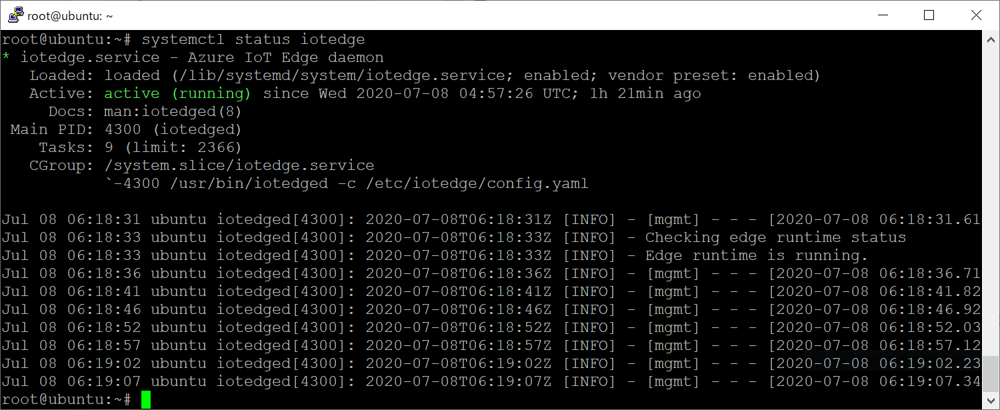
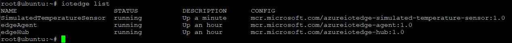

Run a simple sample on e-RT3 Plus (F3RP70-2L) device running Ubuntu 18.04.
===

# Table of Contents

-   [Introduction](#Introduction)
-   [Step 1: Prerequisites](#Prerequisites)
-   [Step 2: Prepare your Device](#PrepareDevice)
-   [Step 3: Manual Test for Azure IoT Edge on device](#Manual)
-   [Step 4: Next Steps](#NextSteps)

# Introduction

**About this document**

This document describes how to connect e-RT3 Plus (F3RP70-2L) device running Ubuntu 18.04 with Azure IoT Edge Runtime pre-installed and Device Management. This multi-step process includes:

-   Configuring Azure IoT Hub
-   Registering your IoT device
-   Build and Deploy client component to test device management capability 

# Step 1: Prerequisites

You should have the following items ready before beginning the process:

-   [Setup your IoT Hub](https://account.windowsazure.com/signup?offer=ms-azr-0044p)
-   [Provision your device and get its credentials][lnk-manage-iot-hub]
-   [Sign up to IoT Hub](https://account.windowsazure.com/signup?offer=ms-azr-0044p)

# Step 2: Prepare your Device

## 2.1 Install IoT Edge Runtime

Install these packages:
-   Moby engine
-   IoT Edge security daemon

**Details of the steps:**

**Moby engine:**
See [this page](https://docs.microsoft.com/en-us/azure/iot-edge/how-to-install-iot-edge-linux#install-iot-edge-and-container-runtimes) section "Register Microsoft key and software repository feed" and "Install a container runtime", install moby-engine and moby-cli. 

**IoT Edge security daemon:**
See [this page](https://docs.microsoft.com/en-us/azure/iot-edge/how-to-install-iot-edge-linux#install-runtime-using-release-assets) step 4., install libiothsm-std and iotedge. Your device can run *armhf* architecture.

## 2.2 Connect to IoT Hub
See [this page](https://docs.microsoft.com/en-us/azure/iot-edge/how-to-install-iot-edge-linux#configure-the-security-daemon) section "Configure the security daemon", connect your device to IoT Hub and verify successful installation.

## 2.3 Deploy a module
See [this page](https://docs.microsoft.com/en-us/azure/iot-edge/quickstart-linux#deploy-a-module) section "Deploy a module", deploy *Simulated Temperature Sensor* module on your device.

# Step 3: Manual Test for Azure IoT Edge on device

This section walks you through the test to be performed on the Edge devices running the Linux operating system such that it can qualify for Azure IoT Edge certification.

**Check the iotedge daemon command:** 

Open the terminal software on your IoT Edge device, confirm that the Azure IoT edge Daemon is under running state

    systemctl status iotedge

 

Open the command prompt on your IoT Edge device, confirm that the module deployed from the cloud is running on your IoT Edge device

    iotedge list

  

On the device details page of the Azure, you should see the runtime modules - edgeAgent, edgeHub and tempSensor modueles are under running status

 

# Step 4: Next steps

If you want to use some useful function for your device, for example, API, I/O access, see Instruction Manual on [this page](https://partner.yokogawa.com/global/). You can see it you sign up to *Yokogawa partner portal*.
  
[setup-devbox-linux]: https://github.com/Azure/azure-iot-sdk-c/blob/master/doc/devbox_setup.md
[lnk-setup-iot-hub]: ../setup_iothub.md
[lnk-manage-iot-hub]: ../manage_iot_hub.md
