Azure IoT Certification Steps for the PrimeMini IoT device running on Ubuntu 18.04.4 LTS
===
---

# Table of Contents

-   [Introduction](#Introduction)
-   [Step 1: Prepare development environment](#Preparedevelopment)
-   [Step 2: Build the C SDK on Linux](#Build)
-   [Step 3: Setup your IoT hub](#Setup)
-   [Next Steps](#NextSteps)

# Introduction

**About this document**

This document describes how to connect PrimeMini IoT device running on Ubuntu 18.04.4 LTS with Azure IoT Edge Runtime pre-installed and Device Management. This multi-step process includes:

-   Configuring Azure IoT Hub
-   Registering your IoT device
-   Build and Deploy client component to test device management capability 

##1. Prepare development environment:

### Set up a Linux development environment.

-   Please make sure all dependencies are installed before building the SDK. For Ubuntu, you can run the following commands:

        Iot:~$ apt-get update
        Iot:~$ apt-get install -y git cmake build-essential curl libcurl4-openssl-dev libssl-dev uuid-dev

-   Verify that CMake is at least version 3.10.2 by running the command below.

  

-   Verify that gcc is at least version 7.5.0.

  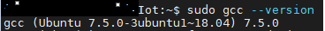

-   Locate the tag name for the [latest release](https://github.com/Azure/azure-iot-sdk-c/releases/tag/LTS_07_2020_Ref01) of the SDK.
-   The release tag names are date values in LTS\_mm\_yyyy format and I used the following version: “LTS\_07\_2020\_Ref01 “.
-   Clone the latest release of SDK to your local machine using the tag name you find by running the following command: 

        git clone -b  LTS_07_2020_Ref01  [https://github.com/Azure/azure-iot-sdk-c.git](https://github.com/Azure/azure-iot-sdk-c.git)
        cd azure-iot-sdk-c && git submodule update –init

##2. Build the C SDK on Linux

To build the SDK: please run the following commands:

    cd azure-iot-sdk-c
    mkdir cmake
    cd cmake
    cmake ..
    cmake --build . # append '-- -j <n>' to run <n> jobs in parallel

##3. Setup your IoT hub

-   Install the Azure IoT Edge runtime on Ubuntu 18.04.4 LTS
 
First you need to Install IoT Edge and container runtimes by installing the repository configuration via the following command:

    curl https://packages.microsoft.com/config/ubuntu/18.04/multiarch/prod.list > ./microsoft-prod.list
-	Then Copy the generated list:

        sudo cp ./microsoft-prod.list /etc/apt/sources.list.d/
-   Install Microsoft GPG public key:

        curl https://packages.microsoft.com/keys/microsoft.asc | gpg --dearmor > microsoft.gpg
        sudo cp ./microsoft.gpg /etc/apt/trusted.gpg.d/
-   Install a container runtime:
Please update the package lists on your device.

        sudo apt-get update
-   Install the Moby engine:

        sudo apt-get install moby-engine
-   Install the Moby command-line interface (CLI). 
The CLI is useful for development but optional for production deployments:

        sudo apt-get install moby-cli

-   Install the Azure IoT Edge Security Daemon:
The IoT Edge security daemon provides and maintains security standards on the IoT Edge device. The daemon starts on every boot and bootstraps the device by starting the rest of the IoT Edge runtime.

        Please update package lists on your device:
        sudo apt-get update

-   Check to see which versions of IoT Edge are available:

        apt list -a iotedge

-   You will get the following result:
 
  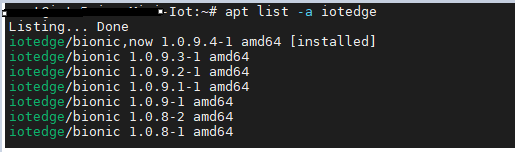

The version number I used here is 1.0.9.4-1. To install this version please run the following command:

    apt-get install iotedge=1.0.9* libiothsm-std=1.0.9*

-   Configure the security daemon:

Please note my configuration is built on Manual provisioning.

-   Configure the IoT Edge runtime to link your physical device with a device identity that exists in an Azure IoT hub.

-   The daemon can be configured using the configuration file at `/etc/iotedge/config.yaml`. The file is write-protected by default, and you might need elevated permissions to edit it.To edit the file, you need to run the following command:

        chmod 644 /etc/iotedge/config.yaml && vi /etc/iotedge/config.yaml

-   In the device “device connection string” please add the connection:
  
  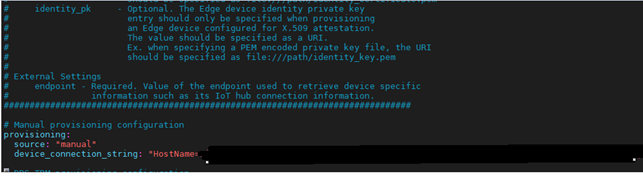

-   The connection string will be generated while creating submission for your device under <https://aics.azureiotsolutions.com/catalogDeviceId/>

  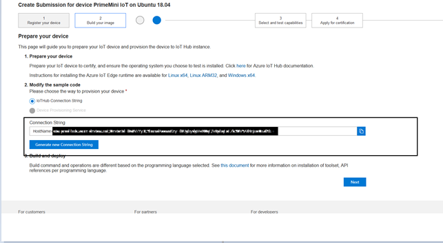	 

-   After adding the connection string save, and close the vi editor.
Then you need to start Azure IoT Edge Security Daemon by running the following command:

        sudo systemctl restart iotedge

-   Verify the configuration by running the following command:

        systemctl status iotedge

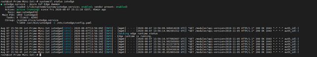

-   Now deploy my IOT Edge to a virtual Ubuntu 18.04 by using Linux machine:
To deploy the machine, you need to install Azure CLI with apt by using the following command:

        curl -sL https://aka.ms/InstallAzureCLIDeb | sudo bash 

-   Then add the azure IoT extension to the Cloud Shell instance by running the following command:

        az extension add --name azure-iot

-   Then login to the azure account:

        az login -u username -p password

-   Once you are logged in you will get the follow message:

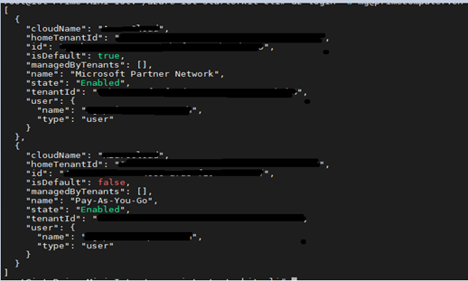

-   To deploy a VM you need to run the following command:

        az group create --name IoTEdgeResources --location westus2

        az iot hub create --resource-group IoTEdgeResources --name PMIOT --sku S1 --partition-count 2

        az iot hub device-identity create --device-id PrimeMiniIoT --edge-enabled --hub-name PMIOT

        az iot hub device-identity show-connection-string --device-id PrimeMiniIoT --hub-name PMIOT

        az deployment group create --resource-group IoTEdgeResources --template-uri "https://aka.ms/iotedge-vm-deploy" --parameters dnsLabelPrefix='pm-iot-vm' --parameters adminUsername='myusername' --parameters deviceConnectionString=$(az iot hub device-identity show-connection-string --device-id PrimeMiniIoT --hub-name PMIOT -o tsv) --parameters authenticationType='password' --parameters adminPasswordOrKey="mypassword"

-   Once the deployment is complete, you should receive a JSON-formatted output in the CLI that contains the SSH information to connect to the virtual machine. Copy the value of the public SSH entry of the outputs section:

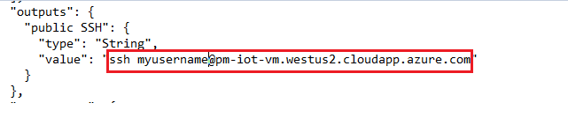

-   View the IoT Edge runtime status:

1.  You can see what's happening on the device. If you're using a virtual machine, connect to that machine now using the admin username that you set up and the DNS name (pm-iot-vm.westus2.cloudapp.azure.com) that was output by the deployment command. The connection would be made via ssh.

2.  Check to see that the IoT Edge security daemon is running as a system service:

        sudo systemctl status iotedge

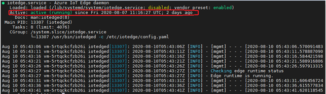

-   Deploy a module:

Manage your Azure IoT Edge device from the cloud to deploy a module that will send telemetry data to IoT Hub.To deploy your first module from the Azure Marketplace, use the following steps:

1.  Sign in to the Azure portal and navigate to your IoT hub.
2.  From the menu on the left pane, under Automatic Device Management, select IoT Edge.
3.  Click on the device ID of the target device from the list of devices.
4.  On the upper bar, select Set Modules.

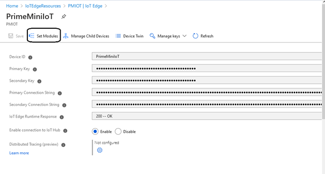

-   In the IoT Edge Modules section of the page, click Add and select Marketplace Module from the drop-down menu.
 
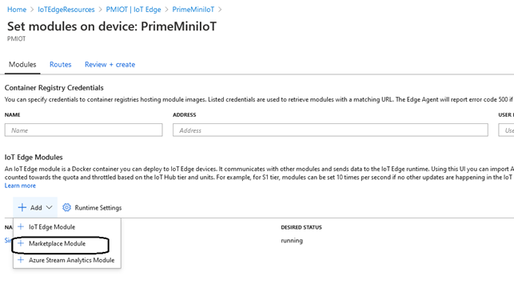

-   In the IoT Edge Module Marketplace, search for "Simulated Temperature Sensor" and select that module.
 
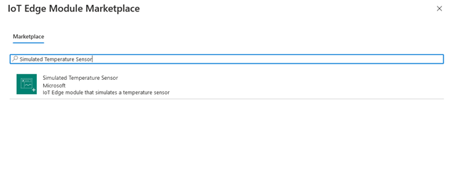 

-   Notice that the SimulatedTemperatureSensor module is added to the IoT Edge Modules section, with the desired status running.

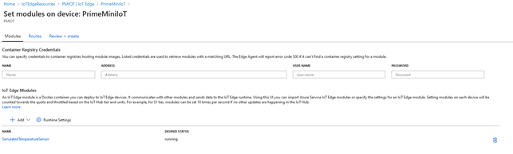

-   Select Next: Routes to continue to the next step of the wizard.

On the Routes tab of the wizard, you can define how messages are passed between modules and the IoT Hub. Routes are constructed using name/value pairs. You should see two routes on this page. The default route called Route sends all messages to IoT Hub (which is called $upstream).A second route called SimulatedTemperatureSensorToIoTHub was created automatically when you added the module from the Marketplace.This route sends all messages specifically from the simulated temperature module to IoT Hub. You can delete the default route because it's redundant in this case.

-   **Select Next:** Review + create to continue to the next step of the wizard.

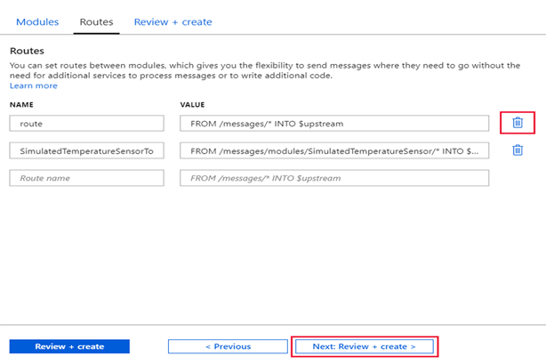

On the Review + create tab of the wizard, you can preview the JSON file that defines all the modules that get deployed to your IoT Edge device. Notice that the SimulatedTemperatureSensor module is included as well as the two runtime modules, edgeAgent and edgeHub. Select Create when you're done reviewing.
-   When you submit a new deployment to an IoT Edge device, nothing is pushed to your device. Instead, the device queries IoT Hub regularly for any new instructions.If the device finds an updated deployment manifest, it uses the information about the new deployment to pull the module images from the cloud then starts running the modules locally. This process may take a few minutes.
-   After you create the module deployment details, the wizard returns you to the device details page. On the device details page, view the deployment status in the Modules tab.Three modules should be listed: $edgeAgent, $edgeHub, and SimulatedTemperatureSensor. If one or more of the modules are listed as specified in deployment but not reported by device, your IoT Edge device is still starting them.Wait a few moments and select Refresh at the top of the page.

  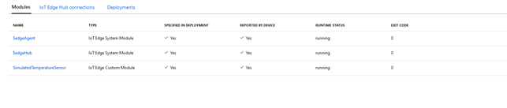

-   To verify your configuration please run:

        sudo iotedge list

  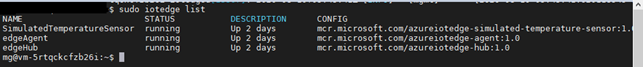

# Next Steps

You have now learned how to run a sample application that collects sensor data and sends it to your IoT hub. To explore how to store, analyze and visualize the data from this application in Azure using a variety of different services, please click on the following lessons:

-   [Manage cloud device messaging with iothub-explorer]
-   [Save IoT Hub messages to Azure data storage]
-   [Use Power BI to visualize real-time sensor data from Azure IoT Hub]
-   [Use Azure Web Apps to visualize real-time sensor data from Azure IoT Hub]
-   [Weather forecast using the sensor data from your IoT hub in Azure Machine Learning]
-   [Remote monitoring and notifications with Logic Apps]   

[Manage cloud device messaging with iothub-explorer]: https://docs.microsoft.com/en-us/azure/iot-hub/iot-hub-explorer-cloud-device-messaging
[Save IoT Hub messages to Azure data storage]: https://docs.microsoft.com/en-us/azure/iot-hub/iot-hub-store-data-in-azure-table-storage
[Use Power BI to visualize real-time sensor data from Azure IoT Hub]: https://docs.microsoft.com/en-us/azure/iot-hub/iot-hub-live-data-visualization-in-power-bi
[Use Azure Web Apps to visualize real-time sensor data from Azure IoT Hub]: https://docs.microsoft.com/en-us/azure/iot-hub/iot-hub-live-data-visualization-in-web-apps
[Weather forecast using the sensor data from your IoT hub in Azure Machine Learning]: https://docs.microsoft.com/en-us/azure/iot-hub/iot-hub-weather-forecast-machine-learning
[Remote monitoring and notifications with Logic Apps]: https://docs.microsoft.com/en-us/azure/iot-hub/iot-hub-monitoring-notifications-with-azure-logic-apps
[setup-devbox-windows]: https://github.com/Azure/azure-iot-sdk-csharp/blob/master/doc/devbox_setup.md
[lnk-setup-iot-hub]: ../setup_iothub.md
[lnk-manage-iot-hub]: ../manage_iot_hub.md

