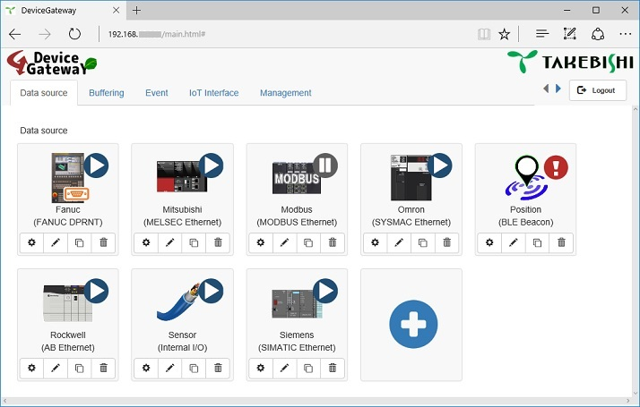
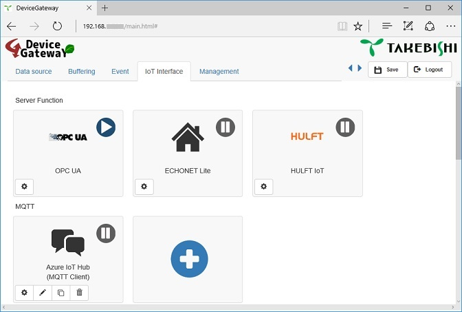
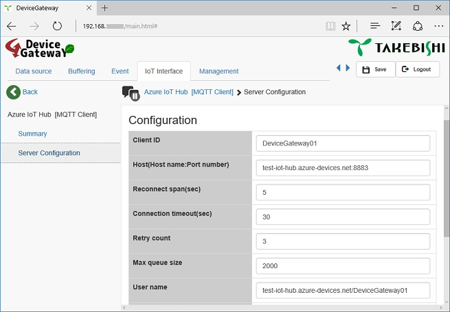
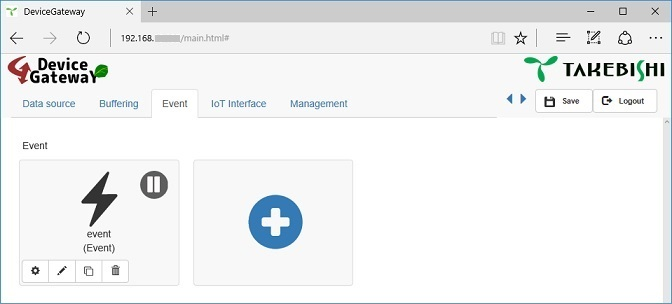
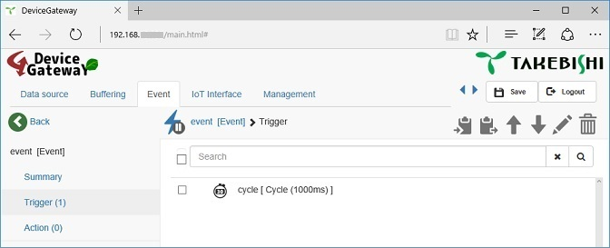
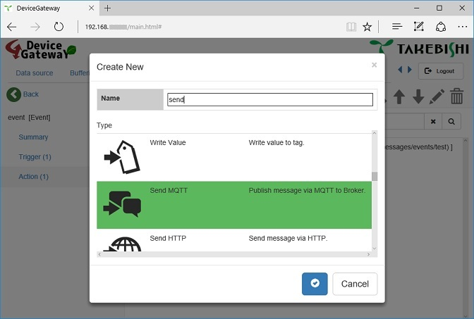
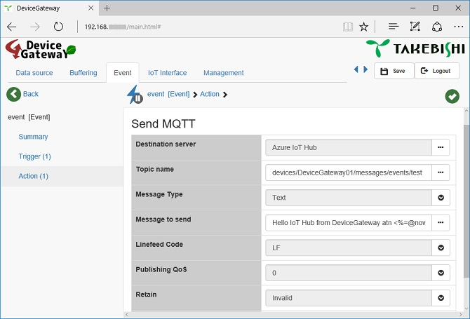
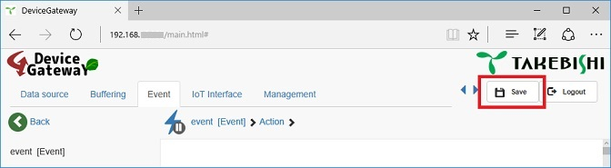

Make simple event logic on DeviceGateway to send MQTT message to Azure IoT Hub
===
---

# Table of Contents

-   [Introduction](#Introduction)
-   [Step 1: Prerequisites](#Prerequisites)
-   [Step 2: Prepare your Device](#PrepareDevice)
-   [Step 3: Configure connection and event logic on your Device](#Configure)
-   [Next Steps](#NextSteps)

# Introduction

**About this document**

This document describes how to connect DeviceGateway with Azure IoT Hub. This multi-step process includes:
-   Configuring Azure IoT Hub.
-   Registering your DeviceGateway.
-   Configure your DeviceGateway (You don't need building or programming anything).

# Step 1: Prerequisites

You should have the following items ready before beginning the process:

-   [Setup your IoT Hub][lnk-setup-iot-hub].
-   [Provision your device and get its credentials][lnk-manage-iot-hub].
-   [Generate SAS token by using Device Explorer tool which is included in Device SDK](https://docs.microsoft.com/ja-jp/azure/iot-hub/iot-hub-mqtt-support).
-   DeviceGateway device.

# Step 2: Prepare your Device

At first, you should make your DeviceGateway join your LAN because you configure your DeviceGateway via WebUI.
And make data source setting on your DeviceGateway if you need.
For detail, please refer tutorial in the [user's guide](https://www.faweb.net/us/download/).

-   Configure IP address of DeviceGateway.
-   Configure data source to collect data from industrial controler(e.g. PLC, NC) if you need.

    

# Step 3: Configure event logic

## 3.1 Make connection with IoT Hub

-   Open [IoT Interface] tab in WebUI menu.

-   Click create button(plus icon).

-   Specify connection name as you like(e.g. Azure IoT Hub) and click apply button(check mark).

    

-   Click configuration button(gear icon) of this MQTT client which was created now.

-   Click [Server Configuration] on left bar.

-   Type Device ID of IoT Hub into [Client ID]. This Device ID is that you defined it when you generated SAS token with using Device Explorer tool.(e.g. DeviceGateway01)

-   Type hostname which appears in your IoT Hub, into [Host]. The [Host] is specified like a following address.

        {iothubhostname}.azure-devices.net:8883

-   Type following text into [User name].

        {iothubhostname}/{device_id}

-   Type following text into [Password]. You can copy and paste part of the SAS token which was generated by Device Explorer tool.

        SharedAccessSignature sig={signature-string}&se={expiry}&sr={URL-encoded-resourceURI}

-   Change [Use TLS] to Valid.

    

## 3.2 Send messages to IoT Hub

### 3.2.1 Make Event

-   Open [Event] tab in WebUI menu.

-   Click create button(plus icon).

-   Specify event name as you like and click apply button(check mark).

-   Click configuration button(gear icon) of this event which was created now.

    

### 3.2.2 Make Trigger in the event

-   Click Trigger on left bar.

-   Click create button(plus icon) on tool bar.

-   Specify trigger name as you like and select Cycle as Type, and click apply button.(Cycle trigger is created as default parameter e.g. 1000ms cycle)

    

### 3.2.3 Make Action in the event

-   Click Action on left bar.

-   Click create button(plus icon) on tool bar.

-   Specify action name as you like and select Send MQTT as Type, and click apply button.

    

-   Click action which was created now to show properties.

-   Choose connection setting which was created at the step 3.1 as Destination server.

-   Type following text into [Topic name]. {device_id} was specified at step 3.1.

        devices/{device_id}/messages/events/{property_tag}

-   Type message as you like into the [Message to send]. If you want embedded the value of data source into message, please click [...] button to insert macro via toolbar of text dialog.

-   Click green check button on tool bar to apply changes of properties.

    

### 3.2.4 Save changes

-   Click [Save] button on the right edge of menu bar of WebUI. (If you can not find it, changes are applied already or you don't change anything.)

    

## 3.3 Receive messages from IoT Hub

-   See [Manage IoT Hub][lnk-manage-iot-hub] to learn how to send cloud-to-device messages to the application.

-   Make a [Received MQTT Trigger] in the same procedures as in step 3.2, and specify following text into [Topic name] of [Received MQTT Trigger].

        devices/{device_id}/messages/devicebound/#

-   Insert [Event Context] macro to refer received text message from actions. If you need to parse json, you can use [Get Json Element] action. If you need to write data to industrial controller, you can use [Write value] action. For detail, please refer [user's guide](https://www.faweb.net/us/download/).

# Next Steps

You have now learned how to configure DeviceGateway that collects data from sensor or industrial controlers and sends it to your IoT hub. To explore how to store, analyze and visualize the data from this application in Azure using a variety of different services, please click on the following lessons:

-   [Manage cloud device messaging with iothub-explorer]
-   [Save IoT Hub messages to Azure data storage]
-   [Use Power BI to visualize real-time sensor data from Azure IoT Hub]
-   [Use Azure Web Apps to visualize real-time sensor data from Azure IoT Hub]
-   [Weather forecast using the sensor data from your IoT hub in Azure Machine Learning]
-   [Remote monitoring and notifications with Logic Apps]   

[Manage cloud device messaging with iothub-explorer]: https://docs.microsoft.com/en-us/azure/iot-hub/iot-hub-explorer-cloud-device-messaging
[Save IoT Hub messages to Azure data storage]: https://docs.microsoft.com/en-us/azure/iot-hub/iot-hub-store-data-in-azure-table-storage
[Use Power BI to visualize real-time sensor data from Azure IoT Hub]: https://docs.microsoft.com/en-us/azure/iot-hub/iot-hub-live-data-visualization-in-power-bi
[Use Azure Web Apps to visualize real-time sensor data from Azure IoT Hub]: https://docs.microsoft.com/en-us/azure/iot-hub/iot-hub-live-data-visualization-in-web-apps
[Weather forecast using the sensor data from your IoT hub in Azure Machine Learning]: https://docs.microsoft.com/en-us/azure/iot-hub/iot-hub-weather-forecast-machine-learning
[Remote monitoring and notifications with Logic Apps]: https://docs.microsoft.com/en-us/azure/iot-hub/iot-hub-monitoring-notifications-with-azure-logic-apps
[setup-devbox-linux]: https://github.com/Azure/azure-iot-sdk-c/blob/master/doc/devbox_setup.md
[lnk-setup-iot-hub]: ../setup_iothub.md
[lnk-manage-iot-hub]: ../manage_iot_hub.md

