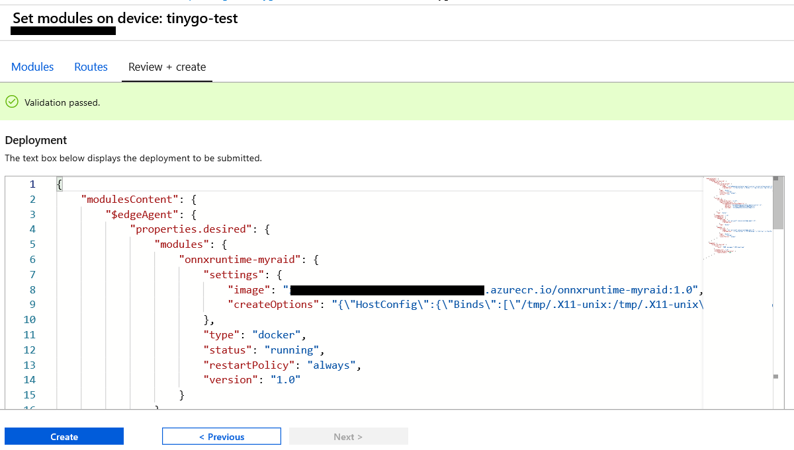

Run a simple C sample on AI-5032 running Ubuntu 16.04 
===
---

# Table of Contents

-   [Introduction](#Introduction)
-   [Step 1: Prerequisites](#Prerequisites)
-   [Step 2: Prepare your Device](#PrepareDevice)
-   [Step 3: Manual Test for Azure IoT Edge on device](#Manual)
-   [Step 4: Inference with IoT Edge and Hardware accelerator](#NextSteps)

# Introduction

**About this document**

This document describes how to connect AI-5032 device running Ubuntu 16.04 with Azure IoT Edge Runtime pre-installed and Device Management. This multi-step process includes:

-   Configuring Azure IoT Hub
-   Registering your IoT device
-   Build and Deploy client component to test device management capability 

# Step 1: Prerequisites

You should have the following items ready before beginning the process:

-   [Prepare your development environment][setup-devbox-linux]
-   [Setup your IoT hub](https://account.windowsazure.com/signup?offer=ms-azr-0044p)
-   [Provision your device and get its credentials][lnk-manage-iot-hub]
-   [Sign up to IOT Hub](https://account.windowsazure.com/signup?offer=ms-azr-0044p)
-   [Add the Edge Device](https://docs.microsoft.com/en-us/azure/iot-edge/quickstart-linux)
-   [Add the Edge Modules](https://docs.microsoft.com/en-us/azure/iot-edge/quickstart-linux#deploy-a-module)
-   AI-5032 device.

# Step 2: Prepare your Device

-   The URL for the device is <http://www.tinygo.com/index.php?c=article&id=50>
-   Connect the AI-5032 With LCD as computer   

# Step 3: Manual Test for Azure IoT Edge on device

This section walks you through the test to be performed on the Edge devices running the Linux operating system such that it can qualify for Azure IoT Edge certification.

## 3.1 Edge RuntimeEnabled (Mandatory)

**Details of the requirement:**

The following components come pre-installed or at the point of distribution on the device to customer(s):

-   Azure IoT Edge Security Daemon
-   Daemon configuration file
-   Moby container management system
-   A version of `hsmlib` 

*Edge Runtime Enabled:*

**Check the iotedge daemon command:** 

Open the command prompt on your IoT Edge device , confirm that the Azure IoT edge Daemon is under running state

    systemctl status iotedge

 

Open the command prompt on your IoT Edge device, confirm that the module deployed from the cloud is running on your IoT Edge device

    sudo iotedge list

  

On the device details page of the Azure, you should see the runtime modules - edgeAgent, edgeHub and tempSensor modueles are under running status

 

**Note**: Client Components must be shipped with the device 

# Step 4: Inference with IoT Edge and Hardware accelerator

## 4.1 Prerequisites

TinyGo AI-5032 embedded the Intel® Movidius VPUs. Before using the VPU accelerator, you need to install OpenVINO toolkit first.

-   [Download OpenVINO R3.1](https://software.intel.com/en-us/openvino-toolkit/choose-download)
-   [Install OpenVINO](https://docs.openvinotoolkit.org/2019_R3.1/_docs_install_guides_installing_openvino_linux.html#install-openvino)

And to manage and storage IoT Edge module image, we suggest to use [Azure Container Registery](https://docs.microsoft.com/en-us/azure/container-registry/container-registry-get-started-portal). You should create a Container Registery service, if you would like to go through the following tutorial. 

## 4.2 Build Azure IoT Edge Module with ONNXRuntime

For Linux, currently supports and is validated on **OpenVINO 2019 R3.1**.

Clone the **onnxruntime** repository into your device.

    git clone https://github.com/microsoft/onnxruntime.git

Move to the **onnxruntime/dockerfiles** directory.

    cd onnxruntime/dockerfiles

Create a python script file and copy the following code. Save as **test.py** on this directory.

    import onnxruntime as ort
    print("ONNX is now run on %s." % ort.get_device())

Open the **Dockerfile.openvino** file, add the following several lines on the bottom and save as **Dockerfile.tinygo**.

    COPY test.py .
    CMD ["python","test.py"]

Build the sample IoT Edge module image tagged **onnxruntime-myriad**. 

    docker build -t onnxruntime-myriad --build-arg DEVICE=MYRIAD_FP16 --network host -f Dockerfile.tinygo .

When build finish, you can do a local test to validate the image.

    docker run -it --network host --privileged -v /dev:/dev  onnxruntime-myriad:latest

The result is

    Myraid-VPU

Learn More:
*You can also test a specified model. [ONNX Model Zoo](https://github.com/onnx/models) has provded many onnx model. Just replace the inference code on test.py script and re-build it*.

## 4.3 Configure and deploy Edge Module to device

### Push the module to Container Registery

Now you can push the docker image you build above to Container Registery which will be deploy to Azure IoT Edge. 

Select Acess keys on the left panel  on the Container Registry portal. Save the **\<SERVER\>, \<USERNAME\>,\<PASSWORD\>** values.

Login in your account on terminal. Then tag the image **onnxruntime-myriad** to Container Registry server and push the image.

    docker login -u <USERNAME> -p <PASSWORD> <SERVER>
    docker tag onnxruntime-myriad <SERVER>/onnxruntime-myriad:1.0
    docker push

Select **Repositories** to check if the **onnxruntime-myraid:1.0** upload success.

## 4.4 Inference at edge with hardware accelerator

Go to the IoT Edge portal, Select Add an IoT Edge Device to create a new device.

Input a device ID and save.

Copy the **\<CONNECT STRING>**. Then select the **Set Module**.

Fill the Container Registry Credentials. Then Add an IoT Edge Module.

Input a module name and the **image URL** (\<server>/onnxruntime-myraid:1.0).

Select the **Container Create Options** and Copy the json below.

    {
        "HostConfig":{
            "Binds":["/tmp/.X11-unix:/tmp/.X11-unix","/dev:/dev"],
            "NetworkMode":"host",
            "IpcMode":"host",
            "Privileged":true
            }
    }

Create the Module with default settings.

Check if the module set success.

Open the terminal on device. Edit the line 33 in /etc/iotedge/config.yaml as below. Fill the **device_connect_string** with the **\<CONNECT STRING>** you copy above.

Wait minutes to let device pull the module. 
Check the IoT Edge module running status.

    iotedge list
  
[setup-devbox-linux]: https://github.com/Azure/azure-iot-sdk-c/blob/master/doc/devbox_setup.md
[lnk-setup-iot-hub]: ../setup_iothub.md
[lnk-manage-iot-hub]: ../manage_iot_hub.md
