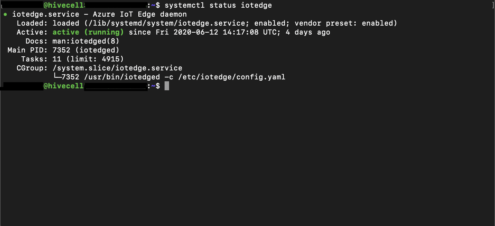
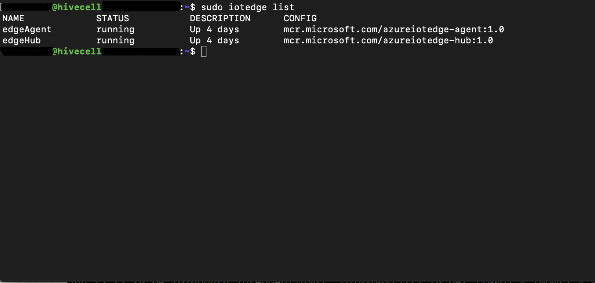

Run a simple Azure IoT esdge module on Hivecell One device running Ubuntu 18.04.
===
---

# Table of Contents

-   [Introduction](#Introduction)
-   [Step 1: Prerequisites](#Prerequisites)
-   [Step 2: Prepare your Device](#PrepareDevice)
-   [Step 3: Manual Test for Azure IoT Edge on device](#Manual)
-   [Step 4: Connecting device with the cloud](#Connectingtocloud)
-   [Step 5: Deploying pre-build module](#Step5Deployment)
-   [Additional items](#Additional)

# Introduction

**About this document**

This document describes how to connect Hivecell One device running Ubuntu 18.04 with Azure IoT Edge Runtime and Device Management and run simple package from Azure Marketplace. This multi-step process includes:

-   Configuring Azure IoT Hub
-   Deploying Azure IoT Runtime on device
-   Registering your IoT device
-   Deploing client component to test device management capability 

# Step 1: Prerequisites

You should have the following items ready before beginning the process:

-   [Setup your IoThub](https://docs.microsoft.com/en-us/azure/iot-hub/iot-hub-create-through-portal)
-   [Provision your device and get its credentials](https://docs.microsoft.com/en-us/azure/iot-hub/iot-hub-create-through-portal)
-   Internet connectivity via LAN (ethernet cable)

# Step 2: Prepare your Device

-   Unpack device from the box on receival
-   Attach ethernet cable and power cable on the back pancel.  You can check how it is done on the following video:
(<https://www.youtube.com/watch?v=KbPPrv7RZS0>)
-   Power on the device as per video above
-   Once it is loaded you are able to connect to it via the ssh. Credentials for initial ssh connect are provided in the box, device was shipped in.

# Step 3: Manual Test for Azure IoT Edge on device

## 3.1 Edge RuntimeEnabled (Mandatory)

**Details of the requirement:**

The following components come pre-installed or at the point of distribution on the device to customer(s):

-   Azure IoT Edge Security Daemon
-   Daemon configuration file
-   Moby container management system
-   Hivecell Platform agent

*Edge Runtime Enabled:*

**Check the iotedge daemon command:** 

Open the command prompt on your Hivecell One device, confirm that the Azure IoT edge Daemon is under running state

    systemctl status iotedge

 
Open the command prompt on your IoT Edge device, confirm that the module deployed from the cloud is running on your IoT Edge device

    sudo iotedge list

# Step 4: Connecting device with the cloud

During Iot Device creation in Azure IoT Hub  you were provided with Primary connection string. Copy it to the clipboard and execute instruction, step "Configure the security daemon: Option 1: Manual Provisioning"

<https://docs.microsoft.com/en-us/azure/iot-edge/how-to-install-iot-edge-linux>

After instruction execution you should be able to see connected devices in your Azure Iot Hub. 
Picture you see should be similar to:

# Step 5: Deploying pre-build module

Using instruction below deploy pre-build module that simulates temperature sensor:

<https://docs.microsoft.com/en-us/learn/modules/deploy-prebuilt-module-edge-device/6-exercise-deploying-prebuilt-module>

# Additional items

Additional help, support and consultations can be received by mailing on <mailto:inquiry@hivecell.com> or by using contact us form on our website - <https://hivecell.com>
