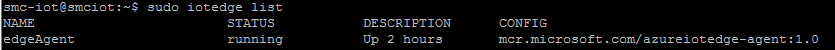
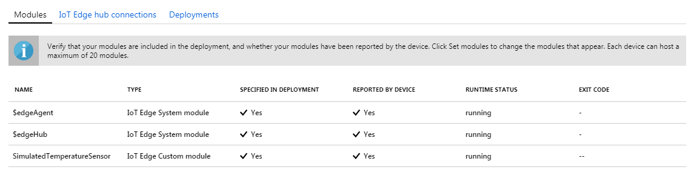
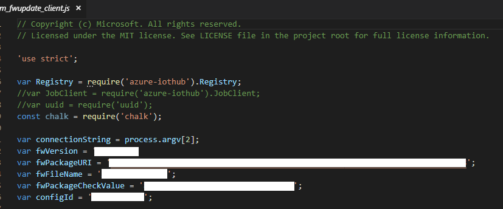
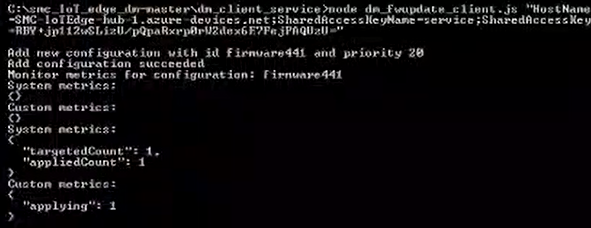
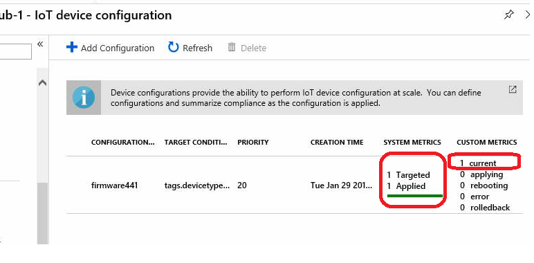
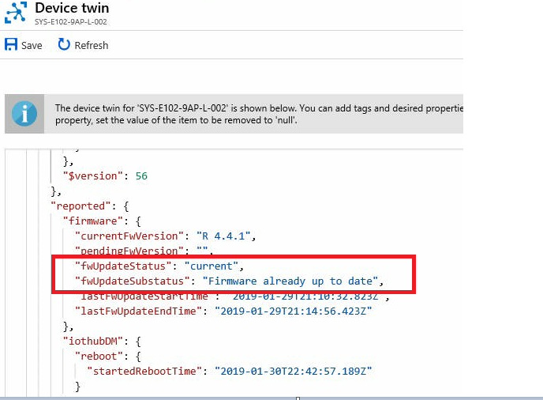
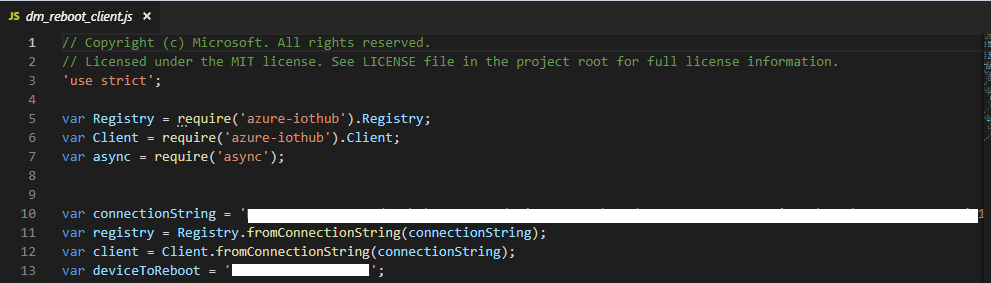
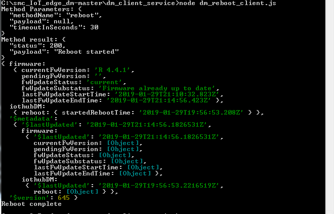
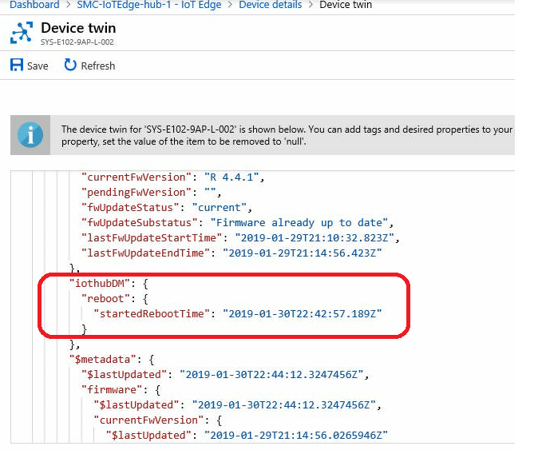

Run a back-end app sample for managing Supermicro SYS-E102-9AP-L Azure IoT edge device running Ubuntu 18.04
===
---

# Table of Contents

-   [Introduction](#Introduction)
-   [Step 1: Prerequisites](#Prerequisites)
-   [Step 2: Prepare your Device](#PrepareDevice)
-   [Step 3: Manual Test for Azure IoT Edge on device](#Manual)
-   [Step 4: Troubleshooting](#Step-4-Troubleshooting)

# Introduction

**About this document**

This document describes how to run a back-end application samples to manage Supermicro SYS-E102-9AP-L Azure IoT edge device, with Supermicro device management component and IoT edge Runtime preinstalled in Ubuntu 18.04. This multi-step process includes:

-   Configuring Azure IoT Hub
-   Registering your IoT device
-   Run back-end sample to test device management functionalities 

# Step 1: Prerequisites

You should have the following items ready before beginning the process:

-   Prepare your test environment in which you can run back-end sample apps
-   [Setup your IoT hub](https://account.windowsazure.com/signup?offer=ms-azr-0044p)
-   Add the Edge Device SYS-E102-9AP-L to IoT Hub and get its credentials

# Step 2: Prepare your Device

-   SYS-E102-9AP-L is a compact, embedded system comprised of the E102 chassis and the A2SAN-L single processor motherboard. The server is shipped with Non-ECC SO-DIMM of speeds up to 1866 MHz and one M.2 SSD of 120mm in length. Mount the system in place or leave on desk, connect 40W DC power.

# Step 3: Manual Test for Azure IoT Edge on device

This section walks you through the test to be performed on the Edge devices running the Linux operating system such that it can qualify for Azure IoT Edge certification.

## 3.1 Edge RuntimeEnabled (Mandatory)

**Details of the requirement:**

The following components come pre-installed or at the point of distribution on the device to customer(s):

-   Azure IoT Edge Security Daemon
-   Daemon configuration file
-   Moby container management system
-   A version of `hsmlib` 

*Edge Runtime Enabled:*

**Check the iotedge daemon command:** 

Open the command prompt on your IoT Edge device , confirm that the Azure IoT edge Daemon is under running state

    systemctl status iotedge

 

Open the command prompt on your IoT Edge device, confirm that the module deployed from the cloud is running on your IoT Edge device. You will only see edgeAgent module running out of box.

    sudo iotedge list

  

On the device details page of the Azure, you should see the runtime modules - edgeAgent, edgeHub and tempSensor modueles are under running status

 

## 3.2 Device Management (Mandatory)

**Pre-requisites:** Device Connectivity.

**Description:** Supermicro IoT edge device SYS-E102-9AP-L comes with preloaded device management service component can perform basic device management operations (Reboot and Firmware update) that are triggered by messages from IoT Hub.

**Check SMC device management daemon command:**

Open the command prompt on your IoT Edge device, confirm that the device management service Daemon is under running state.

    sudo systemctl status smc_dm.service

 

## 3.2.1 Firmware Update (Using Node.js Samples):

Supermicro provide Node.js test samples for Firmware Update feature and reboot feature. These test samples are modified Microsoft IoT client service samples for device management functionality verification purpose. You can download these samples from the following [link](https://github.com/smcmanmanz/iot_samples), and test them in a Node.js environment on your working computer or VM where it has internet access to Azure IoT Hub. 

To verify the Firmware Update functionality, open a shell or command prompt window in your test environment, and navigate to the folder in the Node.js project you downloaded. 

Open dm_fwupdate.client.js and fill in firmware information for the fields of fwVersion, fwPackageURI, fwFileName, fwPackageCheckValue, and configId, as shown below. Save the file after that.

**Note:** You should receive from Super Micro the values of the following fields: fwVersion, fwPackageURI, fwFileName, and fwPackageCheckValue.

 

Then run the following commands:

    npm install
    node dm_fwupdate_client.js "{your service connection string}"

IoT device client will get the message and report the status to the device twin.

 

Monitor the firmware update status from IoT Hub. After the firmware update, you should be able to see below status in the configuration you added to the hub using the client sample.

 

Navigate to device twin tab, and confirm the new firmware (R 4.4.1 in this example) in the IoT hub as below:

 

## 3.2.2 Reboot (Using Node.js Samples):

To verify reboot functionality on the device, open a shell or command prompt window in your test environment, and navigate to the folder in the Node.js project you downloaded. 

Open dm_reboot.client.js and fill in connectionString field with the IoT Hub service string, and deviceToReboot field with the device id you created in IoT Hub.

 

Then run the following commands:

    npm install
    node dm_reboot_client.js

The device reboots immediately, and you will see below reported reboot status from your reboot client sample.

 

Navigate to device twin tab in IoT Hub, and confirm the recorded last reboot time.
  
 

# Step 4: Troubleshooting

Please [contact](https://www.supermicro.com/about/contact/) engineering support for help with troubleshooting.
  
[setup-devbox-linux]: https://github.com/Azure/azure-iot-sdk-c/blob/master/doc/devbox_setup.md
[lnk-setup-iot-hub]: ../setup_iothub.md
[lnk-manage-iot-hub]: ../manage_iot_hub.md