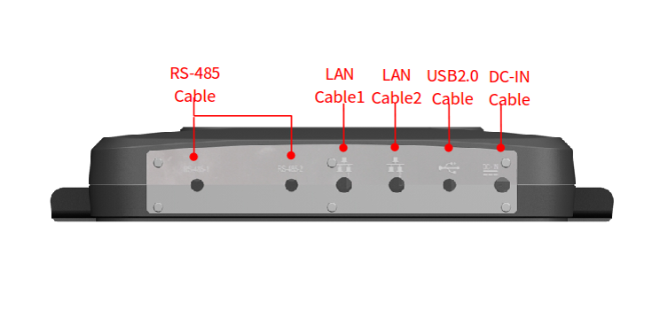
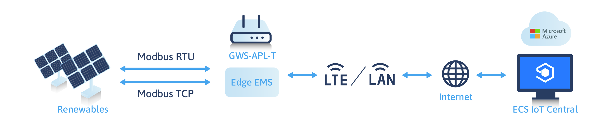
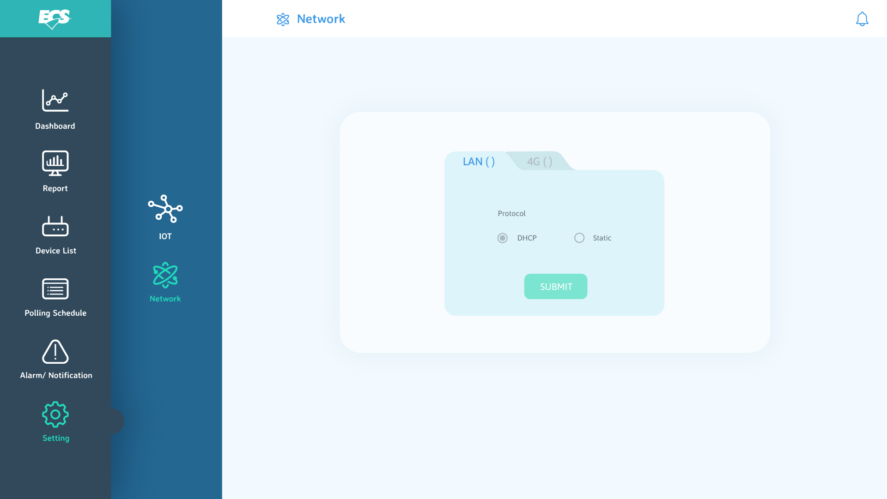
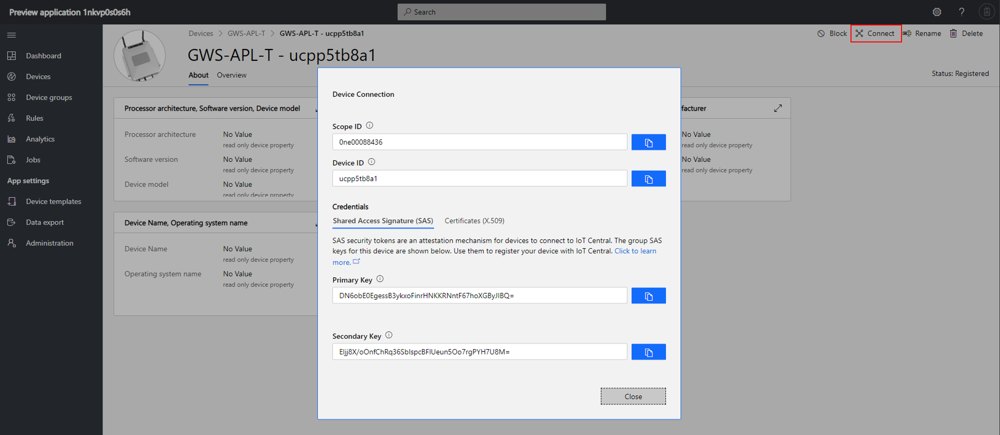
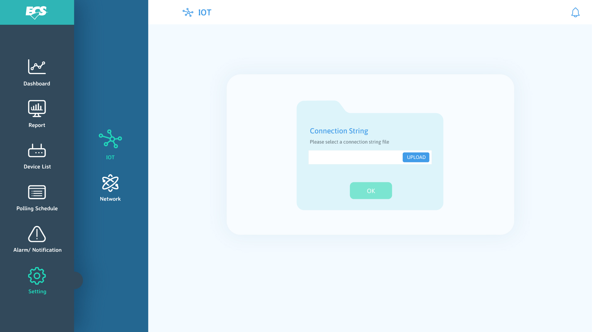
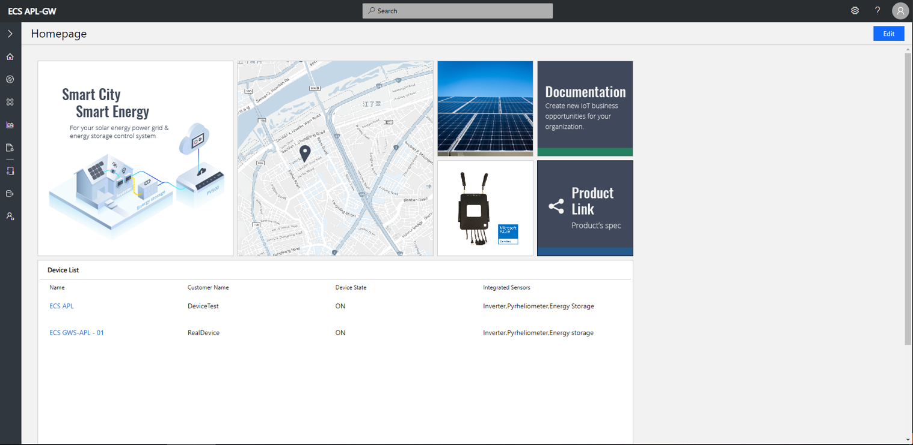
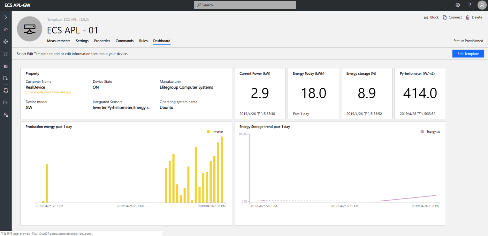

Connect GWS-APL-T device to your Azure IoT Central Application
===
---

# Table of Contents

-   [Introduction](#Introduction)
-   [Step 1: Prerequisites](#Prerequisites)
-   [Step 2: Device Connection Details](#DeviceConnectionDetails)
-   [Step 3: Prepare the Device](#PreparetheDevice)
-   [Step 4: Integration with IoT Central](#IntegrationwithIoTCentral)
-   [Step 5: Additional Links](#AdditionalLinks)

# Introduction 

**About this document**

This document describes how to connect GWS-APL-T to Azure IoT Central application using the IoT plug and Play model. Plug and Play simplifies IoT by allowing solution developers to integrate devices without writing any device code. Using Plug and Play, device manufacturers will provide a model of their device to cloud developers to be integrated quickly into IoT Central or any solution built on the Azure IoT platform. IoT Plug and Play will be open to the community by way of a definition language and SDKs.

# Step 1 : Prerequisites

You should have the following items ready before beginning the process: 

-   [Azure Account](https://portal.azure.com)

-   [Azure IoT Hub Instance](https://docs.microsoft.com/en-us/azure/iot-hub/about-iot-hub)

-   [Azure IoT Hub Device Provisioning Service](https://docs.microsoft.com/en-us/azure/iot-dps/about-iot-dps)

-   Provide Network connectivity (LTE, LAN) supported by the device and connect to our device

-   Prepare [ablerex](http://www.ablerex.com.tw), [SMA](https://www.sma.de/en/products/solarinverters.html), [IoLogik E1200 Series](https://www.moxa.com/en/products/industrial-edge-connectivity/controllers-and-ios/universal-controllers-and-i-os/iologik-e1200-series) Modbus device to conncet our device. 

-   Its mandatory that the device code/software image is preinstalled in device to enable Plug and Play

# Step 2 : Device Connection Details.

GWS-APL-T is a smart gateway solution. It's suitable for Solar Power Plants in order to aggregate, share and filter data, and then present all of the data and command on IoT central. In addition, you can set the configuration of Modbus easily to add more solar power devices via Web config page.

## GWS-APL-T Appearance

1.  Push the power button to power up GWS-APL-T. After that, your computer connects to GWS-APL-T LAN cable 1. Notice that your computer needs in the same network segment with GWS-APL-T. Please adjust your computer IP and Netmask.EX : IpAddress: 192.168.10.xxx Netmask: 255.255.255.0.	

    

2.  Open browser with `http://192.168.10.1:3001`. Set the network config to choose networking communication (LTE/LAN) on the network page.
3.  Set configuration of Modbus to add solar power devices such as Inverter, Pyranometer and temperature sensor. If want to know more detail, check [next part](#Step-3-:-Prepare-the-Device).
4.  GWS-APL-T will send Device to Cloud Message to Azure IoT Central or Azure IoT Hub.

# Step 3 : Prepare the Device.

1.  Selecting network interface(LAN or 4G LTE), default is LAN DHCP.
    -   Connecting GWS-APL-T cabel 1.
    -   Open browser with `http://192.168.10.1:3001`.

    

2. Set configuration of Modbus to add solar power devices in device List page.
    -   Basic Information
        -   **Device ID** : System will fill it automatically,it is unique id.
        -   **Device name** : Custom name for distinguishing exact device easily.
        -   **Device Template** : Choose which modbus template do you want. Support [ablerex](http://www.ablerex.com.tw), [SMA](https://www.sma.de/en/products/solarinverters.html), [IoLogik E1200 Series](https://www.moxa.com/en/products/industrial-edge-connectivity/controllers-and-ios/universal-controllers-and-i-os/iologik-e1200-series)  device currently.
    -   Configuration Definition
        -   **Slave ID** : Setting Modbus device slave id according to device spec.
        -   **IP** : Setting the IP address if use Modbus/TCP.
        -   **Port** : Setting IP port.(default : 502)
        -   **Assignment** : Select proper radio button to assign device to corresponding PnP telemetry defined by us.
        -   **Access Register** : Setting reading register.

3.  Get `Scope ID` , `Primary Key` and `Device ID` of SAS - Device Connection page in Azure IoT Central Application before generating connection string.
    -   **Step 1.** Select Device templates and import GWS-APL-T templates in IoT Central Application.
    
     

    -   **Step 2.** Select Devices and create GWS-APL-T device

    

    -   **Step 3.** After creating, clicke connect to get `Scope ID` , `Primary Key` and `Device ID`

    

    -   **Step 4.** Use [dps-keygen](https://www.npmjs.com/package/dps-keygen) to generate connection string and save it as text file on your computer.

    

    -  Open a browser with `http://192.168.10.1:3001` again. Select "IOT" tag page, and click "Browse" to find the connection string txt file which you saved it before upload.

    

-   If uploaded successfully,the telemetry will be showcase on IoT Central

# Step 4 : Integration with IoT Central

**Homepage**

**Device dashboard**

# Step 5 : Additional Links

Please refer to the below link for additional information for Plug and Play 

-   [Blog](https://azure.microsoft.com/en-us/blog/iot-plug-and-play-is-now-available-in-preview/)
-   [FAQ](TBD) 
-   [Plug and Play C SDK](https://github.com/Azure/azure-iot-sdk-c/tree/public-preview) 
-   [Plug and Play Node SDK](https://github.com/Azure/azure-iot-sdk-node/tree/digitaltwins-preview)
-   [Plug and Play Definitions](https://github.com/Azure/IoTPlugandPlay)