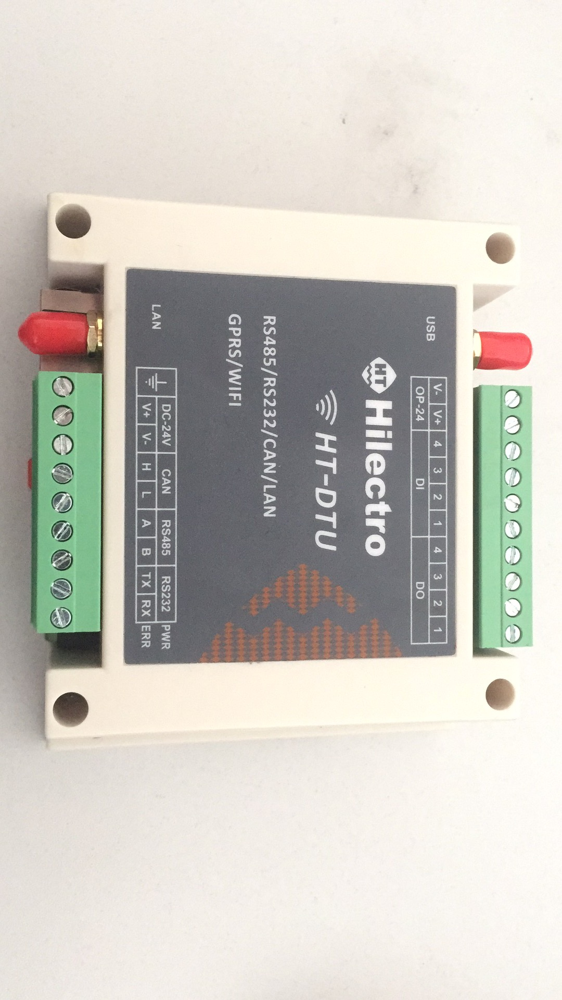
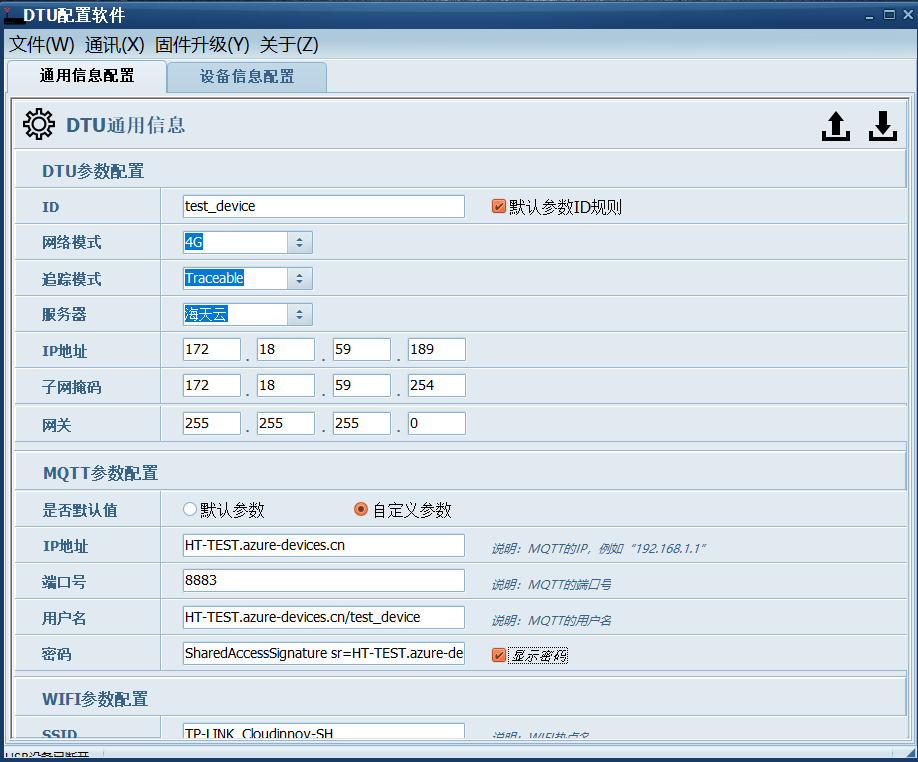

Run a simple C sample on supported HT-DTU M1 device running uCOS
===
---

# Table of Contents

-   [Introduction](#Introduction)
-   [Step 1: Prerequisites](#Prerequisites)
-   [Step 2: Prepare your Device](#PrepareDevice)
-   [Step 3: Build and Run the Sample](#Build)
-   [Next Steps](#NextSteps)

# Introduction

**About this document**

This document describes how to connect supported HT-DTU M1 device running uCOS with Azure IoT SDK. This multi-step process includes:
-   Configuring Azure IoT Hub
-   Registering your IoT device
-   Use HT-DTU M1 PC config tool to download the configs to HT-DTU M1 device
-	Validate the sample using secureCRT-serial-debug-tool and Device-Explorer-Twin

**About the HT-DTU M1**

HT-DTU M1 is Ningbo Haitian Drive Systems's development kits for developer and engineer to fast connect the iot internet.
Static state show:

-   HT-DTU M1's  picture

-   HT-DTU M1's PC config tool picture

# Step 1: Prerequisites

Before executing any of the steps below, read through each process, step by step
to ensure end to end understanding.

You should have the following items ready before beginning the process:

-   Required hardware:
    -   Prepare HT-DTU M1 hardware, it contains 1 CAN port, 1 RS485 port, 1 RS232 port, 4 IO import, 4 IO output and support 2G, 3G, 4G, wifi and Ethernet.

-   Required HT-DTU M1 PC config tool:
    -   Prepare HT-DTU M1 PC config tool, and install HT-DTU M1 USB driver.

# Step 2: Config your Device

-   After Configure Azure IoT Hub and Register your device, you can get your IOT Host Name, Device ID and SAS key.

-   Open HT-DTU M1 PC config tool and connect PC with HT-DTU M1 by USB.Fill the IOT Host Name, Device ID and SAS key to the DTU common msg 
config page.Then click **Common Msg Download** button to download the configs to HT-DTU M1 and you will recieve download success infomation in
the HT-DTU M1 PC config tool.

-   When all above process is complete, HT-DTU M1 has the ability to connect the Azure IOT center by MQTT Protocal, and will auto connect the
Azure MQTT Server when bootup.

# Step 3: Config data to report

-   After Step 2, HT-DTU M1 can connect the Azure MQTT Server, but will not report any device data to Azure MQTT Server, you should config device
detail infomation in device msg config page of HT-DTU M1 PC config tool.

-   In this page, you can config HT-DTU M1 to collect data by Modbus RTU/TCP, CANOPen, Profibus DP.And you also can config the period to report data.

# Next Steps

You have now learned how to run a sample application that collects data and sends it to your IoT hub. To explore how to store, analyze and visualize the data from this application in Azure using a variety of different services, please click on the following lessons:

-   [Manage cloud device messaging with iothub-explorer]
-   [Save IoT Hub messages to Azure data storage]
-   [Use Power BI to visualize real-time sensor data from Azure IoT Hub]
-   [Use Azure Web Apps to visualize real-time sensor data from Azure IoT Hub]
-   [Weather forecast using the sensor data from your IoT hub in Azure Machine Learning]
-   [Remote monitoring and notifications with Logic Apps]   

[Manage cloud device messaging with iothub-explorer]: https://docs.microsoft.com/en-us/azure/iot-hub/iot-hub-explorer-cloud-device-messaging
[Save IoT Hub messages to Azure data storage]: https://docs.microsoft.com/en-us/azure/iot-hub/iot-hub-store-data-in-azure-table-storage
[Use Power BI to visualize real-time sensor data from Azure IoT Hub]: https://docs.microsoft.com/en-us/azure/iot-hub/iot-hub-live-data-visualization-in-power-bi
[Use Azure Web Apps to visualize real-time sensor data from Azure IoT Hub]: https://docs.microsoft.com/en-us/azure/iot-hub/iot-hub-live-data-visualization-in-web-apps
[Weather forecast using the sensor data from your IoT hub in Azure Machine Learning]: https://docs.microsoft.com/en-us/azure/iot-hub/iot-hub-weather-forecast-machine-learning
[Remote monitoring and notifications with Logic Apps]: https://docs.microsoft.com/en-us/azure/iot-hub/iot-hub-monitoring-notifications-with-azure-logic-apps

