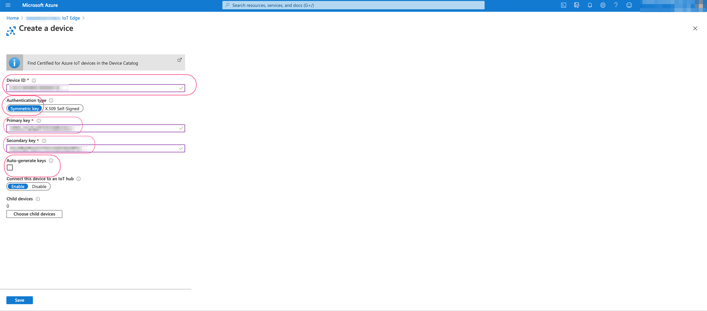

Run a simple  edge module on VeeaHub Pro-S VHE10 device.
===
---
# Table of Contents

-   [Introduction](#Introduction)
-   [Step 1: Prerequisites](#Prerequisites)
-   [Step 2: Prepare your Device](#PrepareDevice)
-   [Step 3: Add the edge device and deploy modules](#DeployIoTEdgeModules)
-   [Step 4: Manual Test for Azure IoT Edge on device](#Manual)
-   [Step 5: Contact Veea Support](#VeeaSupport)
-   [Next Steps](#NextSteps)

# Introduction

**About this document**

This document describes how to connect VeeHub Pro-S VHE10-H with Azure IoT Edge Runtime. This multi-step process includes:

-   Prepare VeeaHub device
-   Configuring Azure IoT Hub
-   Registering your IoT device
-   Build and Deploy edge modules

# Step 1: Prerequisites 

You should have the following items ready before beginning the process

-   [Prepare your Linux development environment][setup-devbox-linux]
-   [Sign up to IOT Hub](https://account.windowsazure.com/signup?offer=ms-azr-0044p)
-   [Setup your IoT hub](https://account.windowsazure.com/signup?offer=ms-azr-0044p)

# Step 2: Prepare your device

-   Prepare your VeeaHub using [instructions](https://www.veea.com/support/article/360017651073/)
-   Contact Veea Support to obtain the symmetric keys to be used while adding an IoT edge device to IoT Hub. These keys will be automatically provisioned on the device.

# Step 3: Add the edge device and deploy modules

-   Add this device to the IoT Hub using the screenshots below. [Add the Edge Device](https://docs.microsoft.com/en-us/azure/iot-edge/quickstart-linux) has more details.

 

 

-   [Add the Edge Modules](https://docs.microsoft.com/en-us/azure/iot-edge/quickstart-linux#deploy-a-module)

# Step 4: Manual Test for Azure IoT Edge on device 

## 4.1 Edge RuntimeEnabled (Mandatory)

**Details of the requirement:**

Veea Solution Delivery team will enable Azure IoT and the following will be installed as part of the bootstrap process automatically after Azure is enabled:

-   Azure IoT Edge Security Daemon
-   Daemon configuration file
-   Docker container management system
-   A version of `hsmlib`

*Edge Runtime Enabled:*

**Check that iotedge daemon is running:**

Ensure that IoT Edge runtime is running on the device

 

 **Check that edge modules are running:**
 

# Step 5: Contact Veea Support

Contact [Veea Support](mailto:support@veea.com) for any support during Azure IoT Edge runtime setup.

[setup-devbox-linux]: https://github.com/Azure/azure-iot-sdk-c/blob/master/doc/devbox_setup.md

# Next Steps

You have now learned how to run a sample application that collects sensor data and sends it to your IoT hub. To explore how to store, analyze and visualize the data from this application in Azure using a variety of different services, please click on the following lessons:

-   [Manage cloud device messaging with iothub-explorer]
-   [Save IoT Hub messages to Azure data storage]
-   [Use Power BI to visualize real-time sensor data from Azure IoT Hub]
-   [Use Azure Web Apps to visualize real-time sensor data from Azure IoT Hub]
-   [Weather forecast using the sensor data from your IoT hub in Azure Machine Learning]
-   [Remote monitoring and notifications with Logic Apps]   

[Manage cloud device messaging with iothub-explorer]: https://docs.microsoft.com/en-us/azure/iot-hub/iot-hub-explorer-cloud-device-messaging
[Save IoT Hub messages to Azure data storage]: https://docs.microsoft.com/en-us/azure/iot-hub/iot-hub-store-data-in-azure-table-storage
[Use Power BI to visualize real-time sensor data from Azure IoT Hub]: https://docs.microsoft.com/en-us/azure/iot-hub/iot-hub-live-data-visualization-in-power-bi
[Use Azure Web Apps to visualize real-time sensor data from Azure IoT Hub]: https://docs.microsoft.com/en-us/azure/iot-hub/iot-hub-live-data-visualization-in-web-apps
[Weather forecast using the sensor data from your IoT hub in Azure Machine Learning]: https://docs.microsoft.com/en-us/azure/iot-hub/iot-hub-weather-forecast-machine-learning
[Remote monitoring and notifications with Logic Apps]: https://docs.microsoft.com/en-us/azure/iot-hub/iot-hub-monitoring-notifications-with-azure-logic-apps
[setup-devbox-windows]: https://github.com/Azure/azure-iot-sdk-csharp/blob/master/doc/devbox_setup.md
[lnk-setup-iot-hub]: ../setup_iothub.md
[lnk-manage-iot-hub]: ../manage_iot_hub.md
