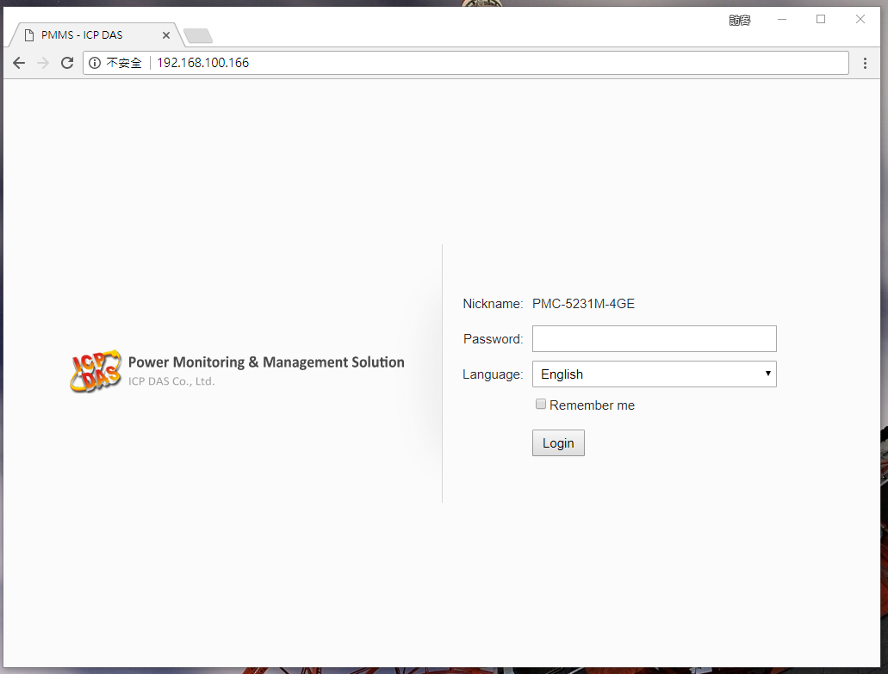
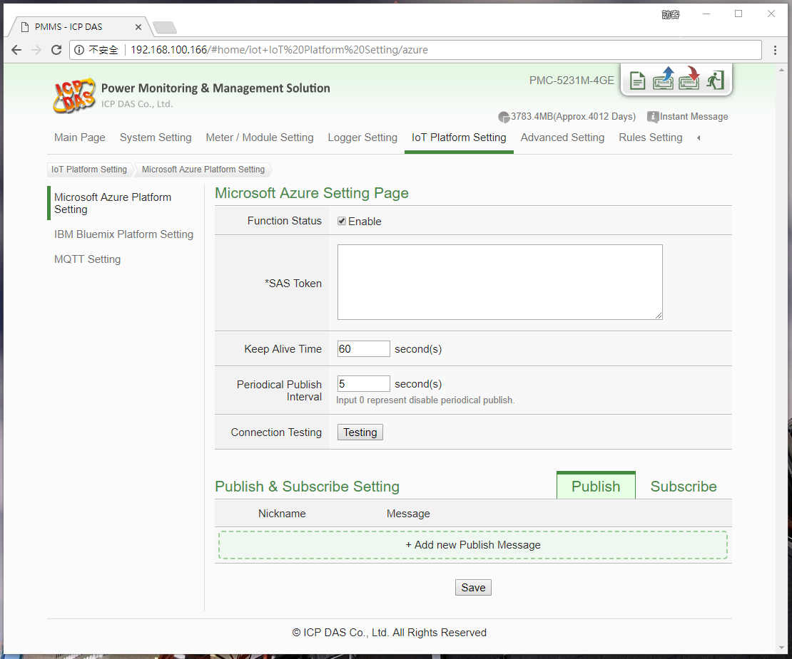
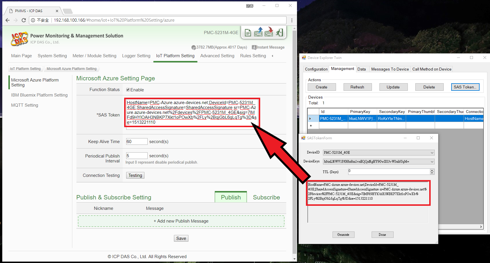

Run a simple Csharp sample on PMC-5231M-4GE device running WinCE 7.0
===
---

# Table of Contents

-   [Introduction](#Introduction)
-   [Step 1: Prerequisites](#Step-1-Prerequisites)
-   [Step 2: Prepare your Device](#Step-2-PrepareDevice)
-   [Step 3: Build and Run the Sample](#Step-3-Build)

# Introduction

**About this document**

This document describes how to connect PMC-5231M-4GE device to Azure IoT Hub.

This multi-step process includes:
-   Configuring Azure IoT Hub
-   Registering your IoT device
-   Build and deploy Azure IoT SDK on device

# Step 1: Prerequisites

-   [Setup your IoT hub][lnk-setup-iot-hub]
-   [Provision your device and get its credentials][lnk-manage-iot-hub]
-   PMC-5231M-4GE device. 
-   Computer with a browser.

 

# Step 2: Prepare your Device

-   Follow the instruction described in this [Quick Start](http://pmms.icpdas.com/include/PMC_5231/PMC-52xx%20Quick%20Start_v3.1.5.pdf) to Connect to the Web interface of PMC-5231M-4GE.

# Step 3: Run the sample

-   Connect to PMC-5231M-4GE webpage server via Web browser, login with the default password "Admin".

    

-   Go to the "Microsoft Azure Setting" page.

    

-   Input the SAS Token generated by Device Explorer.

    

-   Edit the Message to send.

    

-   Click the Save button and write the settings to PMC-5231M-4GE.

    

-   Use the DeviceExplorer utility to observe the messages IoT Hub receives from PMC-5231M-4GE.

    

-   Use the DeviceExplorer utility to send the messages to PMC-5231M-4GE.

    

[lnk-setup-iot-hub]: ../setup_iothub.md
[lnk-manage-iot-hub]: ../manage_iot_hub.md

