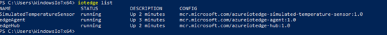
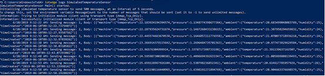

Run a simple C sample on ITG-100-AL device running Windows 10 IoT Enterprise, build 17763
===

# Table of Contents

- [Introduction](#Introduction)
- [Step 1: Prerequisites](#Prerequisites)
- [Step 2: Manual Test for Azure IoT Edge on device](#Manual)
- [Step 3: Next Steps](#NextSteps)

# Introduction

**About this document**

This document describes how to connect ITG-100-AL device running Windows 10 IoT Enterprise, build 17763 with Azure IoT Edge Runtime pre-installed and Device Management. This multi-step process includes:

-   Configuring Azure IoT Hub
-   Registering your IoT device
-   Build and Deploy client component to test device management capability

# Step 1: Prerequisites

You should have the following items ready before beginning the process:

-   [Prepare your development environment][setup-devbox-windows]
-   [Setup your IoT hub](https://account.windowsazure.com/signup?offer=ms-azr-0044p)
-   [Provision your device and get its credentials][lnk-manage-iot-hub]
-   [Sign up to IOT Hub](https://account.windowsazure.com/signup?offer=ms-azr-0044p)
-   [Add the Edge Device](https://docs.microsoft.com/en-us/azure/iot-edge/quickstart)
-   [Add the Edge Modules](https://docs.microsoft.com/en-us/azure/iot-edge/quickstart#deploy-a-module)
-   ITG-100-AL device

# Step 2: Manual Test for Azure IoT Edge on device

## 2.1 Edge RuntimeEnabled (Mandatory)

**Details of the requirement:**

The following components come pre-installed or at the point of distribution on the device to customer(s):

-   Azure IoT Edge Security Daemon
-   Daemon configuration file
-   Moby container management system
-   A version of `hsmlib` 

*Edge Runtime Enabled:*

Open the powershell on your IoT Edge device , confirm the status of the IoT Edge service.

    Get-Service iotedge

Examine service logs from the last 5 minutes. If you just finished installing the IoT Edge runtime, you may see a list of errors from the time between running **Deploy-IoTEdge** and **Initialize-IoTEdge**. These errors are expected, as the service is trying to start before being configured. 

    . {Invoke-WebRequest -useb aka.ms/iotedge-win} | Invoke-Expression; Get-IoTEdgeLog

List running modules. After a new installation, the only module you should see running is **edgeAgent**. After you [deploy IoT Edge modules](https://docs.microsoft.com/en-us/azure/iot-edge/quickstart#deploy-a-module), you will see others. 

    iotedge list

View the messages being sent from the module you created to the cloud.

    iotedge logs SimulatedTemperatureSensor

# Next Steps

You have now learned how to run a sample application that collects sensor data and sends it to your IoT hub. To explore how to store, analyze and visualize the data from this application in Azure using a variety of different services, please click on the following lessons:

-   [Manage cloud device messaging with iothub-explorer]
-   [Save IoT Hub messages to Azure data storage]
-   [Use Power BI to visualize real-time sensor data from Azure IoT Hub]
-   [Use Azure Web Apps to visualize real-time sensor data from Azure IoT Hub]
-   [Weather forecast using the sensor data from your IoT hub in Azure Machine Learning]
-   [Remote monitoring and notifications with Logic Apps]   

[Manage cloud device messaging with iothub-explorer]: https://docs.microsoft.com/en-us/azure/iot-hub/iot-hub-explorer-cloud-device-messaging
[Save IoT Hub messages to Azure data storage]: https://docs.microsoft.com/en-us/azure/iot-hub/iot-hub-store-data-in-azure-table-storage
[Use Power BI to visualize real-time sensor data from Azure IoT Hub]: https://docs.microsoft.com/en-us/azure/iot-hub/iot-hub-live-data-visualization-in-power-bi
[Use Azure Web Apps to visualize real-time sensor data from Azure IoT Hub]: https://docs.microsoft.com/en-us/azure/iot-hub/iot-hub-live-data-visualization-in-web-apps
[Weather forecast using the sensor data from your IoT hub in Azure Machine Learning]: https://docs.microsoft.com/en-us/azure/iot-hub/iot-hub-weather-forecast-machine-learning
[Remote monitoring and notifications with Logic Apps]: https://docs.microsoft.com/en-us/azure/iot-hub/iot-hub-monitoring-notifications-with-azure-logic-apps
[setup-devbox-windows]: https://github.com/Azure/azure-iot-sdk-csharp/blob/master/doc/devbox_setup.md
[lnk-setup-iot-hub]: ../setup_iothub.md
[lnk-manage-iot-hub]: ../manage_iot_hub.md
