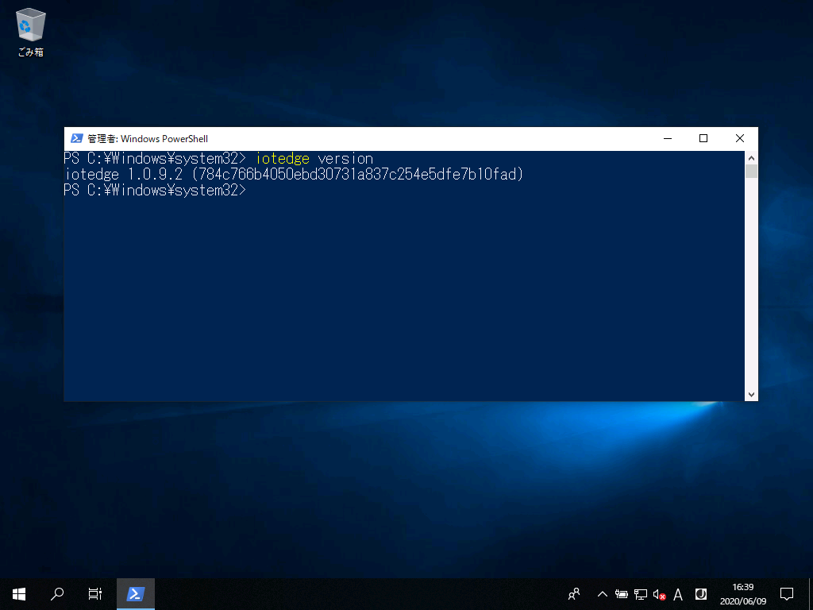

Run a simple csharp sample on OpenBlocks IoT IX9 device running Windows 10 IoT Enterprise.
===
---

# Table of Contents

-   [Introduction](#Introduction)
-   [Step 1: Prerequisites](#Prerequisites)
-   [Step 2: Prepare your Device](#PrepareDevice)
-   [Step 3: Manual Test for Azure IoT Edge on device](#Manual)
-   [Next Steps](#NextSteps)

# Introduction

**About this document**

This document describes how to connect OpenBlocks IX9 device running WIndows 10 IoT Enterprise with Azure IoT Edge Runtime pre-installed and Device Management. This multi-step process includes:

-   Configuring Azure IoT Hub
-   Registering your IoT device
-   Build and Deploy client component to test device management capability 

# Step 1: Prerequisites

You should have the following items ready before beginning the process:

-   [Prepare your development environment][setup-devbox-windows]
-   [Setup your IoT hub](https://account.windowsazure.com/signup?offer=ms-azr-0044p)
-   [Provision your device and get its credentials][lnk-manage-iot-hub]
-   [Sign up to IOT Hub](https://account.windowsazure.com/signup?offer=ms-azr-0044p)
-   [Add the Edge Device](https://docs.microsoft.com/en-us/azure/iot-edge/quickstart)
-   [Add the Edge Modules](https://docs.microsoft.com/en-us/azure/iot-edge/quickstart#deploy-a-module)
-   OpenBlocks IX9 device.

# Step 2: Prepare your Device

-   Follow the instructions in the [OpenBlocks IX9 startup guide](https://www.plathome.co.jp/wp-content/uploads/IX9W_UsersGuide_2.0.pdf) to login the Windows 10 IoT Enterprise 2019 LTSC.

# Step 3: Manual Test for Azure IoT Edge on device

## Edge RuntimeEnabled

-   Create the Edge Device on Azure IoT Hub and copy the connection string.

-   Launch the PowerShell with administrator privilege.

-   Check installed Iot Edge version.

        iotedge version
        or
        iotedge --version

     

-   Check the architecture of runtime installed.
    
        (Get-Process -Id $PID).StartInfo.EnvironmentVariables["PROCESSOR_ARCHITECTURE"]

  

-   Check status of IoT Edge runtime
    
        Get-Service iotedge

  

-   To Provision the device, open the onfiguration file

-   Replace the device connection string 

        notepad C:\ProgramData\iotedge\config.yaml

        sample-
        
        provisioning:
        source:"manual"
        device_connection_string:"<replace with the device connection string obtained in 3.1.1>"

 -   save and close the file.

-   Restart the IoT Edge deamon

        Stop-Service iotedge -NoWait
        Sleep 5
        Start-service iotedge

-   Verify successful installation
-   Check the status of the IoT Edge Daemon

        Get-service iotedge

  

-   Examine daemon logs

        . {Invoke-WebRequest -useb aka.ms/iotedge-win} | Invoke-Expression; Get-IoTEdgeLog

  

-   List running modules

        iotedge list        

  

## Deploy Edge module on Edge Device

-   In the Azure Portal, navigat to your IoT Hub.

-   Go to **IoT Edge** and Select you IoT edge device.

-   Select **Set Modules**.

-   In the **Deployment Modules** section of the page, click **Add** then select **IoT Edge module**.

-   In the **Name** field, enter *tempSensor*.

-   In the **Image URI** field, enter "mcr.microsoft.com/azureiotedge-simulated-temperature-sensor:1.0"

-   Leave the other settings unchanged and select **Save**.

-   Back in the **Add modules** step, select **Next**.

-   In the **Specify routes** step, you should have a default route that sends all messages from all modules to IoT Hub.

-   In the**Review Deployment** step, select **Submit**.

-   Return to the device details page in Azure and selet **Refresh**. In addition to the **edgeAgent** module that was created when you first started the service, you should see another runtime module called **edgeHub** and the **tempSensor** module listed.

-   Check the list of running modules on Device (All the modules edge agent, edge hub and TempSensor should be in running state)

        iotedge list

  

-   Check the logs for the tempSensor Edge Module.

        iotedge logs SimulatedTemperaturesensor -f

  

# Next Steps

You have now learned how to run a sample application that collects sensor data and sends it to your IoT hub. To explore how to store, analyze and visualize the data from this application in Azure using a variety of different services, please click on the following lessons:

-   [Manage cloud device messaging with iothub-explorer]
-   [Save IoT Hub messages to Azure data storage]
-   [Use Power BI to visualize real-time sensor data from Azure IoT Hub]
-   [Use Azure Web Apps to visualize real-time sensor data from Azure IoT Hub]
-   [Weather forecast using the sensor data from your IoT hub in Azure Machine Learning]
-   [Remote monitoring and notifications with Logic Apps]   

[Manage cloud device messaging with iothub-explorer]: https://docs.microsoft.com/en-us/azure/iot-hub/iot-hub-explorer-cloud-device-messaging
[Save IoT Hub messages to Azure data storage]: https://docs.microsoft.com/en-us/azure/iot-hub/iot-hub-store-data-in-azure-table-storage
[Use Power BI to visualize real-time sensor data from Azure IoT Hub]: https://docs.microsoft.com/en-us/azure/iot-hub/iot-hub-live-data-visualization-in-power-bi
[Use Azure Web Apps to visualize real-time sensor data from Azure IoT Hub]: https://docs.microsoft.com/en-us/azure/iot-hub/iot-hub-live-data-visualization-in-web-apps
[Weather forecast using the sensor data from your IoT hub in Azure Machine Learning]: https://docs.microsoft.com/en-us/azure/iot-hub/iot-hub-weather-forecast-machine-learning
[Remote monitoring and notifications with Logic Apps]: https://docs.microsoft.com/en-us/azure/iot-hub/iot-hub-monitoring-notifications-with-azure-logic-apps
[setup-devbox-windows]: https://github.com/Azure/azure-iot-sdk-csharp/blob/master/doc/devbox_setup.md
[lnk-setup-iot-hub]: ../setup_iothub.md
[lnk-manage-iot-hub]: ../manage_iot_hub.md
