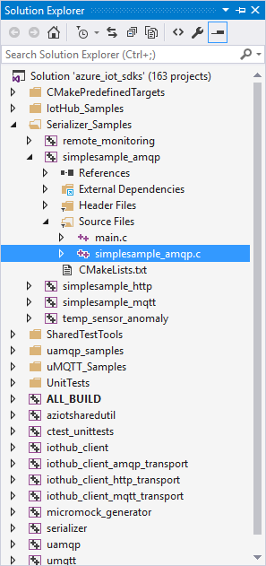
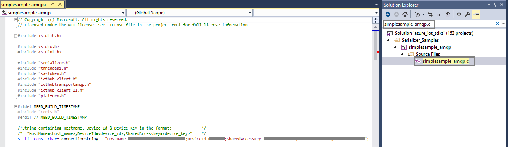
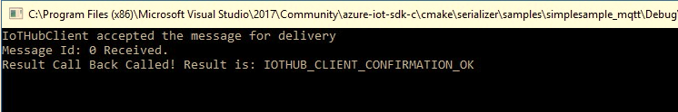
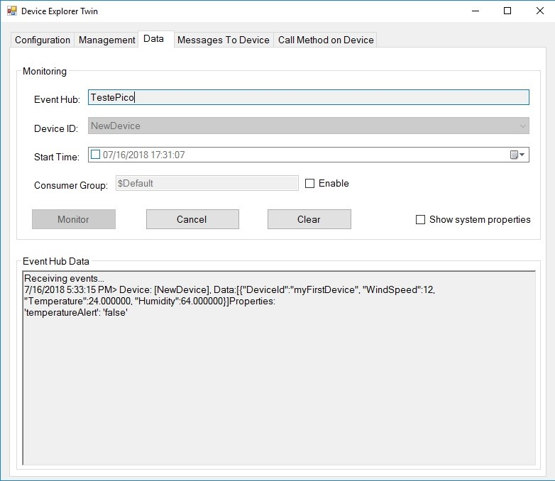
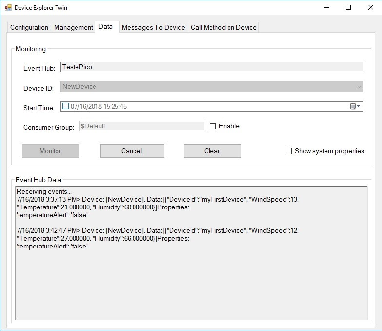
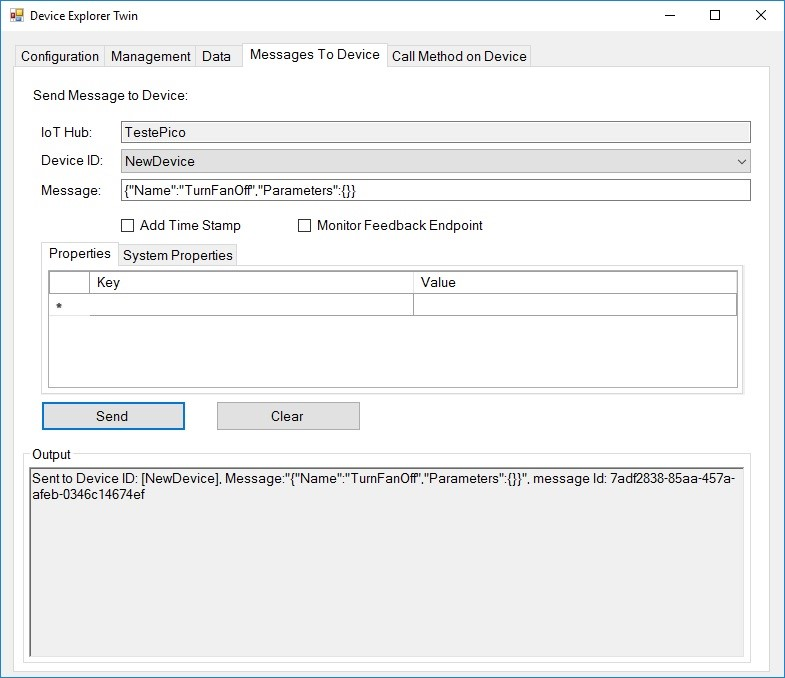
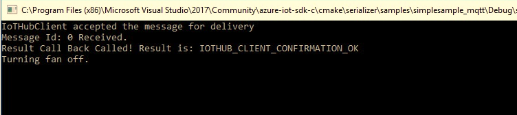

Run a simple C sample on Pico PC device running Windows 10 IoT Enterprise
===
---

# Table of Contents

-   [Introduction](#Introduction)
-   [Step 1: Prerequisites](#Prerequisites)
-   [Step 2: Prepare your Device](#PrepareDevice)
-   [Step 3: Build and Run the Sample](#Build)
-   [Next Steps](#NextSteps)

# Introduction

**About this document**

This document describes how to connect Pico PC device running Windows 10 IoT Enterprise with Azure IoT SDK. This multi-step process includes:
-   Configuring Azure IoT Hub
-   Registering your IoT device
-   Build and deploy Azure IoT SDK on device

# Step 1: Prerequisites

You should have the following items ready before beginning the process:

-   [Prepare your development environment][setup-devbox-windows]
-   [Setup your IoT hub][lnk-setup-iot-hub]
-   [Provision your device and get its credentials][lnk-manage-iot-hub]
-   Pico PC device

# Step 2: Prepare your Device

-   Install Windows 10 IoT Enterprise.
-   Install drivers provided by manufacturer.

## 2.1 Register device:

In this section, you will register your device using DeviceExplorer. The DeviceExplorer is a Windows application that interfaces with Azure IoT Hub and can perform the following operations:

-   Device management
    -   Create new devices
    -   List existing devices and expose device properties stored on Device Hub
    -   Provides ability to update device keys
    -   Provides ability to delete a device
-   Monitoring events from your device
-   Sending messages to your device

To run DeviceExplorer tool, use following configuration string as described in Step1:

-   IoT Hub Connection String

**Steps:**

1.  Click [here](https://github.com/Azure/azure-iot-sdk-csharp/blob/master/tools/DeviceExplorer/readme.md) to download and install DeviceExplorer.
2.  Add connection information under the **Configuration** tab and click the **Update** button.
3.  Create and register the device with your IoT Hub using instructions as below.

    a. Click the **Management** tab.

    b. Your registered devices will be visible in the list. In case your device is not there in the list, click **Refresh** button. If this is your first time, then you shouldn't retrieve anything.

    c. Click **Create** button to create a device ID and key.

    d. Once created successfully, device will be listed in DeviceExplorer.

    e. Right click the device and from context menu select **"Copy connection string for selected device"**.

    f. Save this information in Notepad. You will need this information in later steps.

# Step 3: Build SDK and Run the sample

##3.1 Connect the Device

-   Connect the board to your network using an Ethernet cable. This step is required, as the sample depends on internet access.

## 3.2 Build the Samples

Set up a Windows development environment:

-   Install [Visual Studio 2017](https://www.visualstudio.com/downloads/). You can use the **Visual Studio Community** Free download if you meet the licensing requirements. (**Visual Studio 2015** is also supported.)

    Be sure to include Visual C++ and NuGet Package Manager.

-   Install [git](http://www.git-scm.com/). Confirm git is in your PATH by typing git version from a command prompt.
-   Install [CMake](https://cmake.org/). Make sure it is in your PATH by typing cmake -version from a command prompt. CMake will be used to create Visual Studio projects to build libraries and samples.
-   Locate the tag name for the [latest release](https://github.com/Azure/azure-iot-sdk-c/releases/latest) of the SDK.

    Our release tag names are date values in yyyy-mm-dd format.

-   Clone the latest release of SDK to your local machine using the tag name you found:

        git clone -b <yyyy-mm-dd> --recursive https://github.com/Azure/azure-iot-sdk-c.git

    The --recursive argument instructs git to clone other GitHub repos this SDK depends on.

-   A folder **cmake\_Win32** will be created under your user profile folder **e.g. c:\user[yourusername]\cmake_Win32**.
-   Start a new instance of Visual Studio 2015. Open the **azure\_iot\_sdks.sln** solution in the cmake\_Win32 folder.
-   In Visual Studio, from **Solution Explorer**, navigate to project based on your choice of protocol:

    **For HTTP protocol:**

    Navigate to **simplesample\_http** project and open the **simplesample\_http.c** file.

    **For MQTT protocol:**

    Navigate to **simplesample\_mqtt** project and open the **simplesample\_mqtt.c** file.

 

-   Find the following place holder for IoT connection string:

        static const char* connectionString = "[device connection string]";

-   Replace the above placeholder with device connection string. You can get this from DeviceExplorer as explained in Step 2, that you copied into Notepad.

 

## 3.3 Run and Validate the Samples

In this section you will run the Azure IoT client SDK samples to validate the communication between your device and Azure IoT Hub. You will send the messages to the Azure IoT Hub service and validate that IoT Hub has successfully receive the data. You will also monitor any messages sent from the Azure IoT Hub to client.

### 3.3.1 Send Device Events to IoT Hub

-   Launch the DeviceExplorer as explained in Step 2 and navigate to **Data** tab. Select the device name you created from the drop-down list of device IDs and click **Monitor** button.

 

-   DeviceExplorer is now monitoring data sent from the selected device to the IoT Hub.
-   In Visual Studio, from **Solution Explorer**, right-click on the project and click **Debug -> Start new instance** to build and run the sample.

 

-   Verify that the confirmation messages show an OK. If not, then verify the device hub connection information.

   **If HTTP protocol:**

 

   **If MQTT protocol:**

 

-    DeviceExplorer should show that IoT Hub has successfully received data sent by sample test.

   **If HTTP protocol:**

 

   **If MQTT protocol:**

 

### 3.3.2 Receive messages from IoT Hub

-   To verify that you can send messages from the IoT Hub to your device, go to the **Messages to Device** tab in DeviceExplorer.
-   Select the device you created using Device ID drop down.
-   Add some text to the Message field, then click Send.

 

-   You should be able to see the message received in the device console window.

   **If HTTP protocol:**

 

   **If MQTT protocol:**

 

# Next Steps

You have now learned how to run a sample application that collects sensor data and sends it to your IoT hub. To explore how to store, analyze and visualize the data from this application in Azure using a variety of different services, please click on the following lessons:

-   [Manage cloud device messaging with iothub-explorer]
-   [Save IoT Hub messages to Azure data storage]
-   [Use Power BI to visualize real-time sensor data from Azure IoT Hub]
-   [Use Azure Web Apps to visualize real-time sensor data from Azure IoT Hub]
-   [Weather forecast using the sensor data from your IoT hub in Azure Machine Learning]
-   [Remote monitoring and notifications with Logic Apps]   

[Manage cloud device messaging with iothub-explorer]: https://docs.microsoft.com/en-us/azure/iot-hub/iot-hub-explorer-cloud-device-messaging
[Save IoT Hub messages to Azure data storage]: https://docs.microsoft.com/en-us/azure/iot-hub/iot-hub-store-data-in-azure-table-storage
[Use Power BI to visualize real-time sensor data from Azure IoT Hub]: https://docs.microsoft.com/en-us/azure/iot-hub/iot-hub-live-data-visualization-in-power-bi
[Use Azure Web Apps to visualize real-time sensor data from Azure IoT Hub]: https://docs.microsoft.com/en-us/azure/iot-hub/iot-hub-live-data-visualization-in-web-apps
[Weather forecast using the sensor data from your IoT hub in Azure Machine Learning]: https://docs.microsoft.com/en-us/azure/iot-hub/iot-hub-weather-forecast-machine-learning
[Remote monitoring and notifications with Logic Apps]: https://docs.microsoft.com/en-us/azure/iot-hub/iot-hub-monitoring-notifications-with-azure-logic-apps
[setup-devbox-windows]: https://github.com/Azure/azure-iot-sdk-c/blob/master/doc/devbox_setup.md
[lnk-setup-iot-hub]: ../setup_iothub.md
[lnk-manage-iot-hub]: ../manage_iot_hub.md

