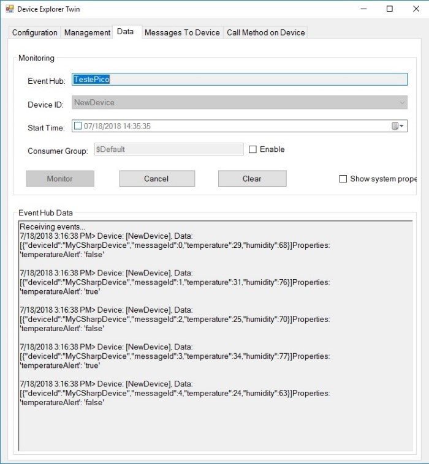
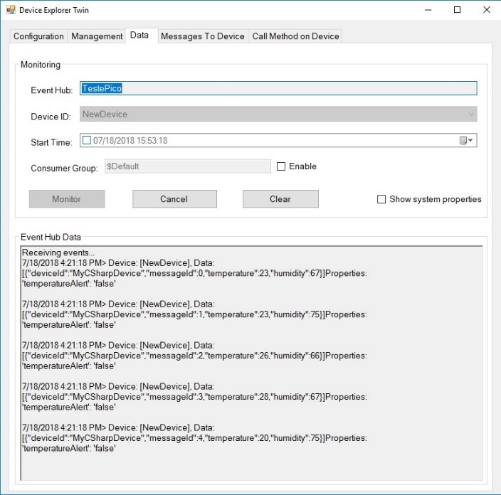
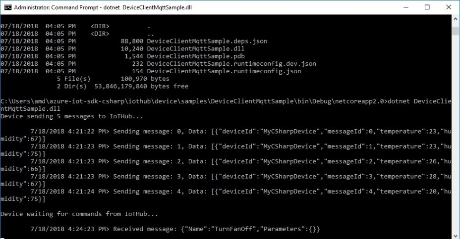

Run a simple CSharp sample on Pico PC device running Windows 10 IoT Enterprise
===
---

# Table of Contents

-   [Introduction](#Introduction)
-   [Step 1: Prerequisites](#Prerequisites)
-   [Step 2: Prepare your Device](#PrepareDevice)
-   [Step 3: Build and Run the Sample](#Build)
-   [Next Steps](#NextSteps)

# Introduction

**About this document**

This document describes how to connect Pico PC device running Windows 10 IoT Enterprise with Azure IoT SDK. This multi-step process includes:
-   Configuring Azure IoT Hub
-   Registering your IoT device
-   Build and deploy Azure IoT SDK on device

# Step 1: Prerequisites

You should have the following items ready before beginning the process:

-   [Prepare your development environment][setup-devbox-windows]
-   [Setup your IoT hub][lnk-setup-iot-hub]
-   [Provision your device and get its credentials][lnk-manage-iot-hub]
-   Pico PC device

# Step 2: Prepare your Device

-   Install Windows 10 IoT Enterprise.
-   Install drivers provided by manufacturer.

## 2.1 Register device:

In this section, you will register your device using DeviceExplorer. The DeviceExplorer is a Windows application that interfaces with Azure IoT Hub and can perform the following operations:

-   Device management
    -   Create new devices
    -   List existing devices and expose device properties stored on Device Hub
    -   Provides ability to update device keys
    -   Provides ability to delete a device
-   Monitoring events from your device
-   Sending messages to your device

To run DeviceExplorer tool, use following configuration string as described in Step1:

-   IoT Hub Connection String

**Steps:**

1.  Click [here](https://github.com/Azure/azure-iot-sdk-csharp/blob/master/tools/DeviceExplorer/readme.md) to download and install DeviceExplorer.
2.  Add connection information under the **Configuration** tab and click the **Update** button.
3.  Create and register the device with your IoT Hub using instructions as below.

    a. Click the **Management** tab.

    b. Your registered devices will be visible in the list. In case your device is not there in the list, click **Refresh** button. If this is your first time, then you shouldn't retrieve anything.

    c. Click **Create** button to create a device ID and key.

    d. Once created successfully, device will be listed in DeviceExplorer.

    e. Right click the device and from context menu select **"Copy connection string for selected device"**.

    f. Save this information in Notepad. You will need this information in later steps.

# Step 3: Build and Run the sample

## 3.1 Prepare your development environment

-   Install the latest .NET Core from <https://dot.net>
-   Install .NET Framework 4.7 Developer Pack: <https://support.microsoft.com/en-us/help/3186612/the-net-framework-4-7-developer-pack-and-language-packs>
-   Install .NET Framework 4.5.1 Developer Pack: <https://www.microsoft.com/en-us/download/details.aspx?id=40772>

## 3.2 Build the samples

-   Download the [Azure IoT SDK](https://github.com/Azure/azure-iot-sdk-csharp) and the sample programs and save them to your local repository.
-   Open a device console (command prompt) and change to your local SDK **azure-iot-sdk-csharp** directory.
-   Add the Iot Hub device connection string on your device as an environment variable:

        setx IOTHUB_DEVICE_CONN_STRING ”yourDeviceConnectionString”

-   Run the following command to build the SDK:

        build.cmd -config Release

## 3.3 Run the samples

In this section you will run the Azure IoT client SDK samples to validate the communication between your device and Azure IoT Hub. You will send the messages to the Azure IoT Hub service and validate that IoT Hub has successfully receive the data. You will also monitor any messages sent from the Azure IoT Hub to client.

### 3.3.1 Send Device Events to IoT Hub

-   Launch the DeviceExplorer as explained in Step 2 and navigate to **Data** tab. Select the device name you created from the drop-down list of device IDs and click **Monitor** button.

 

-   DeviceExplorer is now monitoring data sent from the selected device to the IoT Hub.
-   From the device console, run the sample using following command:

   **If HTTP protocol:**

        cd iothub\device\samples\DeviceClientHttpSample\bin\Debug\netcoreapp2.0
        dotnet DeviceClientHttpSample.dll

   **If MQTT protocol:**

        cd iothub\device\samples\DeviceClientMqttSample\bin\Debug\netcoreapp2.0
        dotnet DeviceClientMqttSample.dll

-   You should be able to see the events received in device console on successful execution.

   **If HTTP protocol:**

 

   **If MQTT protocol:**

 
 
-   You should be able to see the events received in the DeviceExplorer's data tab.Refer "Monitor device-to-cloud events" in [DeviceExplorer Usage document](https://github.com/Azure/azure-iot-sdk-csharp/blob/master/tools/DeviceExplorer/doc/how_to_use_device_explorer.md) to see the data your device is sending:

   **If HTTP protocol:**

 

   **If MQTT protocol:**
 
 

### 3.3.2 Receive messages from IoT Hub

-   To verify that you can send messages from the IoT Hub to your device, go to the **Messages to Device** tab in DeviceExplorer.
-   Select the device you created using Device ID drop down.
-   Add some text to the Message field, then click Send.

 

-   You should be able to see the message received in the device console window.

   **If HTTP protocol:**
 
 

   **If MQTT protocol:**
 
 

# Next Steps

You have now learned how to run a sample application that collects sensor data and sends it to your IoT hub. To explore how to store, analyze and visualize the data from this application in Azure using a variety of different services, please click on the following lessons:

-   [Manage cloud device messaging with iothub-explorer]
-   [Save IoT Hub messages to Azure data storage]
-   [Use Power BI to visualize real-time sensor data from Azure IoT Hub]
-   [Use Azure Web Apps to visualize real-time sensor data from Azure IoT Hub]
-   [Weather forecast using the sensor data from your IoT hub in Azure Machine Learning]
-   [Remote monitoring and notifications with Logic Apps]   

[Manage cloud device messaging with iothub-explorer]: https://docs.microsoft.com/en-us/azure/iot-hub/iot-hub-explorer-cloud-device-messaging
[Save IoT Hub messages to Azure data storage]: https://docs.microsoft.com/en-us/azure/iot-hub/iot-hub-store-data-in-azure-table-storage
[Use Power BI to visualize real-time sensor data from Azure IoT Hub]: https://docs.microsoft.com/en-us/azure/iot-hub/iot-hub-live-data-visualization-in-power-bi
[Use Azure Web Apps to visualize real-time sensor data from Azure IoT Hub]: https://docs.microsoft.com/en-us/azure/iot-hub/iot-hub-live-data-visualization-in-web-apps
[Weather forecast using the sensor data from your IoT hub in Azure Machine Learning]: https://docs.microsoft.com/en-us/azure/iot-hub/iot-hub-weather-forecast-machine-learning
[Remote monitoring and notifications with Logic Apps]: https://docs.microsoft.com/en-us/azure/iot-hub/iot-hub-monitoring-notifications-with-azure-logic-apps
[setup-devbox-windows]: https://github.com/Azure/azure-iot-sdk-csharp/blob/master/doc/devbox_setup.md
[lnk-setup-iot-hub]: ../setup_iothub.md
[lnk-manage-iot-hub]: ../manage_iot_hub.md
