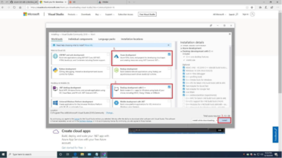

Run a simple Csharp sample on GIGAIPC QBiX-Pro-KBLB7100H-A1 device running Windows 10 IoT Enterprise
===
---

# Table of Contents

-   [Introduction](#Introduction)
-   [Step 1: Prerequisites](#Prerequisites)
-   [Step 2: Prepare your Device](#PrepareDevice)
-   [Step 3: Build and Run the Sample](#Build)
-   [Next Steps](#NextSteps)

# Introduction

**About this document**

This document describes how to connect [GIGAIPC QBiX-Pro-KBLB7100H-A1](http://www.gigaipc.com/?action=products3&cid=1536866789088331900&tid=1536869180071893800&pid=1540780825001919800) device running Windows 10 IoT Enterprise with Azure IoT SDK. This multi-step process includes:
-   Configuring Azure IoT Hub
-   Registering your IoT device
-   Build and deploy Azure IoT SDK on device

# Step 1: Prerequisites

You should have the following items ready before beginning the process:

-   Computer with GitHub installed and access to the azure-iot-sdk-csharp GitHub private repository.
-   GIGAIPC QBiX-Pro-KBLB7100H-A1 device.
-   VGA Cable ,USB Keyboard/Mouse, and the Internet connection
-   Install any version of Visual Studio 2019 Community Development Kit
		a. Select Azure development
		b. Select Desktop development with C++.

 

-   Install [Microsoft Azure SDK](http://www.microsoft.com/download/details.aspx?id=48178) for .NET.
-   [Setup your IoT hub](https://catalog.azureiotsolutions.com/docs?title=Azure/azure-iot-device-ecosystem/setup_iothub)
-   [Provision your device and get its credentials](https://catalog.azureiotsolutions.com/docs?title=Azure/azure-iot-device-ecosystem/manage_iot_hub)

# Step 2: Prepare your Device

-   Create a bootable USB Drive. Please follow this guide on how to create a bootable drive (<https://www.microsoft.com/en-us/download/windows-usb-dvd-download-tool>).
-   Insert the bootable USB Drive from the previous step into your [QBiX-Pro-KBLB7100H-A1](http://www.gigaipc.com/?action=products3&cid=1536866789088331900&tid=1536869180071893800&pid=1540780825001919800). Turn on your [QBiX-Pro-KBLB7100H-A1](http://www.gigaipc.com/?action=products3&cid=1536866789088331900&tid=1536869180071893800&pid=1540780825001919800) device and press the **Delete** key.
-   Change the BIOS Boot option filter to **UEFI and Legacy**.
-   Change the **Boot Option Priorities** to boot from your USB Drive.
-   Save changes and restart your [QBiX-Pro-KBLB7100H-A1](http://www.gigaipc.com/?action=products3&cid=1536866789088331900&tid=1536869180071893800&pid=1540780825001919800). Follow on screen instructions to install Windows Operating System on your [QBiX-Pro-KBLB7100H-A1](http://www.gigaipc.com/?action=products3&cid=1536866789088331900&tid=1536869180071893800&pid=1540780825001919800).
-   Wait until the operating system is ready.

# Step 3: Build and Run the sample

Sign Up To Azure IoT Hub

Follow the instructions [here](https://account.windowsazure.com/signup?offer=ms-azr-0044p) on how to sign up to the Azure IoT Hub service.
As part of the sign up process, you will receive the connection string.

-   **IoT Hub Connection String**: An example of IoT Hub Connection String is as below:

        HostName=[YourIoTHubName];SharedAccessKeyName=[YourAccessKeyName];SharedAccessKey=[YourAccessKey]

-   Download the [Azure IoT SDK](https://github.com/Azure/azure-iot-sdk-csharp) and the sample programs and save them to your local repository.
-   Start a new instance of [Visual Studio 2019](https://www.visualstudio.com/downloads/).
-   Open the **iothub\_csharp\_client.sln** solution in the `csharp\device` folder in your local copy of the repository.
-   In Visual Studio, from Solution Explorer, navigate to the **samples** folder.
-   In the **DeviceClientAmqpSample** project, open the **Program.cs** file.
-   Locate the following code in the file:

        private const string DeviceConnectionString = "<replace>";

-   Replace <replace> with the connection string for your device.
-   In visual Studio, under Solution Explorer, right-click the **DeviceClientAmqpSample** project, click **Debug −> Start** new instance to build and run the sample. The console displays messages as the application sends device-to-cloud messages to IoT Hub.
-   See [Manage IoT Hub](https://catalog.azureiotsolutions.com/docs?title=Azure/azure-iot-device-ecosystem/manage_iot_hub) to learn how to observe the messages IoT Hub receives from the application and how to send cloud-to-device messages to the application.

# Next Steps

You have now learned how to run a sample application that collects sensor data and sends it to your IoT hub. To explore how to store, analyze and visualize the data from this application in Azure using a variety of different services, please click on the following lessons:

-   [Manage cloud device messaging with iothub-explorer]
-   [Save IoT Hub messages to Azure data storage]
-   [Use Power BI to visualize real-time sensor data from Azure IoT Hub]
-   [Use Azure Web Apps to visualize real-time sensor data from Azure IoT Hub]
-   [Weather forecast using the sensor data from your IoT hub in Azure Machine Learning]
-   [Remote monitoring and notifications with Logic Apps]   

[Manage cloud device messaging with iothub-explorer]: https://docs.microsoft.com/en-us/azure/iot-hub/iot-hub-explorer-cloud-device-messaging
[Save IoT Hub messages to Azure data storage]: https://docs.microsoft.com/en-us/azure/iot-hub/iot-hub-store-data-in-azure-table-storage
[Use Power BI to visualize real-time sensor data from Azure IoT Hub]: https://docs.microsoft.com/en-us/azure/iot-hub/iot-hub-live-data-visualization-in-power-bi
[Use Azure Web Apps to visualize real-time sensor data from Azure IoT Hub]: https://docs.microsoft.com/en-us/azure/iot-hub/iot-hub-live-data-visualization-in-web-apps
[Weather forecast using the sensor data from your IoT hub in Azure Machine Learning]: https://docs.microsoft.com/en-us/azure/iot-hub/iot-hub-weather-forecast-machine-learning
[Remote monitoring and notifications with Logic Apps]: https://docs.microsoft.com/en-us/azure/iot-hub/iot-hub-monitoring-notifications-with-azure-logic-apps
[setup-devbox-windows]: https://github.com/Azure/azure-iot-sdk-csharp/blob/master/doc/devbox_setup.md
[lnk-setup-iot-hub]: ../setup_iothub.md
[lnk-manage-iot-hub]: ../manage_iot_hub.md